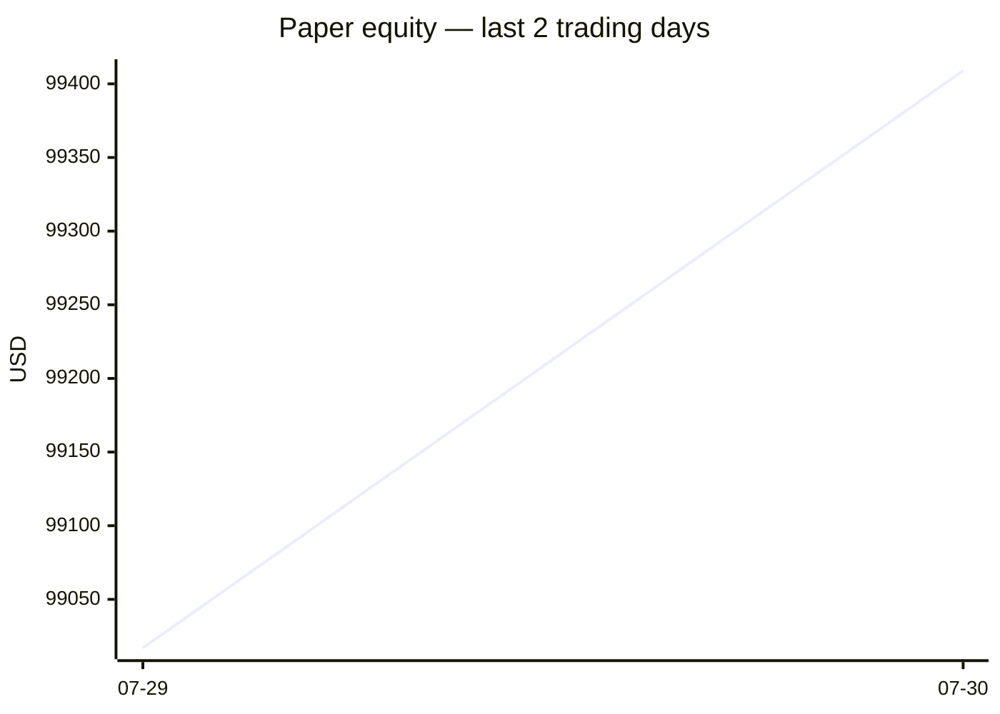
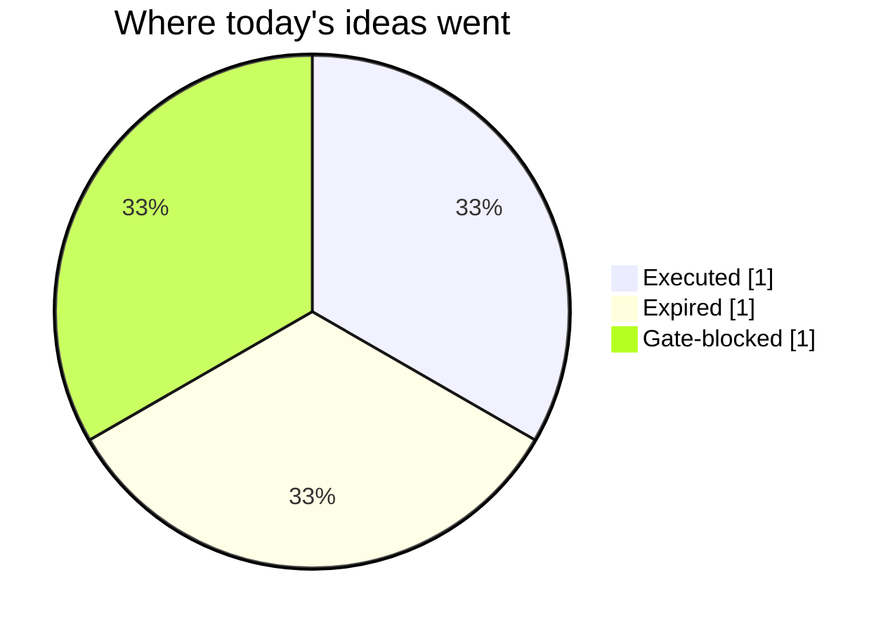

# Trading day 2026-07-30

Paper equity **$99,409** · day +0.11% · regime choppy · config v2-seeded

## Charts

## Activity

- Theses formed: 2 (approved→orders: 1, human-rejected: 0, expired unapproved: 1)
- Risk gate blocked: 1
- Fills at the broker: 1

### The day's ideas

- **BTC/USD** (crypto-momentum-breakout) entry 64501.3 stop 64035.46 target 65432.98 — BTC/USD broke its 20-bar high (64426.73), above its 20-day average. Stop 3×ATR below (wider than equities — crypto volatility), target 2R.
- **ETH/USD** (crypto-momentum-breakout) entry 1918.07 stop 1903.84 target 1946.53 — ETH/USD broke its 20-bar high (1917.74), above its 20-day average. Stop 3×ATR below (wider than equities — crypto volatility), target 2R.

## Shadow ledger (what would have happened)

No shadow outcomes resolved today.

## Running shadow record

Resolved 0 ideas · win rate —% · total +0R · avg —R · still tracking 2

## Is the desk earning its keep?

Shadow-outcome R by the desk verdict each idea carried (vetoed/expired ideas only — executed trades don't resolve to an R-outcome yet):

| Verdict | Ideas | Win rate | Avg R |
|---|---|---|---|
| proceed | 0 | —% | — |
| caution | 0 | —% | — |
| avoid | 0 | —% | — |
| none | 0 | —% | — |

*Only 0 scored ideas so far — a preview, not a verdict on the AI yet.*

*Generated by code, no AI. Paper account only.*
