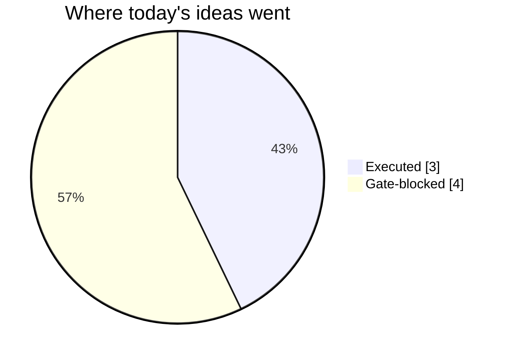

# Trading day 2026-07-31

Paper equity **$98,734** · day -0.56% · regime trending · config v2-seeded

## Charts

## Activity

- Theses formed: 5 (approved→orders: 3, human-rejected: 0, expired unapproved: 0)
- Risk gate blocked: 4
- Fills at the broker: 5

### The day's ideas

- **CRM** (momentum-breakout) entry 183.53 stop 181.72 target 187.15 — Broke 20-bar high (183.42) with stock and SPY above their 20-day averages. Stop 2×ATR below, target 2R.
- **CVX** (momentum-breakout) entry 196.09 stop 194.83 target 198.61 — Broke 20-bar high (195.96) with stock and SPY above their 20-day averages. Stop 2×ATR below, target 2R.
- **GOOGL** (momentum-breakout) entry 354.89 stop 351.16 target 362.35 — Broke 20-bar high (354.85) with stock and SPY above their 20-day averages. Stop 2×ATR below, target 2R.
- **XOM** (momentum-breakout) entry 155.04 stop 153.99 target 157.14 — Broke 20-bar high (155.01) with stock and SPY above their 20-day averages. Stop 2×ATR below, target 2R.
- **PEP** (momentum-breakout) entry 140.09 stop 139.44 target 141.39 — Broke 20-bar high (140.07) with stock and SPY above their 20-day averages. Stop 2×ATR below, target 2R.

## Shadow ledger (what would have happened)

No shadow outcomes resolved today.

## Running shadow record

Resolved 0 ideas · win rate —% · total +0R · avg —R · still tracking 5

## Is the desk earning its keep?

Shadow-outcome R by the desk verdict each idea carried (vetoed/expired ideas only — executed trades don't resolve to an R-outcome yet):

| Verdict | Ideas | Win rate | Avg R |
|---|---|---|---|
| proceed | 0 | —% | — |
| caution | 0 | —% | — |
| avoid | 0 | —% | — |
| none | 0 | —% | — |

*Only 0 scored ideas so far — a preview, not a verdict on the AI yet.*

*Generated by code, no AI. Paper account only.*
