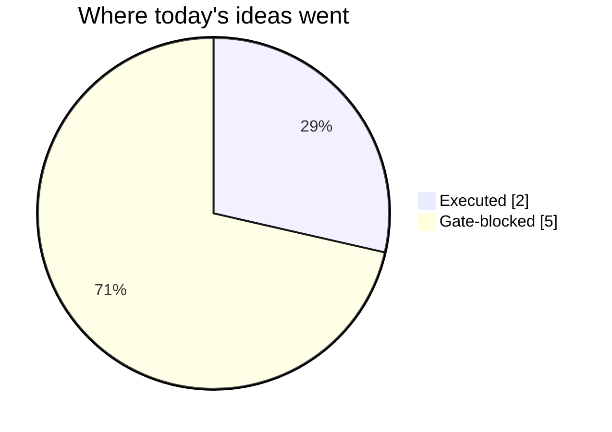
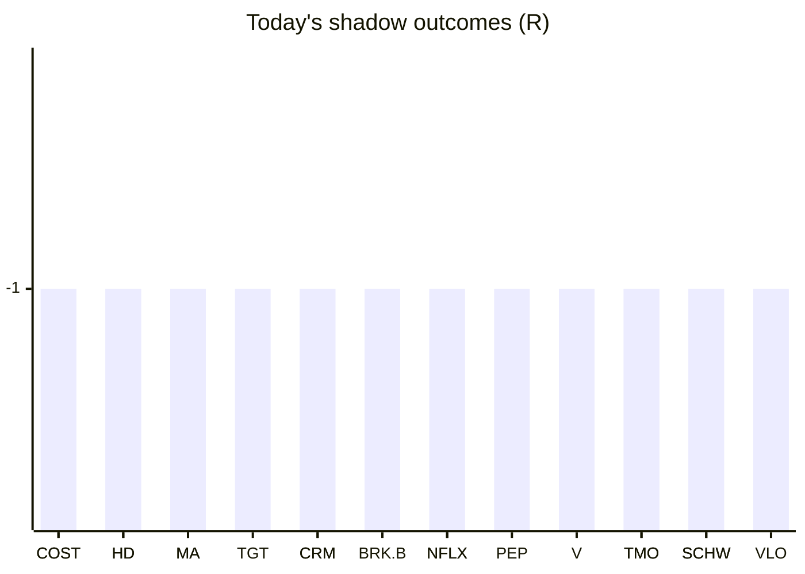

# Trading day 2026-08-03

Paper equity **$99,617** · day +0.92% · regime trending · config v3-seeded · VIX 15.99 (down)

## Charts

## Activity

- Theses formed: 5 (approved→orders: 2, human-rejected: 0, expired unapproved: 0)
- Risk gate blocked: 5
- Fills at the broker: 3

### The day's ideas

- **MSFT** (momentum-breakout) entry 490.99 stop 483.84 target 505.29 — Broke 20-bar high (490.79) with stock and SPY above their 20-day averages. Stop 2×ATR below, target 2R.
- **SCHW** (momentum-breakout) entry 106.62 stop 105.91 target 108.04 — Broke 20-bar high (106.57) with stock and SPY above their 20-day averages. Stop 2×ATR below, target 2R.
- **TMO** (momentum-breakout) entry 583.43 stop 578.86 target 592.57 — Broke 20-bar high (583.14) with stock and SPY above their 20-day averages. Stop 2×ATR below, target 2R.
- **LIN** (mean-reversion) entry 477.22 stop 459.63 target 512.64 — RSI 30 oversold with no fresh headlines, still above the 200-day average — quiet-tape dip in an uptrend. Target: back to the 20-day average.
- **AVGO** (momentum-breakout) entry 390.31 stop 386.16 target 398.61 — Broke 20-bar high (390.21) with stock and SPY above their 20-day averages. Stop 2×ATR below, target 2R.

## Shadow ledger (what would have happened)

- COST (momentum-breakout, gate-blocked) → **stopped** -1R
- HD (momentum-breakout, gate-blocked) → **stopped** -1R
- HD (momentum-breakout, gate-blocked) → **stopped** -1R
- MA (momentum-breakout, gate-blocked) → **stopped** -1R
- TGT (momentum-breakout, gate-blocked) → **stopped** -1R
- MA (momentum-breakout, gate-blocked) → **stopped** -1R
- CRM (momentum-breakout, gate-blocked) → **stopped** -1R
- BRK.B (momentum-breakout, gate-blocked) → **stopped** -1R
- NFLX (momentum-breakout, gate-blocked) → **stopped** -1R
- COST (momentum-breakout, gate-blocked) → **stopped** -1R
- NFLX (momentum-breakout, gate-blocked) → **stopped** -1R
- PEP (momentum-breakout, gate-blocked) → **stopped** -1R
- V (momentum-breakout, gate-blocked) → **stopped** -1R
- TMO (momentum-breakout, gate-blocked) → **stopped** -1R
- TMO (momentum-breakout, gate-blocked) → **stopped** -1R
- CRM (momentum-breakout, gate-blocked) → **stopped** -1R
- SCHW (momentum-breakout, gate-blocked) → **stopped** -1R
- VLO (momentum-breakout, gate-blocked) → **stopped** -1R
- SCHW (momentum-breakout, gate-blocked) → **stopped** -1R

Day total: **-19R**

## Running shadow record

Resolved 19 ideas · win rate 0% · total -19R · avg -1R · still tracking 21

## Is the desk earning its keep?

Shadow-outcome R by the desk verdict each idea carried (vetoed/expired ideas only — executed trades don't resolve to an R-outcome yet):

| Verdict | Ideas | Win rate | Avg R |
|---|---|---|---|
| proceed | 0 | —% | — |
| caution | 0 | —% | — |
| avoid | 0 | —% | — |
| none | 19 | 0% | -1 |

*Only 0 scored ideas so far — a preview, not a verdict on the AI yet.*

## Incubation ward

- **pullback-trend** — incubating: 0/25 shadow outcomes
- **crypto-mean-reversion** — incubating: 0/25 shadow outcomes

*Incubating strategies shadow-track every signal but never execute. Graduation is mechanical: 25+ outcomes, avg ≥ +0.10R, wins ≥ 40%.*

*Generated by code, no AI. Paper account only.*
