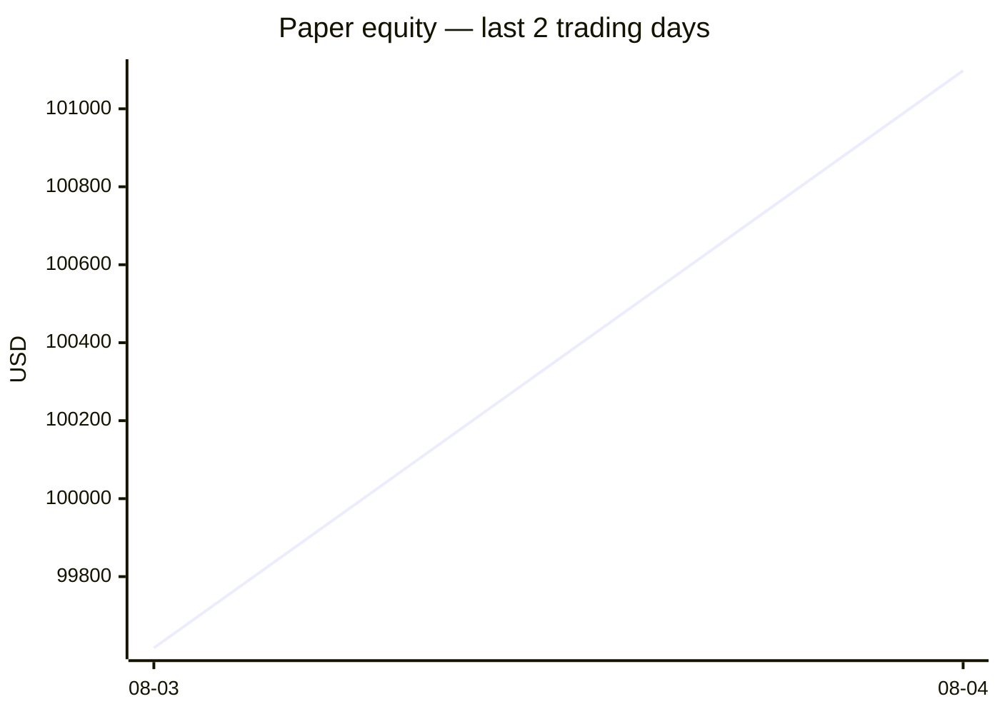
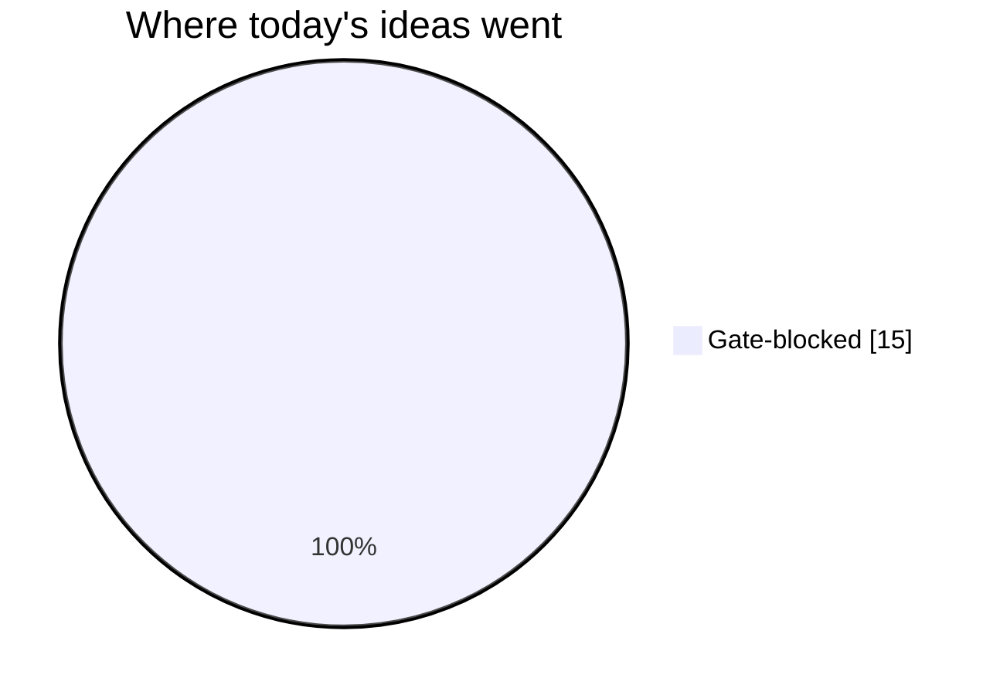
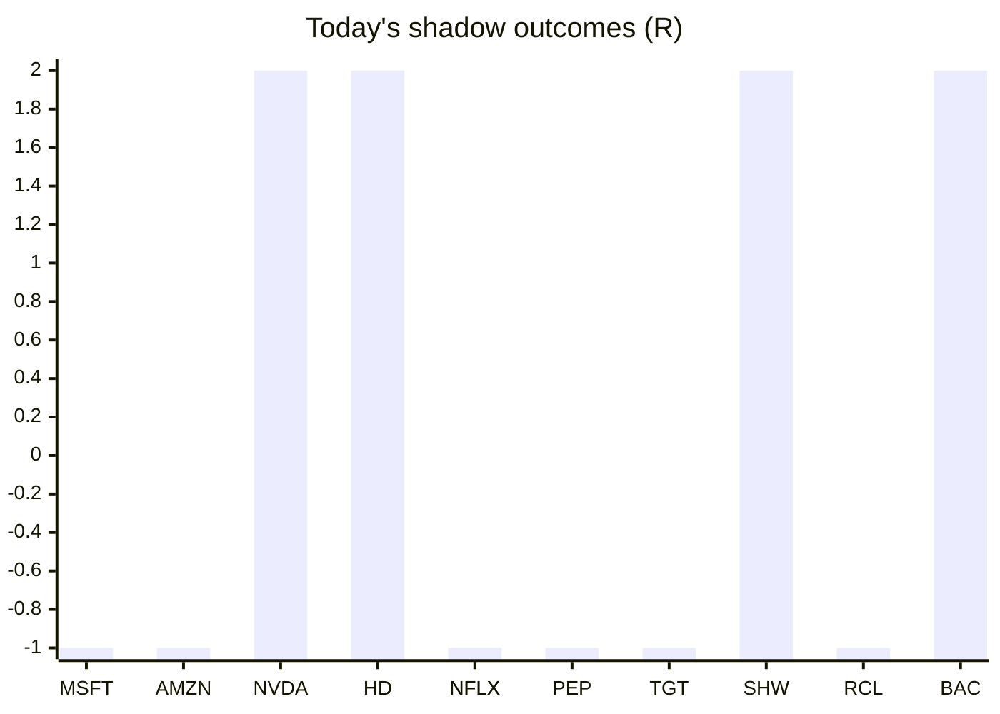

# Trading day 2026-08-04

Paper equity **$101,098** · day +1.52% · regime trending · config v3-seeded · VIX 15.86 (down)

## Charts

## Activity

- Theses formed: 0 (approved→orders: 0, human-rejected: 0, expired unapproved: 0)
- Risk gate blocked: 15
- Fills at the broker: 0

## Shadow ledger (what would have happened)

- MSFT (momentum-breakout, gate-blocked) → **stopped** -1R
- AMZN (momentum-breakout, gate-blocked) → **stopped** -1R
- NVDA (momentum-breakout, gate-blocked) → **target** +2R
- HD (momentum-breakout, gate-blocked) → **target** +2R
- NFLX (momentum-breakout, gate-blocked) → **stopped** -1R
- PEP (momentum-breakout, gate-blocked) → **stopped** -1R
- TGT (momentum-breakout, gate-blocked) → **stopped** -1R
- SHW (momentum-breakout, gate-blocked) → **target** +2R
- RCL (momentum-breakout, gate-blocked) → **stopped** -1R
- BAC (momentum-breakout, gate-blocked) → **target** +2R
- HD (momentum-breakout, gate-blocked) → **target** +2R
- NFLX (momentum-breakout, gate-blocked) → **stopped** -1R

Day total: **+3R**

## Running shadow record

Resolved 31 ideas · win rate 16% · total -16R · avg -0.52R · still tracking 29

## Is the desk earning its keep?

Shadow-outcome R by the desk verdict each idea carried (vetoed/expired ideas only — executed trades don't resolve to an R-outcome yet):

| Verdict | Ideas | Win rate | Avg R |
|---|---|---|---|
| proceed | 0 | —% | — |
| caution | 0 | —% | — |
| avoid | 0 | —% | — |
| none | 31 | 16% | -0.52 |

*Only 0 scored ideas so far — a preview, not a verdict on the AI yet.*

## Incubation ward

- **pullback-trend** — incubating: 0/25 shadow outcomes
- **crypto-mean-reversion** — incubating: 0/25 shadow outcomes

*Incubating strategies shadow-track every signal but never execute. Graduation is mechanical: 25+ outcomes, avg ≥ +0.10R, wins ≥ 40%.*

*Generated by code, no AI. Paper account only.*
