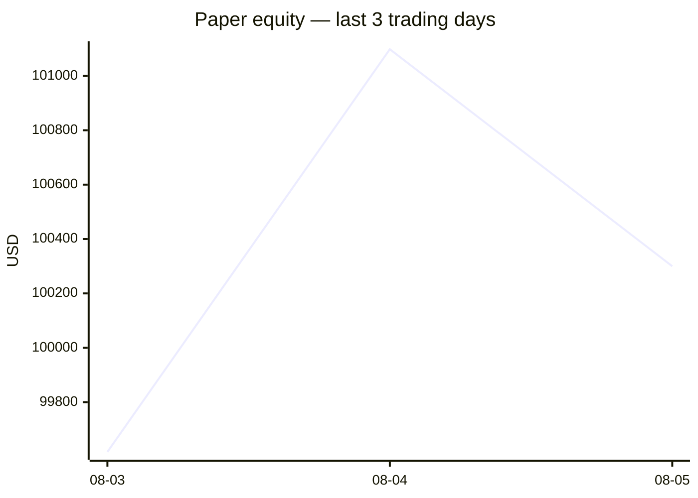
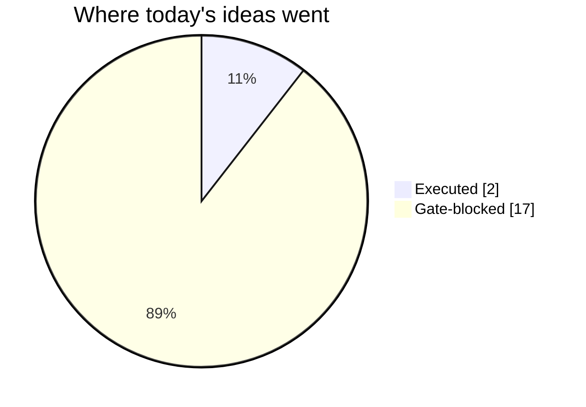
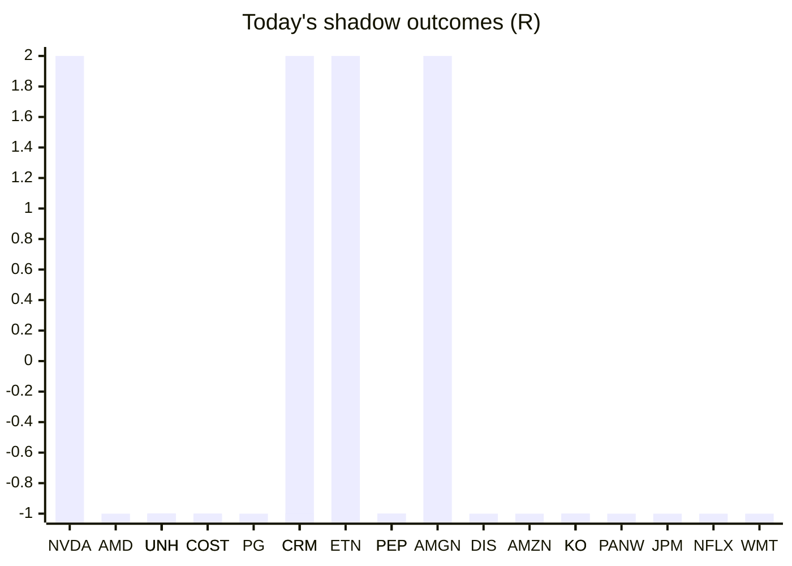

# Trading day 2026-08-05

Paper equity **$100,300** · day -0.78% · regime trending · config v3-seeded · VIX 16.5 (down)

## Charts

## Activity

- Theses formed: 2 (approved→orders: 2, human-rejected: 0, expired unapproved: 0)
- Risk gate blocked: 17
- Fills at the broker: 2

### The day's ideas

- **ETH/USD** (crypto-momentum-breakout) entry 1896.57 stop 1883.44 target 1922.83 — ETH/USD broke its 20-bar high (1895.27) on 1.5× average volume, above its 20-day average. Stop 2×ATR below (wider than equities — crypto volatility), target 2R.
- **BTC/USD** (crypto-momentum-breakout) entry 64877.74 stop 64547.84 target 65537.54 — BTC/USD broke its 20-bar high (64868.99) on 1.3× average volume, above its 20-day average. Stop 2×ATR below (wider than equities — crypto volatility), target 2R.

## Shadow ledger (what would have happened)

- NVDA (momentum-breakout, gate-blocked) → **target** +2R
- AMD (momentum-breakout, gate-blocked) → **stopped** -1R
- UNH (pullback-trend, incubation) → **stopped** -1R
- UNH (pullback-trend, incubation) → **stopped** -1R
- UNH (pullback-trend, incubation) → **stopped** -1R
- UNH (pullback-trend, incubation) → **stopped** -1R
- COST (momentum-breakout, gate-blocked) → **stopped** -1R
- PG (momentum-breakout, gate-blocked) → **stopped** -1R
- CRM (momentum-breakout, gate-blocked) → **target** +2R
- ETN (momentum-breakout, gate-blocked) → **target** +2R
- PEP (momentum-breakout, gate-blocked) → **stopped** -1R
- AMGN (momentum-breakout, gate-blocked) → **target** +2R
- DIS (momentum-breakout, gate-blocked) → **stopped** -1R
- PEP (momentum-breakout, gate-blocked) → **stopped** -1R
- AMZN (momentum-breakout, gate-blocked) → **stopped** -1R
- KO (momentum-breakout, gate-blocked) → **stopped** -1R
- COST (momentum-breakout, gate-blocked) → **stopped** -1R
- PANW (momentum-breakout, gate-blocked) → **stopped** -1R
- KO (momentum-breakout, gate-blocked) → **stopped** -1R
- CRM (momentum-breakout, gate-blocked) → **stopped** -1R
- JPM (momentum-breakout, gate-blocked) → **stopped** -1R
- NFLX (momentum-breakout, gate-blocked) → **stopped** -1R
- WMT (momentum-breakout, gate-blocked) → **stopped** -1R

Day total: **-11R**

## Running shadow record

Resolved 54 ideas · win rate 17% · total -27R · avg -0.5R · still tracking 29

## Is the desk earning its keep?

Shadow-outcome R by the desk verdict each idea carried (vetoed/expired ideas only — executed trades don't resolve to an R-outcome yet):

| Verdict | Ideas | Win rate | Avg R |
|---|---|---|---|
| proceed | 0 | —% | — |
| caution | 0 | —% | — |
| avoid | 0 | —% | — |
| none | 54 | 17% | -0.5 |

*Only 0 scored ideas so far — a preview, not a verdict on the AI yet.*

## Incubation ward

- **pullback-trend** — incubating: 4/25 shadow outcomes
- **crypto-mean-reversion** — incubating: 0/25 shadow outcomes

*Incubating strategies shadow-track every signal but never execute. Graduation is mechanical: 25+ outcomes, avg ≥ +0.10R, wins ≥ 40%.*

*Generated by code, no AI. Paper account only.*
