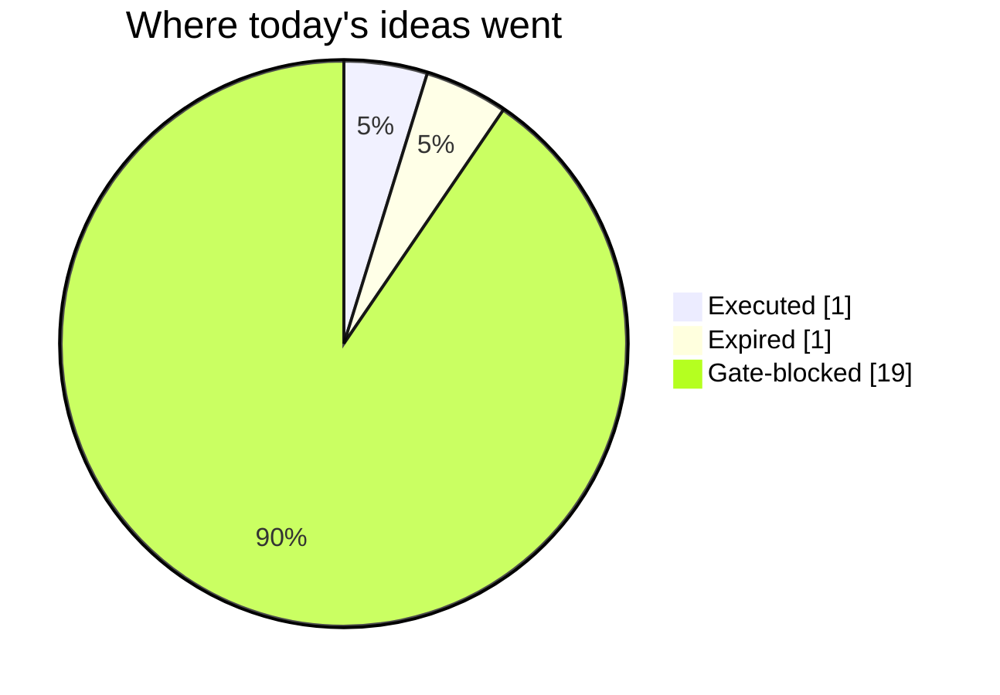
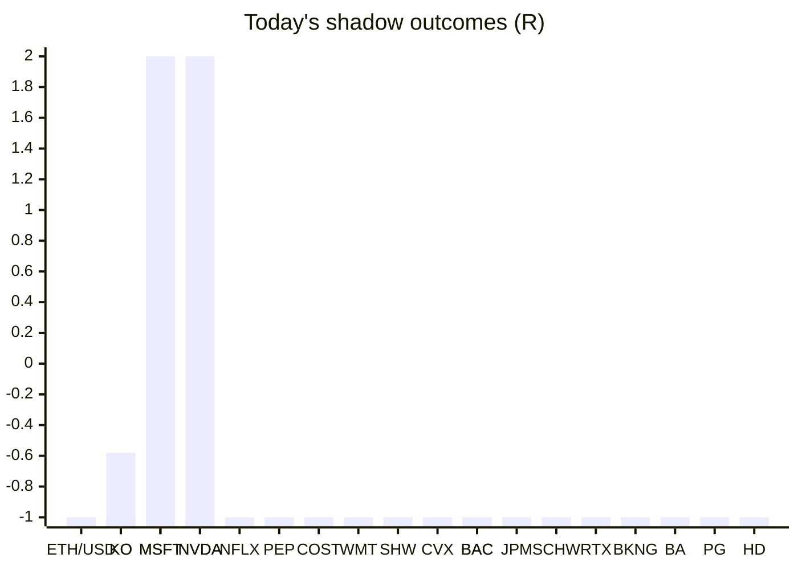

# Trading day 2026-08-06

Paper equity **$100,324** · day +0.24% · regime trending · config v3-seeded · VIX 15.81 (down)

## Charts

## Activity

- Theses formed: 2 (approved→orders: 1, human-rejected: 0, expired unapproved: 1)
- Risk gate blocked: 19
- Fills at the broker: 2

### The day's ideas

- **BTC/USD** (crypto-momentum-breakout) entry 64828.7 stop 64580.3 target 65325.5 — BTC/USD broke its 20-bar high (64693.14) on 18.4× average volume, above its 20-day average. Stop 2×ATR below (wider than equities — crypto volatility), target 2R.
- **ETH/USD** (crypto-momentum-breakout) entry 1913.66 stop 1904.75 target 1931.48 — ETH/USD broke its 20-bar high (1910.98) on 1.6× average volume, above its 20-day average. Stop 2×ATR below (wider than equities — crypto volatility), target 2R.

## Shadow ledger (what would have happened)

- ETH/USD (crypto-momentum-breakout, expired) → **stopped** -1R
- KO (post-earnings-drift, gate-blocked) → **timeout** -0.58R
- MSFT (momentum-breakout, gate-blocked) → **stopped** -1R
- NVDA (momentum-breakout, gate-blocked) → **target** +2R
- NFLX (momentum-breakout, gate-blocked) → **stopped** -1R
- PEP (momentum-breakout, gate-blocked) → **stopped** -1R
- COST (momentum-breakout, gate-blocked) → **stopped** -1R
- WMT (momentum-breakout, gate-blocked) → **stopped** -1R
- KO (momentum-breakout, gate-blocked) → **stopped** -1R
- SHW (momentum-breakout, gate-blocked) → **stopped** -1R
- CVX (momentum-breakout, gate-blocked) → **stopped** -1R
- BAC (momentum-breakout, gate-blocked) → **stopped** -1R
- JPM (momentum-breakout, gate-blocked) → **stopped** -1R
- SCHW (momentum-breakout, gate-blocked) → **stopped** -1R
- RTX (momentum-breakout, gate-blocked) → **stopped** -1R
- BKNG (momentum-breakout, gate-blocked) → **stopped** -1R
- NVDA (momentum-breakout, gate-blocked) → **stopped** -1R
- BA (momentum-breakout, gate-blocked) → **stopped** -1R
- BAC (momentum-breakout, gate-blocked) → **stopped** -1R
- PG (momentum-breakout, gate-blocked) → **stopped** -1R
- HD (momentum-breakout, gate-blocked) → **stopped** -1R
- MSFT (momentum-breakout, gate-blocked) → **target** +2R

Day total: **-15.58R**

## Running shadow record

Resolved 22 ideas · win rate 9% · total -15.58R · avg -0.71R · still tracking 30

## Is the desk earning its keep?

Shadow-outcome R by the desk verdict each idea carried (vetoed/expired ideas only — executed trades don't resolve to an R-outcome yet):

| Verdict | Ideas | Win rate | Avg R |
|---|---|---|---|
| proceed | 0 | —% | — |
| caution | 0 | —% | — |
| avoid | 0 | —% | — |
| none | 22 | 9% | -0.71 |

*Only 0 scored ideas so far — a preview, not a verdict on the AI yet.*

## Incubation ward

- **pullback-trend** — incubating: 0/25 shadow outcomes
- **crypto-mean-reversion** — incubating: 0/25 shadow outcomes

*Incubating strategies shadow-track every signal but never execute. Graduation is mechanical: 25+ outcomes, avg ≥ +0.10R, wins ≥ 40%.*

*Generated by code, no AI. Paper account only.*
