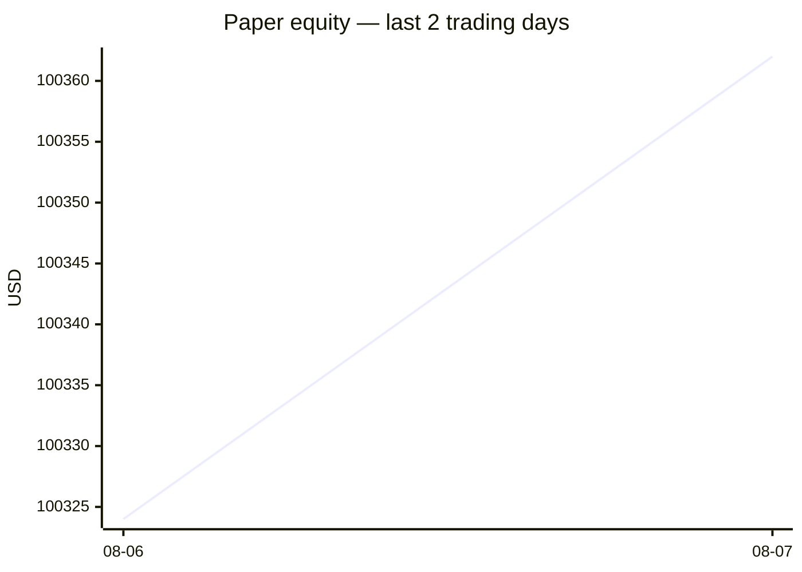
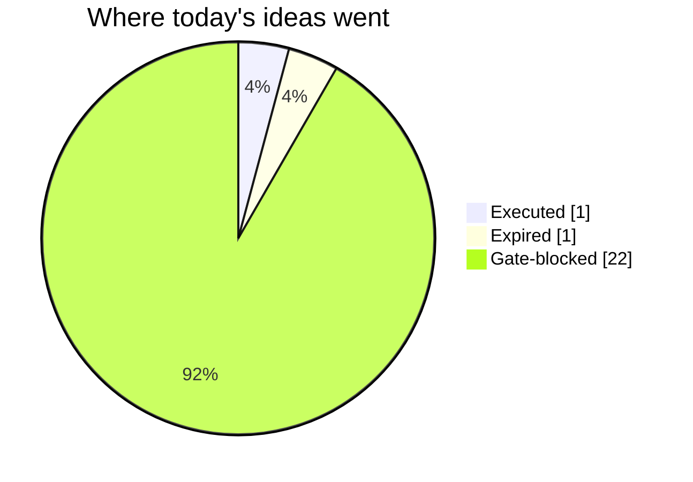
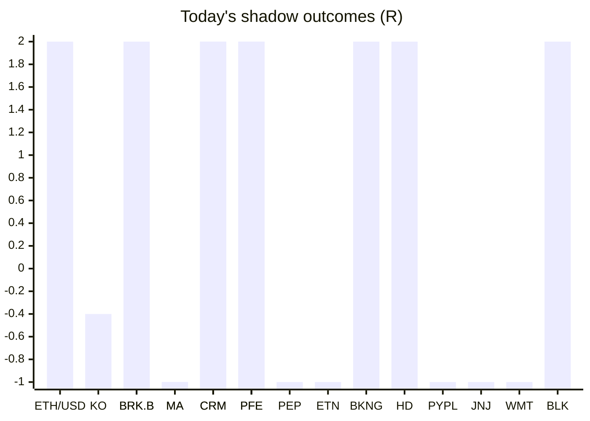

# Trading day 2026-08-07

Paper equity **$100,362** · day +0.17% · regime trending · config v3-seeded · VIX 15.15 (down)

## Charts

## Activity

- Theses formed: 2 (approved→orders: 1, human-rejected: 0, expired unapproved: 1)
- Risk gate blocked: 22
- Fills at the broker: 2

### The day's ideas

- **ETH/USD** (crypto-momentum-breakout) entry 1911.15 stop 1904.35 target 1924.75 — ETH/USD broke its 20-bar high (1905.9) on 1.7× average volume, above its 20-day average. Stop 2×ATR below (wider than equities — crypto volatility), target 2R.
- **BTC/USD** (crypto-momentum-breakout) entry 65113.57 stop 64851.93 target 65636.85 — BTC/USD broke its 20-bar high (64942.41) on 2.0× average volume, above its 20-day average. Stop 2×ATR below (wider than equities — crypto volatility), target 2R.

## Shadow ledger (what would have happened)

- ETH/USD (crypto-momentum-breakout, expired) → **target** +2R
- KO (post-earnings-drift, gate-blocked) → **timeout** -0.4R
- BRK.B (momentum-breakout, gate-blocked) → **target** +2R
- MA (momentum-breakout, gate-blocked) → **stopped** -1R
- CRM (momentum-breakout, gate-blocked) → **target** +2R
- PFE (momentum-breakout, gate-blocked) → **target** +2R
- MA (momentum-breakout, gate-blocked) → **stopped** -1R
- BRK.B (momentum-breakout, gate-blocked) → **stopped** -1R
- PEP (momentum-breakout, gate-blocked) → **stopped** -1R
- CRM (momentum-breakout, gate-blocked) → **target** +2R
- ETN (momentum-breakout, gate-blocked) → **stopped** -1R
- BKNG (momentum-breakout, gate-blocked) → **target** +2R
- HD (momentum-breakout, gate-blocked) → **target** +2R
- PYPL (momentum-breakout, gate-blocked) → **stopped** -1R
- JNJ (momentum-breakout, gate-blocked) → **stopped** -1R
- WMT (momentum-breakout, gate-blocked) → **stopped** -1R
- BLK (momentum-breakout, gate-blocked) → **target** +2R
- PFE (momentum-breakout, gate-blocked) → **target** +2R

Day total: **+9.6R**

## Running shadow record

Resolved 40 ideas · win rate 28% · total -5.98R · avg -0.15R · still tracking 37

## Is the desk earning its keep?

Shadow-outcome R by the desk verdict each idea carried (vetoed/expired ideas only — executed trades don't resolve to an R-outcome yet):

| Verdict | Ideas | Win rate | Avg R |
|---|---|---|---|
| proceed | 0 | —% | — |
| caution | 0 | —% | — |
| avoid | 0 | —% | — |
| none | 40 | 28% | -0.15 |

*Only 0 scored ideas so far — a preview, not a verdict on the AI yet.*

## Incubation ward

- **pullback-trend** — incubating: 0/25 shadow outcomes
- **crypto-mean-reversion** — incubating: 0/25 shadow outcomes

*Incubating strategies shadow-track every signal but never execute. Graduation is mechanical: 25+ outcomes, avg ≥ +0.10R, wins ≥ 40%.*

*Generated by code, no AI. Paper account only.*
