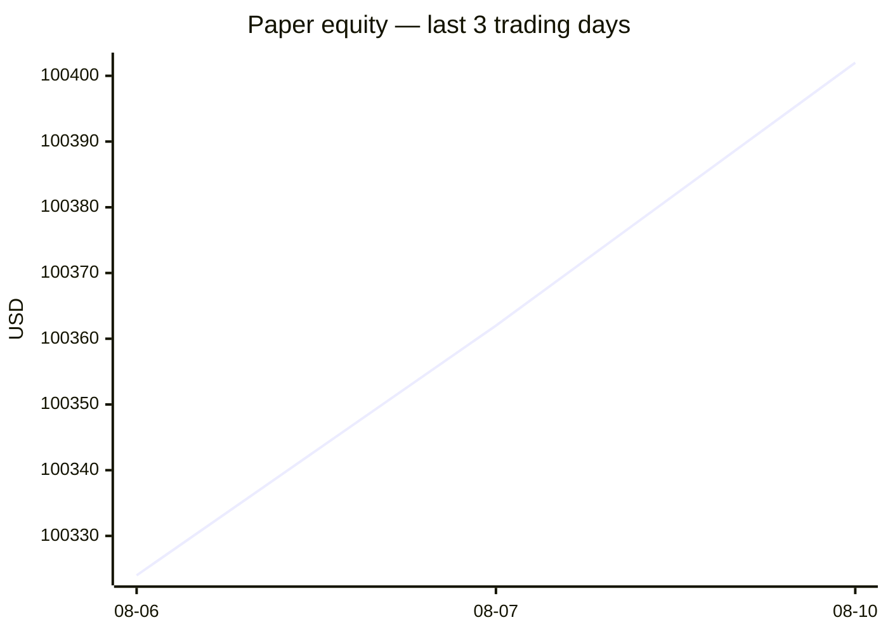
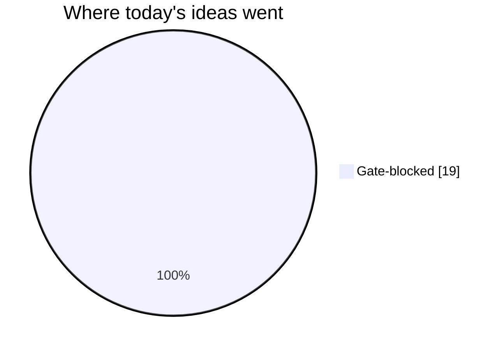
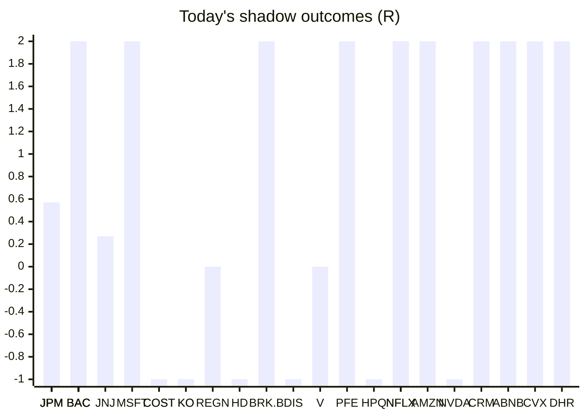

# Trading day 2026-08-10

Paper equity **$100,402** · day +0.15% · regime trending · config v3-seeded · VIX 14.9 (down)

## Charts

## Activity

- Theses formed: 0 (approved→orders: 0, human-rejected: 0, expired unapproved: 0)
- Risk gate blocked: 19
- Fills at the broker: 1

## Shadow ledger (what would have happened)

- JPM (pullback-trend, incubation) → **timeout** +0.46R
- BAC (pullback-trend, incubation) → **timeout** +0.71R
- JNJ (pullback-trend, incubation) → **timeout** +0.27R
- MSFT (momentum-breakout, gate-blocked) → **target** +2R
- COST (momentum-breakout, gate-blocked) → **stopped** -1R
- KO (momentum-breakout, gate-blocked) → **stopped** -1R
- JPM (pullback-trend, incubation) → **timeout** +0.57R
- BAC (pullback-trend, incubation) → **timeout** +0.92R
- REGN (momentum-breakout, gate-blocked) → **timeout** +0R
- BAC (momentum-breakout, gate-blocked) → **target** +2R
- HD (momentum-breakout, gate-blocked) → **stopped** -1R
- BRK.B (momentum-breakout, gate-blocked) → **target** +2R
- DIS (momentum-breakout, gate-blocked) → **stopped** -1R
- JPM (pullback-trend, incubation) → **timeout** +0.52R
- BAC (pullback-trend, incubation) → **timeout** +0.89R
- V (pullback-trend, incubation) → **timeout** +0R
- BAC (momentum-breakout, gate-blocked) → **target** +2R
- PFE (momentum-breakout, gate-blocked) → **target** +2R
- HPQ (momentum-breakout, gate-blocked) → **stopped** -1R
- NFLX (momentum-breakout, gate-blocked) → **target** +2R
- AMZN (momentum-breakout, gate-blocked) → **target** +2R
- NVDA (momentum-breakout, gate-blocked) → **stopped** -1R
- NFLX (momentum-breakout, gate-blocked) → **target** +2R
- CRM (momentum-breakout, gate-blocked) → **target** +2R
- ABNB (momentum-breakout, gate-blocked) → **target** +2R
- CVX (momentum-breakout, gate-blocked) → **target** +2R
- JPM (momentum-breakout, gate-blocked) → **stopped** -1R
- KO (momentum-breakout, gate-blocked) → **stopped** -1R
- COST (momentum-breakout, gate-blocked) → **stopped** -1R
- DHR (momentum-breakout, gate-blocked) → **target** +2R

Day total: **+19.34R**

## Running shadow record

Resolved 71 ideas · win rate 42% · total +12.36R · avg 0.17R · still tracking 27

## Is the desk earning its keep?

Shadow-outcome R by the desk verdict each idea carried (vetoed/expired ideas only — executed trades don't resolve to an R-outcome yet):

| Verdict | Ideas | Win rate | Avg R |
|---|---|---|---|
| proceed | 0 | —% | — |
| caution | 0 | —% | — |
| avoid | 0 | —% | — |
| none | 71 | 42% | 0.17 |

*Only 0 scored ideas so far — a preview, not a verdict on the AI yet.*

## Incubation ward

- **pullback-trend** — incubating: 8/25 shadow outcomes
- **crypto-mean-reversion** — incubating: 0/25 shadow outcomes

*Incubating strategies shadow-track every signal but never execute. Graduation is mechanical: 25+ outcomes, avg ≥ +0.10R, wins ≥ 40%.*

*Generated by code, no AI. Paper account only.*
