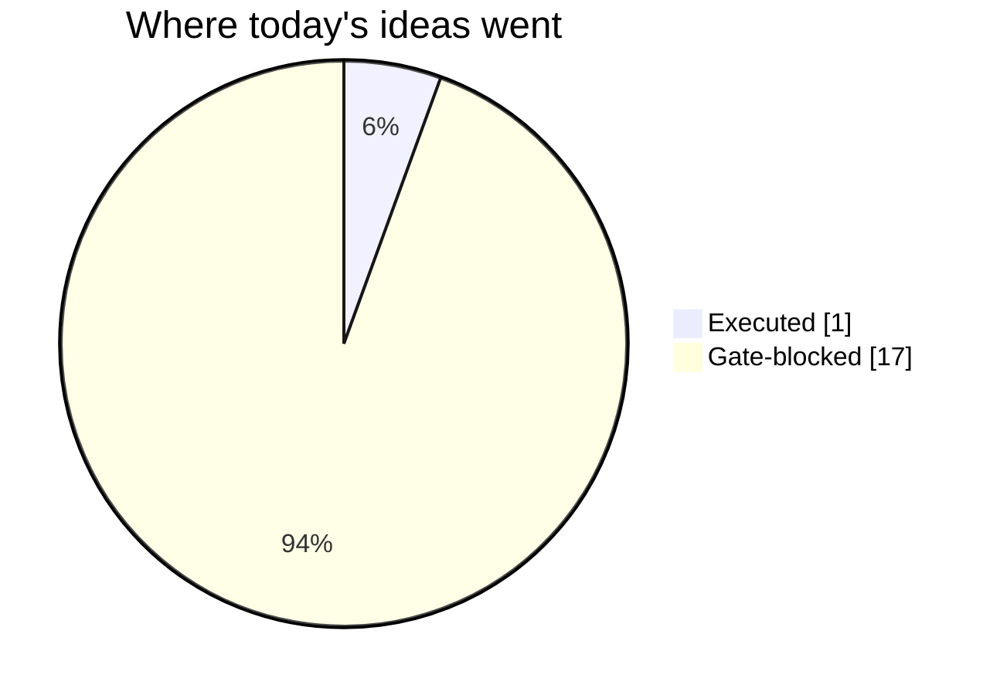
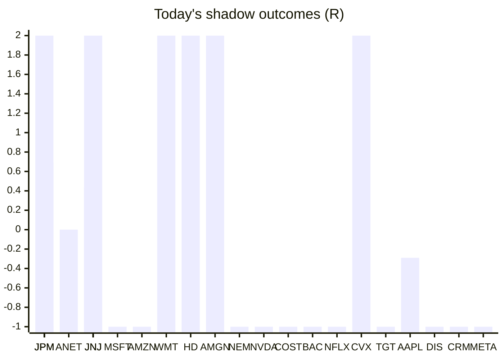

# Trading day 2026-08-11

Paper equity **$99,239** · day -1.21% · regime trending · config v4-seeded · VIX 15.46 (down)

## Charts

## Activity

- Theses formed: 1 (approved→orders: 1, human-rejected: 0, expired unapproved: 0)
- Risk gate blocked: 17
- Fills at the broker: 2

### The day's ideas

- **BTC/USD** (crypto-momentum-breakout) entry 64247.35 stop 64050.39 target 64641.27 — BTC/USD broke its 20-bar high (64194.09) on 4.8× average volume, above its 20-day average. Stop 2×ATR below (wider than equities — crypto volatility), target 2R.

## Shadow ledger (what would have happened)

- JPM (pullback-trend, incubation) → **timeout** +0.69R
- ANET (pullback-trend, incubation) → **timeout** +0R
- JNJ (momentum-breakout, gate-blocked) → **target** +2R
- JPM (momentum-breakout, gate-blocked) → **target** +2R
- MSFT (momentum-breakout, gate-blocked) → **stopped** -1R
- AMZN (momentum-breakout, gate-blocked) → **stopped** -1R
- WMT (momentum-breakout, gate-blocked) → **target** +2R
- HD (momentum-breakout, gate-blocked) → **target** +2R
- AMGN (momentum-breakout, gate-blocked) → **target** +2R
- NEM (momentum-breakout, gate-blocked) → **stopped** -1R
- NVDA (momentum-breakout, gate-blocked) → **stopped** -1R
- COST (momentum-breakout, gate-blocked) → **stopped** -1R
- JPM (momentum-breakout, gate-blocked) → **stopped** -1R
- JNJ (momentum-breakout, gate-blocked) → **stopped** -1R
- BAC (momentum-breakout, gate-blocked) → **stopped** -1R
- NFLX (momentum-breakout, gate-blocked) → **stopped** -1R
- CVX (momentum-breakout, gate-blocked) → **target** +2R
- TGT (momentum-breakout, gate-blocked) → **stopped** -1R
- AAPL (pullback-trend, incubation) → **timeout** -0.29R
- DIS (momentum-breakout, gate-blocked) → **stopped** -1R
- CRM (momentum-breakout, gate-blocked) → **stopped** -1R
- META (momentum-breakout, gate-blocked) → **stopped** -1R
- JNJ (pullback-trend, incubation) → **timeout** +0.44R

Day total: **-0.16R**

## Running shadow record

Resolved 23 ideas · win rate 35% · total -0.16R · avg -0.01R · still tracking 22

## Is the desk earning its keep?

Shadow-outcome R by the desk verdict each idea carried (vetoed/expired ideas only — executed trades don't resolve to an R-outcome yet):

| Verdict | Ideas | Win rate | Avg R |
|---|---|---|---|
| proceed | 0 | —% | — |
| caution | 0 | —% | — |
| avoid | 0 | —% | — |
| none | 23 | 35% | -0.01 |

*Only 0 scored ideas so far — a preview, not a verdict on the AI yet.*

## Incubation ward

- **pullback-trend** — incubating: 4/25 shadow outcomes
- **crypto-mean-reversion** — incubating: 0/25 shadow outcomes

*Incubating strategies shadow-track every signal but never execute. Graduation is mechanical: 25+ outcomes, avg ≥ +0.10R, wins ≥ 40%.*

*Generated by code, no AI. Paper account only.*
