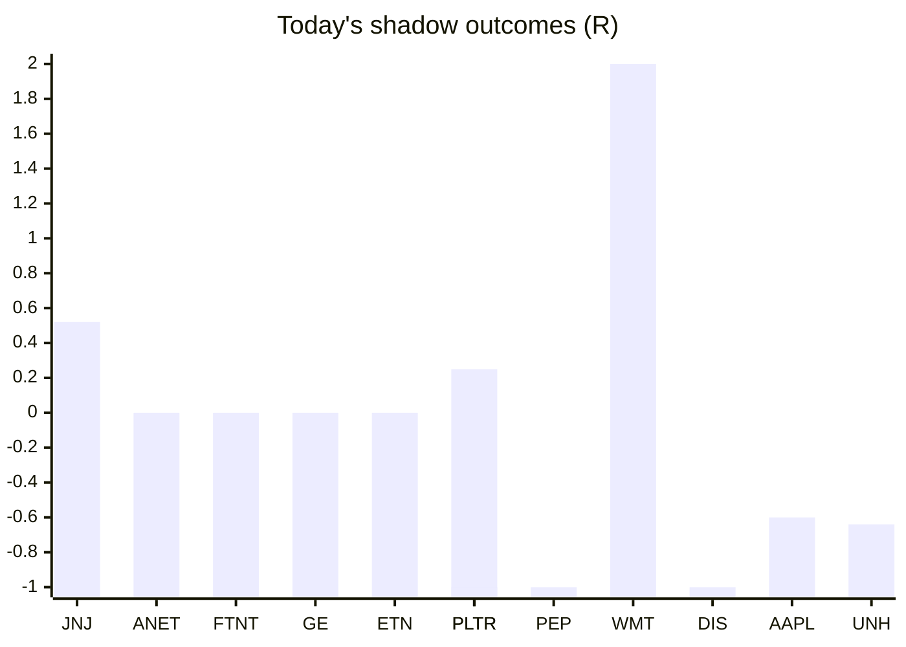

# Trading day 2026-08-12

Paper equity **$99,173** · day -0.13% · regime trending · config v4-seeded

## Charts

## Activity

- Theses formed: 0 (approved→orders: 0, human-rejected: 0, expired unapproved: 0)
- Risk gate blocked: 0
- Fills at the broker: 0

## Shadow ledger (what would have happened)

- JNJ (pullback-trend, incubation) → **timeout** +0.52R
- ANET (pullback-trend, incubation) → **timeout** +0R
- FTNT (pullback-trend, incubation) → **timeout** +0R
- GE (pullback-trend, incubation) → **timeout** +0R
- ETN (post-earnings-drift, gate-blocked) → **timeout** +0R
- PLTR (post-earnings-drift, gate-blocked) → **timeout** +0.25R
- PEP (momentum-breakout, gate-blocked) → **stopped** -1R
- WMT (momentum-breakout, gate-blocked) → **target** +2R
- PLTR (momentum-breakout, gate-blocked) → **stopped** -1R
- DIS (momentum-breakout, gate-blocked) → **stopped** -1R
- AAPL (pullback-trend, incubation) → **timeout** -0.6R
- UNH (pullback-trend, incubation) → **timeout** -0.64R

Day total: **-1.47R**

## Running shadow record

Resolved 12 ideas · win rate 25% · total -1.47R · avg -0.12R · still tracking 10

## Is the desk earning its keep?

Shadow-outcome R by the desk verdict each idea carried (vetoed/expired ideas only — executed trades don't resolve to an R-outcome yet):

| Verdict | Ideas | Win rate | Avg R |
|---|---|---|---|
| proceed | 0 | —% | — |
| caution | 0 | —% | — |
| avoid | 0 | —% | — |
| none | 12 | 25% | -0.12 |

*Only 0 scored ideas so far — a preview, not a verdict on the AI yet.*

## Incubation ward

- **pullback-trend** — incubating: 6/25 shadow outcomes
- **crypto-mean-reversion** — incubating: 0/25 shadow outcomes
- **cfd-mean-reversion** — incubating: 0/25 shadow outcomes

*Incubating strategies shadow-track every signal but never execute. Graduation is mechanical: 25+ outcomes, avg ≥ +0.10R, wins ≥ 40%.*

*Generated by code, no AI. Paper account only.*
