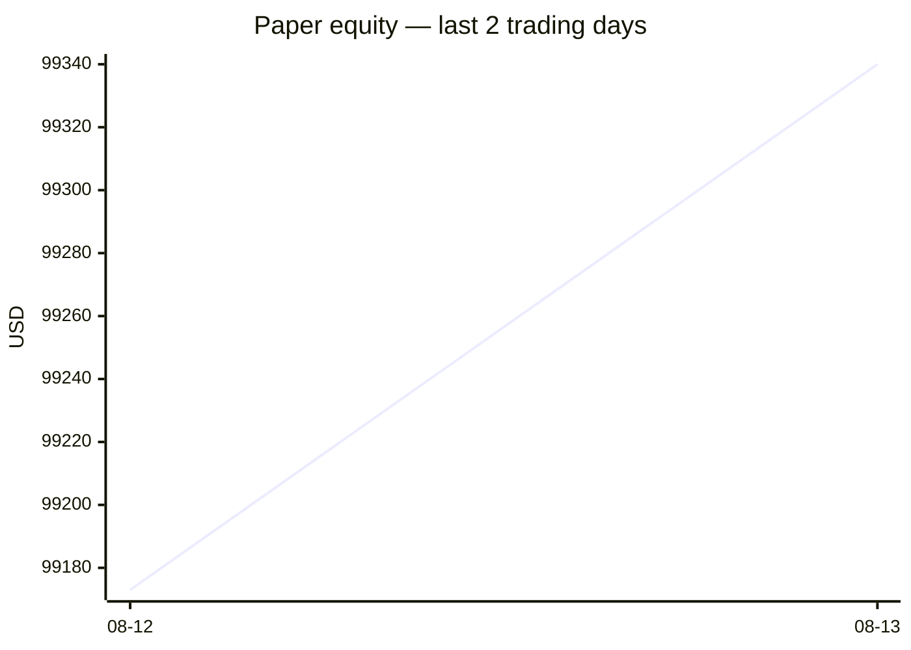
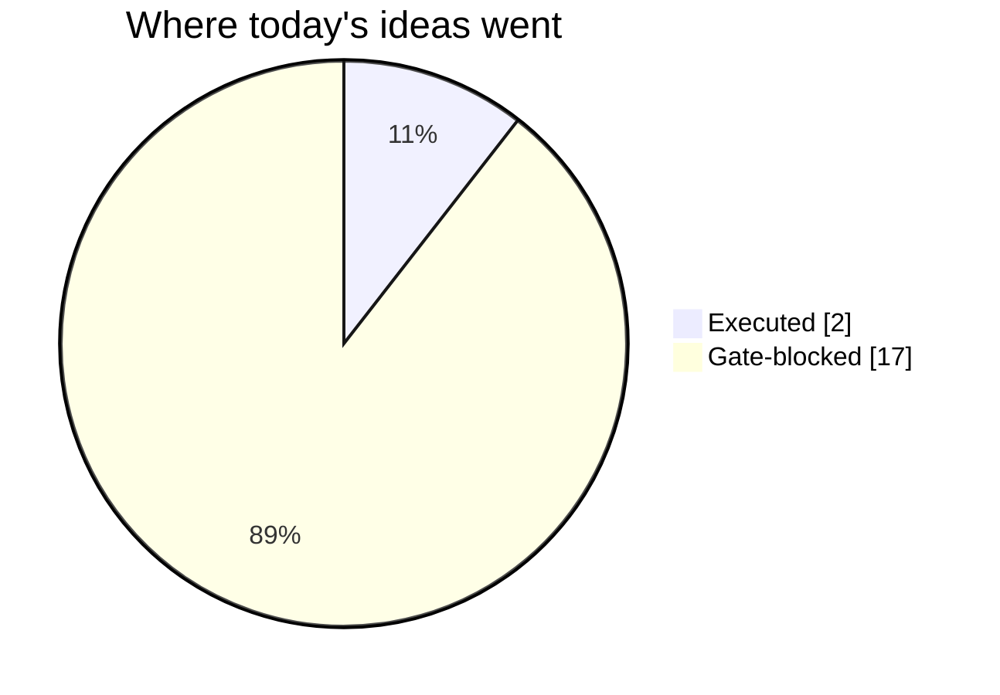
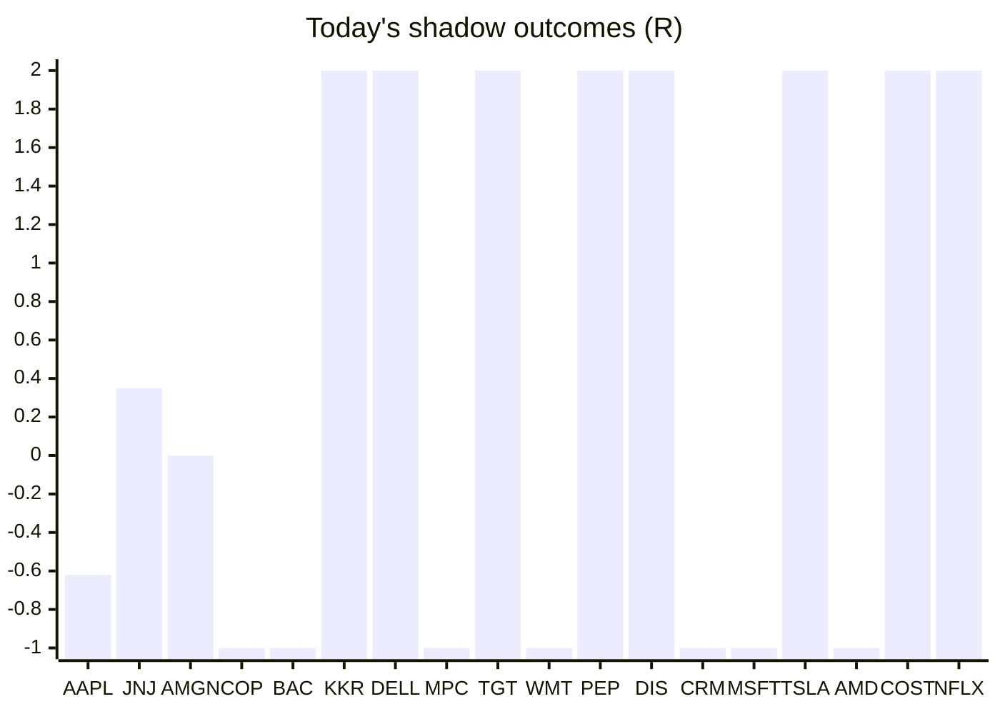

# Trading day 2026-08-13

Paper equity **$99,340** · day +0.14% · regime trending · config v4-seeded · VIX 14.55 (down)

## Charts

## Activity

- Theses formed: 2 (approved→orders: 2, human-rejected: 0, expired unapproved: 0)
- Risk gate blocked: 17
- Fills at the broker: 0

### The day's ideas

- **SPX500_USD** (cfd-momentum-breakout) entry 7804.1 stop 7774.86 target 7847.96 — SPX500_USD broke its 20-hour high (7773.2) on 2.6× average volume, above its 20-day average. Stop 3×ATR below, target 1.5R.
- **NAS100_USD** (cfd-momentum-breakout) entry 30090.7 stop 29869.35 target 30422.73 — NAS100_USD broke its 20-hour high (29841) on 3.1× average volume, above its 20-day average. Stop 3×ATR below, target 1.5R.

## Shadow ledger (what would have happened)

- AAPL (pullback-trend, incubation) → **timeout** -0.62R
- JNJ (pullback-trend, incubation) → **timeout** +0.35R
- AMGN (pullback-trend, incubation) → **timeout** +0R
- COP (momentum-breakout, gate-blocked) → **stopped** -1R
- BAC (momentum-breakout, gate-blocked) → **stopped** -1R
- KKR (momentum-breakout, gate-blocked) → **target** +2R
- DELL (momentum-breakout, gate-blocked) → **target** +2R
- MPC (momentum-breakout, gate-blocked) → **stopped** -1R
- TGT (momentum-breakout, gate-blocked) → **target** +2R
- WMT (momentum-breakout, gate-blocked) → **stopped** -1R
- PEP (momentum-breakout, gate-blocked) → **target** +2R
- DIS (momentum-breakout, gate-blocked) → **target** +2R
- CRM (momentum-breakout, gate-blocked) → **stopped** -1R
- MSFT (momentum-breakout, gate-blocked) → **stopped** -1R
- TSLA (momentum-breakout, gate-blocked) → **target** +2R
- AMD (momentum-breakout, gate-blocked) → **stopped** -1R
- COST (momentum-breakout, gate-blocked) → **target** +2R
- NFLX (momentum-breakout, gate-blocked) → **target** +2R

Day total: **+8.73R**

## Running shadow record

Resolved 18 ideas · win rate 50% · total +8.73R · avg 0.49R · still tracking 13

## Is the desk earning its keep?

Shadow-outcome R by the desk verdict each idea carried (vetoed/expired ideas only — executed trades don't resolve to an R-outcome yet):

| Verdict | Ideas | Win rate | Avg R |
|---|---|---|---|
| proceed | 0 | —% | — |
| caution | 0 | —% | — |
| avoid | 0 | —% | — |
| none | 18 | 50% | 0.49 |

*Only 0 scored ideas so far — a preview, not a verdict on the AI yet.*

## Incubation ward

- **pullback-trend** — incubating: 3/25 shadow outcomes
- **crypto-mean-reversion** — incubating: 0/25 shadow outcomes
- **cfd-mean-reversion** — incubating: 0/25 shadow outcomes

*Incubating strategies shadow-track every signal but never execute. Graduation is mechanical: 25+ outcomes, avg ≥ +0.10R, wins ≥ 40%.*

*Generated by code, no AI. Paper account only.*
