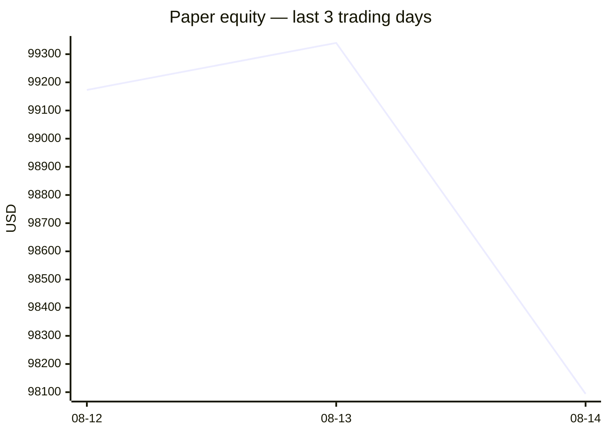
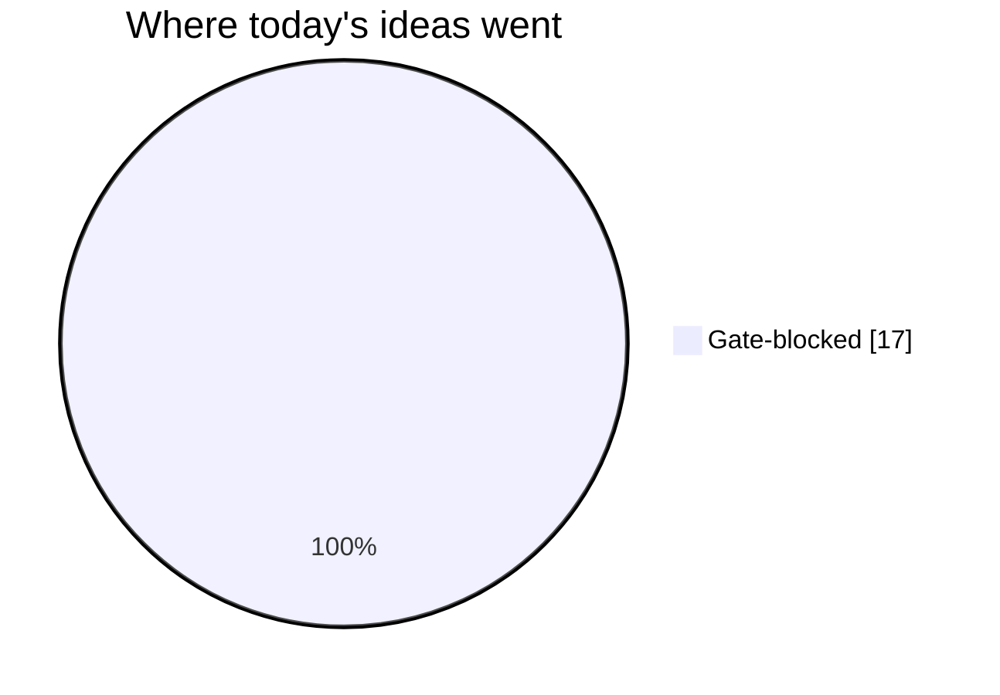
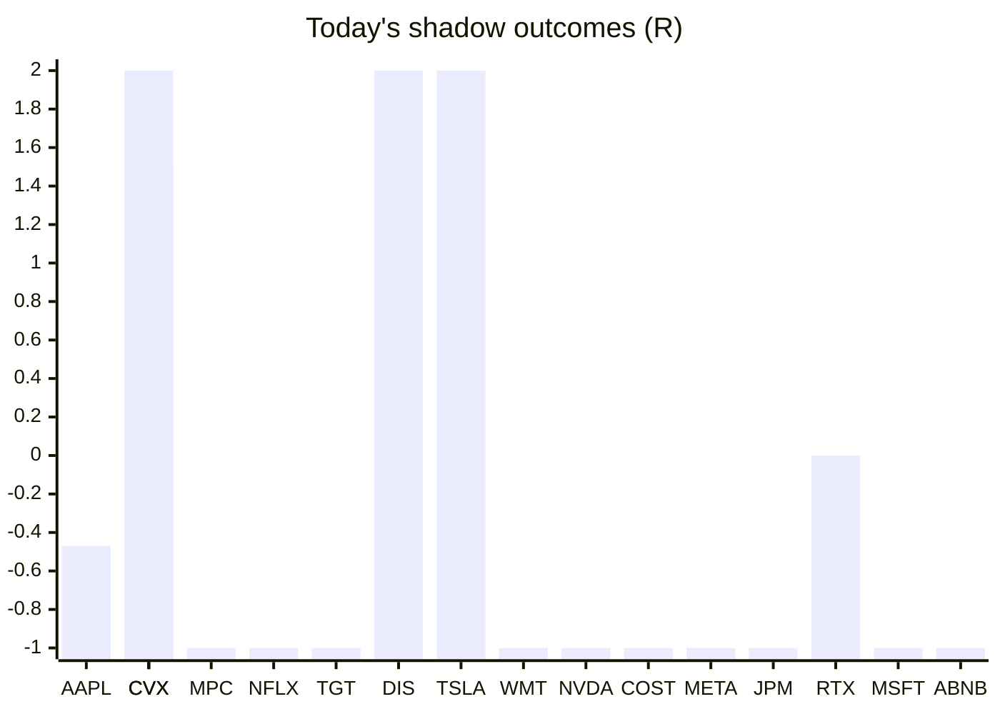

# Trading day 2026-08-14

Paper equity **$98,094** · day -1.26% · regime trending · config v4-seeded · VIX 14.63 (down)

## Charts

## Activity

- Theses formed: 0 (approved→orders: 0, human-rejected: 0, expired unapproved: 0)
- Risk gate blocked: 17
- Fills at the broker: 0

## Shadow ledger (what would have happened)

- AAPL (pullback-trend, incubation) → **timeout** -0.47R
- CVX (pullback-trend, incubation) → **timeout** +1.51R
- CVX (momentum-breakout, gate-blocked) → **target** +2R
- MPC (momentum-breakout, gate-blocked) → **stopped** -1R
- NFLX (momentum-breakout, gate-blocked) → **stopped** -1R
- TGT (momentum-breakout, gate-blocked) → **stopped** -1R
- DIS (momentum-breakout, gate-blocked) → **target** +2R
- CVX (momentum-breakout, gate-blocked) → **target** +2R
- TSLA (momentum-breakout, gate-blocked) → **target** +2R
- WMT (momentum-breakout, gate-blocked) → **stopped** -1R
- NVDA (momentum-breakout, gate-blocked) → **stopped** -1R
- COST (momentum-breakout, gate-blocked) → **stopped** -1R
- META (momentum-breakout, gate-blocked) → **stopped** -1R
- JPM (momentum-breakout, gate-blocked) → **stopped** -1R
- RTX (momentum-breakout, gate-blocked) → **timeout** +0R
- MSFT (momentum-breakout, gate-blocked) → **stopped** -1R
- ABNB (momentum-breakout, gate-blocked) → **stopped** -1R

Day total: **-0.96R**

## Running shadow record

Resolved 17 ideas · win rate 29% · total -0.96R · avg -0.06R · still tracking 17

## Is the desk earning its keep?

Shadow-outcome R by the desk verdict each idea carried (vetoed/expired ideas only — executed trades don't resolve to an R-outcome yet):

| Verdict | Ideas | Win rate | Avg R |
|---|---|---|---|
| proceed | 0 | —% | — |
| caution | 0 | —% | — |
| avoid | 0 | —% | — |
| none | 17 | 29% | -0.06 |

*Only 0 scored ideas so far — a preview, not a verdict on the AI yet.*

## Incubation ward

- **pullback-trend** — incubating: 2/25 shadow outcomes
- **crypto-mean-reversion** — incubating: 0/25 shadow outcomes
- **cfd-mean-reversion** — incubating: 0/25 shadow outcomes

*Incubating strategies shadow-track every signal but never execute. Graduation is mechanical: 25+ outcomes, avg ≥ +0.10R, wins ≥ 40%.*

*Generated by code, no AI. Paper account only.*
