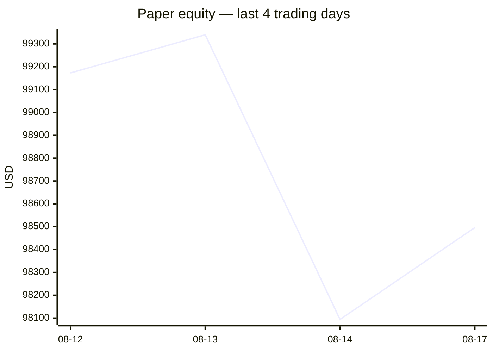
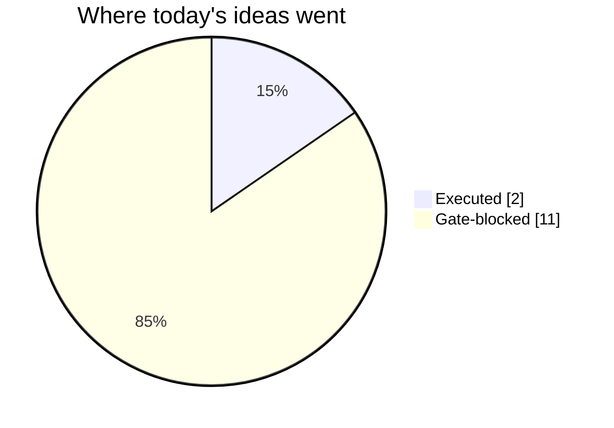
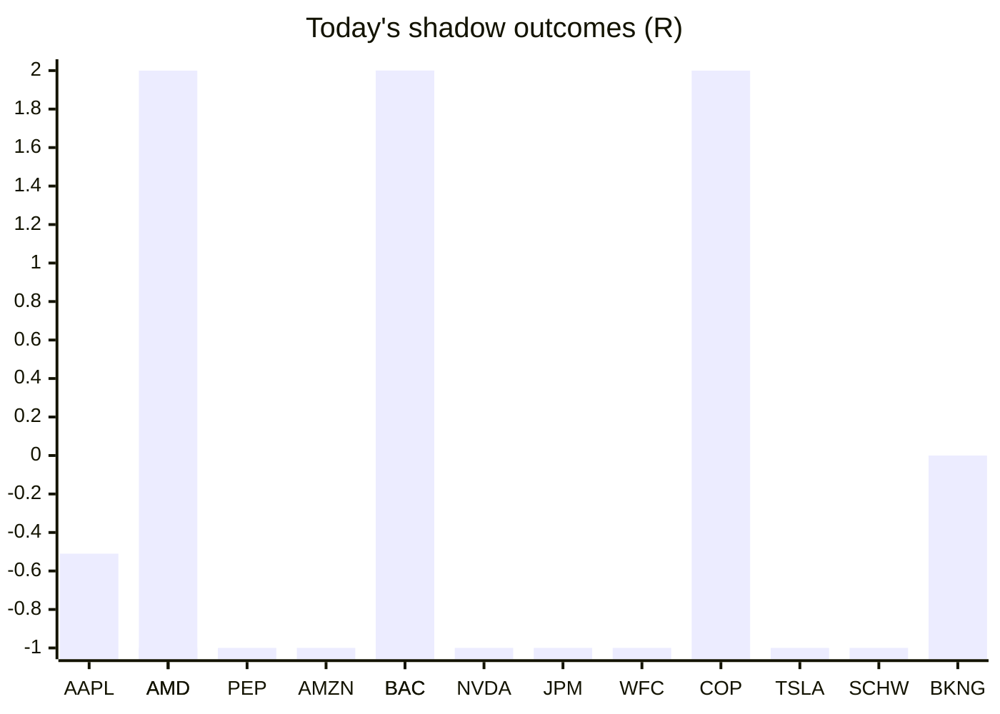

# Trading day 2026-08-17

Paper equity **$98,496** · day +0.35% · regime trending · config v4-seeded · VIX 14.25 (down)

## Charts

## Activity

- Theses formed: 2 (approved→orders: 2, human-rejected: 0, expired unapproved: 0)
- Risk gate blocked: 11
- Fills at the broker: 1

### Positions closed (real book)

- SPX500_USD → **stopped-or-closed** -1R · banked -233% of its +0.43R peak
- BTC/USD → **stopped-or-closed** -1R

Exit quality: banked **-233%** of peak open profit across 1 closed position(s) that had a real peak to protect. Persistently low = greed (holding through the give-back); high but with peaks barely above the exits = fear (selling winners too early).

### Execution quality (measured, today)

- cfd: 1 fill(s) · avg slippage cost 0.032R (negative = better than intended) · 3.6 bps · worst 0.032R
- crypto: 1 fill(s) · avg slippage cost 0.208R (negative = better than intended) · 10 bps · worst 0.208R

### The day's ideas

- **XAU_USD** (cfd-momentum-breakout) entry 4417.48 stop 4367.63 target 4492.25 — XAU_USD broke its 20-hour high (4416.55) on 3.1× average volume, above its 20-day average. Stop 3×ATR below, target 1.5R.
- **BTC/USD** (crypto-momentum-breakout) entry 64076.44 stop 63770.44 target 64688.44 — BTC/USD broke its 20-bar high (64073.51) on 1.3× average volume, above its 20-day average. Stop 2×ATR below (wider than equities — crypto volatility), target 2R.

## Shadow ledger (what would have happened)

- AAPL (pullback-trend, incubation) → **timeout** -0.51R
- AMD (momentum-breakout, gate-blocked) → **target** +2R
- PEP (momentum-breakout, gate-blocked) → **stopped** -1R
- AMZN (momentum-breakout, gate-blocked) → **stopped** -1R
- BAC (momentum-breakout, gate-blocked) → **target** +2R
- NVDA (momentum-breakout, gate-blocked) → **stopped** -1R
- BAC (momentum-breakout, gate-blocked) → **target** +2R
- JPM (momentum-breakout, gate-blocked) → **stopped** -1R
- WFC (momentum-breakout, gate-blocked) → **stopped** -1R
- AMD (momentum-breakout, gate-blocked) → **stopped** -1R
- COP (momentum-breakout, gate-blocked) → **target** +2R
- TSLA (momentum-breakout, gate-blocked) → **stopped** -1R
- SCHW (momentum-breakout, gate-blocked) → **stopped** -1R
- BKNG (momentum-breakout, gate-blocked) → **timeout** +0R

Day total: **-0.51R**

## Running shadow record

Resolved 14 ideas · win rate 29% · total -0.51R · avg -0.04R · still tracking 18

## Is the desk earning its keep?

Shadow-outcome R by the desk verdict each idea carried (vetoed/expired ideas only — executed trades don't resolve to an R-outcome yet):

| Verdict | Ideas | Win rate | Avg R |
|---|---|---|---|
| proceed | 0 | —% | — |
| caution | 0 | —% | — |
| avoid | 0 | —% | — |
| none | 14 | 29% | -0.04 |

*Only 0 scored ideas so far — a preview, not a verdict on the AI yet.*

## Incubation ward

- **pullback-trend** — incubating: 1/25 shadow outcomes
- **crypto-mean-reversion** — incubating: 0/25 shadow outcomes
- **cfd-mean-reversion** — incubating: 0/25 shadow outcomes

*Incubating strategies shadow-track every signal but never execute. Graduation is mechanical: 25+ outcomes, avg ≥ +0.10R, wins ≥ 40%.*

*Generated by code, no AI. Paper account only.*
