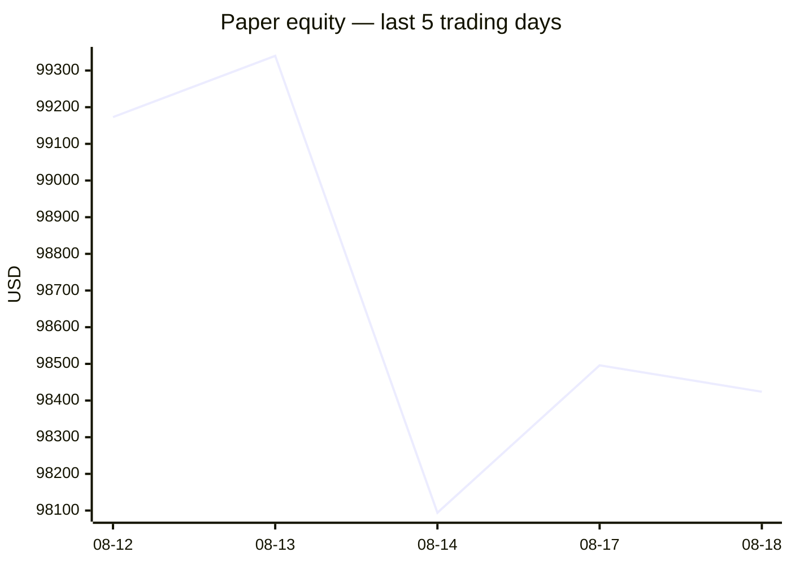
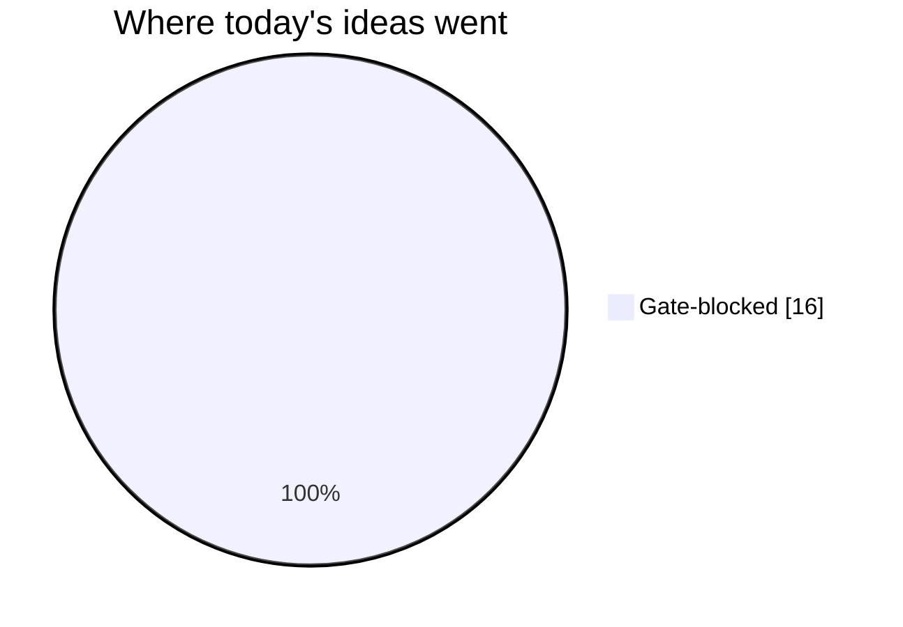
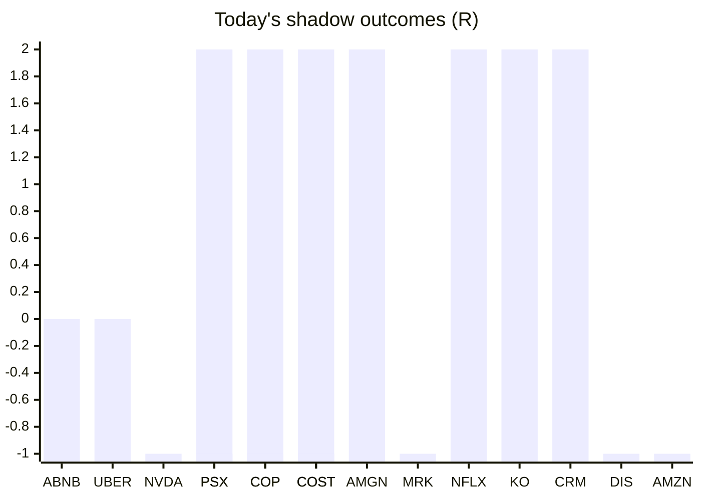

# Trading day 2026-08-18

Paper equity **$98,424** · day +0.12% · regime trending · config v4-seeded · VIX 15.19 (down)

## Charts

## Activity

- Theses formed: 0 (approved→orders: 0, human-rejected: 0, expired unapproved: 0)
- Risk gate blocked: 16
- Fills at the broker: 0

### Positions closed (real book)

- XAU_USD → **stopped-or-closed** -1R · banked -333% of its +0.3R peak

Exit quality: banked **-333%** of peak open profit across 1 closed position(s) that had a real peak to protect. Persistently low = greed (holding through the give-back); high but with peaks barely above the exits = fear (selling winners too early).

## Shadow ledger (what would have happened)

- ABNB (pullback-trend, incubation) → **timeout** +0R
- UBER (momentum-breakout, gate-blocked) → **timeout** +0R
- NVDA (momentum-breakout, gate-blocked) → **stopped** -1R
- PSX (momentum-breakout, gate-blocked) → **target** +2R
- COP (momentum-breakout, gate-blocked) → **target** +2R
- COST (momentum-breakout, gate-blocked) → **target** +2R
- AMGN (momentum-breakout, gate-blocked) → **target** +2R
- PSX (momentum-breakout, gate-blocked) → **stopped** -1R
- COP (momentum-breakout, gate-blocked) → **stopped** -1R
- COST (momentum-breakout, gate-blocked) → **stopped** -1R
- MRK (momentum-breakout, gate-blocked) → **stopped** -1R
- NFLX (momentum-breakout, gate-blocked) → **target** +2R
- KO (momentum-breakout, gate-blocked) → **target** +2R
- CRM (momentum-breakout, gate-blocked) → **target** +2R
- DIS (momentum-breakout, gate-blocked) → **stopped** -1R
- AMZN (momentum-breakout, gate-blocked) → **stopped** -1R

Day total: **+7R**

## Running shadow record

Resolved 30 ideas · win rate 37% · total +6.49R · avg 0.22R · still tracking 22

## Is the desk earning its keep?

Shadow-outcome R by the desk verdict each idea carried (vetoed/expired ideas only — executed trades don't resolve to an R-outcome yet):

| Verdict | Ideas | Win rate | Avg R |
|---|---|---|---|
| proceed | 0 | —% | — |
| caution | 0 | —% | — |
| avoid | 0 | —% | — |
| none | 30 | 37% | 0.22 |

*Only 0 scored ideas so far — a preview, not a verdict on the AI yet.*

## Incubation ward

- **pullback-trend** — incubating: 2/25 shadow outcomes
- **crypto-mean-reversion** — incubating: 0/25 shadow outcomes
- **cfd-mean-reversion** — incubating: 0/25 shadow outcomes

*Incubating strategies shadow-track every signal but never execute. Graduation is mechanical: 25+ outcomes, avg ≥ +0.10R, wins ≥ 40%.*

*Generated by code, no AI. Paper account only.*
