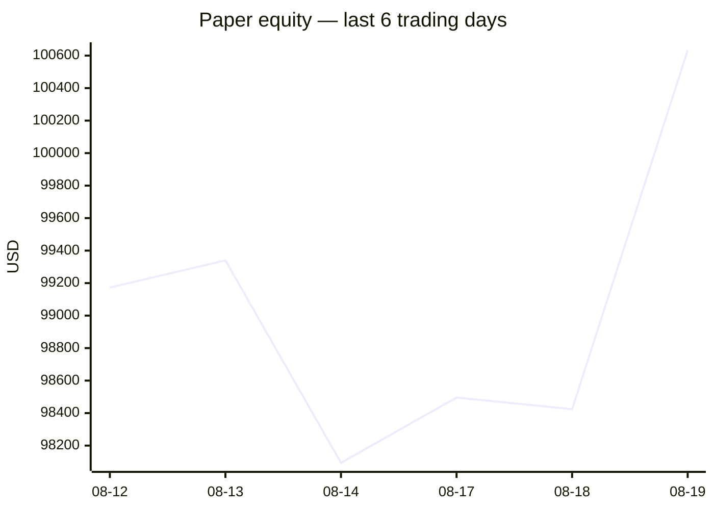
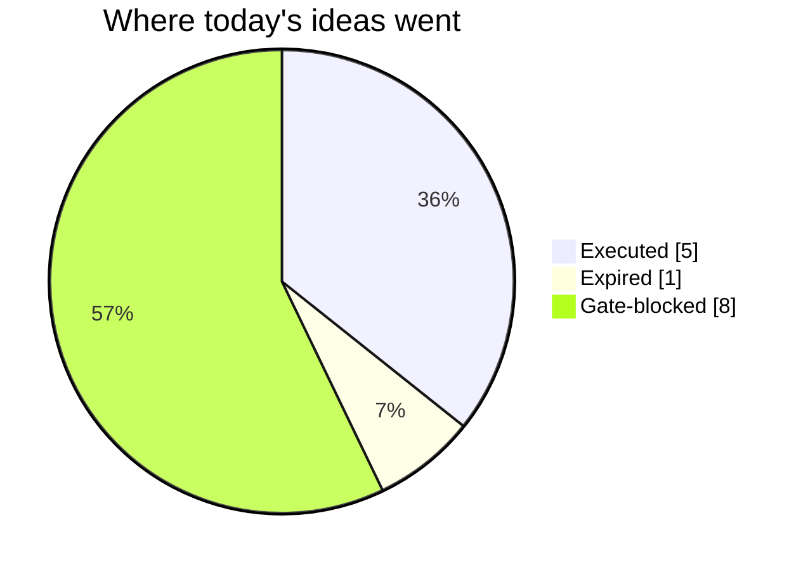
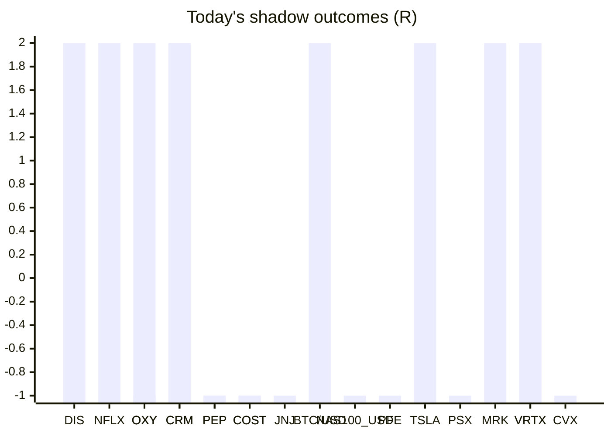

# Trading day 2026-08-19

Paper equity **$100,632** · day +2.35% · regime trending · config v4-seeded · VIX 15.84 (up)

## Charts

## Activity

- Theses formed: 10 (approved→orders: 5, human-rejected: 0, expired unapproved: 1)
- Risk gate blocked: 8
- Fills at the broker: 10

### Positions closed (real book)

- CRM → **stopped-or-closed** +0.84R · banked 46% of its +1.84R peak
- DIS → **stopped** +0.22R · banked 18% of its +1.22R peak
- MA → **stopped** -1.09R · banked -191% of its +0.57R peak
- NFLX → **stopped** +0.42R · banked 29% of its +1.43R peak
- AAPL → **stopped** -1R · banked -122% of its +0.82R peak

Exit quality: banked **-44%** of peak open profit across 5 closed position(s) that had a real peak to protect. Persistently low = greed (holding through the give-back); high but with peaks barely above the exits = fear (selling winners too early).

### Execution quality (measured, today)

- equities: 5 fill(s) · avg slippage cost 0.091R (negative = better than intended) · 16.8 bps · worst 0.309R

### The day's ideas

- **MA** (momentum-breakout) entry 580.47 stop 576.85 target 587.71 — Broke 20-bar high (578.34) with stock and SPY above their 20-day averages. Stop 2×ATR below, target 2R.
- **CRM** (momentum-breakout) entry 201.71 stop 199.49 target 206.15 — Broke 20-bar high (201.41) with stock and SPY above their 20-day averages. Stop 2×ATR below, target 2R.
- **NFLX** (momentum-breakout) entry 80 stop 79.19 target 81.62 — Broke 20-bar high (79.66) with stock and SPY above their 20-day averages. Stop 2×ATR below, target 2R.
- **AAPL** (momentum-breakout) entry 317.23 stop 314.83 target 322.03 — Broke 20-bar high (316.37) with stock and SPY above their 20-day averages. Stop 2×ATR below, target 2R.
- **DIS** (momentum-breakout) entry 106.12 stop 105.39 target 107.58 — Broke 20-bar high (105.82) with stock and SPY above their 20-day averages. Stop 2×ATR below, target 2R.
- **CVX** (momentum-breakout) entry 207.42 stop 206.35 target 209.56 — Broke 20-bar high (207.18) with stock and SPY above their 20-day averages. Stop 2×ATR below, target 2R.
- **MRK** (momentum-breakout) entry 151.38 stop 148.34 target 157.46 — Broke 20-bar high (150.83) with stock and SPY above their 20-day averages. Stop 2×ATR below, target 2R.
- **HD** (momentum-breakout) entry 348.58 stop 344.2 target 357.34 — Broke 20-bar high (348.24) with stock and SPY above their 20-day averages. Stop 2×ATR below, target 2R.
- **BTC/USD** (crypto-momentum-breakout) entry 65403.56 stop 65032.48 target 66145.72 — BTC/USD broke its 20-bar high (65403.1) on 30.1× average volume, above its 20-day average. Stop 2×ATR below (wider than equities — crypto volatility), target 2R.
- **ETH/USD** (crypto-momentum-breakout) entry 1945.73 stop 1935.24 target 1966.71 — ETH/USD broke its 20-bar high (1941.38) on 1.7× average volume, above its 20-day average. Stop 2×ATR below (wider than equities — crypto volatility), target 2R.

## Shadow ledger (what would have happened)

- DIS (momentum-breakout, gate-blocked) → **target** +2R
- NFLX (momentum-breakout, gate-blocked) → **target** +2R
- OXY (momentum-breakout, gate-blocked) → **target** +2R
- CRM (momentum-breakout, gate-blocked) → **target** +2R
- PEP (momentum-breakout, gate-blocked) → **stopped** -1R
- PEP (momentum-breakout, gate-blocked) → **stopped** -1R
- COST (momentum-breakout, gate-blocked) → **stopped** -1R
- JNJ (momentum-breakout, gate-blocked) → **stopped** -1R
- CRM (momentum-breakout, gate-blocked) → **target** +2R
- BTC/USD (crypto-momentum-breakout, expired) → **target** +2R
- NAS100_USD (cfd-momentum-breakout, gate-blocked) → **stopped** -1R
- PFE (momentum-breakout, gate-blocked) → **stopped** -1R
- COST (momentum-breakout, gate-blocked) → **stopped** -1R
- TSLA (momentum-breakout, gate-blocked) → **target** +2R
- PSX (momentum-breakout, gate-blocked) → **stopped** -1R
- OXY (momentum-breakout, gate-blocked) → **stopped** -1R
- MRK (momentum-breakout, gate-blocked) → **target** +2R
- VRTX (momentum-breakout, gate-blocked) → **target** +2R
- OXY (momentum-breakout, gate-blocked) → **stopped** -1R
- CVX (momentum-breakout, gate-blocked) → **stopped** -1R
- VRTX (momentum-breakout, gate-blocked) → **target** +2R

Day total: **+9R**

## Running shadow record

Resolved 21 ideas · win rate 48% · total +9R · avg 0.43R · still tracking 28

## Is the desk earning its keep?

Shadow-outcome R by the desk verdict each idea carried (vetoed/expired ideas only — executed trades don't resolve to an R-outcome yet):

| Verdict | Ideas | Win rate | Avg R |
|---|---|---|---|
| proceed | 0 | —% | — |
| caution | 0 | —% | — |
| avoid | 0 | —% | — |
| none | 21 | 48% | 0.43 |

*Only 0 scored ideas so far — a preview, not a verdict on the AI yet.*

## Incubation ward

- **pullback-trend** — incubating: 0/25 shadow outcomes
- **crypto-mean-reversion** — incubating: 0/25 shadow outcomes
- **cfd-mean-reversion** — incubating: 0/25 shadow outcomes
- **cfd-opening-range** — incubating: 0/25 shadow outcomes

*Incubating strategies shadow-track every signal but never execute. Graduation is mechanical: 25+ outcomes, avg ≥ +0.10R, wins ≥ 40%.*

*Generated by code, no AI. Paper account only.*
