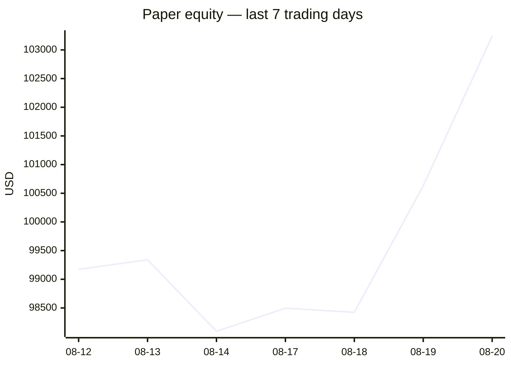
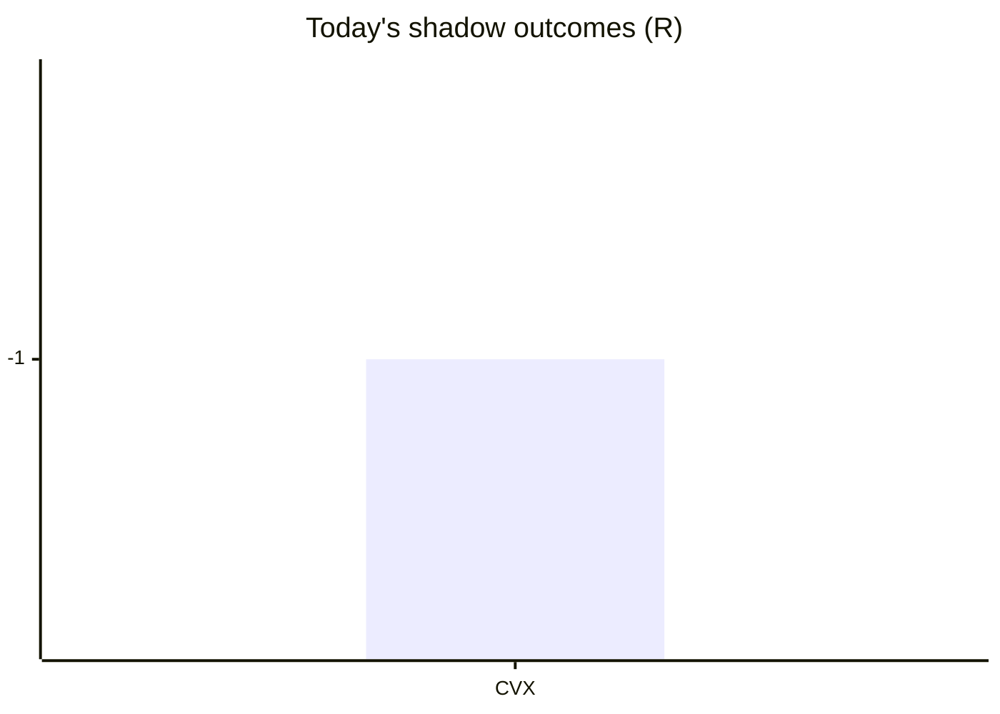

# Trading day 2026-08-20

Paper equity **$103,241** · day +0.60% · regime trending · config v4-seeded · VIX 14.89 (up)

## Charts

## Activity

- Theses formed: 0 (approved→orders: 0, human-rejected: 0, expired unapproved: 0)
- Risk gate blocked: 0
- Fills at the broker: 1

### Positions closed (real book)

- CRM → **stopped** -1.02R · banked -2050% of its +0.05R peak

Exit quality: banked **-2050%** of peak open profit across 1 closed position(s) that had a real peak to protect. Persistently low = greed (holding through the give-back); high but with peaks barely above the exits = fear (selling winners too early).

## Shadow ledger (what would have happened)

- CVX (momentum-breakout, gate-blocked) → **stopped** -1R

Day total: **-1R**

## Running shadow record

Resolved 1 ideas · win rate 0% · total -1R · avg -1R · still tracking 32

## Is the desk earning its keep?

Shadow-outcome R by the desk verdict each idea carried (vetoed/expired ideas only — executed trades don't resolve to an R-outcome yet):

| Verdict | Ideas | Win rate | Avg R |
|---|---|---|---|
| proceed | 0 | —% | — |
| caution | 0 | —% | — |
| avoid | 0 | —% | — |
| none | 1 | 0% | -1 |

*Only 0 scored ideas so far — a preview, not a verdict on the AI yet.*

## Incubation ward

- **pullback-trend** — incubating: 0/25 shadow outcomes
- **crypto-mean-reversion** — incubating: 0/25 shadow outcomes
- **cfd-mean-reversion** — incubating: 0/25 shadow outcomes
- **cfd-opening-range** — incubating: 0/25 shadow outcomes
- **equity-opening-range** — incubating: 0/25 shadow outcomes

*Incubating strategies shadow-track every signal but never execute. Graduation is mechanical: 25+ outcomes, avg ≥ +0.10R, wins ≥ 40%.*

*Generated by code, no AI. Paper account only.*
