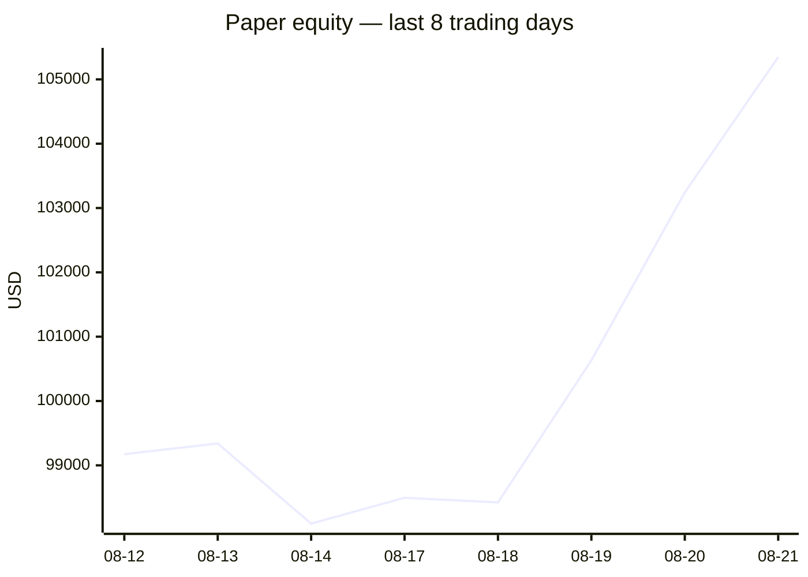
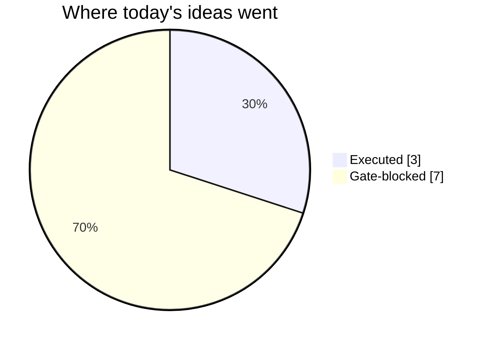
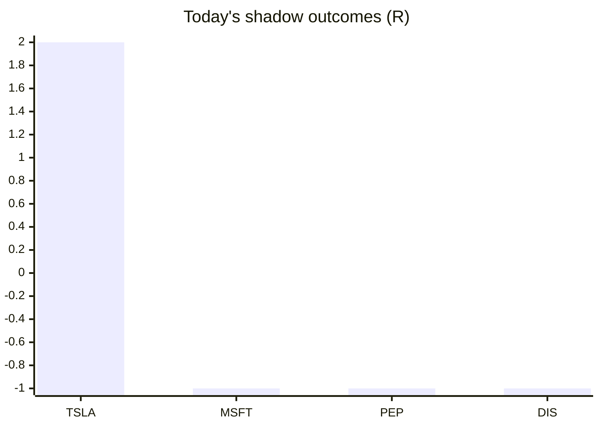

# Trading day 2026-08-21

Paper equity **$105,347** · day +1.20% · regime trending · config v4-seeded · VIX 16.01 (up)

## Charts

## Activity

- Theses formed: 6 (approved→orders: 3, human-rejected: 0, expired unapproved: 0)
- Risk gate blocked: 7
- Fills at the broker: 4

### Positions closed (real book)

- CRM → **stopped** +0.59R · banked 38% of its +1.56R peak
- KO → **stopped** -1.03R

Exit quality: banked **38%** of peak open profit across 1 closed position(s) that had a real peak to protect. Persistently low = greed (holding through the give-back); high but with peaks barely above the exits = fear (selling winners too early).

### Execution quality (measured, today)

- equities: 2 fill(s) · avg slippage cost -0.083R (negative = better than intended) · 16.5 bps · worst 0.205R
- cfd: 1 fill(s) · avg slippage cost 0.043R (negative = better than intended) · 5.9 bps · worst 0.043R

### The day's ideas

- **TSLA** (momentum-breakout) entry 352.16 stop 348.67 target 359.14 — Broke 20-bar high (351.56) with stock and SPY above their 20-day averages. Stop 2×ATR below, target 2R.
- **CRM** (momentum-breakout) entry 208.03 stop 206.13 target 211.83 — Broke 20-bar high (207.92) with stock and SPY above their 20-day averages. Stop 2×ATR below, target 2R.
- **MRK** (momentum-breakout) entry 152.73 stop 150.96 target 156.27 — Broke 20-bar high (152.5) with stock and SPY above their 20-day averages. Stop 2×ATR below, target 2R.
- **XAU_USD** (cfd-momentum-breakout) entry 4614.63 stop 4551.75 target 4708.95 — XAU_USD broke its 20-hour high (4604.61) on 2.3× average volume, above its 20-day average. Stop 3×ATR below, target 1.5R.
- **PSX** (momentum-breakout) entry 243.83 stop 242.15 target 247.19 — Broke 20-bar high (243.77) with stock and SPY above their 20-day averages. Stop 2×ATR below, target 2R.
- **KO** (momentum-breakout) entry 90.96 stop 90.61 target 91.66 — Broke 20-bar high (90.95) with stock and SPY above their 20-day averages. Stop 2×ATR below, target 2R.

## Shadow ledger (what would have happened)

- TSLA (momentum-breakout, gate-blocked) → **target** +2R
- MSFT (momentum-breakout, gate-blocked) → **stopped** -1R
- PEP (momentum-breakout, gate-blocked) → **stopped** -1R
- DIS (momentum-breakout, gate-blocked) → **stopped** -1R

Day total: **-1R**

## Running shadow record

Resolved 4 ideas · win rate 25% · total -1R · avg -0.25R · still tracking 40

## Is the desk earning its keep?

Shadow-outcome R by the desk verdict each idea carried (vetoed/expired ideas only — executed trades don't resolve to an R-outcome yet):

| Verdict | Ideas | Win rate | Avg R |
|---|---|---|---|
| proceed | 0 | —% | — |
| caution | 0 | —% | — |
| avoid | 0 | —% | — |
| none | 4 | 25% | -0.25 |

*Only 0 scored ideas so far — a preview, not a verdict on the AI yet.*

## Incubation ward

- **pullback-trend** — incubating: 0/25 shadow outcomes
- **crypto-mean-reversion** — incubating: 0/25 shadow outcomes
- **cfd-mean-reversion** — incubating: 0/25 shadow outcomes
- **cfd-opening-range** — incubating: 0/25 shadow outcomes
- **equity-opening-range** — incubating: 0/25 shadow outcomes
- **cfd-pair-reversion** — incubating: 0/25 shadow outcomes

*Incubating strategies shadow-track every signal but never execute. Graduation is mechanical: 25+ outcomes, avg ≥ +0.10R, wins ≥ 40%.*

*Generated by code, no AI. Paper account only.*
