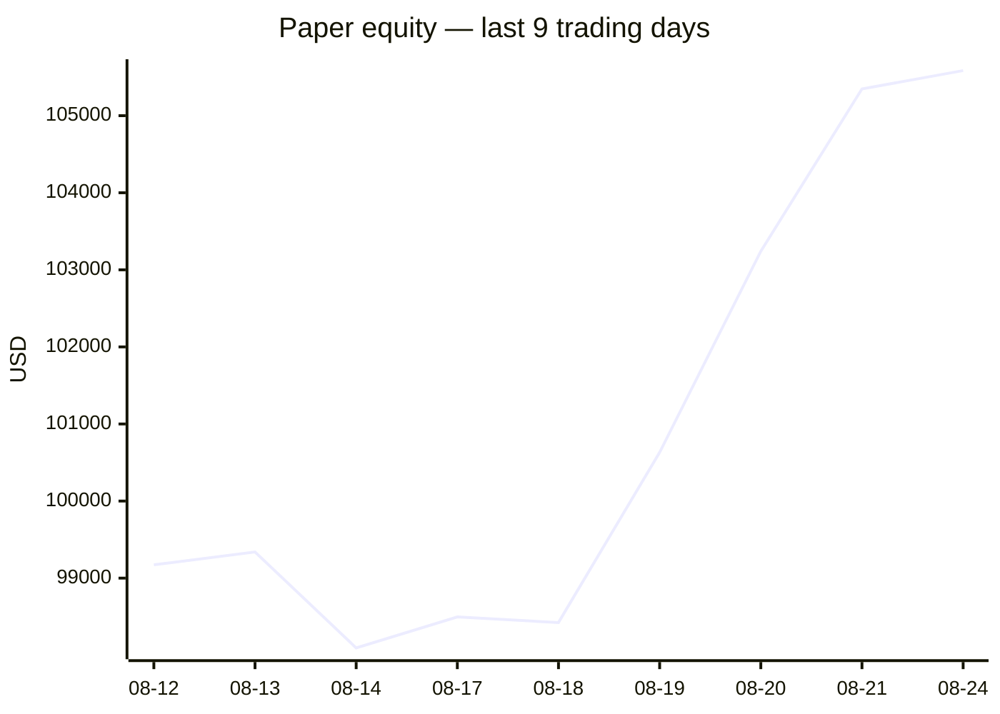
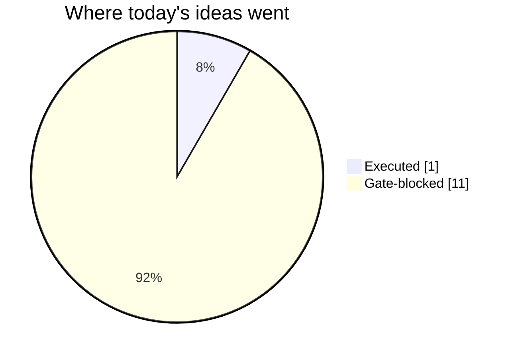
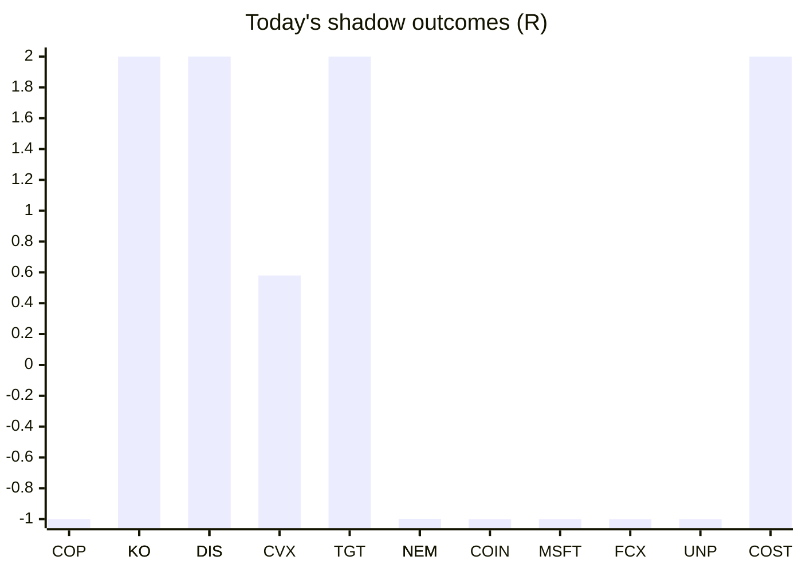

# Trading day 2026-08-24

Paper equity **$105,585** · day -0.41% · regime trending · config v4-seeded

## Charts

## Activity

- Theses formed: 2 (approved→orders: 1, human-rejected: 0, expired unapproved: 0)
- Risk gate blocked: 11
- Fills at the broker: 1

### Execution quality (measured, today)

- equities: 1 fill(s) · avg slippage cost -0.188R (negative = better than intended) · 11.2 bps · worst 0R

### The day's ideas

- **JNJ** (momentum-breakout) entry 271.98 stop 270.46 target 275.02 — Broke 20-bar high (271.95) with stock and SPY above their 20-day averages. Stop 2×ATR below, target 2R.
- **NFLX** (momentum-breakout) entry 80.39 stop 79.91 target 81.35 — Broke 20-bar high (80.38) with stock and SPY above their 20-day averages. Stop 2×ATR below, target 2R.

## Shadow ledger (what would have happened)

- COP (momentum-breakout, gate-blocked) → **stopped** -1R
- KO (pullback-trend, incubation) → **timeout** +1.78R
- DIS (momentum-breakout, gate-blocked) → **target** +2R
- CVX (pullback-trend, incubation) → **timeout** +0.58R
- KO (momentum-breakout, gate-blocked) → **target** +2R
- TGT (momentum-breakout, gate-blocked) → **target** +2R
- NEM (momentum-breakout, gate-blocked) → **stopped** -1R
- COIN (momentum-breakout, gate-blocked) → **stopped** -1R
- MSFT (momentum-breakout, gate-blocked) → **stopped** -1R
- DIS (momentum-breakout, gate-blocked) → **target** +2R
- FCX (momentum-breakout, gate-blocked) → **stopped** -1R
- NEM (momentum-breakout, gate-blocked) → **stopped** -1R
- NEM (momentum-breakout, gate-blocked) → **stopped** -1R
- UNP (momentum-breakout, gate-blocked) → **stopped** -1R
- COST (momentum-breakout, gate-blocked) → **target** +2R

Day total: **+4.36R**

## Running shadow record

Resolved 19 ideas · win rate 42% · total +3.36R · avg 0.18R · still tracking 41

## Is the desk earning its keep?

Shadow-outcome R by the desk verdict each idea carried (vetoed/expired ideas only — executed trades don't resolve to an R-outcome yet):

| Verdict | Ideas | Win rate | Avg R |
|---|---|---|---|
| proceed | 0 | —% | — |
| caution | 0 | —% | — |
| avoid | 0 | —% | — |
| none | 19 | 42% | 0.18 |

*Only 0 scored ideas so far — a preview, not a verdict on the AI yet.*

## Incubation ward

- **pullback-trend** — incubating: 2/25 shadow outcomes
- **crypto-mean-reversion** — incubating: 0/25 shadow outcomes
- **cfd-mean-reversion** — incubating: 0/25 shadow outcomes
- **cfd-opening-range** — incubating: 0/25 shadow outcomes
- **equity-opening-range** — incubating: 0/25 shadow outcomes
- **cfd-pair-reversion** — incubating: 0/25 shadow outcomes

*Incubating strategies shadow-track every signal but never execute. Graduation is mechanical: 25+ outcomes, avg ≥ +0.10R, wins ≥ 40%.*

*Generated by code, no AI. Paper account only.*
