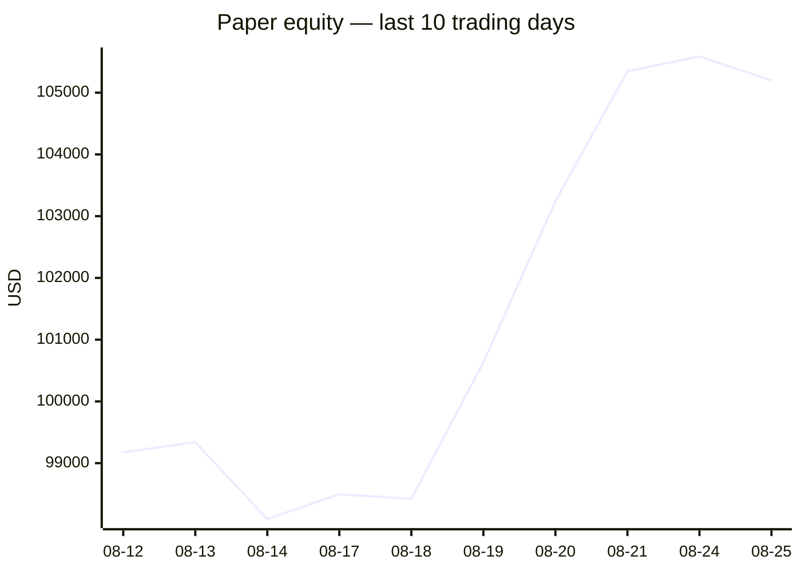
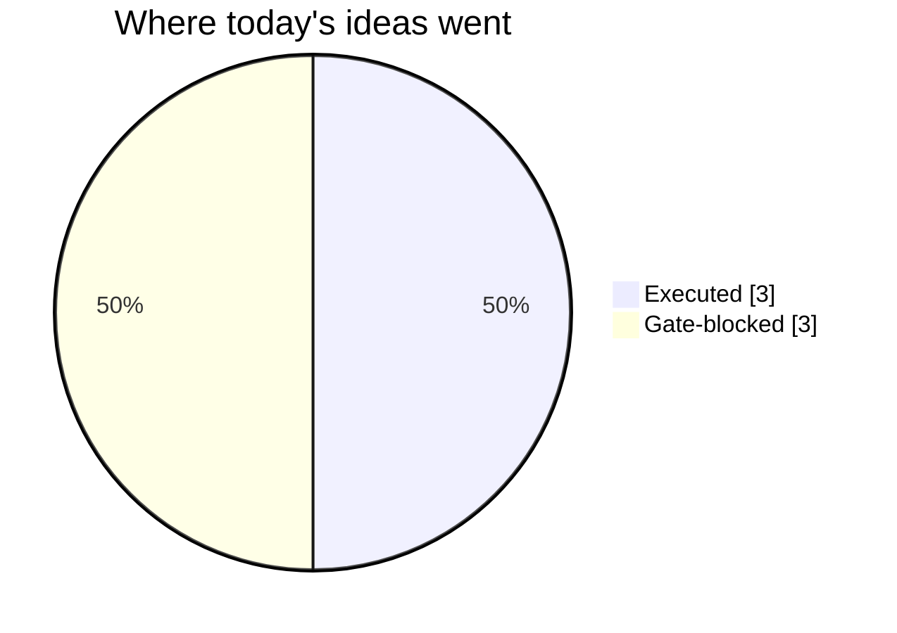
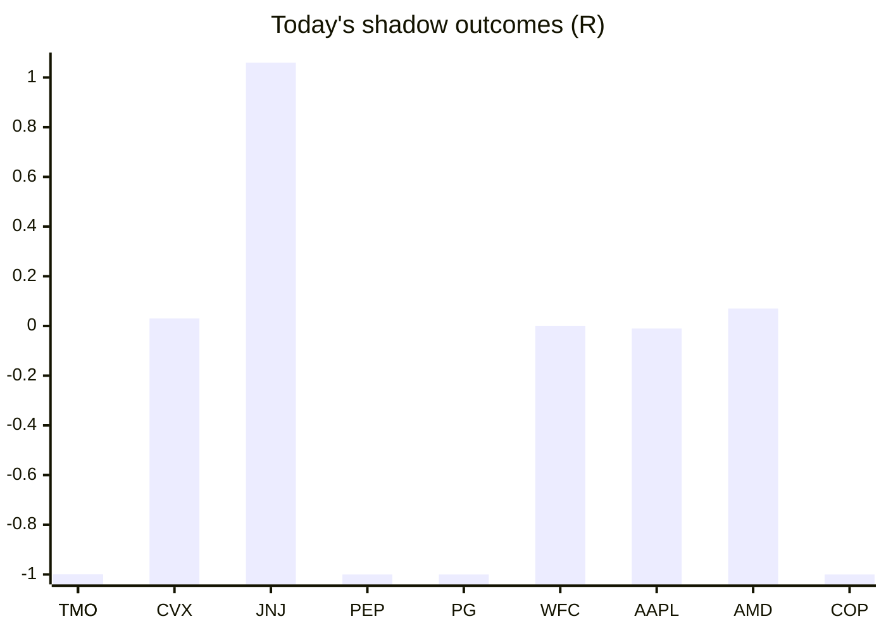

# Trading day 2026-08-25

Paper equity **$105,201** · day -0.71% · regime trending · config v4-seeded · VIX 15.85 (up)

## Charts

## Activity

- Theses formed: 4 (approved→orders: 3, human-rejected: 0, expired unapproved: 0)
- Risk gate blocked: 3
- Fills at the broker: 5

### Positions closed (real book)

- NFLX → **stopped-or-closed** +0.71R · banked 42% of its +1.7R peak
- TSLA → **stopped** -0.99R · banked -198% of its +0.5R peak

Exit quality: banked **-78%** of peak open profit across 2 closed position(s) that had a real peak to protect. Persistently low = greed (holding through the give-back); high but with peaks barely above the exits = fear (selling winners too early).

### Execution quality (measured, today)

- equities: 3 fill(s) · avg slippage cost -0.095R (negative = better than intended) · 6.3 bps · worst 0.01R

### The day's ideas

- **DIS** (momentum-breakout) entry 110.92 stop 110.16 target 112.44 — Broke 20-bar high (110.85) with stock and SPY above their 20-day averages. Stop 2×ATR below, target 2R.
- **UNP** (momentum-breakout) entry 310.1 stop 308.53 target 313.24 — Broke 20-bar high (309.94) with stock and SPY above their 20-day averages. Stop 2×ATR below, target 2R.
- **TSLA** (momentum-breakout) entry 354.88 stop 350.83 target 362.98 — Broke 20-bar high (354.86) with stock and SPY above their 20-day averages. Stop 2×ATR below, target 2R.
- **MSFT** (momentum-breakout) entry 490.67 stop 488 target 496.01 — Broke 20-bar high (490.35) with stock and SPY above their 20-day averages. Stop 2×ATR below, target 2R.

## Shadow ledger (what would have happened)

- TMO (momentum-breakout, gate-blocked) → **stopped** -1R
- CVX (pullback-trend, incubation) → **timeout** +0.03R
- JNJ (pullback-trend, incubation) → **timeout** +1.06R
- PEP (momentum-breakout, gate-blocked) → **stopped** -1R
- PG (momentum-breakout, gate-blocked) → **stopped** -1R
- WFC (pullback-trend, incubation) → **timeout** +0R
- TMO (momentum-breakout, gate-blocked) → **stopped** -1R
- AAPL (pullback-trend, incubation) → **timeout** -0.01R
- AMD (equity-opening-range, incubation) → **timeout** +0.07R
- COP (momentum-breakout, gate-blocked) → **stopped** -1R

Day total: **-3.85R**

## Running shadow record

Resolved 10 ideas · win rate 30% · total -3.85R · avg -0.38R · still tracking 42

## Is the desk earning its keep?

Shadow-outcome R by the desk verdict each idea carried (vetoed/expired ideas only — executed trades don't resolve to an R-outcome yet):

| Verdict | Ideas | Win rate | Avg R |
|---|---|---|---|
| proceed | 0 | —% | — |
| caution | 0 | —% | — |
| avoid | 0 | —% | — |
| none | 10 | 30% | -0.38 |

*Only 0 scored ideas so far — a preview, not a verdict on the AI yet.*

## Incubation ward

- **pullback-trend** — incubating: 4/25 shadow outcomes
- **crypto-mean-reversion** — incubating: 0/25 shadow outcomes
- **cfd-mean-reversion** — incubating: 0/25 shadow outcomes
- **cfd-opening-range** — incubating: 0/25 shadow outcomes
- **equity-opening-range** — incubating: 1/25 shadow outcomes
- **cfd-pair-reversion** — incubating: 0/25 shadow outcomes

*Incubating strategies shadow-track every signal but never execute. Graduation is mechanical: 25+ outcomes, avg ≥ +0.10R, wins ≥ 40%.*

*Generated by code, no AI. Paper account only.*
