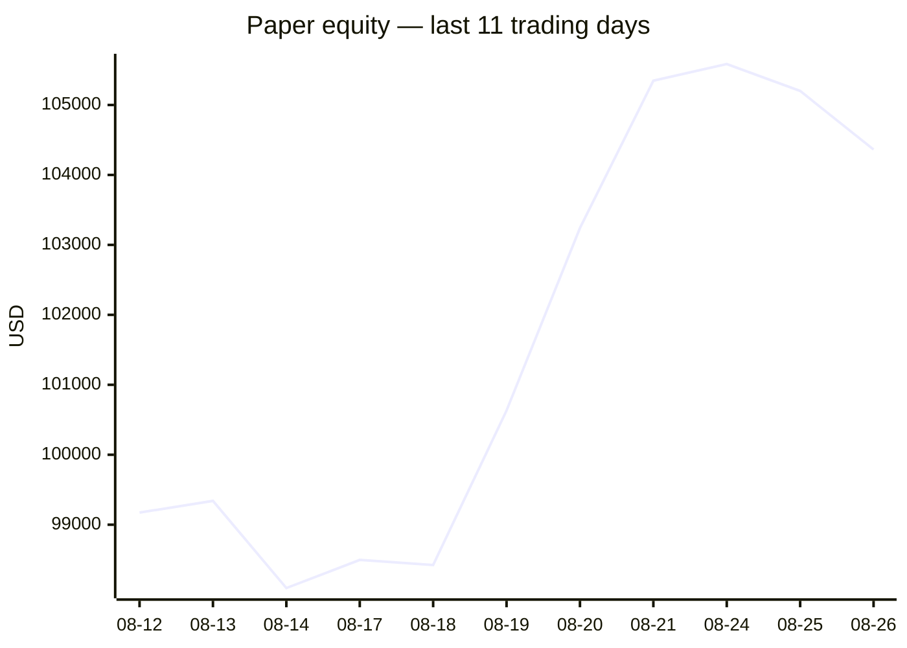
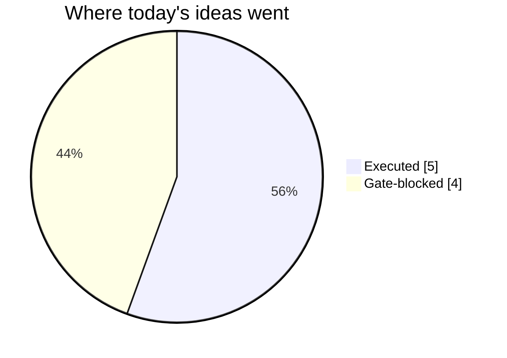
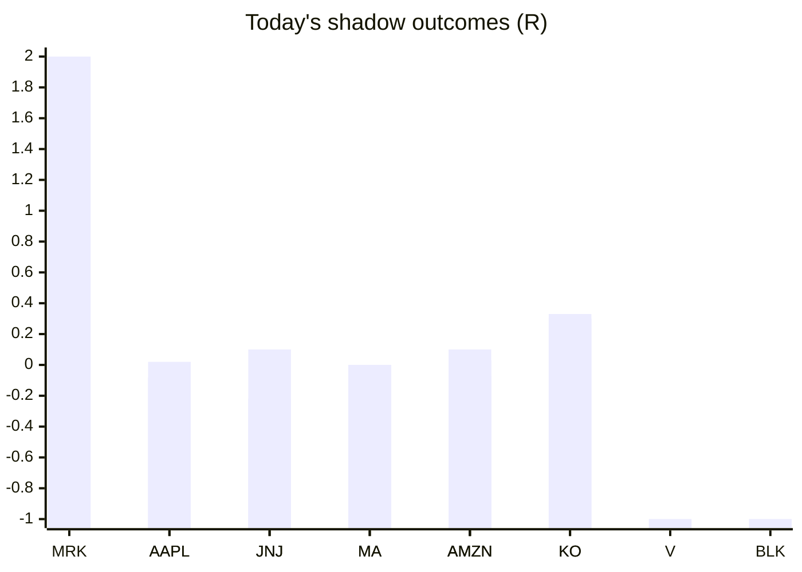

# Trading day 2026-08-26

Paper equity **$104,363** · day -0.76% · regime trending · config v4-seeded · VIX 15.45 (down)

## Charts

## Activity

- Theses formed: 5 (approved→orders: 5, human-rejected: 0, expired unapproved: 0)
- Risk gate blocked: 4
- Fills at the broker: 8

### Positions closed (real book)

- MSFT → **stopped-or-closed** +0.91R · banked 48% of its +1.9R peak
- AMD → **stopped** -1R
- UNP → **stopped** +0.51R · banked 32% of its +1.61R peak
- AAPL → **stopped** +0.7R · banked 41% of its +1.71R peak

Exit quality: banked **40%** of peak open profit across 3 closed position(s) that had a real peak to protect. Persistently low = greed (holding through the give-back); high but with peaks barely above the exits = fear (selling winners too early).

### Execution quality (measured, today)

- equities: 4 fill(s) · avg slippage cost -0.034R (negative = better than intended) · 22.9 bps · worst 0.403R
- cfd: 1 fill(s) · avg slippage cost -0.059R (negative = better than intended) · 2.7 bps · worst 0R

### The day's ideas

- **AMD** (momentum-breakout) entry 489.78 stop 483.67 target 502 — Broke 20-bar high (488.1) with stock and SPY above their 20-day averages. Stop 2×ATR below, target 2R.
- **MSFT** (momentum-breakout) entry 495.17 stop 491.71 target 502.09 — Broke 20-bar high (495.07) with stock and SPY above their 20-day averages. Stop 2×ATR below, target 2R.
- **UNP** (momentum-breakout) entry 311.9 stop 310.56 target 314.58 — Broke 20-bar high (311.63) with stock and SPY above their 20-day averages. Stop 2×ATR below, target 2R.
- **AAPL** (momentum-breakout) entry 312.5 stop 310.84 target 315.82 — Broke 20-bar high (311.66) with stock and SPY above their 20-day averages. Stop 2×ATR below, target 2R.
- **SPX500_USD** (cfd-momentum-breakout) entry 7690.3 stop 7654.96 target 7743.31 — SPX500_USD broke its 20-hour high (7686) on 3.8× average volume, above its 20-day average. Stop 3×ATR below, target 1.5R.

## Shadow ledger (what would have happened)

- MRK (momentum-breakout, gate-blocked) → **target** +2R
- AAPL (pullback-trend, incubation) → **timeout** +0.02R
- JNJ (pullback-trend, incubation) → **timeout** +0.1R
- MA (pullback-trend, incubation) → **timeout** +0R
- AMZN (pullback-trend, incubation) → **timeout** -0.07R
- AAPL (pullback-trend, incubation) → **timeout** -0.08R
- KO (pullback-trend, incubation) → **timeout** +0.3R
- V (momentum-breakout, gate-blocked) → **stopped** -1R
- AMZN (pullback-trend, incubation) → **timeout** +0.1R
- MA (pullback-trend, incubation) → **timeout** +0R
- AMZN (pullback-trend, incubation) → **timeout** +0.03R
- JNJ (pullback-trend, incubation) → **timeout** -0.22R
- KO (pullback-trend, incubation) → **timeout** +0.33R
- BLK (momentum-breakout, gate-blocked) → **stopped** -1R

Day total: **+0.51R**

## Running shadow record

Resolved 24 ideas · win rate 42% · total -3.34R · avg -0.14R · still tracking 36

## Is the desk earning its keep?

Shadow-outcome R by the desk verdict each idea carried (vetoed/expired ideas only — executed trades don't resolve to an R-outcome yet):

| Verdict | Ideas | Win rate | Avg R |
|---|---|---|---|
| proceed | 0 | —% | — |
| caution | 0 | —% | — |
| avoid | 0 | —% | — |
| none | 24 | 42% | -0.14 |

*Only 0 scored ideas so far — a preview, not a verdict on the AI yet.*

## Incubation ward

- **pullback-trend** — incubating: 15/25 shadow outcomes
- **crypto-mean-reversion** — incubating: 0/25 shadow outcomes
- **cfd-mean-reversion** — incubating: 0/25 shadow outcomes
- **cfd-opening-range** — incubating: 0/25 shadow outcomes
- **equity-opening-range** — incubating: 1/25 shadow outcomes
- **cfd-pair-reversion** — incubating: 0/25 shadow outcomes

*Incubating strategies shadow-track every signal but never execute. Graduation is mechanical: 25+ outcomes, avg ≥ +0.10R, wins ≥ 40%.*

*Generated by code, no AI. Paper account only.*
