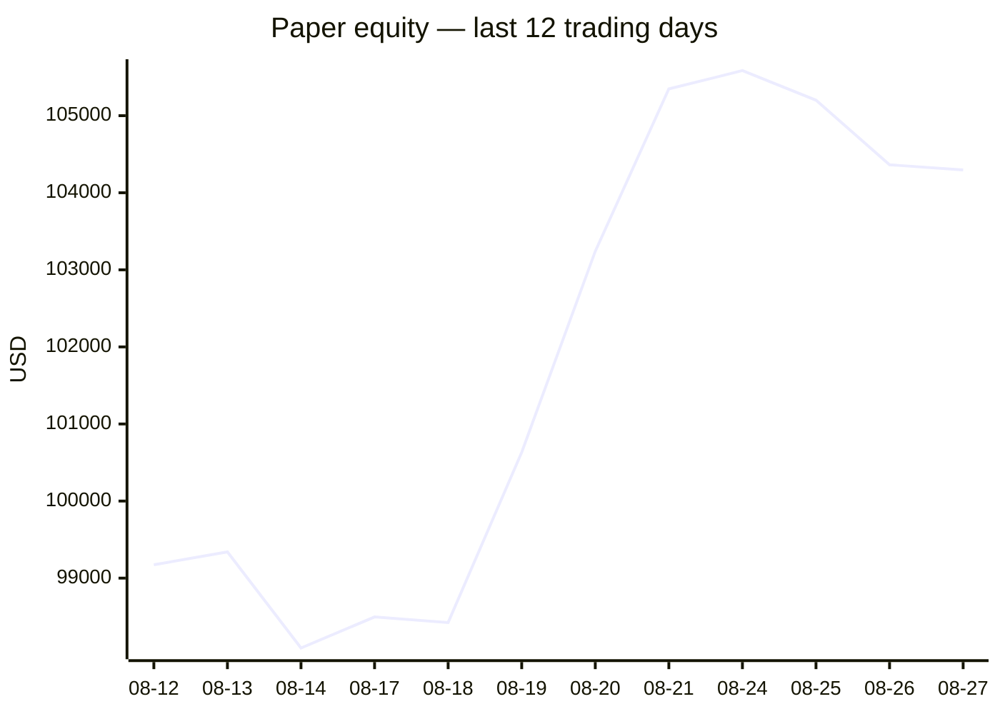
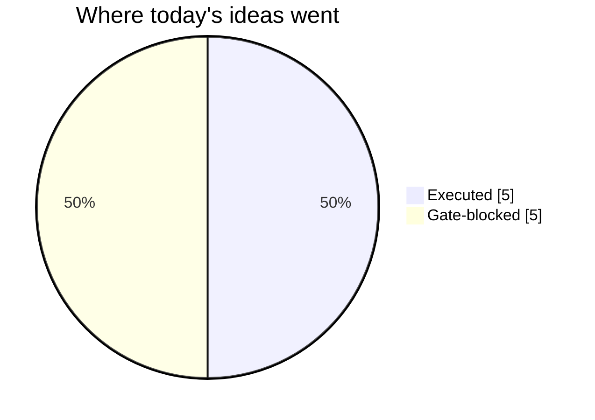
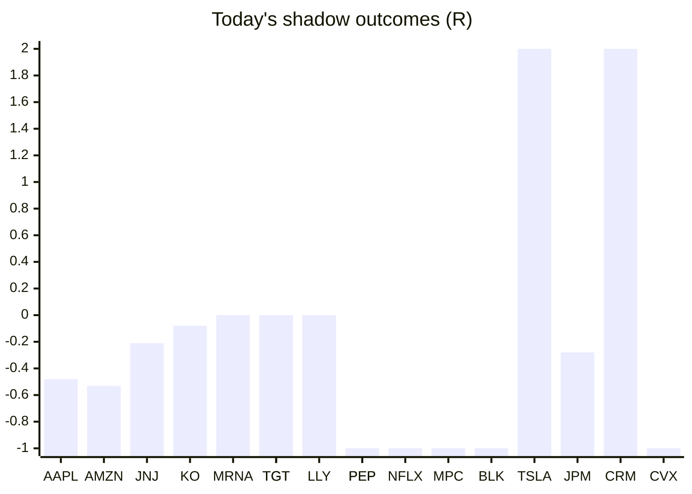

# Trading day 2026-08-27

Paper equity **$104,296** · day -0.36% · regime trending · config v4-seeded · VIX 15.21 (up)

## Charts

## Activity

- Theses formed: 5 (approved→orders: 5, human-rejected: 0, expired unapproved: 0)
- Risk gate blocked: 5
- Fills at the broker: 10

### Positions closed (real book)

- SPX500_USD → **stopped** +0.28R · banked 22% of its +1.28R peak
- MSFT → **stopped** -0.63R · banked -61% of its +1.03R peak
- MSFT → **stopped-or-closed** +0.9R · banked 47% of its +1.9R peak
- META → **stopped** -1.1R · banked -167% of its +0.66R peak
- TMO → **stopped** -1.18R
- FCX → **stopped** -1.01R · banked -184% of its +0.55R peak

Exit quality: banked **-69%** of peak open profit across 5 closed position(s) that had a real peak to protect. Persistently low = greed (holding through the give-back); high but with peaks barely above the exits = fear (selling winners too early).

### Execution quality (measured, today)

- cfd: 1 fill(s) · avg slippage cost 0R (negative = better than intended) · 0 bps · worst 0R
- equities: 5 fill(s) · avg slippage cost -0.029R (negative = better than intended) · 15.4 bps · worst 0.306R

### The day's ideas

- **MSFT** (momentum-breakout) entry 498.29 stop 494.92 target 505.03 — Broke 20-bar high (497.4) with stock and SPY above their 20-day averages. Stop 2×ATR below, target 2R.
- **META** (momentum-breakout) entry 583.23 stop 575.75 target 598.19 — Broke 20-bar high (582.99) with stock and SPY above their 20-day averages. Stop 2×ATR below, target 2R.
- **FCX** (momentum-breakout) entry 79.36 stop 78.53 target 81.02 — Broke 20-bar high (79.33) with stock and SPY above their 20-day averages. Stop 2×ATR below, target 2R.
- **TMO** (momentum-breakout) entry 636.76 stop 632.14 target 646 — Broke 20-bar high (636.64) with stock and SPY above their 20-day averages. Stop 2×ATR below, target 2R.
- **NFLX** (momentum-breakout) entry 79.97 stop 79.51 target 80.89 — Broke 20-bar high (79.96) with stock and SPY above their 20-day averages. Stop 2×ATR below, target 2R.

## Shadow ledger (what would have happened)

- AAPL (pullback-trend, incubation) → **timeout** -0.48R
- AMZN (pullback-trend, incubation) → **timeout** -0.53R
- JNJ (pullback-trend, incubation) → **timeout** -0.21R
- KO (pullback-trend, incubation) → **timeout** -0.08R
- MRNA (pullback-trend, incubation) → **timeout** +0R
- TGT (pullback-trend, incubation) → **timeout** +0R
- LLY (pullback-trend, incubation) → **timeout** +0R
- PEP (momentum-breakout, gate-blocked) → **stopped** -1R
- NFLX (momentum-breakout, gate-blocked) → **stopped** -1R
- MPC (momentum-breakout, gate-blocked) → **stopped** -1R
- BLK (momentum-breakout, gate-blocked) → **stopped** -1R
- TSLA (momentum-breakout, gate-blocked) → **target** +2R
- JPM (pullback-trend, incubation) → **timeout** -0.28R
- CRM (momentum-breakout, gate-blocked) → **target** +2R
- TGT (pullback-trend, incubation) → **timeout** +0R
- CVX (momentum-breakout, gate-blocked) → **stopped** -1R
- PEP (equity-opening-range, incubation) → **stopped** -1R

Day total: **-3.58R**

## Running shadow record

Resolved 41 ideas · win rate 29% · total -6.92R · avg -0.17R · still tracking 28

## Is the desk earning its keep?

Shadow-outcome R by the desk verdict each idea carried (vetoed/expired ideas only — executed trades don't resolve to an R-outcome yet):

| Verdict | Ideas | Win rate | Avg R |
|---|---|---|---|
| proceed | 0 | —% | — |
| caution | 0 | —% | — |
| avoid | 0 | —% | — |
| none | 41 | 29% | -0.17 |

*Only 0 scored ideas so far — a preview, not a verdict on the AI yet.*

## Incubation ward

- **pullback-trend** — incubating: 24/25 shadow outcomes
- **crypto-mean-reversion** — incubating: 0/25 shadow outcomes
- **cfd-mean-reversion** — incubating: 0/25 shadow outcomes
- **cfd-opening-range** — incubating: 0/25 shadow outcomes
- **equity-opening-range** — incubating: 2/25 shadow outcomes
- **cfd-pair-reversion** — incubating: 0/25 shadow outcomes

*Incubating strategies shadow-track every signal but never execute. Graduation is mechanical: 25+ outcomes, avg ≥ +0.10R, wins ≥ 40%.*

*Generated by code, no AI. Paper account only.*
