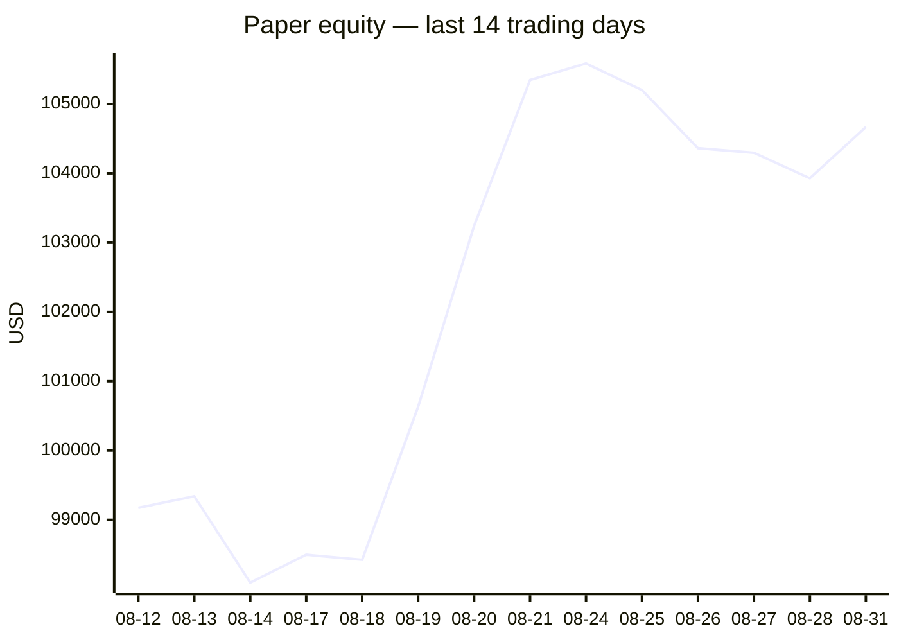
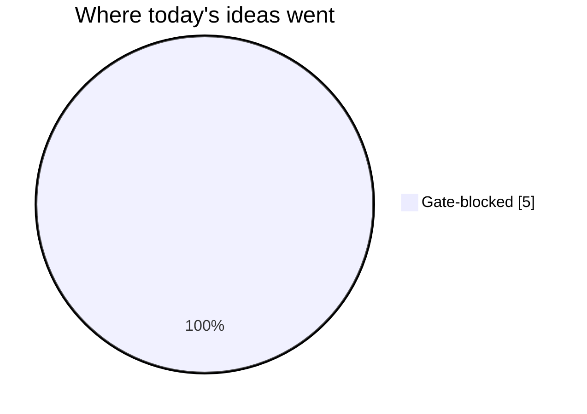
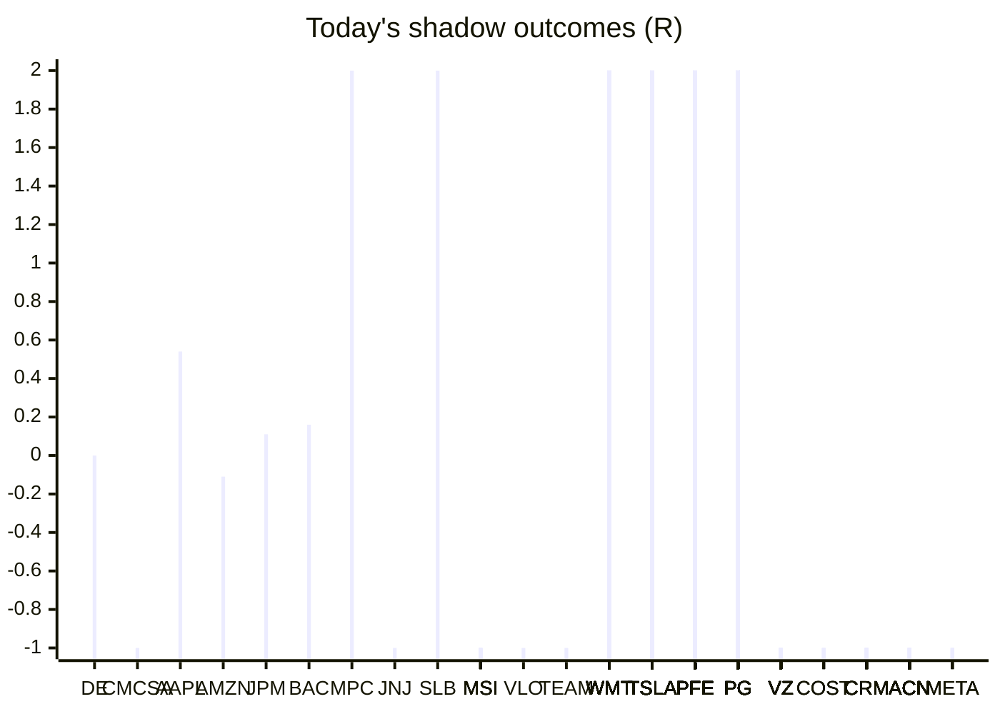

# Trading day 2026-08-31

Paper equity **$104,668** · day +0.60% · regime choppy · config v4-seeded · VIX 14.43 (down)

## Charts

## Activity

- Theses formed: 0 (approved→orders: 0, human-rejected: 0, expired unapproved: 0)
- Risk gate blocked: 5
- Fills at the broker: 1

## Shadow ledger (what would have happened)

- DE (pullback-trend, incubation) → **timeout** +0R
- CMCSA (momentum-breakout, gate-blocked) → **stopped** -1R
- AAPL (pullback-trend, incubation) → **timeout** +0.54R
- AMZN (pullback-trend, incubation) → **timeout** -0.11R
- JPM (pullback-trend, incubation) → **timeout** +0.11R
- BAC (pullback-trend, incubation) → **timeout** +0.16R
- MPC (momentum-breakout, gate-blocked) → **target** +2R
- JNJ (momentum-breakout, gate-blocked) → **stopped** -1R
- SLB (momentum-breakout, gate-blocked) → **target** +2R
- MSI (momentum-breakout:filtered, filter-blocked) → **stopped** -1R
- VLO (momentum-breakout, gate-blocked) → **stopped** -1R
- TEAM (momentum-breakout, gate-blocked) → **stopped** -1R
- MSI (momentum-breakout:filtered, filter-blocked) → **stopped** -1R
- MSI (momentum-breakout:filtered, filter-blocked) → **stopped** -1R
- MSI (momentum-breakout:filtered, filter-blocked) → **stopped** -1R
- WMT (momentum-breakout:filtered, filter-blocked) → **target** +2R
- MSI (momentum-breakout:filtered, filter-blocked) → **stopped** -1R
- TSLA (momentum-breakout:filtered, filter-blocked) → **target** +2R
- WMT (momentum-breakout:filtered, filter-blocked) → **target** +2R
- WMT (momentum-breakout:filtered, filter-blocked) → **target** +2R
- WMT (momentum-breakout:filtered, filter-blocked) → **target** +2R
- WMT (momentum-breakout:filtered, filter-blocked) → **target** +2R
- WMT (momentum-breakout:filtered, filter-blocked) → **target** +2R
- WMT (momentum-breakout:filtered, filter-blocked) → **target** +2R
- WMT (momentum-breakout:filtered, filter-blocked) → **target** +2R
- TSLA (momentum-breakout:filtered, filter-blocked) → **target** +2R
- TSLA (momentum-breakout:filtered, filter-blocked) → **target** +2R
- WMT (momentum-breakout:filtered, filter-blocked) → **target** +2R
- WMT (momentum-breakout:filtered, filter-blocked) → **target** +2R
- WMT (momentum-breakout:filtered, filter-blocked) → **target** +2R
- TSLA (momentum-breakout:filtered, filter-blocked) → **target** +2R
- TSLA (momentum-breakout:filtered, filter-blocked) → **target** +2R
- TSLA (momentum-breakout:filtered, filter-blocked) → **target** +2R
- TSLA (momentum-breakout:filtered, filter-blocked) → **target** +2R
- TSLA (momentum-breakout:filtered, filter-blocked) → **target** +2R
- PFE (momentum-breakout:filtered, filter-blocked) → **target** +2R
- TSLA (momentum-breakout:filtered, filter-blocked) → **target** +2R
- PG (momentum-breakout:filtered, filter-blocked) → **target** +2R
- VZ (momentum-breakout:filtered, filter-blocked) → **stopped** -1R
- VZ (momentum-breakout:filtered, filter-blocked) → **stopped** -1R
- VZ (momentum-breakout:filtered, filter-blocked) → **stopped** -1R
- VZ (momentum-breakout:filtered, filter-blocked) → **stopped** -1R
- VZ (momentum-breakout:filtered, filter-blocked) → **stopped** -1R
- VZ (momentum-breakout:filtered, filter-blocked) → **stopped** -1R
- VZ (momentum-breakout:filtered, filter-blocked) → **stopped** -1R
- VZ (momentum-breakout:filtered, filter-blocked) → **stopped** -1R
- VZ (momentum-breakout:filtered, filter-blocked) → **stopped** -1R
- VZ (momentum-breakout:filtered, filter-blocked) → **stopped** -1R
- VZ (momentum-breakout:filtered, filter-blocked) → **stopped** -1R
- VZ (momentum-breakout:filtered, filter-blocked) → **stopped** -1R
- COST (momentum-breakout:filtered, filter-blocked) → **stopped** -1R
- VZ (momentum-breakout:filtered, filter-blocked) → **stopped** -1R
- COST (momentum-breakout:filtered, filter-blocked) → **stopped** -1R
- COST (momentum-breakout:filtered, filter-blocked) → **stopped** -1R
- PFE (momentum-breakout:filtered, filter-blocked) → **target** +2R
- VZ (momentum-breakout:filtered, filter-blocked) → **stopped** -1R
- VZ (momentum-breakout:filtered, filter-blocked) → **stopped** -1R
- PFE (momentum-breakout:filtered, filter-blocked) → **target** +2R
- PFE (momentum-breakout:filtered, filter-blocked) → **target** +2R
- TSLA (momentum-breakout:filtered, filter-blocked) → **target** +2R
- TSLA (momentum-breakout:filtered, filter-blocked) → **target** +2R
- TSLA (momentum-breakout:filtered, filter-blocked) → **target** +2R
- TSLA (momentum-breakout:filtered, filter-blocked) → **target** +2R
- TSLA (momentum-breakout:filtered, filter-blocked) → **target** +2R
- PFE (momentum-breakout:filtered, filter-blocked) → **target** +2R
- PG (momentum-breakout:filtered, filter-blocked) → **target** +2R
- PG (momentum-breakout:filtered, filter-blocked) → **target** +2R
- PFE (momentum-breakout:filtered, filter-blocked) → **target** +2R
- PFE (momentum-breakout:filtered, filter-blocked) → **target** +2R
- PFE (momentum-breakout:filtered, filter-blocked) → **target** +2R
- PFE (momentum-breakout:filtered, filter-blocked) → **target** +2R
- PFE (momentum-breakout:filtered, filter-blocked) → **target** +2R
- PFE (momentum-breakout:filtered, filter-blocked) → **target** +2R
- PFE (momentum-breakout:filtered, filter-blocked) → **target** +2R
- PFE (momentum-breakout:filtered, filter-blocked) → **target** +2R
- PFE (momentum-breakout:filtered, filter-blocked) → **target** +2R
- PG (momentum-breakout:filtered, filter-blocked) → **target** +2R
- PFE (momentum-breakout:filtered, filter-blocked) → **target** +2R
- PG (momentum-breakout:filtered, filter-blocked) → **target** +2R
- PG (momentum-breakout:filtered, filter-blocked) → **target** +2R
- PG (momentum-breakout:filtered, filter-blocked) → **target** +2R
- PG (momentum-breakout:filtered, filter-blocked) → **target** +2R
- PG (momentum-breakout:filtered, filter-blocked) → **target** +2R
- PG (momentum-breakout:filtered, filter-blocked) → **target** +2R
- PG (momentum-breakout:filtered, filter-blocked) → **target** +2R
- PG (momentum-breakout:filtered, filter-blocked) → **target** +2R
- PG (momentum-breakout:filtered, filter-blocked) → **target** +2R
- PG (momentum-breakout:filtered, filter-blocked) → **target** +2R
- PG (momentum-breakout:filtered, filter-blocked) → **target** +2R
- PG (momentum-breakout:filtered, filter-blocked) → **stopped** -1R
- PG (momentum-breakout:filtered, filter-blocked) → **stopped** -1R
- PG (momentum-breakout:filtered, filter-blocked) → **stopped** -1R
- PFE (momentum-breakout:filtered, filter-blocked) → **target** +2R
- PFE (momentum-breakout:filtered, filter-blocked) → **target** +2R
- PFE (momentum-breakout:filtered, filter-blocked) → **target** +2R
- PFE (momentum-breakout:filtered, filter-blocked) → **target** +2R
- PG (momentum-breakout:filtered, filter-blocked) → **stopped** -1R
- PG (momentum-breakout:filtered, filter-blocked) → **stopped** -1R
- PFE (momentum-breakout:filtered, filter-blocked) → **target** +2R
- PFE (momentum-breakout:filtered, filter-blocked) → **target** +2R
- PFE (momentum-breakout:filtered, filter-blocked) → **target** +2R
- PG (momentum-breakout:filtered, filter-blocked) → **stopped** -1R
- PG (momentum-breakout:filtered, filter-blocked) → **stopped** -1R
- PG (momentum-breakout:filtered, filter-blocked) → **stopped** -1R
- PG (momentum-breakout:filtered, filter-blocked) → **stopped** -1R
- PG (momentum-breakout:filtered, filter-blocked) → **stopped** -1R
- PG (momentum-breakout:filtered, filter-blocked) → **stopped** -1R
- CRM (momentum-breakout:filtered, filter-blocked) → **stopped** -1R
- CRM (momentum-breakout:filtered, filter-blocked) → **stopped** -1R
- WMT (momentum-breakout:filtered, filter-blocked) → **target** +2R
- WMT (momentum-breakout:filtered, filter-blocked) → **target** +2R
- PFE (momentum-breakout:filtered, filter-blocked) → **target** +2R
- PFE (momentum-breakout:filtered, filter-blocked) → **target** +2R
- WMT (momentum-breakout:filtered, filter-blocked) → **target** +2R
- PFE (momentum-breakout:filtered, filter-blocked) → **target** +2R
- PFE (momentum-breakout:filtered, filter-blocked) → **target** +2R
- PFE (momentum-breakout:filtered, filter-blocked) → **target** +2R
- PFE (momentum-breakout:filtered, filter-blocked) → **target** +2R
- PFE (momentum-breakout:filtered, filter-blocked) → **target** +2R
- PFE (momentum-breakout:filtered, filter-blocked) → **target** +2R
- PFE (momentum-breakout:filtered, filter-blocked) → **target** +2R
- PFE (momentum-breakout:filtered, filter-blocked) → **target** +2R
- PFE (momentum-breakout:filtered, filter-blocked) → **target** +2R
- PFE (momentum-breakout:filtered, filter-blocked) → **target** +2R
- PFE (momentum-breakout:filtered, filter-blocked) → **target** +2R
- PFE (momentum-breakout:filtered, filter-blocked) → **target** +2R
- PFE (momentum-breakout:filtered, filter-blocked) → **target** +2R
- PFE (momentum-breakout:filtered, filter-blocked) → **target** +2R
- PFE (momentum-breakout:filtered, filter-blocked) → **target** +2R
- PFE (momentum-breakout:filtered, filter-blocked) → **target** +2R
- PFE (momentum-breakout:filtered, filter-blocked) → **target** +2R
- PFE (momentum-breakout:filtered, filter-blocked) → **target** +2R
- VZ (momentum-breakout:filtered, filter-blocked) → **stopped** -1R
- VZ (momentum-breakout:filtered, filter-blocked) → **stopped** -1R
- VZ (momentum-breakout:filtered, filter-blocked) → **stopped** -1R
- VZ (momentum-breakout:filtered, filter-blocked) → **stopped** -1R
- VZ (momentum-breakout:filtered, filter-blocked) → **stopped** -1R
- VZ (momentum-breakout:filtered, filter-blocked) → **stopped** -1R
- VZ (momentum-breakout:filtered, filter-blocked) → **stopped** -1R
- VZ (momentum-breakout:filtered, filter-blocked) → **stopped** -1R
- VZ (momentum-breakout:filtered, filter-blocked) → **stopped** -1R
- VZ (momentum-breakout:filtered, filter-blocked) → **stopped** -1R
- ACN (momentum-breakout:filtered, filter-blocked) → **stopped** -1R
- ACN (momentum-breakout:filtered, filter-blocked) → **stopped** -1R
- ACN (momentum-breakout:filtered, filter-blocked) → **stopped** -1R
- ACN (momentum-breakout:filtered, filter-blocked) → **stopped** -1R
- ACN (momentum-breakout:filtered, filter-blocked) → **stopped** -1R
- WMT (momentum-breakout:filtered, filter-blocked) → **stopped** -1R
- ACN (momentum-breakout:filtered, filter-blocked) → **stopped** -1R
- WMT (momentum-breakout:filtered, filter-blocked) → **stopped** -1R
- ACN (momentum-breakout:filtered, filter-blocked) → **stopped** -1R
- ACN (momentum-breakout:filtered, filter-blocked) → **stopped** -1R
- ACN (momentum-breakout:filtered, filter-blocked) → **stopped** -1R
- ACN (momentum-breakout:filtered, filter-blocked) → **stopped** -1R
- ACN (momentum-breakout:filtered, filter-blocked) → **stopped** -1R
- WMT (momentum-breakout:filtered, filter-blocked) → **stopped** -1R
- ACN (momentum-breakout:filtered, filter-blocked) → **stopped** -1R
- ACN (momentum-breakout:filtered, filter-blocked) → **stopped** -1R
- WMT (momentum-breakout:filtered, filter-blocked) → **stopped** -1R
- ACN (momentum-breakout:filtered, filter-blocked) → **stopped** -1R
- ACN (momentum-breakout:filtered, filter-blocked) → **stopped** -1R
- ACN (momentum-breakout:filtered, filter-blocked) → **stopped** -1R
- WMT (momentum-breakout:filtered, filter-blocked) → **stopped** -1R
- WMT (momentum-breakout:filtered, filter-blocked) → **stopped** -1R
- WMT (momentum-breakout:filtered, filter-blocked) → **stopped** -1R
- PFE (momentum-breakout:filtered, filter-blocked) → **stopped** -1R
- WMT (momentum-breakout:filtered, filter-blocked) → **stopped** -1R
- PFE (momentum-breakout:filtered, filter-blocked) → **stopped** -1R
- WMT (momentum-breakout:filtered, filter-blocked) → **stopped** -1R
- WMT (momentum-breakout:filtered, filter-blocked) → **stopped** -1R
- PFE (momentum-breakout:filtered, filter-blocked) → **stopped** -1R
- WMT (momentum-breakout:filtered, filter-blocked) → **stopped** -1R
- PFE (momentum-breakout:filtered, filter-blocked) → **stopped** -1R
- WMT (momentum-breakout:filtered, filter-blocked) → **stopped** -1R
- PFE (momentum-breakout:filtered, filter-blocked) → **stopped** -1R
- WMT (momentum-breakout:filtered, filter-blocked) → **stopped** -1R
- PFE (momentum-breakout:filtered, filter-blocked) → **stopped** -1R
- WMT (momentum-breakout:filtered, filter-blocked) → **stopped** -1R
- PFE (momentum-breakout:filtered, filter-blocked) → **stopped** -1R
- WMT (momentum-breakout:filtered, filter-blocked) → **stopped** -1R
- PFE (momentum-breakout:filtered, filter-blocked) → **stopped** -1R
- PG (momentum-breakout:filtered, filter-blocked) → **stopped** -1R
- PG (momentum-breakout:filtered, filter-blocked) → **stopped** -1R
- TSLA (momentum-breakout:filtered, filter-blocked) → **target** +2R
- TSLA (momentum-breakout:filtered, filter-blocked) → **target** +2R
- TSLA (momentum-breakout:filtered, filter-blocked) → **target** +2R
- ACN (momentum-breakout:filtered, filter-blocked) → **stopped** -1R
- ACN (momentum-breakout:filtered, filter-blocked) → **stopped** -1R
- ACN (momentum-breakout:filtered, filter-blocked) → **stopped** -1R
- ACN (momentum-breakout:filtered, filter-blocked) → **stopped** -1R
- ACN (momentum-breakout:filtered, filter-blocked) → **stopped** -1R
- ACN (momentum-breakout:filtered, filter-blocked) → **stopped** -1R
- ACN (momentum-breakout:filtered, filter-blocked) → **stopped** -1R
- ACN (momentum-breakout:filtered, filter-blocked) → **stopped** -1R
- ACN (momentum-breakout:filtered, filter-blocked) → **stopped** -1R
- ACN (momentum-breakout:filtered, filter-blocked) → **stopped** -1R
- ACN (momentum-breakout:filtered, filter-blocked) → **stopped** -1R
- ACN (momentum-breakout:filtered, filter-blocked) → **stopped** -1R
- ACN (momentum-breakout:filtered, filter-blocked) → **stopped** -1R
- ACN (momentum-breakout:filtered, filter-blocked) → **stopped** -1R
- ACN (momentum-breakout:filtered, filter-blocked) → **stopped** -1R
- ACN (momentum-breakout:filtered, filter-blocked) → **stopped** -1R
- ACN (momentum-breakout:filtered, filter-blocked) → **stopped** -1R
- ACN (momentum-breakout:filtered, filter-blocked) → **stopped** -1R
- CRM (momentum-breakout:filtered, filter-blocked) → **stopped** -1R
- CRM (momentum-breakout:filtered, filter-blocked) → **stopped** -1R
- CRM (momentum-breakout:filtered, filter-blocked) → **stopped** -1R
- CRM (momentum-breakout:filtered, filter-blocked) → **stopped** -1R
- CRM (momentum-breakout:filtered, filter-blocked) → **stopped** -1R
- CRM (momentum-breakout:filtered, filter-blocked) → **stopped** -1R
- PFE (momentum-breakout:filtered, filter-blocked) → **stopped** -1R
- META (momentum-breakout:filtered, filter-blocked) → **stopped** -1R
- META (momentum-breakout:filtered, filter-blocked) → **stopped** -1R
- META (momentum-breakout:filtered, filter-blocked) → **stopped** -1R
- PFE (momentum-breakout:filtered, filter-blocked) → **stopped** -1R
- PFE (momentum-breakout:filtered, filter-blocked) → **stopped** -1R
- PFE (momentum-breakout:filtered, filter-blocked) → **stopped** -1R
- PFE (momentum-breakout:filtered, filter-blocked) → **stopped** -1R
- PFE (momentum-breakout:filtered, filter-blocked) → **stopped** -1R
- CRM (momentum-breakout:filtered, filter-blocked) → **stopped** -1R

Day total: **+55.7R**

## Running shadow record

Resolved 11 ideas · win rate 45% · total +0.7R · avg 0.06R · still tracking 350

## Is the desk earning its keep?

Shadow-outcome R by the desk verdict each idea carried (vetoed/expired ideas only — executed trades don't resolve to an R-outcome yet):

| Verdict | Ideas | Win rate | Avg R |
|---|---|---|---|
| proceed | 0 | —% | — |
| caution | 0 | —% | — |
| avoid | 0 | —% | — |
| none | 11 | 45% | 0.06 |

*Only 0 scored ideas so far — a preview, not a verdict on the AI yet.*

## Incubation ward

- **pullback-trend** — incubating: 5/25 shadow outcomes
- **crypto-mean-reversion** — incubating: 0/25 shadow outcomes
- **cfd-mean-reversion** — incubating: 0/25 shadow outcomes
- **cfd-opening-range** — incubating: 0/25 shadow outcomes
- **equity-opening-range** — incubating: 0/25 shadow outcomes
- **cfd-pair-reversion** — incubating: 0/25 shadow outcomes

*Incubating strategies shadow-track every signal but never execute. Graduation is mechanical: 25+ outcomes, avg ≥ +0.10R, wins ≥ 40%.*

*Generated by code, no AI. Paper account only.*
