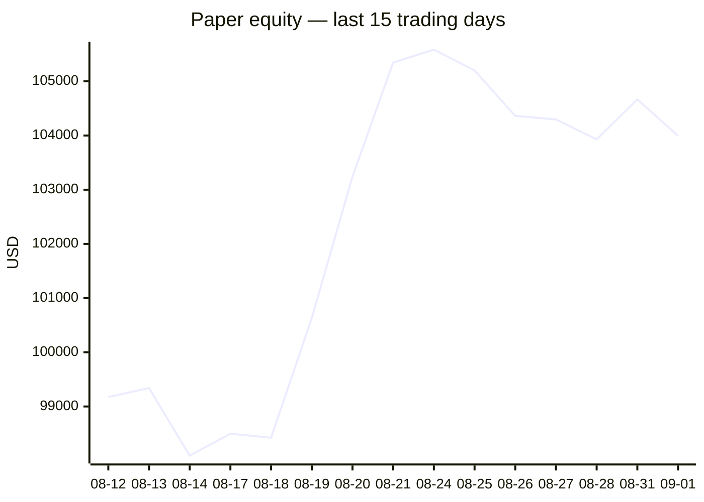
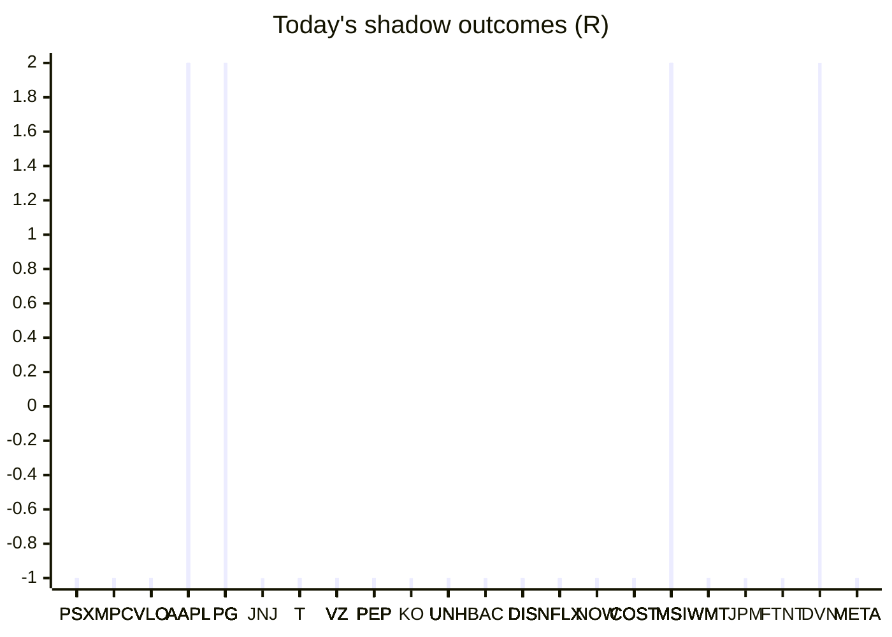

# Trading day 2026-09-01

Paper equity **$103,993** · day -0.39% · regime choppy · config v4-seeded · VIX 14.92 (down)

## Charts

## Activity

- Theses formed: 0 (approved→orders: 0, human-rejected: 0, expired unapproved: 0)
- Risk gate blocked: 0
- Fills at the broker: 0

## Shadow ledger (what would have happened)

- PSX (momentum-breakout:filtered, filter-blocked) → **stopped** -1R
- PSX (momentum-breakout:filtered, filter-blocked) → **stopped** -1R
- PSX (momentum-breakout:filtered, filter-blocked) → **stopped** -1R
- MPC (momentum-breakout:filtered, filter-blocked) → **stopped** -1R
- MPC (momentum-breakout:filtered, filter-blocked) → **stopped** -1R
- MPC (momentum-breakout:filtered, filter-blocked) → **stopped** -1R
- VLO (momentum-breakout:filtered, filter-blocked) → **stopped** -1R
- VLO (momentum-breakout:filtered, filter-blocked) → **stopped** -1R
- PSX (momentum-breakout:filtered, filter-blocked) → **stopped** -1R
- MPC (momentum-breakout:filtered, filter-blocked) → **stopped** -1R
- VLO (momentum-breakout:filtered, filter-blocked) → **stopped** -1R
- AAPL (momentum-breakout:filtered, filter-blocked) → **target** +2R
- AAPL (momentum-breakout:filtered, filter-blocked) → **target** +2R
- AAPL (momentum-breakout:filtered, filter-blocked) → **target** +2R
- PG (momentum-breakout:filtered, filter-blocked) → **target** +2R
- PG (momentum-breakout:filtered, filter-blocked) → **target** +2R
- PG (momentum-breakout:filtered, filter-blocked) → **target** +2R
- PG (momentum-breakout:filtered, filter-blocked) → **target** +2R
- JNJ (momentum-breakout:filtered, filter-blocked) → **stopped** -1R
- AAPL (momentum-breakout:filtered, filter-blocked) → **target** +2R
- AAPL (momentum-breakout:filtered, filter-blocked) → **target** +2R
- AAPL (momentum-breakout:filtered, filter-blocked) → **target** +2R
- T (momentum-breakout:filtered, filter-blocked) → **stopped** -1R
- PSX (momentum-breakout:filtered, filter-blocked) → **stopped** -1R
- T (momentum-breakout:filtered, filter-blocked) → **stopped** -1R
- T (momentum-breakout:filtered, filter-blocked) → **stopped** -1R
- VZ (momentum-breakout:filtered, filter-blocked) → **stopped** -1R
- VZ (momentum-breakout:filtered, filter-blocked) → **stopped** -1R
- VZ (momentum-breakout:filtered, filter-blocked) → **stopped** -1R
- PEP (momentum-breakout:filtered, filter-blocked) → **stopped** -1R
- T (momentum-breakout:filtered, filter-blocked) → **stopped** -1R
- KO (momentum-breakout:filtered, filter-blocked) → **stopped** -1R
- VZ (momentum-breakout:filtered, filter-blocked) → **stopped** -1R
- T (momentum-breakout:filtered, filter-blocked) → **stopped** -1R
- UNH (momentum-breakout:filtered, filter-blocked) → **stopped** -1R
- UNH (momentum-breakout:filtered, filter-blocked) → **stopped** -1R
- UNH (momentum-breakout:filtered, filter-blocked) → **stopped** -1R
- BAC (momentum-breakout:filtered, filter-blocked) → **stopped** -1R
- PEP (momentum-breakout:filtered, filter-blocked) → **stopped** -1R
- PEP (momentum-breakout:filtered, filter-blocked) → **stopped** -1R
- PEP (momentum-breakout:filtered, filter-blocked) → **stopped** -1R
- PEP (momentum-breakout:filtered, filter-blocked) → **stopped** -1R
- PEP (momentum-breakout:filtered, filter-blocked) → **stopped** -1R
- PEP (momentum-breakout:filtered, filter-blocked) → **stopped** -1R
- PEP (momentum-breakout:filtered, filter-blocked) → **stopped** -1R
- PEP (momentum-breakout:filtered, filter-blocked) → **stopped** -1R
- PEP (momentum-breakout:filtered, filter-blocked) → **stopped** -1R
- PEP (momentum-breakout:filtered, filter-blocked) → **stopped** -1R
- UNH (momentum-breakout:filtered, filter-blocked) → **stopped** -1R
- UNH (momentum-breakout:filtered, filter-blocked) → **stopped** -1R
- UNH (momentum-breakout:filtered, filter-blocked) → **stopped** -1R
- UNH (momentum-breakout:filtered, filter-blocked) → **stopped** -1R
- UNH (momentum-breakout:filtered, filter-blocked) → **stopped** -1R
- UNH (momentum-breakout:filtered, filter-blocked) → **stopped** -1R
- UNH (momentum-breakout:filtered, filter-blocked) → **stopped** -1R
- UNH (momentum-breakout:filtered, filter-blocked) → **stopped** -1R
- PSX (momentum-breakout:filtered, filter-blocked) → **stopped** -1R
- PSX (momentum-breakout:filtered, filter-blocked) → **stopped** -1R
- PSX (momentum-breakout:filtered, filter-blocked) → **stopped** -1R
- UNH (momentum-breakout:filtered, filter-blocked) → **stopped** -1R
- UNH (momentum-breakout:filtered, filter-blocked) → **stopped** -1R
- DIS (momentum-breakout:filtered, filter-blocked) → **stopped** -1R
- DIS (momentum-breakout:filtered, filter-blocked) → **stopped** -1R
- DIS (momentum-breakout:filtered, filter-blocked) → **stopped** -1R
- PEP (momentum-breakout:filtered, filter-blocked) → **stopped** -1R
- PEP (momentum-breakout:filtered, filter-blocked) → **stopped** -1R
- PEP (momentum-breakout:filtered, filter-blocked) → **stopped** -1R
- PEP (momentum-breakout:filtered, filter-blocked) → **stopped** -1R
- PEP (momentum-breakout:filtered, filter-blocked) → **stopped** -1R
- PEP (momentum-breakout:filtered, filter-blocked) → **stopped** -1R
- PEP (momentum-breakout:filtered, filter-blocked) → **stopped** -1R
- UNH (momentum-breakout:filtered, filter-blocked) → **stopped** -1R
- VZ (momentum-breakout:filtered, filter-blocked) → **stopped** -1R
- VZ (momentum-breakout:filtered, filter-blocked) → **stopped** -1R
- VZ (momentum-breakout:filtered, filter-blocked) → **stopped** -1R
- VZ (momentum-breakout:filtered, filter-blocked) → **stopped** -1R
- VZ (momentum-breakout:filtered, filter-blocked) → **stopped** -1R
- UNH (momentum-breakout:filtered, filter-blocked) → **stopped** -1R
- UNH (momentum-breakout:filtered, filter-blocked) → **stopped** -1R
- DIS (momentum-breakout:filtered, filter-blocked) → **stopped** -1R
- DIS (momentum-breakout:filtered, filter-blocked) → **stopped** -1R
- DIS (momentum-breakout:filtered, filter-blocked) → **stopped** -1R
- DIS (momentum-breakout:filtered, filter-blocked) → **stopped** -1R
- DIS (momentum-breakout:filtered, filter-blocked) → **stopped** -1R
- DIS (momentum-breakout:filtered, filter-blocked) → **stopped** -1R
- DIS (momentum-breakout:filtered, filter-blocked) → **stopped** -1R
- DIS (momentum-breakout:filtered, filter-blocked) → **stopped** -1R
- DIS (momentum-breakout:filtered, filter-blocked) → **stopped** -1R
- DIS (momentum-breakout:filtered, filter-blocked) → **stopped** -1R
- DIS (momentum-breakout:filtered, filter-blocked) → **stopped** -1R
- DIS (momentum-breakout:filtered, filter-blocked) → **stopped** -1R
- DIS (momentum-breakout:filtered, filter-blocked) → **stopped** -1R
- DIS (momentum-breakout:filtered, filter-blocked) → **stopped** -1R
- VZ (momentum-breakout:filtered, filter-blocked) → **stopped** -1R
- VZ (momentum-breakout:filtered, filter-blocked) → **stopped** -1R
- VZ (momentum-breakout:filtered, filter-blocked) → **stopped** -1R
- UNH (momentum-breakout:filtered, filter-blocked) → **stopped** -1R
- UNH (momentum-breakout:filtered, filter-blocked) → **stopped** -1R
- NFLX (momentum-breakout:filtered, filter-blocked) → **stopped** -1R
- NFLX (momentum-breakout:filtered, filter-blocked) → **stopped** -1R
- UNH (momentum-breakout:filtered, filter-blocked) → **stopped** -1R
- UNH (momentum-breakout:filtered, filter-blocked) → **stopped** -1R
- DIS (momentum-breakout:filtered, filter-blocked) → **stopped** -1R
- DIS (momentum-breakout:filtered, filter-blocked) → **stopped** -1R
- NFLX (momentum-breakout:filtered, filter-blocked) → **stopped** -1R
- NFLX (momentum-breakout:filtered, filter-blocked) → **stopped** -1R
- NFLX (momentum-breakout:filtered, filter-blocked) → **stopped** -1R
- NFLX (momentum-breakout:filtered, filter-blocked) → **stopped** -1R
- NFLX (momentum-breakout:filtered, filter-blocked) → **stopped** -1R
- NFLX (momentum-breakout:filtered, filter-blocked) → **stopped** -1R
- NFLX (momentum-breakout:filtered, filter-blocked) → **stopped** -1R
- UNH (momentum-breakout:filtered, filter-blocked) → **stopped** -1R
- NOW (momentum-breakout:filtered, filter-blocked) → **stopped** -1R
- NOW (momentum-breakout:filtered, filter-blocked) → **stopped** -1R
- DIS (momentum-breakout:filtered, filter-blocked) → **stopped** -1R
- COST (momentum-breakout:filtered, filter-blocked) → **stopped** -1R
- COST (momentum-breakout:filtered, filter-blocked) → **stopped** -1R
- COST (momentum-breakout:filtered, filter-blocked) → **stopped** -1R
- COST (momentum-breakout:filtered, filter-blocked) → **stopped** -1R
- COST (momentum-breakout:filtered, filter-blocked) → **stopped** -1R
- COST (momentum-breakout:filtered, filter-blocked) → **stopped** -1R
- COST (momentum-breakout:filtered, filter-blocked) → **stopped** -1R
- COST (momentum-breakout:filtered, filter-blocked) → **stopped** -1R
- COST (momentum-breakout:filtered, filter-blocked) → **stopped** -1R
- COST (momentum-breakout:filtered, filter-blocked) → **stopped** -1R
- COST (momentum-breakout:filtered, filter-blocked) → **stopped** -1R
- COST (momentum-breakout:filtered, filter-blocked) → **stopped** -1R
- COST (momentum-breakout:filtered, filter-blocked) → **stopped** -1R
- MSI (momentum-breakout:filtered, filter-blocked) → **stopped** -1R
- MSI (momentum-breakout:filtered, filter-blocked) → **stopped** -1R
- MSI (momentum-breakout:filtered, filter-blocked) → **stopped** -1R
- MSI (momentum-breakout:filtered, filter-blocked) → **stopped** -1R
- MSI (momentum-breakout:filtered, filter-blocked) → **stopped** -1R
- VZ (momentum-breakout:filtered, filter-blocked) → **stopped** -1R
- MSI (momentum-breakout:filtered, filter-blocked) → **stopped** -1R
- MSI (momentum-breakout:filtered, filter-blocked) → **stopped** -1R
- NOW (momentum-breakout:filtered, filter-blocked) → **stopped** -1R
- AAPL (momentum-breakout:filtered, filter-blocked) → **stopped** -1R
- AAPL (momentum-breakout:filtered, filter-blocked) → **stopped** -1R
- COST (momentum-breakout:filtered, filter-blocked) → **stopped** -1R
- COST (momentum-breakout:filtered, filter-blocked) → **stopped** -1R
- VZ (momentum-breakout:filtered, filter-blocked) → **stopped** -1R
- WMT (momentum-breakout:filtered, filter-blocked) → **stopped** -1R
- MSI (momentum-breakout:filtered, filter-blocked) → **stopped** -1R
- AAPL (momentum-breakout:filtered, filter-blocked) → **target** +2R
- AAPL (momentum-breakout:filtered, filter-blocked) → **target** +2R
- AAPL (momentum-breakout:filtered, filter-blocked) → **target** +2R
- AAPL (momentum-breakout:filtered, filter-blocked) → **target** +2R
- AAPL (momentum-breakout:filtered, filter-blocked) → **target** +2R
- MPC (momentum-breakout:filtered, filter-blocked) → **stopped** -1R
- PG (momentum-breakout:filtered, filter-blocked) → **stopped** -1R
- PG (momentum-breakout:filtered, filter-blocked) → **stopped** -1R
- PG (momentum-breakout:filtered, filter-blocked) → **stopped** -1R
- PG (momentum-breakout:filtered, filter-blocked) → **stopped** -1R
- PG (momentum-breakout:filtered, filter-blocked) → **stopped** -1R
- PG (momentum-breakout:filtered, filter-blocked) → **stopped** -1R
- JPM (momentum-breakout:filtered, filter-blocked) → **stopped** -1R
- PG (momentum-breakout:filtered, filter-blocked) → **stopped** -1R
- PG (momentum-breakout:filtered, filter-blocked) → **stopped** -1R
- PG (momentum-breakout:filtered, filter-blocked) → **stopped** -1R
- PG (momentum-breakout:filtered, filter-blocked) → **stopped** -1R
- PG (momentum-breakout:filtered, filter-blocked) → **stopped** -1R
- BAC (momentum-breakout:filtered, filter-blocked) → **stopped** -1R
- PG (momentum-breakout:filtered, filter-blocked) → **stopped** -1R
- FTNT (pullback-trend, incubation) → **stopped** -1R
- PG (momentum-breakout:filtered, filter-blocked) → **stopped** -1R
- PG (momentum-breakout:filtered, filter-blocked) → **stopped** -1R
- PG (momentum-breakout:filtered, filter-blocked) → **stopped** -1R
- PG (momentum-breakout:filtered, filter-blocked) → **stopped** -1R
- PG (momentum-breakout:filtered, filter-blocked) → **stopped** -1R
- PG (momentum-breakout:filtered, filter-blocked) → **stopped** -1R
- PG (momentum-breakout:filtered, filter-blocked) → **stopped** -1R
- MSI (momentum-breakout:filtered, filter-blocked) → **target** +2R
- DVN (momentum-breakout:filtered, filter-blocked) → **target** +2R
- MSI (momentum-breakout:filtered, filter-blocked) → **target** +2R
- MSI (momentum-breakout:filtered, filter-blocked) → **target** +2R
- MSI (momentum-breakout:filtered, filter-blocked) → **target** +2R
- MSI (momentum-breakout:filtered, filter-blocked) → **target** +2R
- MSI (momentum-breakout:filtered, filter-blocked) → **target** +2R
- MSI (momentum-breakout:filtered, filter-blocked) → **target** +2R
- MSI (momentum-breakout:filtered, filter-blocked) → **target** +2R
- MSI (momentum-breakout:filtered, filter-blocked) → **target** +2R
- MSI (momentum-breakout:filtered, filter-blocked) → **target** +2R
- VLO (momentum-breakout:filtered, filter-blocked) → **stopped** -1R
- VLO (momentum-breakout:filtered, filter-blocked) → **stopped** -1R
- VLO (momentum-breakout:filtered, filter-blocked) → **stopped** -1R
- VLO (momentum-breakout:filtered, filter-blocked) → **stopped** -1R
- VLO (momentum-breakout:filtered, filter-blocked) → **stopped** -1R
- VLO (momentum-breakout:filtered, filter-blocked) → **stopped** -1R
- META (momentum-breakout:filtered, filter-blocked) → **stopped** -1R
- META (momentum-breakout:filtered, filter-blocked) → **stopped** -1R
- META (momentum-breakout:filtered, filter-blocked) → **stopped** -1R
- META (momentum-breakout:filtered, filter-blocked) → **stopped** -1R
- WMT (momentum-breakout:filtered, filter-blocked) → **stopped** -1R
- WMT (momentum-breakout:filtered, filter-blocked) → **stopped** -1R
- WMT (momentum-breakout:filtered, filter-blocked) → **stopped** -1R
- WMT (momentum-breakout:filtered, filter-blocked) → **stopped** -1R
- WMT (momentum-breakout:filtered, filter-blocked) → **stopped** -1R
- WMT (momentum-breakout:filtered, filter-blocked) → **stopped** -1R
- WMT (momentum-breakout:filtered, filter-blocked) → **stopped** -1R
- PG (momentum-breakout:filtered, filter-blocked) → **stopped** -1R
- MSI (momentum-breakout:filtered, filter-blocked) → **stopped** -1R
- MSI (momentum-breakout:filtered, filter-blocked) → **stopped** -1R
- MSI (momentum-breakout:filtered, filter-blocked) → **stopped** -1R
- MSI (momentum-breakout:filtered, filter-blocked) → **stopped** -1R
- MSI (momentum-breakout:filtered, filter-blocked) → **stopped** -1R
- MSI (momentum-breakout:filtered, filter-blocked) → **stopped** -1R
- MSI (momentum-breakout:filtered, filter-blocked) → **stopped** -1R
- MSI (momentum-breakout:filtered, filter-blocked) → **stopped** -1R
- MSI (momentum-breakout:filtered, filter-blocked) → **stopped** -1R
- AAPL (momentum-breakout:filtered, filter-blocked) → **stopped** -1R
- MSI (momentum-breakout:filtered, filter-blocked) → **stopped** -1R

Day total: **-134R**

## Running shadow record

Resolved 1 ideas · win rate 0% · total -1R · avg -1R · still tracking 284

## Is the desk earning its keep?

Shadow-outcome R by the desk verdict each idea carried (vetoed/expired ideas only — executed trades don't resolve to an R-outcome yet):

| Verdict | Ideas | Win rate | Avg R |
|---|---|---|---|
| proceed | 0 | —% | — |
| caution | 0 | —% | — |
| avoid | 0 | —% | — |
| none | 1 | 0% | -1 |

*Only 0 scored ideas so far — a preview, not a verdict on the AI yet.*

## Incubation ward

- **pullback-trend** — incubating: 1/25 shadow outcomes
- **crypto-mean-reversion** — incubating: 0/25 shadow outcomes
- **cfd-mean-reversion** — incubating: 0/25 shadow outcomes
- **cfd-opening-range** — incubating: 0/25 shadow outcomes
- **equity-opening-range** — incubating: 0/25 shadow outcomes
- **cfd-pair-reversion** — incubating: 0/25 shadow outcomes

*Incubating strategies shadow-track every signal but never execute. Graduation is mechanical: 25+ outcomes, avg ≥ +0.10R, wins ≥ 40%.*

*Generated by code, no AI. Paper account only.*
