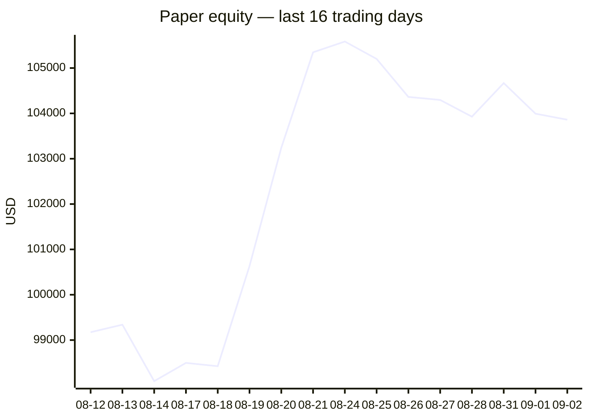
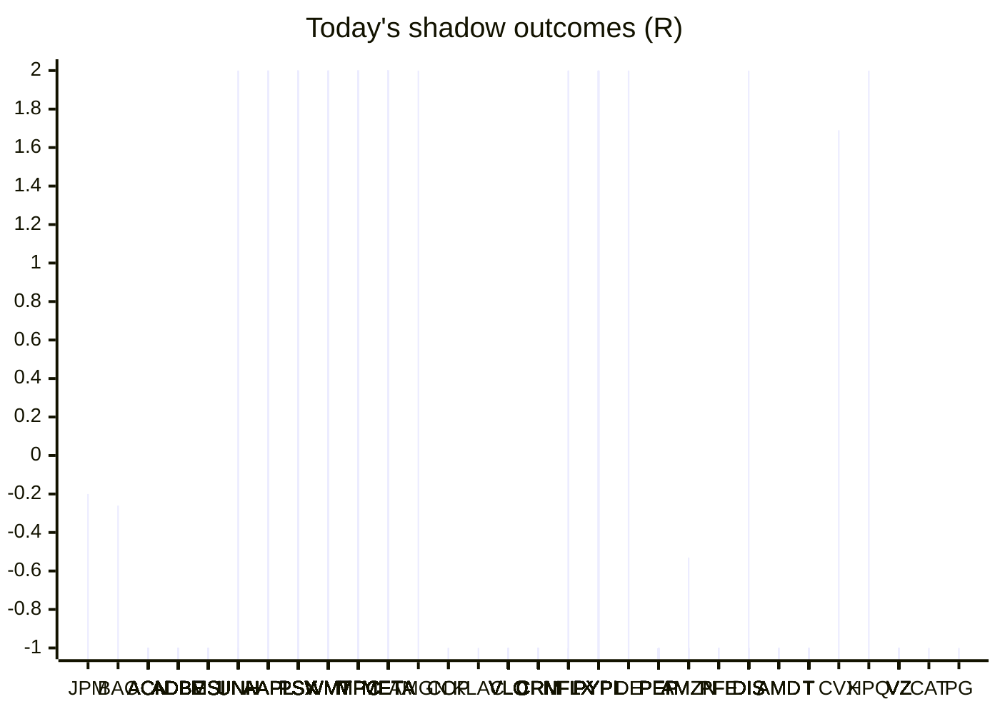

# Trading day 2026-09-02

Paper equity **$103,861** · day +0.07% · regime choppy · config v4-seeded · VIX 16.34 (up)

## Charts

## Activity

- Theses formed: 0 (approved→orders: 0, human-rejected: 0, expired unapproved: 0)
- Risk gate blocked: 0
- Fills at the broker: 0

## Shadow ledger (what would have happened)

- JPM (pullback-trend, incubation) → **timeout** -0.2R
- BAC (pullback-trend, incubation) → **timeout** -0.26R
- ACN (momentum-breakout:filtered, filter-blocked) → **stopped** -1R
- ACN (momentum-breakout:filtered, filter-blocked) → **stopped** -1R
- ACN (momentum-breakout:filtered, filter-blocked) → **stopped** -1R
- ACN (momentum-breakout:filtered, filter-blocked) → **stopped** -1R
- ACN (momentum-breakout:filtered, filter-blocked) → **stopped** -1R
- ACN (momentum-breakout:filtered, filter-blocked) → **stopped** -1R
- ACN (momentum-breakout:filtered, filter-blocked) → **stopped** -1R
- ACN (momentum-breakout:filtered, filter-blocked) → **stopped** -1R
- ACN (momentum-breakout:filtered, filter-blocked) → **stopped** -1R
- ACN (momentum-breakout:filtered, filter-blocked) → **stopped** -1R
- ACN (momentum-breakout:filtered, filter-blocked) → **stopped** -1R
- ADBE (momentum-breakout:filtered, filter-blocked) → **stopped** -1R
- ADBE (momentum-breakout:filtered, filter-blocked) → **stopped** -1R
- ADBE (momentum-breakout:filtered, filter-blocked) → **stopped** -1R
- ADBE (momentum-breakout:filtered, filter-blocked) → **stopped** -1R
- ADBE (momentum-breakout:filtered, filter-blocked) → **stopped** -1R
- ADBE (momentum-breakout:filtered, filter-blocked) → **stopped** -1R
- ADBE (momentum-breakout:filtered, filter-blocked) → **stopped** -1R
- ADBE (momentum-breakout:filtered, filter-blocked) → **stopped** -1R
- ADBE (momentum-breakout:filtered, filter-blocked) → **stopped** -1R
- ADBE (momentum-breakout:filtered, filter-blocked) → **stopped** -1R
- ADBE (momentum-breakout:filtered, filter-blocked) → **stopped** -1R
- ADBE (momentum-breakout:filtered, filter-blocked) → **stopped** -1R
- ADBE (momentum-breakout:filtered, filter-blocked) → **stopped** -1R
- ADBE (momentum-breakout:filtered, filter-blocked) → **stopped** -1R
- ADBE (momentum-breakout:filtered, filter-blocked) → **stopped** -1R
- ADBE (momentum-breakout:filtered, filter-blocked) → **stopped** -1R
- ADBE (momentum-breakout:filtered, filter-blocked) → **stopped** -1R
- ADBE (momentum-breakout:filtered, filter-blocked) → **stopped** -1R
- ADBE (momentum-breakout:filtered, filter-blocked) → **stopped** -1R
- ADBE (momentum-breakout:filtered, filter-blocked) → **stopped** -1R
- ADBE (momentum-breakout:filtered, filter-blocked) → **stopped** -1R
- ADBE (momentum-breakout:filtered, filter-blocked) → **stopped** -1R
- ADBE (momentum-breakout:filtered, filter-blocked) → **stopped** -1R
- ADBE (momentum-breakout:filtered, filter-blocked) → **stopped** -1R
- ADBE (momentum-breakout:filtered, filter-blocked) → **stopped** -1R
- ADBE (momentum-breakout:filtered, filter-blocked) → **stopped** -1R
- ADBE (momentum-breakout:filtered, filter-blocked) → **stopped** -1R
- ADBE (momentum-breakout:filtered, filter-blocked) → **stopped** -1R
- ADBE (momentum-breakout:filtered, filter-blocked) → **stopped** -1R
- ADBE (momentum-breakout:filtered, filter-blocked) → **stopped** -1R
- ADBE (momentum-breakout:filtered, filter-blocked) → **stopped** -1R
- ADBE (momentum-breakout:filtered, filter-blocked) → **stopped** -1R
- ADBE (momentum-breakout:filtered, filter-blocked) → **stopped** -1R
- ADBE (momentum-breakout:filtered, filter-blocked) → **stopped** -1R
- ADBE (momentum-breakout:filtered, filter-blocked) → **stopped** -1R
- ADBE (momentum-breakout:filtered, filter-blocked) → **stopped** -1R
- ADBE (momentum-breakout:filtered, filter-blocked) → **stopped** -1R
- ADBE (momentum-breakout:filtered, filter-blocked) → **stopped** -1R
- ADBE (momentum-breakout:filtered, filter-blocked) → **stopped** -1R
- ADBE (momentum-breakout:filtered, filter-blocked) → **stopped** -1R
- MSI (momentum-breakout:filtered, filter-blocked) → **stopped** -1R
- UNH (momentum-breakout:filtered, filter-blocked) → **target** +2R
- AAPL (momentum-breakout:filtered, filter-blocked) → **target** +2R
- AAPL (momentum-breakout:filtered, filter-blocked) → **target** +2R
- AAPL (momentum-breakout:filtered, filter-blocked) → **target** +2R
- AAPL (momentum-breakout:filtered, filter-blocked) → **target** +2R
- AAPL (momentum-breakout:filtered, filter-blocked) → **target** +2R
- AAPL (momentum-breakout:filtered, filter-blocked) → **target** +2R
- PSX (momentum-breakout:filtered, filter-blocked) → **stopped** -1R
- PSX (momentum-breakout:filtered, filter-blocked) → **stopped** -1R
- WMT (momentum-breakout:filtered, filter-blocked) → **stopped** -1R
- WMT (momentum-breakout:filtered, filter-blocked) → **stopped** -1R
- WMT (momentum-breakout:filtered, filter-blocked) → **stopped** -1R
- WMT (momentum-breakout:filtered, filter-blocked) → **stopped** -1R
- WMT (momentum-breakout:filtered, filter-blocked) → **stopped** -1R
- WMT (momentum-breakout:filtered, filter-blocked) → **stopped** -1R
- WMT (momentum-breakout:filtered, filter-blocked) → **stopped** -1R
- WMT (momentum-breakout:filtered, filter-blocked) → **stopped** -1R
- PSX (momentum-breakout:filtered, filter-blocked) → **target** +2R
- PSX (momentum-breakout:filtered, filter-blocked) → **target** +2R
- MPC (momentum-breakout:filtered, filter-blocked) → **target** +2R
- PSX (momentum-breakout:filtered, filter-blocked) → **target** +2R
- PSX (momentum-breakout:filtered, filter-blocked) → **target** +2R
- PSX (momentum-breakout:filtered, filter-blocked) → **target** +2R
- WMT (momentum-breakout:filtered, filter-blocked) → **stopped** -1R
- WMT (momentum-breakout:filtered, filter-blocked) → **stopped** -1R
- WMT (momentum-breakout:filtered, filter-blocked) → **stopped** -1R
- WMT (momentum-breakout:filtered, filter-blocked) → **stopped** -1R
- WMT (momentum-breakout:filtered, filter-blocked) → **stopped** -1R
- WMT (momentum-breakout:filtered, filter-blocked) → **stopped** -1R
- WMT (momentum-breakout:filtered, filter-blocked) → **stopped** -1R
- WMT (momentum-breakout:filtered, filter-blocked) → **stopped** -1R
- WMT (momentum-breakout:filtered, filter-blocked) → **stopped** -1R
- WMT (momentum-breakout:filtered, filter-blocked) → **stopped** -1R
- WMT (momentum-breakout:filtered, filter-blocked) → **stopped** -1R
- META (momentum-breakout:filtered, filter-blocked) → **target** +2R
- META (momentum-breakout:filtered, filter-blocked) → **target** +2R
- META (momentum-breakout:filtered, filter-blocked) → **target** +2R
- META (momentum-breakout:filtered, filter-blocked) → **target** +2R
- META (momentum-breakout:filtered, filter-blocked) → **target** +2R
- META (momentum-breakout:filtered, filter-blocked) → **target** +2R
- MSI (momentum-breakout:filtered, filter-blocked) → **stopped** -1R
- MSI (momentum-breakout:filtered, filter-blocked) → **stopped** -1R
- MSI (momentum-breakout:filtered, filter-blocked) → **stopped** -1R
- MSI (momentum-breakout:filtered, filter-blocked) → **stopped** -1R
- MSI (momentum-breakout:filtered, filter-blocked) → **stopped** -1R
- MSI (momentum-breakout:filtered, filter-blocked) → **stopped** -1R
- MSI (momentum-breakout:filtered, filter-blocked) → **stopped** -1R
- MSI (momentum-breakout:filtered, filter-blocked) → **stopped** -1R
- MSI (momentum-breakout:filtered, filter-blocked) → **stopped** -1R
- MSI (momentum-breakout:filtered, filter-blocked) → **stopped** -1R
- MSI (momentum-breakout:filtered, filter-blocked) → **stopped** -1R
- MSI (momentum-breakout:filtered, filter-blocked) → **stopped** -1R
- MSI (momentum-breakout:filtered, filter-blocked) → **stopped** -1R
- MPC (momentum-breakout:filtered, filter-blocked) → **target** +2R
- PSX (momentum-breakout:filtered, filter-blocked) → **target** +2R
- PSX (momentum-breakout:filtered, filter-blocked) → **target** +2R
- PSX (momentum-breakout:filtered, filter-blocked) → **target** +2R
- PSX (momentum-breakout:filtered, filter-blocked) → **target** +2R
- PSX (momentum-breakout:filtered, filter-blocked) → **target** +2R
- PSX (momentum-breakout:filtered, filter-blocked) → **target** +2R
- PSX (momentum-breakout:filtered, filter-blocked) → **target** +2R
- PSX (momentum-breakout:filtered, filter-blocked) → **target** +2R
- PSX (momentum-breakout:filtered, filter-blocked) → **target** +2R
- PSX (momentum-breakout:filtered, filter-blocked) → **target** +2R
- PSX (momentum-breakout:filtered, filter-blocked) → **target** +2R
- MSI (momentum-breakout:filtered, filter-blocked) → **stopped** -1R
- MSI (momentum-breakout:filtered, filter-blocked) → **stopped** -1R
- MSI (momentum-breakout:filtered, filter-blocked) → **stopped** -1R
- MSI (momentum-breakout:filtered, filter-blocked) → **stopped** -1R
- MSI (momentum-breakout:filtered, filter-blocked) → **stopped** -1R
- MSI (momentum-breakout:filtered, filter-blocked) → **stopped** -1R
- MSI (momentum-breakout:filtered, filter-blocked) → **stopped** -1R
- MSI (momentum-breakout:filtered, filter-blocked) → **stopped** -1R
- MSI (momentum-breakout:filtered, filter-blocked) → **stopped** -1R
- MSI (momentum-breakout:filtered, filter-blocked) → **stopped** -1R
- MSI (momentum-breakout:filtered, filter-blocked) → **stopped** -1R
- MSI (momentum-breakout:filtered, filter-blocked) → **stopped** -1R
- MSI (momentum-breakout:filtered, filter-blocked) → **stopped** -1R
- MSI (momentum-breakout:filtered, filter-blocked) → **stopped** -1R
- MSI (momentum-breakout:filtered, filter-blocked) → **stopped** -1R
- MSI (momentum-breakout:filtered, filter-blocked) → **stopped** -1R
- MSI (momentum-breakout:filtered, filter-blocked) → **stopped** -1R
- MSI (momentum-breakout:filtered, filter-blocked) → **stopped** -1R
- META (momentum-breakout:filtered, filter-blocked) → **target** +2R
- META (momentum-breakout:filtered, filter-blocked) → **target** +2R
- META (momentum-breakout:filtered, filter-blocked) → **target** +2R
- META (momentum-breakout:filtered, filter-blocked) → **target** +2R
- AMGN (momentum-breakout:filtered, filter-blocked) → **target** +2R
- COP (momentum-breakout:filtered, filter-blocked) → **stopped** -1R
- KLAC (momentum-breakout:filtered, filter-blocked) → **stopped** -1R
- AAPL (momentum-breakout:filtered, filter-blocked) → **stopped** -1R
- VLO (momentum-breakout:filtered, filter-blocked) → **stopped** -1R
- CRM (momentum-breakout:filtered, filter-blocked) → **stopped** -1R
- VLO (momentum-breakout:filtered, filter-blocked) → **stopped** -1R
- CRM (momentum-breakout:filtered, filter-blocked) → **stopped** -1R
- VLO (momentum-breakout:filtered, filter-blocked) → **stopped** -1R
- VLO (momentum-breakout:filtered, filter-blocked) → **stopped** -1R
- COP (momentum-breakout:filtered, filter-blocked) → **stopped** -1R
- MPC (momentum-breakout:filtered, filter-blocked) → **stopped** -1R
- MPC (momentum-breakout:filtered, filter-blocked) → **stopped** -1R
- PSX (momentum-breakout:filtered, filter-blocked) → **stopped** -1R
- CRM (momentum-breakout:filtered, filter-blocked) → **stopped** -1R
- META (momentum-breakout:filtered, filter-blocked) → **target** +2R
- UNH (momentum-breakout:filtered, filter-blocked) → **stopped** -1R
- CRM (momentum-breakout:filtered, filter-blocked) → **stopped** -1R
- UNH (momentum-breakout:filtered, filter-blocked) → **stopped** -1R
- UNH (momentum-breakout:filtered, filter-blocked) → **stopped** -1R
- META (momentum-breakout:filtered, filter-blocked) → **target** +2R
- MPC (momentum-breakout:filtered, filter-blocked) → **stopped** -1R
- MPC (momentum-breakout:filtered, filter-blocked) → **stopped** -1R
- MPC (momentum-breakout:filtered, filter-blocked) → **stopped** -1R
- META (momentum-breakout:filtered, filter-blocked) → **target** +2R
- VLO (momentum-breakout:filtered, filter-blocked) → **stopped** -1R
- NFLX (momentum-breakout:filtered, filter-blocked) → **target** +2R
- UNH (momentum-breakout:filtered, filter-blocked) → **stopped** -1R
- UNH (momentum-breakout:filtered, filter-blocked) → **stopped** -1R
- META (momentum-breakout:filtered, filter-blocked) → **target** +2R
- NFLX (momentum-breakout:filtered, filter-blocked) → **target** +2R
- NFLX (momentum-breakout:filtered, filter-blocked) → **target** +2R
- VLO (momentum-breakout:filtered, filter-blocked) → **stopped** -1R
- VLO (momentum-breakout:filtered, filter-blocked) → **stopped** -1R
- NFLX (momentum-breakout:filtered, filter-blocked) → **target** +2R
- NFLX (momentum-breakout:filtered, filter-blocked) → **target** +2R
- META (momentum-breakout:filtered, filter-blocked) → **target** +2R
- META (momentum-breakout:filtered, filter-blocked) → **target** +2R
- META (momentum-breakout:filtered, filter-blocked) → **target** +2R
- META (momentum-breakout:filtered, filter-blocked) → **target** +2R
- META (momentum-breakout:filtered, filter-blocked) → **target** +2R
- META (momentum-breakout:filtered, filter-blocked) → **target** +2R
- META (momentum-breakout:filtered, filter-blocked) → **target** +2R
- META (momentum-breakout:filtered, filter-blocked) → **target** +2R
- META (momentum-breakout:filtered, filter-blocked) → **target** +2R
- META (momentum-breakout:filtered, filter-blocked) → **target** +2R
- META (momentum-breakout:filtered, filter-blocked) → **target** +2R
- PYPL (momentum-breakout:filtered, filter-blocked) → **target** +2R
- DE (momentum-breakout:filtered, filter-blocked) → **target** +2R
- AAPL (momentum-breakout:filtered, filter-blocked) → **stopped** -1R
- AAPL (momentum-breakout:filtered, filter-blocked) → **stopped** -1R
- AAPL (momentum-breakout:filtered, filter-blocked) → **stopped** -1R
- AAPL (momentum-breakout:filtered, filter-blocked) → **stopped** -1R
- AAPL (momentum-breakout:filtered, filter-blocked) → **stopped** -1R
- AAPL (momentum-breakout:filtered, filter-blocked) → **stopped** -1R
- PEP (momentum-breakout:filtered, filter-blocked) → **stopped** -1R
- PEP (momentum-breakout:filtered, filter-blocked) → **stopped** -1R
- PEP (momentum-breakout:filtered, filter-blocked) → **stopped** -1R
- PEP (momentum-breakout:filtered, filter-blocked) → **stopped** -1R
- PEP (momentum-breakout:filtered, filter-blocked) → **stopped** -1R
- PEP (momentum-breakout:filtered, filter-blocked) → **stopped** -1R
- PEP (momentum-breakout:filtered, filter-blocked) → **stopped** -1R
- PEP (momentum-breakout:filtered, filter-blocked) → **stopped** -1R
- AMZN (pullback-trend, incubation) → **timeout** -0.53R
- META (momentum-breakout:filtered, filter-blocked) → **target** +2R
- CRM (momentum-breakout:filtered, filter-blocked) → **stopped** -1R
- META (momentum-breakout:filtered, filter-blocked) → **target** +2R
- META (momentum-breakout:filtered, filter-blocked) → **target** +2R
- AAPL (momentum-breakout:filtered, filter-blocked) → **stopped** -1R
- MPC (momentum-breakout:filtered, filter-blocked) → **target** +2R
- MPC (momentum-breakout:filtered, filter-blocked) → **target** +2R
- MPC (momentum-breakout:filtered, filter-blocked) → **target** +2R
- MPC (momentum-breakout:filtered, filter-blocked) → **target** +2R
- DE (momentum-breakout:filtered, filter-blocked) → **target** +2R
- ACN (momentum-breakout:filtered, filter-blocked) → **stopped** -1R
- ACN (momentum-breakout:filtered, filter-blocked) → **stopped** -1R
- ACN (momentum-breakout:filtered, filter-blocked) → **stopped** -1R
- ACN (momentum-breakout:filtered, filter-blocked) → **stopped** -1R
- ACN (momentum-breakout:filtered, filter-blocked) → **stopped** -1R
- ACN (momentum-breakout:filtered, filter-blocked) → **stopped** -1R
- ACN (momentum-breakout:filtered, filter-blocked) → **stopped** -1R
- PSX (momentum-breakout:filtered, filter-blocked) → **target** +2R
- META (momentum-breakout:filtered, filter-blocked) → **target** +2R
- META (momentum-breakout:filtered, filter-blocked) → **target** +2R
- META (momentum-breakout:filtered, filter-blocked) → **target** +2R
- META (momentum-breakout:filtered, filter-blocked) → **target** +2R
- META (momentum-breakout:filtered, filter-blocked) → **target** +2R
- CRM (momentum-breakout:filtered, filter-blocked) → **stopped** -1R
- NFLX (momentum-breakout:filtered, filter-blocked) → **stopped** -1R
- PFE (momentum-breakout:filtered, filter-blocked) → **stopped** -1R
- PFE (momentum-breakout:filtered, filter-blocked) → **stopped** -1R
- PFE (momentum-breakout:filtered, filter-blocked) → **stopped** -1R
- CRM (momentum-breakout:filtered, filter-blocked) → **stopped** -1R
- CRM (momentum-breakout:filtered, filter-blocked) → **stopped** -1R
- CRM (momentum-breakout:filtered, filter-blocked) → **stopped** -1R
- CRM (momentum-breakout:filtered, filter-blocked) → **stopped** -1R
- CRM (momentum-breakout:filtered, filter-blocked) → **stopped** -1R
- CRM (momentum-breakout:filtered, filter-blocked) → **stopped** -1R
- CRM (momentum-breakout:filtered, filter-blocked) → **stopped** -1R
- CRM (momentum-breakout:filtered, filter-blocked) → **stopped** -1R
- CRM (momentum-breakout:filtered, filter-blocked) → **stopped** -1R
- PSX (momentum-breakout:filtered, filter-blocked) → **target** +2R
- PYPL (momentum-breakout:filtered, filter-blocked) → **target** +2R
- PYPL (momentum-breakout:filtered, filter-blocked) → **target** +2R
- PFE (momentum-breakout:filtered, filter-blocked) → **stopped** -1R
- PYPL (momentum-breakout:filtered, filter-blocked) → **target** +2R
- PYPL (momentum-breakout:filtered, filter-blocked) → **target** +2R
- PYPL (momentum-breakout:filtered, filter-blocked) → **target** +2R
- MPC (momentum-breakout:filtered, filter-blocked) → **target** +2R
- PYPL (momentum-breakout:filtered, filter-blocked) → **target** +2R
- DIS (momentum-breakout:filtered, filter-blocked) → **target** +2R
- AMD (momentum-breakout:filtered, filter-blocked) → **stopped** -1R
- AMD (momentum-breakout:filtered, filter-blocked) → **stopped** -1R
- AMD (momentum-breakout:filtered, filter-blocked) → **stopped** -1R
- AMD (momentum-breakout:filtered, filter-blocked) → **stopped** -1R
- PSX (momentum-breakout:filtered, filter-blocked) → **stopped** -1R
- T (momentum-breakout:filtered, filter-blocked) → **stopped** -1R
- T (momentum-breakout:filtered, filter-blocked) → **stopped** -1R
- META (momentum-breakout:filtered, filter-blocked) → **stopped** -1R
- AMZN (momentum-breakout:filtered, filter-blocked) → **stopped** -1R
- AMZN (momentum-breakout:filtered, filter-blocked) → **stopped** -1R
- T (momentum-breakout:filtered, filter-blocked) → **stopped** -1R
- T (momentum-breakout:filtered, filter-blocked) → **stopped** -1R
- T (momentum-breakout:filtered, filter-blocked) → **stopped** -1R
- UNH (momentum-breakout:filtered, filter-blocked) → **target** +2R
- CVX (pullback-trend, incubation) → **timeout** +1.69R
- NFLX (momentum-breakout:filtered, filter-blocked) → **stopped** -1R
- PYPL (momentum-breakout:filtered, filter-blocked) → **target** +2R
- META (momentum-breakout:filtered, filter-blocked) → **stopped** -1R
- UNH (momentum-breakout:filtered, filter-blocked) → **stopped** -1R
- UNH (momentum-breakout:filtered, filter-blocked) → **stopped** -1R
- UNH (momentum-breakout:filtered, filter-blocked) → **stopped** -1R
- UNH (momentum-breakout:filtered, filter-blocked) → **stopped** -1R
- MPC (momentum-breakout:filtered, filter-blocked) → **target** +2R
- HPQ (momentum-breakout:filtered, filter-blocked) → **target** +2R
- AMZN (momentum-breakout:filtered, filter-blocked) → **stopped** -1R
- AMZN (momentum-breakout:filtered, filter-blocked) → **stopped** -1R
- NFLX (momentum-breakout:filtered, filter-blocked) → **stopped** -1R
- NFLX (momentum-breakout:filtered, filter-blocked) → **stopped** -1R
- NFLX (momentum-breakout:filtered, filter-blocked) → **stopped** -1R
- NFLX (momentum-breakout:filtered, filter-blocked) → **stopped** -1R
- MPC (momentum-breakout:filtered, filter-blocked) → **target** +2R
- MPC (momentum-breakout:filtered, filter-blocked) → **target** +2R
- MPC (momentum-breakout:filtered, filter-blocked) → **target** +2R
- UNH (momentum-breakout:filtered, filter-blocked) → **stopped** -1R
- UNH (momentum-breakout:filtered, filter-blocked) → **stopped** -1R
- UNH (momentum-breakout:filtered, filter-blocked) → **stopped** -1R
- VZ (momentum-breakout:filtered, filter-blocked) → **stopped** -1R
- VZ (momentum-breakout:filtered, filter-blocked) → **stopped** -1R
- VZ (momentum-breakout:filtered, filter-blocked) → **stopped** -1R
- VZ (momentum-breakout:filtered, filter-blocked) → **stopped** -1R
- VZ (momentum-breakout:filtered, filter-blocked) → **stopped** -1R
- T (momentum-breakout:filtered, filter-blocked) → **stopped** -1R
- VZ (momentum-breakout:filtered, filter-blocked) → **stopped** -1R
- VZ (momentum-breakout:filtered, filter-blocked) → **stopped** -1R
- T (momentum-breakout:filtered, filter-blocked) → **stopped** -1R
- T (momentum-breakout:filtered, filter-blocked) → **stopped** -1R
- WMT (momentum-breakout:filtered, filter-blocked) → **target** +2R
- WMT (momentum-breakout:filtered, filter-blocked) → **target** +2R
- WMT (momentum-breakout:filtered, filter-blocked) → **target** +2R
- WMT (momentum-breakout:filtered, filter-blocked) → **target** +2R
- WMT (momentum-breakout:filtered, filter-blocked) → **target** +2R
- WMT (momentum-breakout:filtered, filter-blocked) → **target** +2R
- T (momentum-breakout:filtered, filter-blocked) → **stopped** -1R
- T (momentum-breakout:filtered, filter-blocked) → **stopped** -1R
- T (momentum-breakout:filtered, filter-blocked) → **stopped** -1R
- T (momentum-breakout:filtered, filter-blocked) → **stopped** -1R
- CAT (momentum-breakout:filtered, filter-blocked) → **stopped** -1R
- T (momentum-breakout:filtered, filter-blocked) → **stopped** -1R
- META (momentum-breakout:filtered, filter-blocked) → **stopped** -1R
- META (momentum-breakout:filtered, filter-blocked) → **stopped** -1R
- PEP (momentum-breakout:filtered, filter-blocked) → **stopped** -1R
- PEP (momentum-breakout:filtered, filter-blocked) → **stopped** -1R
- PEP (momentum-breakout:filtered, filter-blocked) → **stopped** -1R
- PEP (momentum-breakout:filtered, filter-blocked) → **stopped** -1R
- META (momentum-breakout:filtered, filter-blocked) → **stopped** -1R
- META (momentum-breakout:filtered, filter-blocked) → **stopped** -1R
- MPC (momentum-breakout:filtered, filter-blocked) → **target** +2R
- PEP (momentum-breakout:filtered, filter-blocked) → **stopped** -1R
- PEP (momentum-breakout:filtered, filter-blocked) → **stopped** -1R
- PEP (momentum-breakout:filtered, filter-blocked) → **stopped** -1R
- PEP (momentum-breakout:filtered, filter-blocked) → **stopped** -1R
- T (momentum-breakout:filtered, filter-blocked) → **stopped** -1R
- T (momentum-breakout:filtered, filter-blocked) → **stopped** -1R
- T (momentum-breakout:filtered, filter-blocked) → **stopped** -1R
- T (momentum-breakout:filtered, filter-blocked) → **stopped** -1R
- VZ (momentum-breakout:filtered, filter-blocked) → **stopped** -1R
- VZ (momentum-breakout:filtered, filter-blocked) → **stopped** -1R
- T (momentum-breakout:filtered, filter-blocked) → **stopped** -1R
- T (momentum-breakout:filtered, filter-blocked) → **stopped** -1R
- T (momentum-breakout:filtered, filter-blocked) → **stopped** -1R
- T (momentum-breakout:filtered, filter-blocked) → **stopped** -1R
- T (momentum-breakout:filtered, filter-blocked) → **stopped** -1R
- T (momentum-breakout:filtered, filter-blocked) → **stopped** -1R
- VZ (momentum-breakout:filtered, filter-blocked) → **stopped** -1R
- VZ (momentum-breakout:filtered, filter-blocked) → **stopped** -1R
- VZ (momentum-breakout:filtered, filter-blocked) → **stopped** -1R
- VZ (momentum-breakout:filtered, filter-blocked) → **stopped** -1R
- WMT (momentum-breakout:filtered, filter-blocked) → **stopped** -1R
- WMT (momentum-breakout:filtered, filter-blocked) → **stopped** -1R
- WMT (momentum-breakout:filtered, filter-blocked) → **stopped** -1R
- VZ (momentum-breakout:filtered, filter-blocked) → **stopped** -1R
- PEP (momentum-breakout:filtered, filter-blocked) → **stopped** -1R
- PEP (momentum-breakout:filtered, filter-blocked) → **stopped** -1R
- PEP (momentum-breakout:filtered, filter-blocked) → **stopped** -1R
- PEP (momentum-breakout:filtered, filter-blocked) → **stopped** -1R
- PEP (momentum-breakout:filtered, filter-blocked) → **stopped** -1R
- PEP (momentum-breakout:filtered, filter-blocked) → **stopped** -1R
- PEP (momentum-breakout:filtered, filter-blocked) → **stopped** -1R
- PEP (momentum-breakout:filtered, filter-blocked) → **stopped** -1R
- PEP (momentum-breakout:filtered, filter-blocked) → **stopped** -1R
- PEP (momentum-breakout:filtered, filter-blocked) → **stopped** -1R
- PEP (momentum-breakout:filtered, filter-blocked) → **stopped** -1R
- WMT (momentum-breakout:filtered, filter-blocked) → **stopped** -1R
- WMT (momentum-breakout:filtered, filter-blocked) → **stopped** -1R
- WMT (momentum-breakout:filtered, filter-blocked) → **stopped** -1R
- WMT (momentum-breakout:filtered, filter-blocked) → **stopped** -1R
- WMT (momentum-breakout:filtered, filter-blocked) → **stopped** -1R
- WMT (momentum-breakout:filtered, filter-blocked) → **stopped** -1R
- WMT (momentum-breakout:filtered, filter-blocked) → **stopped** -1R
- PEP (momentum-breakout:filtered, filter-blocked) → **stopped** -1R
- PEP (momentum-breakout:filtered, filter-blocked) → **stopped** -1R
- WMT (momentum-breakout:filtered, filter-blocked) → **stopped** -1R
- WMT (momentum-breakout:filtered, filter-blocked) → **stopped** -1R
- PEP (momentum-breakout:filtered, filter-blocked) → **stopped** -1R
- PEP (momentum-breakout:filtered, filter-blocked) → **stopped** -1R
- PEP (momentum-breakout:filtered, filter-blocked) → **stopped** -1R
- PEP (momentum-breakout:filtered, filter-blocked) → **stopped** -1R
- PEP (momentum-breakout:filtered, filter-blocked) → **stopped** -1R
- PEP (momentum-breakout:filtered, filter-blocked) → **stopped** -1R
- PEP (momentum-breakout:filtered, filter-blocked) → **stopped** -1R
- WMT (momentum-breakout:filtered, filter-blocked) → **stopped** -1R
- WMT (momentum-breakout:filtered, filter-blocked) → **stopped** -1R
- WMT (momentum-breakout:filtered, filter-blocked) → **stopped** -1R
- WMT (momentum-breakout:filtered, filter-blocked) → **stopped** -1R
- WMT (momentum-breakout:filtered, filter-blocked) → **stopped** -1R
- WMT (momentum-breakout:filtered, filter-blocked) → **stopped** -1R
- WMT (momentum-breakout:filtered, filter-blocked) → **stopped** -1R
- WMT (momentum-breakout:filtered, filter-blocked) → **stopped** -1R
- WMT (momentum-breakout:filtered, filter-blocked) → **stopped** -1R
- WMT (momentum-breakout:filtered, filter-blocked) → **stopped** -1R
- PEP (momentum-breakout:filtered, filter-blocked) → **stopped** -1R
- PEP (momentum-breakout:filtered, filter-blocked) → **stopped** -1R
- PEP (momentum-breakout:filtered, filter-blocked) → **stopped** -1R
- PSX (momentum-breakout:filtered, filter-blocked) → **target** +2R
- PSX (momentum-breakout:filtered, filter-blocked) → **target** +2R
- PSX (momentum-breakout:filtered, filter-blocked) → **target** +2R
- PSX (momentum-breakout:filtered, filter-blocked) → **target** +2R
- PSX (momentum-breakout:filtered, filter-blocked) → **target** +2R
- VZ (momentum-breakout:filtered, filter-blocked) → **stopped** -1R
- PG (momentum-breakout:filtered, filter-blocked) → **stopped** -1R
- MPC (momentum-breakout:filtered, filter-blocked) → **target** +2R
- PYPL (momentum-breakout:filtered, filter-blocked) → **target** +2R
- PYPL (momentum-breakout:filtered, filter-blocked) → **target** +2R
- PYPL (momentum-breakout:filtered, filter-blocked) → **target** +2R
- PYPL (momentum-breakout:filtered, filter-blocked) → **target** +2R
- PYPL (momentum-breakout:filtered, filter-blocked) → **target** +2R
- PYPL (momentum-breakout:filtered, filter-blocked) → **target** +2R
- PYPL (momentum-breakout:filtered, filter-blocked) → **target** +2R
- PYPL (momentum-breakout:filtered, filter-blocked) → **target** +2R
- PYPL (momentum-breakout:filtered, filter-blocked) → **target** +2R
- PYPL (momentum-breakout:filtered, filter-blocked) → **target** +2R
- PYPL (momentum-breakout:filtered, filter-blocked) → **target** +2R
- PYPL (momentum-breakout:filtered, filter-blocked) → **target** +2R
- PYPL (momentum-breakout:filtered, filter-blocked) → **target** +2R
- PYPL (momentum-breakout:filtered, filter-blocked) → **target** +2R
- PYPL (momentum-breakout:filtered, filter-blocked) → **target** +2R
- PYPL (momentum-breakout:filtered, filter-blocked) → **target** +2R
- PYPL (momentum-breakout:filtered, filter-blocked) → **target** +2R
- PYPL (momentum-breakout:filtered, filter-blocked) → **target** +2R
- PYPL (momentum-breakout:filtered, filter-blocked) → **target** +2R
- PYPL (momentum-breakout:filtered, filter-blocked) → **target** +2R
- PYPL (momentum-breakout:filtered, filter-blocked) → **target** +2R
- PYPL (momentum-breakout:filtered, filter-blocked) → **target** +2R
- PYPL (momentum-breakout:filtered, filter-blocked) → **target** +2R
- PYPL (momentum-breakout:filtered, filter-blocked) → **target** +2R
- PYPL (momentum-breakout:filtered, filter-blocked) → **target** +2R
- PYPL (momentum-breakout:filtered, filter-blocked) → **target** +2R
- PYPL (momentum-breakout:filtered, filter-blocked) → **target** +2R
- PYPL (momentum-breakout:filtered, filter-blocked) → **target** +2R
- PYPL (momentum-breakout:filtered, filter-blocked) → **target** +2R
- PYPL (momentum-breakout:filtered, filter-blocked) → **target** +2R
- PYPL (momentum-breakout:filtered, filter-blocked) → **target** +2R
- PYPL (momentum-breakout:filtered, filter-blocked) → **target** +2R
- PYPL (momentum-breakout:filtered, filter-blocked) → **target** +2R
- PYPL (momentum-breakout:filtered, filter-blocked) → **target** +2R
- PYPL (momentum-breakout:filtered, filter-blocked) → **target** +2R
- PYPL (momentum-breakout:filtered, filter-blocked) → **target** +2R
- PYPL (momentum-breakout:filtered, filter-blocked) → **target** +2R
- PYPL (momentum-breakout:filtered, filter-blocked) → **target** +2R
- PYPL (momentum-breakout:filtered, filter-blocked) → **target** +2R
- PYPL (momentum-breakout:filtered, filter-blocked) → **target** +2R
- PYPL (momentum-breakout:filtered, filter-blocked) → **target** +2R
- PYPL (momentum-breakout:filtered, filter-blocked) → **target** +2R
- PYPL (momentum-breakout:filtered, filter-blocked) → **stopped** -1R
- PYPL (momentum-breakout:filtered, filter-blocked) → **stopped** -1R
- MPC (momentum-breakout:filtered, filter-blocked) → **stopped** -1R
- MPC (momentum-breakout:filtered, filter-blocked) → **stopped** -1R
- MPC (momentum-breakout:filtered, filter-blocked) → **stopped** -1R
- MPC (momentum-breakout:filtered, filter-blocked) → **stopped** -1R
- MPC (momentum-breakout:filtered, filter-blocked) → **stopped** -1R
- MPC (momentum-breakout:filtered, filter-blocked) → **stopped** -1R
- MPC (momentum-breakout:filtered, filter-blocked) → **stopped** -1R
- MPC (momentum-breakout:filtered, filter-blocked) → **stopped** -1R
- MPC (momentum-breakout:filtered, filter-blocked) → **stopped** -1R
- MPC (momentum-breakout:filtered, filter-blocked) → **stopped** -1R
- MPC (momentum-breakout:filtered, filter-blocked) → **stopped** -1R
- MPC (momentum-breakout:filtered, filter-blocked) → **stopped** -1R
- MPC (momentum-breakout:filtered, filter-blocked) → **stopped** -1R
- MPC (momentum-breakout:filtered, filter-blocked) → **stopped** -1R
- VLO (momentum-breakout:filtered, filter-blocked) → **stopped** -1R
- MPC (momentum-breakout:filtered, filter-blocked) → **stopped** -1R
- PSX (momentum-breakout:filtered, filter-blocked) → **stopped** -1R
- VLO (momentum-breakout:filtered, filter-blocked) → **stopped** -1R
- PSX (momentum-breakout:filtered, filter-blocked) → **stopped** -1R
- VLO (momentum-breakout:filtered, filter-blocked) → **stopped** -1R
- PSX (momentum-breakout:filtered, filter-blocked) → **stopped** -1R
- PSX (momentum-breakout:filtered, filter-blocked) → **stopped** -1R
- VLO (momentum-breakout:filtered, filter-blocked) → **stopped** -1R
- PSX (momentum-breakout:filtered, filter-blocked) → **stopped** -1R
- VLO (momentum-breakout:filtered, filter-blocked) → **stopped** -1R
- VLO (momentum-breakout:filtered, filter-blocked) → **stopped** -1R
- VLO (momentum-breakout:filtered, filter-blocked) → **stopped** -1R
- DIS (momentum-breakout:filtered, filter-blocked) → **stopped** -1R
- DIS (momentum-breakout:filtered, filter-blocked) → **stopped** -1R
- DIS (momentum-breakout:filtered, filter-blocked) → **stopped** -1R
- VLO (momentum-breakout:filtered, filter-blocked) → **stopped** -1R
- VLO (momentum-breakout:filtered, filter-blocked) → **stopped** -1R
- VLO (momentum-breakout:filtered, filter-blocked) → **stopped** -1R
- VLO (momentum-breakout:filtered, filter-blocked) → **stopped** -1R
- VLO (momentum-breakout:filtered, filter-blocked) → **stopped** -1R
- VLO (momentum-breakout:filtered, filter-blocked) → **stopped** -1R
- PSX (momentum-breakout:filtered, filter-blocked) → **stopped** -1R
- VLO (momentum-breakout:filtered, filter-blocked) → **stopped** -1R
- PSX (momentum-breakout:filtered, filter-blocked) → **stopped** -1R
- VLO (momentum-breakout:filtered, filter-blocked) → **stopped** -1R
- PSX (momentum-breakout:filtered, filter-blocked) → **stopped** -1R
- VLO (momentum-breakout:filtered, filter-blocked) → **stopped** -1R
- DIS (momentum-breakout:filtered, filter-blocked) → **stopped** -1R
- DIS (momentum-breakout:filtered, filter-blocked) → **stopped** -1R
- DIS (momentum-breakout:filtered, filter-blocked) → **stopped** -1R
- DIS (momentum-breakout:filtered, filter-blocked) → **stopped** -1R
- MPC (momentum-breakout:filtered, filter-blocked) → **stopped** -1R
- VLO (momentum-breakout:filtered, filter-blocked) → **stopped** -1R
- MPC (momentum-breakout:filtered, filter-blocked) → **stopped** -1R
- MPC (momentum-breakout:filtered, filter-blocked) → **stopped** -1R
- MPC (momentum-breakout:filtered, filter-blocked) → **stopped** -1R
- MPC (momentum-breakout:filtered, filter-blocked) → **stopped** -1R
- MPC (momentum-breakout:filtered, filter-blocked) → **stopped** -1R
- MPC (momentum-breakout:filtered, filter-blocked) → **stopped** -1R
- MPC (momentum-breakout:filtered, filter-blocked) → **stopped** -1R
- MPC (momentum-breakout:filtered, filter-blocked) → **stopped** -1R
- MPC (momentum-breakout:filtered, filter-blocked) → **stopped** -1R
- MPC (momentum-breakout:filtered, filter-blocked) → **stopped** -1R
- MPC (momentum-breakout:filtered, filter-blocked) → **stopped** -1R
- MPC (momentum-breakout:filtered, filter-blocked) → **stopped** -1R
- MPC (momentum-breakout:filtered, filter-blocked) → **stopped** -1R
- MPC (momentum-breakout:filtered, filter-blocked) → **stopped** -1R
- MPC (momentum-breakout:filtered, filter-blocked) → **stopped** -1R
- MPC (momentum-breakout:filtered, filter-blocked) → **stopped** -1R
- MPC (momentum-breakout:filtered, filter-blocked) → **stopped** -1R
- MPC (momentum-breakout:filtered, filter-blocked) → **stopped** -1R
- MPC (momentum-breakout:filtered, filter-blocked) → **stopped** -1R
- MPC (momentum-breakout:filtered, filter-blocked) → **stopped** -1R
- MPC (momentum-breakout:filtered, filter-blocked) → **stopped** -1R
- PSX (momentum-breakout:filtered, filter-blocked) → **stopped** -1R
- PSX (momentum-breakout:filtered, filter-blocked) → **stopped** -1R
- PSX (momentum-breakout:filtered, filter-blocked) → **stopped** -1R
- PSX (momentum-breakout:filtered, filter-blocked) → **stopped** -1R
- PSX (momentum-breakout:filtered, filter-blocked) → **stopped** -1R
- PSX (momentum-breakout:filtered, filter-blocked) → **stopped** -1R
- PSX (momentum-breakout:filtered, filter-blocked) → **stopped** -1R
- DIS (momentum-breakout:filtered, filter-blocked) → **stopped** -1R
- DIS (momentum-breakout:filtered, filter-blocked) → **stopped** -1R
- DIS (momentum-breakout:filtered, filter-blocked) → **stopped** -1R
- DIS (momentum-breakout:filtered, filter-blocked) → **stopped** -1R
- DIS (momentum-breakout:filtered, filter-blocked) → **stopped** -1R
- VLO (momentum-breakout:filtered, filter-blocked) → **stopped** -1R
- VLO (momentum-breakout:filtered, filter-blocked) → **stopped** -1R
- VLO (momentum-breakout:filtered, filter-blocked) → **stopped** -1R
- VLO (momentum-breakout:filtered, filter-blocked) → **stopped** -1R
- VLO (momentum-breakout:filtered, filter-blocked) → **stopped** -1R
- VLO (momentum-breakout:filtered, filter-blocked) → **stopped** -1R
- VLO (momentum-breakout:filtered, filter-blocked) → **stopped** -1R

Day total: **-91.3R**

## Running shadow record

Resolved 5 ideas · win rate 20% · total -0.3R · avg -0.06R · still tracking 745

## Is the desk earning its keep?

Shadow-outcome R by the desk verdict each idea carried (vetoed/expired ideas only — executed trades don't resolve to an R-outcome yet):

| Verdict | Ideas | Win rate | Avg R |
|---|---|---|---|
| proceed | 0 | —% | — |
| caution | 0 | —% | — |
| avoid | 0 | —% | — |
| none | 5 | 20% | -0.06 |

*Only 0 scored ideas so far — a preview, not a verdict on the AI yet.*

## Incubation ward

- **pullback-trend** — incubating: 5/25 shadow outcomes
- **crypto-mean-reversion** — incubating: 0/25 shadow outcomes
- **cfd-mean-reversion** — incubating: 0/25 shadow outcomes
- **cfd-opening-range** — incubating: 0/25 shadow outcomes
- **equity-opening-range** — incubating: 0/25 shadow outcomes
- **cfd-pair-reversion** — incubating: 0/25 shadow outcomes

*Incubating strategies shadow-track every signal but never execute. Graduation is mechanical: 25+ outcomes, avg ≥ +0.10R, wins ≥ 40%.*

*Generated by code, no AI. Paper account only.*
