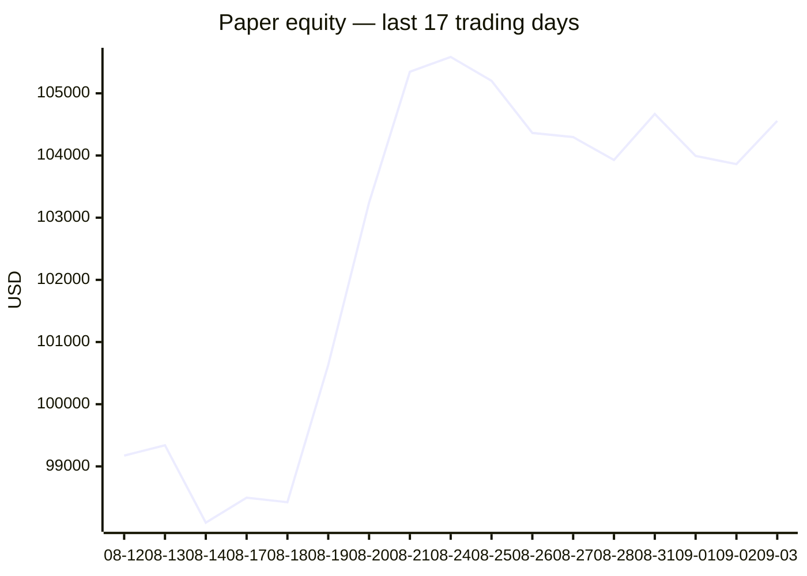
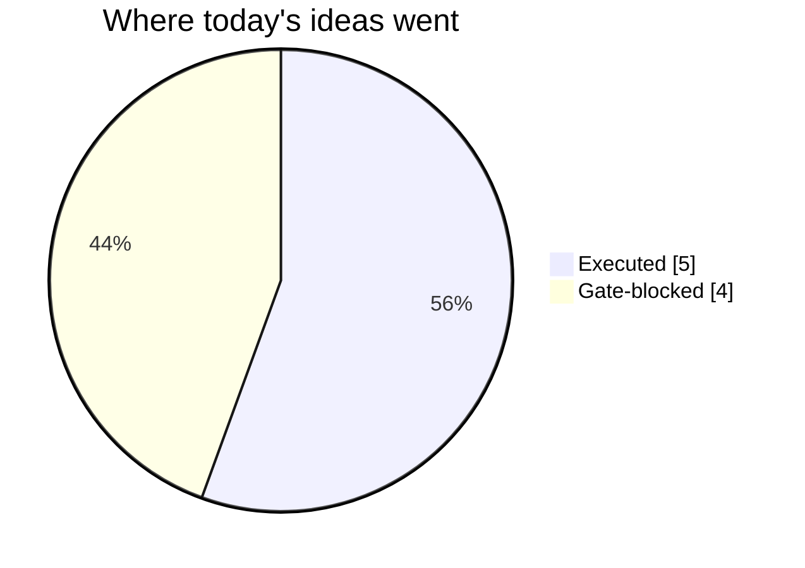
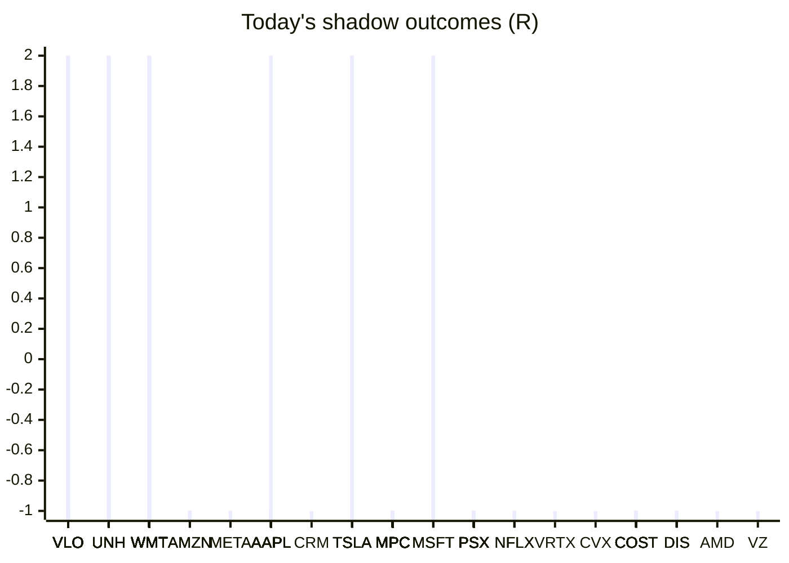

# Trading day 2026-09-03

Paper equity **$104,557** · day +0.67% · regime trending · config v4-seeded · VIX 15.2 (down)

## Charts

## Activity

- Theses formed: 6 (approved→orders: 5, human-rejected: 0, expired unapproved: 0)
- Risk gate blocked: 4
- Fills at the broker: 8

### Positions closed (real book)

- MPC → **stopped** -1.07R · banked -1521% of its +0.07R peak
- PSX → **stopped** -1.04R · banked -416% of its +0.25R peak
- WMT → **stopped** -1.01R

Exit quality: banked **-968%** of peak open profit across 2 closed position(s) that had a real peak to protect. Persistently low = greed (holding through the give-back); high but with peaks barely above the exits = fear (selling winners too early).

### Execution quality (measured, today)

- equities: 5 fill(s) · avg slippage cost 0.03R (negative = better than intended) · 10.2 bps · worst 0.176R

### The day's ideas

- **PSX** (momentum-breakout) entry 259.54 stop 257.1 target 264.42 — Broke 20-bar high (259.42) with stock and SPY above their 20-day averages. Stop 2×ATR below, target 2R.
- **MPC** (momentum-breakout) entry 397.68 stop 393.99 target 405.06 — Broke 20-bar high (397.47) with stock and SPY above their 20-day averages. Stop 2×ATR below, target 2R.
- **UNH** (momentum-breakout) entry 402.16 stop 399.44 target 407.6 — Broke 20-bar high (402.11) with stock and SPY above their 20-day averages. Stop 2×ATR below, target 2R.
- **TSLA** (momentum-breakout) entry 380.87 stop 374.44 target 393.73 — Broke 20-bar high (380.84) with stock and SPY above their 20-day averages. Stop 2×ATR below, target 2R.
- **WMT** (momentum-breakout) entry 109.3 stop 108.58 target 110.74 — Broke 20-bar high (109.2) with stock and SPY above their 20-day averages. Stop 2×ATR below, target 2R.
- **GILD** (momentum-breakout) entry 150.82 stop 150.1 target 152.26 — Broke 20-bar high (150.67) with stock and SPY above their 20-day averages. Stop 2×ATR below, target 2R.

## Shadow ledger (what would have happened)

- VLO (momentum-breakout:filtered, filter-blocked) → **target** +2R
- VLO (momentum-breakout:filtered, filter-blocked) → **target** +2R
- VLO (momentum-breakout:filtered, filter-blocked) → **target** +2R
- UNH (momentum-breakout:filtered, filter-blocked) → **target** +2R
- UNH (momentum-breakout:filtered, filter-blocked) → **target** +2R
- UNH (momentum-breakout:filtered, filter-blocked) → **target** +2R
- UNH (momentum-breakout:filtered, filter-blocked) → **target** +2R
- UNH (momentum-breakout:filtered, filter-blocked) → **target** +2R
- UNH (momentum-breakout:filtered, filter-blocked) → **target** +2R
- VLO (momentum-breakout:filtered, filter-blocked) → **target** +2R
- VLO (momentum-breakout:filtered, filter-blocked) → **target** +2R
- VLO (momentum-breakout:filtered, filter-blocked) → **target** +2R
- VLO (momentum-breakout:filtered, filter-blocked) → **target** +2R
- VLO (momentum-breakout:filtered, filter-blocked) → **target** +2R
- VLO (momentum-breakout:filtered, filter-blocked) → **target** +2R
- VLO (momentum-breakout:filtered, filter-blocked) → **target** +2R
- VLO (momentum-breakout:filtered, filter-blocked) → **target** +2R
- WMT (momentum-breakout:filtered, filter-blocked) → **target** +2R
- AMZN (momentum-breakout:filtered, filter-blocked) → **stopped** -1R
- UNH (momentum-breakout:filtered, filter-blocked) → **target** +2R
- AMZN (momentum-breakout:filtered, filter-blocked) → **stopped** -1R
- AMZN (momentum-breakout:filtered, filter-blocked) → **stopped** -1R
- META (momentum-breakout:filtered, filter-blocked) → **stopped** -1R
- WMT (momentum-breakout:filtered, filter-blocked) → **target** +2R
- WMT (momentum-breakout:filtered, filter-blocked) → **target** +2R
- WMT (momentum-breakout:filtered, filter-blocked) → **target** +2R
- WMT (momentum-breakout:filtered, filter-blocked) → **target** +2R
- WMT (momentum-breakout:filtered, filter-blocked) → **target** +2R
- AAPL (momentum-breakout:filtered, filter-blocked) → **stopped** -1R
- AAPL (momentum-breakout:filtered, filter-blocked) → **stopped** -1R
- AAPL (momentum-breakout:filtered, filter-blocked) → **stopped** -1R
- META (momentum-breakout:filtered, filter-blocked) → **stopped** -1R
- WMT (momentum-breakout:filtered, filter-blocked) → **target** +2R
- WMT (momentum-breakout:filtered, filter-blocked) → **target** +2R
- WMT (momentum-breakout:filtered, filter-blocked) → **target** +2R
- CRM (momentum-breakout, gate-blocked) → **stopped** -1R
- AMZN (momentum-breakout:filtered, filter-blocked) → **stopped** -1R
- UNH (momentum-breakout:filtered, filter-blocked) → **target** +2R
- UNH (momentum-breakout:filtered, filter-blocked) → **target** +2R
- UNH (momentum-breakout:filtered, filter-blocked) → **target** +2R
- UNH (momentum-breakout:filtered, filter-blocked) → **target** +2R
- WMT (momentum-breakout:filtered, filter-blocked) → **target** +2R
- WMT (momentum-breakout:filtered, filter-blocked) → **target** +2R
- UNH (momentum-breakout:filtered, filter-blocked) → **target** +2R
- UNH (momentum-breakout:filtered, filter-blocked) → **target** +2R
- UNH (momentum-breakout:filtered, filter-blocked) → **target** +2R
- UNH (momentum-breakout:filtered, filter-blocked) → **target** +2R
- WMT (momentum-breakout:filtered, filter-blocked) → **target** +2R
- WMT (momentum-breakout:filtered, filter-blocked) → **target** +2R
- TSLA (momentum-breakout:filtered, filter-blocked) → **target** +2R
- TSLA (momentum-breakout:filtered, filter-blocked) → **target** +2R
- WMT (momentum-breakout:filtered, filter-blocked) → **target** +2R
- WMT (momentum-breakout:filtered, filter-blocked) → **target** +2R
- WMT (momentum-breakout:filtered, filter-blocked) → **target** +2R
- WMT (momentum-breakout:filtered, filter-blocked) → **target** +2R
- WMT (momentum-breakout:filtered, filter-blocked) → **target** +2R
- AAPL (momentum-breakout:filtered, filter-blocked) → **target** +2R
- AAPL (momentum-breakout:filtered, filter-blocked) → **target** +2R
- AAPL (momentum-breakout:filtered, filter-blocked) → **target** +2R
- WMT (momentum-breakout:filtered, filter-blocked) → **target** +2R
- WMT (momentum-breakout:filtered, filter-blocked) → **target** +2R
- WMT (momentum-breakout:filtered, filter-blocked) → **target** +2R
- WMT (momentum-breakout:filtered, filter-blocked) → **target** +2R
- WMT (momentum-breakout:filtered, filter-blocked) → **target** +2R
- WMT (momentum-breakout:filtered, filter-blocked) → **target** +2R
- WMT (momentum-breakout:filtered, filter-blocked) → **target** +2R
- WMT (momentum-breakout:filtered, filter-blocked) → **target** +2R
- WMT (momentum-breakout:filtered, filter-blocked) → **target** +2R
- WMT (momentum-breakout:filtered, filter-blocked) → **target** +2R
- WMT (momentum-breakout:filtered, filter-blocked) → **target** +2R
- WMT (momentum-breakout:filtered, filter-blocked) → **target** +2R
- WMT (momentum-breakout:filtered, filter-blocked) → **target** +2R
- MPC (momentum-breakout:filtered, filter-blocked) → **stopped** -1R
- MPC (momentum-breakout:filtered, filter-blocked) → **stopped** -1R
- MPC (momentum-breakout:filtered, filter-blocked) → **stopped** -1R
- MSFT (momentum-breakout:filtered, filter-blocked) → **target** +2R
- TSLA (momentum-breakout:filtered, filter-blocked) → **target** +2R
- TSLA (momentum-breakout:filtered, filter-blocked) → **target** +2R
- TSLA (momentum-breakout:filtered, filter-blocked) → **target** +2R
- TSLA (momentum-breakout:filtered, filter-blocked) → **target** +2R
- TSLA (momentum-breakout, gate-blocked) → **target** +2R
- MSFT (momentum-breakout:filtered, filter-blocked) → **target** +2R
- VLO (momentum-breakout:filtered, filter-blocked) → **stopped** -1R
- VLO (momentum-breakout:filtered, filter-blocked) → **stopped** -1R
- VLO (momentum-breakout:filtered, filter-blocked) → **stopped** -1R
- VLO (momentum-breakout:filtered, filter-blocked) → **stopped** -1R
- VLO (momentum-breakout:filtered, filter-blocked) → **stopped** -1R
- VLO (momentum-breakout:filtered, filter-blocked) → **stopped** -1R
- VLO (momentum-breakout:filtered, filter-blocked) → **stopped** -1R
- VLO (momentum-breakout:filtered, filter-blocked) → **stopped** -1R
- WMT (momentum-breakout:filtered, filter-blocked) → **target** +2R
- MPC (momentum-breakout:filtered, filter-blocked) → **stopped** -1R
- MPC (momentum-breakout:filtered, filter-blocked) → **stopped** -1R
- MPC (momentum-breakout:filtered, filter-blocked) → **stopped** -1R
- MPC (momentum-breakout:filtered, filter-blocked) → **stopped** -1R
- MPC (momentum-breakout:filtered, filter-blocked) → **stopped** -1R
- MPC (momentum-breakout:filtered, filter-blocked) → **stopped** -1R
- MPC (momentum-breakout:filtered, filter-blocked) → **stopped** -1R
- MPC (momentum-breakout:filtered, filter-blocked) → **stopped** -1R
- MPC (momentum-breakout:filtered, filter-blocked) → **stopped** -1R
- MPC (momentum-breakout:filtered, filter-blocked) → **stopped** -1R
- MPC (momentum-breakout:filtered, filter-blocked) → **stopped** -1R
- VLO (momentum-breakout:filtered, filter-blocked) → **stopped** -1R
- VLO (momentum-breakout:filtered, filter-blocked) → **stopped** -1R
- VLO (momentum-breakout:filtered, filter-blocked) → **stopped** -1R
- VLO (momentum-breakout:filtered, filter-blocked) → **stopped** -1R
- VLO (momentum-breakout:filtered, filter-blocked) → **stopped** -1R
- VLO (momentum-breakout:filtered, filter-blocked) → **stopped** -1R
- VLO (momentum-breakout:filtered, filter-blocked) → **stopped** -1R
- MPC (momentum-breakout:filtered, filter-blocked) → **stopped** -1R
- MPC (momentum-breakout:filtered, filter-blocked) → **stopped** -1R
- MPC (momentum-breakout:filtered, filter-blocked) → **stopped** -1R
- MPC (momentum-breakout:filtered, filter-blocked) → **stopped** -1R
- MPC (momentum-breakout:filtered, filter-blocked) → **stopped** -1R
- PSX (momentum-breakout:filtered, filter-blocked) → **stopped** -1R
- MPC (momentum-breakout:filtered, filter-blocked) → **stopped** -1R
- NFLX (momentum-breakout:filtered, filter-blocked) → **stopped** -1R
- NFLX (momentum-breakout:filtered, filter-blocked) → **stopped** -1R
- MPC (momentum-breakout:filtered, filter-blocked) → **stopped** -1R
- MPC (momentum-breakout:filtered, filter-blocked) → **stopped** -1R
- MPC (momentum-breakout:filtered, filter-blocked) → **stopped** -1R
- MPC (momentum-breakout:filtered, filter-blocked) → **stopped** -1R
- NFLX (momentum-breakout:filtered, filter-blocked) → **stopped** -1R
- WMT (momentum-breakout:filtered, filter-blocked) → **target** +2R
- WMT (momentum-breakout:filtered, filter-blocked) → **target** +2R
- WMT (momentum-breakout:filtered, filter-blocked) → **target** +2R
- VRTX (momentum-breakout:filtered, filter-blocked) → **stopped** -1R
- AAPL (momentum-breakout, gate-blocked) → **stopped** -1R
- AAPL (momentum-breakout:filtered, filter-blocked) → **stopped** -1R
- PSX (momentum-breakout:filtered, filter-blocked) → **stopped** -1R
- CVX (momentum-breakout, gate-blocked) → **stopped** -1R
- AAPL (momentum-breakout:filtered, filter-blocked) → **stopped** -1R
- AAPL (momentum-breakout:filtered, filter-blocked) → **stopped** -1R
- PSX (momentum-breakout:filtered, filter-blocked) → **stopped** -1R
- PSX (momentum-breakout:filtered, filter-blocked) → **stopped** -1R
- AAPL (momentum-breakout:filtered, filter-blocked) → **stopped** -1R
- MPC (momentum-breakout:filtered, filter-blocked) → **stopped** -1R
- MPC (momentum-breakout:filtered, filter-blocked) → **stopped** -1R
- AAPL (momentum-breakout:filtered, filter-blocked) → **stopped** -1R
- PSX (momentum-breakout:filtered, filter-blocked) → **stopped** -1R
- PSX (momentum-breakout:filtered, filter-blocked) → **stopped** -1R
- PSX (momentum-breakout:filtered, filter-blocked) → **stopped** -1R
- PSX (momentum-breakout:filtered, filter-blocked) → **stopped** -1R
- AAPL (momentum-breakout:filtered, filter-blocked) → **stopped** -1R
- PSX (momentum-breakout:filtered, filter-blocked) → **stopped** -1R
- PSX (momentum-breakout:filtered, filter-blocked) → **stopped** -1R
- PSX (momentum-breakout:filtered, filter-blocked) → **stopped** -1R
- PSX (momentum-breakout:filtered, filter-blocked) → **stopped** -1R
- PSX (momentum-breakout:filtered, filter-blocked) → **stopped** -1R
- PSX (momentum-breakout:filtered, filter-blocked) → **stopped** -1R
- PSX (momentum-breakout:filtered, filter-blocked) → **stopped** -1R
- PSX (momentum-breakout:filtered, filter-blocked) → **stopped** -1R
- PSX (momentum-breakout:filtered, filter-blocked) → **stopped** -1R
- MSFT (momentum-breakout:filtered, filter-blocked) → **target** +2R
- MPC (momentum-breakout:filtered, filter-blocked) → **stopped** -1R
- MPC (momentum-breakout:filtered, filter-blocked) → **stopped** -1R
- MPC (momentum-breakout:filtered, filter-blocked) → **stopped** -1R
- MPC (momentum-breakout:filtered, filter-blocked) → **stopped** -1R
- MPC (momentum-breakout:filtered, filter-blocked) → **stopped** -1R
- MPC (momentum-breakout:filtered, filter-blocked) → **stopped** -1R
- MPC (momentum-breakout:filtered, filter-blocked) → **stopped** -1R
- MPC (momentum-breakout:filtered, filter-blocked) → **stopped** -1R
- MPC (momentum-breakout:filtered, filter-blocked) → **stopped** -1R
- AAPL (momentum-breakout:filtered, filter-blocked) → **stopped** -1R
- AAPL (momentum-breakout:filtered, filter-blocked) → **stopped** -1R
- UNH (momentum-breakout:filtered, filter-blocked) → **stopped** -1R
- UNH (momentum-breakout:filtered, filter-blocked) → **stopped** -1R
- COST (momentum-breakout:filtered, filter-blocked) → **stopped** -1R
- COST (momentum-breakout:filtered, filter-blocked) → **stopped** -1R
- COST (momentum-breakout:filtered, filter-blocked) → **stopped** -1R
- COST (momentum-breakout:filtered, filter-blocked) → **stopped** -1R
- COST (momentum-breakout:filtered, filter-blocked) → **stopped** -1R
- COST (momentum-breakout:filtered, filter-blocked) → **stopped** -1R
- COST (momentum-breakout:filtered, filter-blocked) → **stopped** -1R
- COST (momentum-breakout:filtered, filter-blocked) → **stopped** -1R
- DIS (momentum-breakout:filtered, filter-blocked) → **stopped** -1R
- DIS (momentum-breakout:filtered, filter-blocked) → **stopped** -1R
- DIS (momentum-breakout:filtered, filter-blocked) → **stopped** -1R
- DIS (momentum-breakout:filtered, filter-blocked) → **stopped** -1R
- WMT (momentum-breakout:filtered, filter-blocked) → **stopped** -1R
- WMT (momentum-breakout:filtered, filter-blocked) → **stopped** -1R
- WMT (momentum-breakout:filtered, filter-blocked) → **stopped** -1R
- WMT (momentum-breakout:filtered, filter-blocked) → **stopped** -1R
- AMD (momentum-breakout:filtered, filter-blocked) → **stopped** -1R
- VZ (momentum-breakout, gate-blocked) → **stopped** -1R
- WMT (momentum-breakout:filtered, filter-blocked) → **stopped** -1R

Day total: **+36R**

## Running shadow record

Resolved 5 ideas · win rate 20% · total -2R · avg -0.4R · still tracking 749

## Is the desk earning its keep?

Shadow-outcome R by the desk verdict each idea carried (vetoed/expired ideas only — executed trades don't resolve to an R-outcome yet):

| Verdict | Ideas | Win rate | Avg R |
|---|---|---|---|
| proceed | 0 | —% | — |
| caution | 0 | —% | — |
| avoid | 0 | —% | — |
| none | 5 | 20% | -0.4 |

*Only 0 scored ideas so far — a preview, not a verdict on the AI yet.*

## Incubation ward

- **pullback-trend** — incubating: 0/25 shadow outcomes
- **crypto-mean-reversion** — incubating: 0/25 shadow outcomes
- **cfd-mean-reversion** — incubating: 0/25 shadow outcomes
- **cfd-opening-range** — incubating: 0/25 shadow outcomes
- **equity-opening-range** — incubating: 0/25 shadow outcomes
- **cfd-pair-reversion** — incubating: 0/25 shadow outcomes

*Incubating strategies shadow-track every signal but never execute. Graduation is mechanical: 25+ outcomes, avg ≥ +0.10R, wins ≥ 40%.*

*Generated by code, no AI. Paper account only.*
