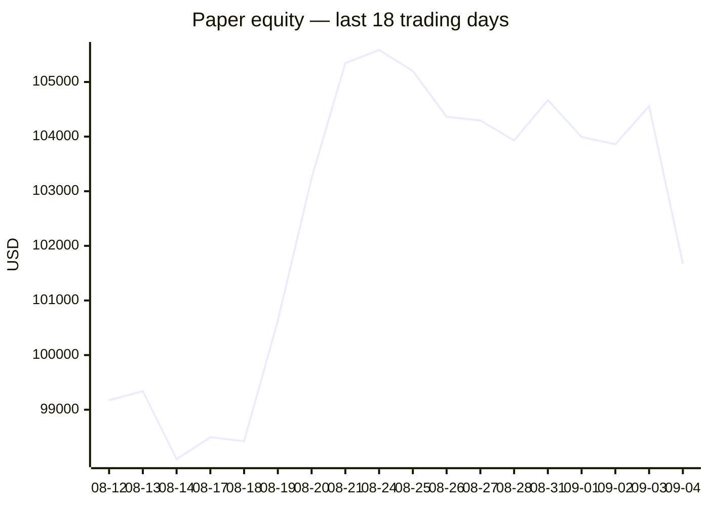
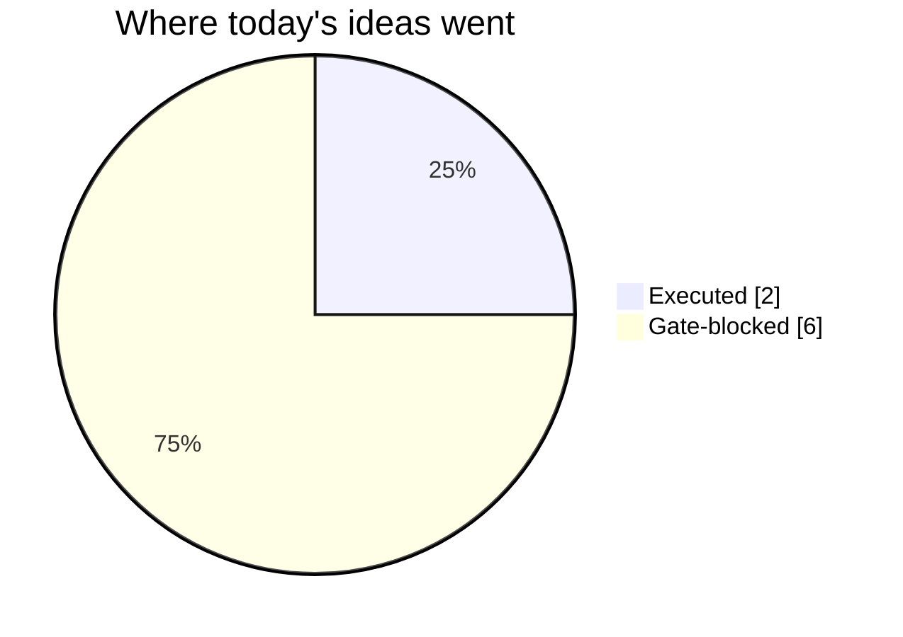
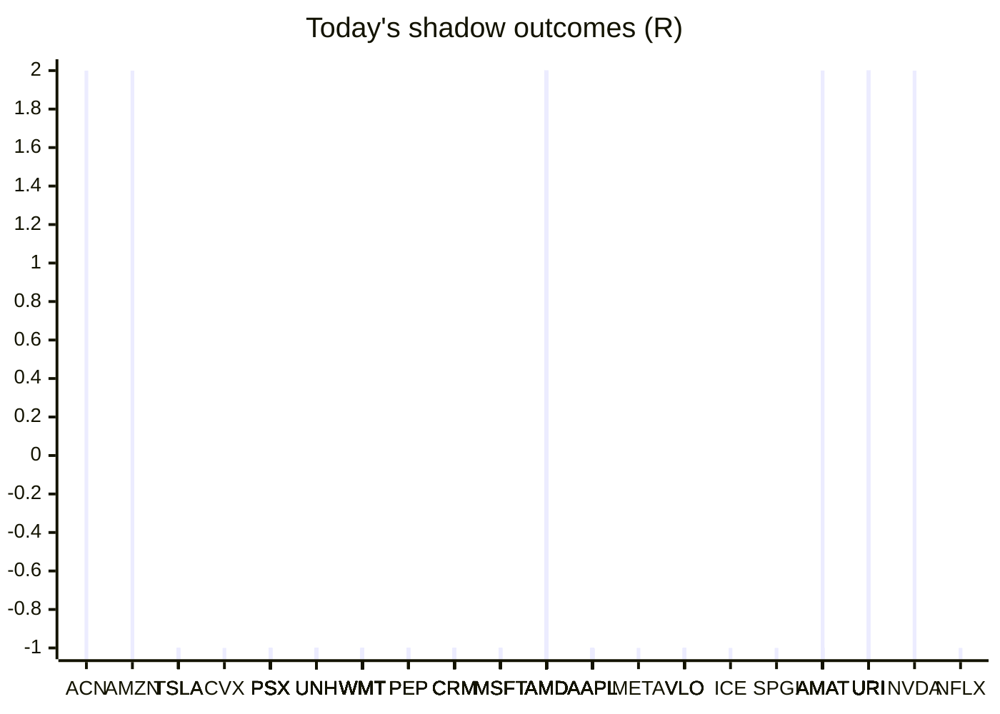

# Trading day 2026-09-04

Paper equity **$101,672** · day -2.46% · regime trending · config v4-seeded · VIX 14.32 (down)

## Charts

## Activity

- Theses formed: 2 (approved→orders: 2, human-rejected: 0, expired unapproved: 0)
- Risk gate blocked: 6
- Fills at the broker: 3

### Positions closed (real book)

- DE → **stopped** -1.16R

### Execution quality (measured, today)

- equities: 2 fill(s) · avg slippage cost -0.163R (negative = better than intended) · 13.5 bps · worst 0R

### The day's ideas

- **DE** (momentum-breakout) entry 699.46 stop 694 target 710.38 — Broke 20-bar high (699.27) with stock and SPY above their 20-day averages. Stop 2×ATR below, target 2R.
- **VLO** (momentum-breakout) entry 371.82 stop 368.53 target 378.4 — Broke 20-bar high (371.72) with stock and SPY above their 20-day averages. Stop 2×ATR below, target 2R.

## Shadow ledger (what would have happened)

- ACN (momentum-breakout:filtered, filter-blocked) → **target** +2R
- AMZN (momentum-breakout:filtered, filter-blocked) → **target** +2R
- TSLA (momentum-breakout:filtered, filter-blocked) → **stopped** -1R
- TSLA (momentum-breakout:filtered, filter-blocked) → **stopped** -1R
- TSLA (momentum-breakout:filtered, filter-blocked) → **stopped** -1R
- TSLA (momentum-breakout:filtered, filter-blocked) → **stopped** -1R
- CVX (momentum-breakout:filtered, filter-blocked) → **stopped** -1R
- PSX (momentum-breakout:filtered, filter-blocked) → **stopped** -1R
- PSX (momentum-breakout:filtered, filter-blocked) → **stopped** -1R
- PSX (momentum-breakout:filtered, filter-blocked) → **stopped** -1R
- PSX (momentum-breakout:filtered, filter-blocked) → **stopped** -1R
- PSX (momentum-breakout:filtered, filter-blocked) → **stopped** -1R
- PSX (momentum-breakout:filtered, filter-blocked) → **stopped** -1R
- PSX (momentum-breakout:filtered, filter-blocked) → **stopped** -1R
- PSX (momentum-breakout:filtered, filter-blocked) → **stopped** -1R
- PSX (momentum-breakout:filtered, filter-blocked) → **stopped** -1R
- PSX (momentum-breakout:filtered, filter-blocked) → **stopped** -1R
- PSX (momentum-breakout:filtered, filter-blocked) → **stopped** -1R
- PSX (momentum-breakout:filtered, filter-blocked) → **stopped** -1R
- PSX (momentum-breakout:filtered, filter-blocked) → **stopped** -1R
- PSX (momentum-breakout:filtered, filter-blocked) → **stopped** -1R
- PSX (momentum-breakout:filtered, filter-blocked) → **stopped** -1R
- PSX (momentum-breakout:filtered, filter-blocked) → **stopped** -1R
- PSX (momentum-breakout:filtered, filter-blocked) → **stopped** -1R
- PSX (momentum-breakout:filtered, filter-blocked) → **stopped** -1R
- PSX (momentum-breakout:filtered, filter-blocked) → **stopped** -1R
- UNH (momentum-breakout:filtered, filter-blocked) → **stopped** -1R
- UNH (momentum-breakout:filtered, filter-blocked) → **stopped** -1R
- UNH (momentum-breakout:filtered, filter-blocked) → **stopped** -1R
- UNH (momentum-breakout:filtered, filter-blocked) → **stopped** -1R
- UNH (momentum-breakout:filtered, filter-blocked) → **stopped** -1R
- UNH (momentum-breakout:filtered, filter-blocked) → **stopped** -1R
- UNH (momentum-breakout:filtered, filter-blocked) → **stopped** -1R
- UNH (momentum-breakout:filtered, filter-blocked) → **stopped** -1R
- UNH (momentum-breakout:filtered, filter-blocked) → **stopped** -1R
- UNH (momentum-breakout:filtered, filter-blocked) → **stopped** -1R
- UNH (momentum-breakout:filtered, filter-blocked) → **stopped** -1R
- UNH (momentum-breakout:filtered, filter-blocked) → **stopped** -1R
- WMT (momentum-breakout:filtered, filter-blocked) → **stopped** -1R
- PEP (momentum-breakout:filtered, filter-blocked) → **stopped** -1R
- PEP (momentum-breakout:filtered, filter-blocked) → **stopped** -1R
- PEP (momentum-breakout:filtered, filter-blocked) → **stopped** -1R
- PEP (momentum-breakout:filtered, filter-blocked) → **stopped** -1R
- CRM (momentum-breakout:filtered, filter-blocked) → **stopped** -1R
- CRM (momentum-breakout:filtered, filter-blocked) → **stopped** -1R
- CRM (momentum-breakout:filtered, filter-blocked) → **stopped** -1R
- CRM (momentum-breakout:filtered, filter-blocked) → **stopped** -1R
- CRM (momentum-breakout:filtered, filter-blocked) → **stopped** -1R
- CRM (momentum-breakout:filtered, filter-blocked) → **stopped** -1R
- CRM (momentum-breakout:filtered, filter-blocked) → **stopped** -1R
- CRM (momentum-breakout:filtered, filter-blocked) → **stopped** -1R
- MSFT (momentum-breakout:filtered, filter-blocked) → **stopped** -1R
- MSFT (momentum-breakout:filtered, filter-blocked) → **stopped** -1R
- MSFT (momentum-breakout, gate-blocked) → **stopped** -1R
- CRM (momentum-breakout:filtered, filter-blocked) → **stopped** -1R
- AMD (momentum-breakout:filtered, filter-blocked) → **target** +2R
- AMD (momentum-breakout:filtered, filter-blocked) → **target** +2R
- AMD (momentum-breakout:filtered, filter-blocked) → **target** +2R
- AMD (momentum-breakout:filtered, filter-blocked) → **target** +2R
- AMD (momentum-breakout:filtered, filter-blocked) → **target** +2R
- AMD (momentum-breakout:filtered, filter-blocked) → **target** +2R
- AMD (momentum-breakout:filtered, filter-blocked) → **target** +2R
- MSFT (momentum-breakout:filtered, filter-blocked) → **stopped** -1R
- MSFT (momentum-breakout:filtered, filter-blocked) → **stopped** -1R
- AAPL (momentum-breakout:filtered, filter-blocked) → **stopped** -1R
- AMD (momentum-breakout:filtered, filter-blocked) → **target** +2R
- AMD (momentum-breakout:filtered, filter-blocked) → **target** +2R
- AMD (momentum-breakout:filtered, filter-blocked) → **target** +2R
- AMD (momentum-breakout:filtered, filter-blocked) → **target** +2R
- AMD (momentum-breakout:filtered, filter-blocked) → **target** +2R
- AMD (momentum-breakout:filtered, filter-blocked) → **target** +2R
- AAPL (momentum-breakout:filtered, filter-blocked) → **stopped** -1R
- AAPL (momentum-breakout:filtered, filter-blocked) → **stopped** -1R
- AAPL (momentum-breakout:filtered, filter-blocked) → **stopped** -1R
- AAPL (momentum-breakout:filtered, filter-blocked) → **stopped** -1R
- AAPL (momentum-breakout:filtered, filter-blocked) → **stopped** -1R
- AAPL (momentum-breakout:filtered, filter-blocked) → **stopped** -1R
- AAPL (momentum-breakout:filtered, filter-blocked) → **stopped** -1R
- META (momentum-breakout:filtered, filter-blocked) → **stopped** -1R
- VLO (momentum-breakout:filtered, filter-blocked) → **stopped** -1R
- VLO (momentum-breakout:filtered, filter-blocked) → **stopped** -1R
- VLO (momentum-breakout:filtered, filter-blocked) → **stopped** -1R
- VLO (momentum-breakout:filtered, filter-blocked) → **stopped** -1R
- VLO (momentum-breakout:filtered, filter-blocked) → **stopped** -1R
- AAPL (momentum-breakout:filtered, filter-blocked) → **stopped** -1R
- MSFT (momentum-breakout:filtered, filter-blocked) → **stopped** -1R
- AAPL (momentum-breakout:filtered, filter-blocked) → **stopped** -1R
- ICE (momentum-breakout, gate-blocked) → **stopped** -1R
- SPGI (momentum-breakout, gate-blocked) → **stopped** -1R
- AMAT (momentum-breakout:filtered, filter-blocked) → **target** +2R
- URI (momentum-breakout:filtered, filter-blocked) → **target** +2R
- URI (momentum-breakout:filtered, filter-blocked) → **target** +2R
- URI (momentum-breakout:filtered, filter-blocked) → **target** +2R
- URI (momentum-breakout:filtered, filter-blocked) → **target** +2R
- URI (momentum-breakout:filtered, filter-blocked) → **target** +2R
- URI (momentum-breakout:filtered, filter-blocked) → **target** +2R
- URI (momentum-breakout:filtered, filter-blocked) → **target** +2R
- URI (momentum-breakout:filtered, filter-blocked) → **target** +2R
- URI (momentum-breakout:filtered, filter-blocked) → **target** +2R
- URI (momentum-breakout:filtered, filter-blocked) → **target** +2R
- URI (momentum-breakout:filtered, filter-blocked) → **target** +2R
- URI (momentum-breakout:filtered, filter-blocked) → **target** +2R
- URI (momentum-breakout:filtered, filter-blocked) → **target** +2R
- URI (momentum-breakout:filtered, filter-blocked) → **target** +2R
- URI (momentum-breakout:filtered, filter-blocked) → **target** +2R
- URI (momentum-breakout:filtered, filter-blocked) → **target** +2R
- URI (momentum-breakout:filtered, filter-blocked) → **target** +2R
- URI (momentum-breakout:filtered, filter-blocked) → **target** +2R
- URI (momentum-breakout:filtered, filter-blocked) → **target** +2R
- URI (momentum-breakout:filtered, filter-blocked) → **target** +2R
- URI (momentum-breakout:filtered, filter-blocked) → **target** +2R
- URI (momentum-breakout:filtered, filter-blocked) → **target** +2R
- URI (momentum-breakout:filtered, filter-blocked) → **target** +2R
- URI (momentum-breakout:filtered, filter-blocked) → **target** +2R
- URI (momentum-breakout:filtered, filter-blocked) → **target** +2R
- URI (momentum-breakout:filtered, filter-blocked) → **target** +2R
- URI (momentum-breakout:filtered, filter-blocked) → **target** +2R
- URI (momentum-breakout:filtered, filter-blocked) → **target** +2R
- URI (momentum-breakout:filtered, filter-blocked) → **target** +2R
- URI (momentum-breakout:filtered, filter-blocked) → **target** +2R
- URI (momentum-breakout:filtered, filter-blocked) → **target** +2R
- URI (momentum-breakout:filtered, filter-blocked) → **target** +2R
- URI (momentum-breakout:filtered, filter-blocked) → **target** +2R
- URI (momentum-breakout:filtered, filter-blocked) → **target** +2R
- URI (momentum-breakout:filtered, filter-blocked) → **target** +2R
- URI (momentum-breakout:filtered, filter-blocked) → **target** +2R
- URI (momentum-breakout:filtered, filter-blocked) → **target** +2R
- URI (momentum-breakout:filtered, filter-blocked) → **target** +2R
- URI (momentum-breakout:filtered, filter-blocked) → **target** +2R
- URI (momentum-breakout:filtered, filter-blocked) → **target** +2R
- URI (momentum-breakout:filtered, filter-blocked) → **target** +2R
- URI (momentum-breakout:filtered, filter-blocked) → **target** +2R
- URI (momentum-breakout:filtered, filter-blocked) → **target** +2R
- URI (momentum-breakout:filtered, filter-blocked) → **target** +2R
- URI (momentum-breakout:filtered, filter-blocked) → **target** +2R
- URI (momentum-breakout:filtered, filter-blocked) → **target** +2R
- URI (momentum-breakout:filtered, filter-blocked) → **target** +2R
- URI (momentum-breakout:filtered, filter-blocked) → **target** +2R
- URI (momentum-breakout:filtered, filter-blocked) → **target** +2R
- URI (momentum-breakout:filtered, filter-blocked) → **target** +2R
- URI (momentum-breakout:filtered, filter-blocked) → **target** +2R
- URI (momentum-breakout:filtered, filter-blocked) → **target** +2R
- URI (momentum-breakout:filtered, filter-blocked) → **target** +2R
- URI (momentum-breakout:filtered, filter-blocked) → **target** +2R
- URI (momentum-breakout:filtered, filter-blocked) → **target** +2R
- URI (momentum-breakout:filtered, filter-blocked) → **target** +2R
- URI (momentum-breakout:filtered, filter-blocked) → **target** +2R
- URI (momentum-breakout:filtered, filter-blocked) → **target** +2R
- URI (momentum-breakout:filtered, filter-blocked) → **target** +2R
- URI (momentum-breakout:filtered, filter-blocked) → **target** +2R
- URI (momentum-breakout:filtered, filter-blocked) → **target** +2R
- URI (momentum-breakout:filtered, filter-blocked) → **target** +2R
- URI (momentum-breakout:filtered, filter-blocked) → **target** +2R
- AMD (momentum-breakout:filtered, filter-blocked) → **target** +2R
- AMD (momentum-breakout:filtered, filter-blocked) → **target** +2R
- AMD (momentum-breakout:filtered, filter-blocked) → **target** +2R
- AAPL (momentum-breakout:filtered, filter-blocked) → **stopped** -1R
- AAPL (momentum-breakout:filtered, filter-blocked) → **stopped** -1R
- AAPL (momentum-breakout:filtered, filter-blocked) → **stopped** -1R
- AMD (momentum-breakout:filtered, filter-blocked) → **target** +2R
- NVDA (momentum-breakout, gate-blocked) → **target** +2R
- AAPL (momentum-breakout:filtered, filter-blocked) → **stopped** -1R
- NFLX (momentum-breakout:filtered, filter-blocked) → **stopped** -1R
- AMAT (momentum-breakout:filtered, filter-blocked) → **target** +2R
- AMAT (momentum-breakout:filtered, filter-blocked) → **target** +2R
- WMT (momentum-breakout:filtered, filter-blocked) → **stopped** -1R
- URI (momentum-breakout:filtered, filter-blocked) → **stopped** -1R
- URI (momentum-breakout:filtered, filter-blocked) → **stopped** -1R
- URI (momentum-breakout:filtered, filter-blocked) → **stopped** -1R
- URI (momentum-breakout:filtered, filter-blocked) → **stopped** -1R
- URI (momentum-breakout:filtered, filter-blocked) → **stopped** -1R
- URI (momentum-breakout:filtered, filter-blocked) → **stopped** -1R
- URI (momentum-breakout:filtered, filter-blocked) → **stopped** -1R
- URI (momentum-breakout:filtered, filter-blocked) → **stopped** -1R
- URI (momentum-breakout:filtered, filter-blocked) → **stopped** -1R
- URI (momentum-breakout:filtered, filter-blocked) → **stopped** -1R
- URI (momentum-breakout:filtered, filter-blocked) → **stopped** -1R
- AAPL (momentum-breakout:filtered, filter-blocked) → **stopped** -1R
- AMD (momentum-breakout:filtered, filter-blocked) → **target** +2R
- WMT (momentum-breakout:filtered, filter-blocked) → **stopped** -1R
- WMT (momentum-breakout:filtered, filter-blocked) → **stopped** -1R
- WMT (momentum-breakout:filtered, filter-blocked) → **stopped** -1R
- WMT (momentum-breakout:filtered, filter-blocked) → **stopped** -1R
- WMT (momentum-breakout:filtered, filter-blocked) → **stopped** -1R
- WMT (momentum-breakout:filtered, filter-blocked) → **stopped** -1R
- WMT (momentum-breakout:filtered, filter-blocked) → **stopped** -1R
- WMT (momentum-breakout:filtered, filter-blocked) → **stopped** -1R
- WMT (momentum-breakout:filtered, filter-blocked) → **stopped** -1R
- WMT (momentum-breakout:filtered, filter-blocked) → **stopped** -1R
- WMT (momentum-breakout:filtered, filter-blocked) → **stopped** -1R
- WMT (momentum-breakout:filtered, filter-blocked) → **stopped** -1R
- WMT (momentum-breakout:filtered, filter-blocked) → **stopped** -1R
- WMT (momentum-breakout:filtered, filter-blocked) → **stopped** -1R
- WMT (momentum-breakout:filtered, filter-blocked) → **stopped** -1R
- WMT (momentum-breakout:filtered, filter-blocked) → **stopped** -1R
- WMT (momentum-breakout:filtered, filter-blocked) → **stopped** -1R
- WMT (momentum-breakout:filtered, filter-blocked) → **stopped** -1R
- AMD (momentum-breakout:filtered, filter-blocked) → **stopped** -1R
- AMAT (momentum-breakout:filtered, filter-blocked) → **stopped** -1R
- AMAT (momentum-breakout:filtered, filter-blocked) → **stopped** -1R
- WMT (momentum-breakout:filtered, filter-blocked) → **stopped** -1R
- WMT (momentum-breakout:filtered, filter-blocked) → **stopped** -1R
- WMT (momentum-breakout:filtered, filter-blocked) → **stopped** -1R
- WMT (momentum-breakout:filtered, filter-blocked) → **stopped** -1R
- WMT (momentum-breakout:filtered, filter-blocked) → **stopped** -1R
- AMD (momentum-breakout:filtered, filter-blocked) → **target** +2R
- AMD (momentum-breakout:filtered, filter-blocked) → **target** +2R
- AMD (momentum-breakout:filtered, filter-blocked) → **target** +2R
- AMD (momentum-breakout:filtered, filter-blocked) → **target** +2R
- AMD (momentum-breakout:filtered, filter-blocked) → **target** +2R
- AMD (momentum-breakout:filtered, filter-blocked) → **target** +2R
- AMD (momentum-breakout:filtered, filter-blocked) → **target** +2R
- AMD (momentum-breakout:filtered, filter-blocked) → **target** +2R
- AMD (momentum-breakout:filtered, filter-blocked) → **target** +2R
- AMAT (momentum-breakout:filtered, filter-blocked) → **stopped** -1R
- WMT (momentum-breakout:filtered, filter-blocked) → **stopped** -1R
- AMAT (momentum-breakout:filtered, filter-blocked) → **stopped** -1R
- AMAT (momentum-breakout:filtered, filter-blocked) → **stopped** -1R
- AMAT (momentum-breakout:filtered, filter-blocked) → **stopped** -1R
- AMAT (momentum-breakout:filtered, filter-blocked) → **stopped** -1R
- AMD (momentum-breakout:filtered, filter-blocked) → **target** +2R
- AMD (momentum-breakout:filtered, filter-blocked) → **target** +2R
- AMD (momentum-breakout:filtered, filter-blocked) → **target** +2R
- AMD (momentum-breakout:filtered, filter-blocked) → **target** +2R
- AMD (momentum-breakout:filtered, filter-blocked) → **target** +2R

Day total: **+78R**

## Running shadow record

Resolved 4 ideas · win rate 25% · total -1R · avg -0.25R · still tracking 676

## Is the desk earning its keep?

Shadow-outcome R by the desk verdict each idea carried (vetoed/expired ideas only — executed trades don't resolve to an R-outcome yet):

| Verdict | Ideas | Win rate | Avg R |
|---|---|---|---|
| proceed | 0 | —% | — |
| caution | 0 | —% | — |
| avoid | 0 | —% | — |
| none | 4 | 25% | -0.25 |

*Only 0 scored ideas so far — a preview, not a verdict on the AI yet.*

## Incubation ward

- **pullback-trend** — incubating: 0/25 shadow outcomes
- **crypto-mean-reversion** — incubating: 0/25 shadow outcomes
- **cfd-mean-reversion** — incubating: 0/25 shadow outcomes
- **cfd-opening-range** — incubating: 0/25 shadow outcomes
- **equity-opening-range** — incubating: 0/25 shadow outcomes
- **cfd-pair-reversion** — incubating: 0/25 shadow outcomes

*Incubating strategies shadow-track every signal but never execute. Graduation is mechanical: 25+ outcomes, avg ≥ +0.10R, wins ≥ 40%.*

*Generated by code, no AI. Paper account only.*
