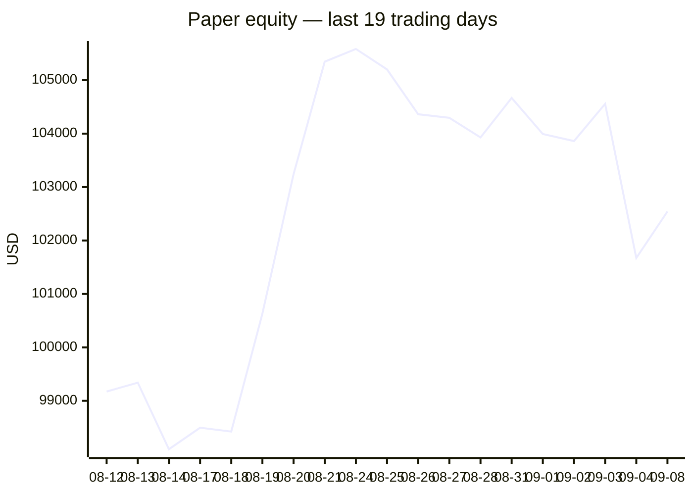
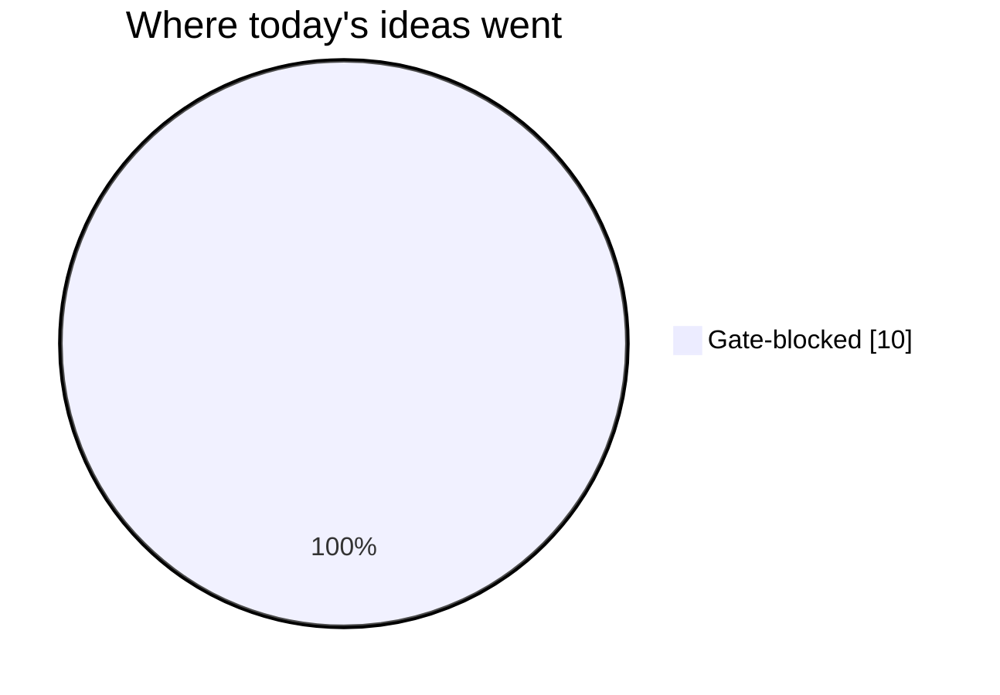
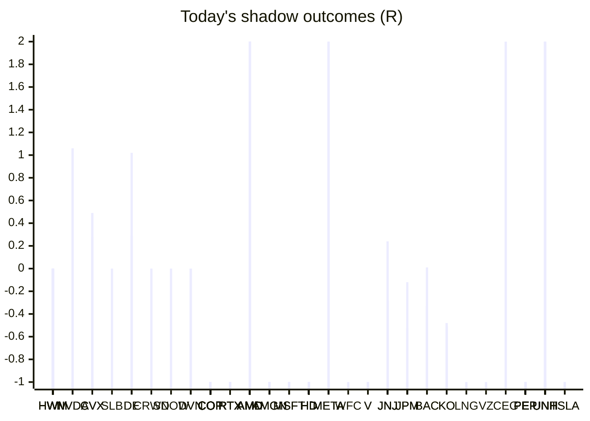

# Trading day 2026-09-08

Paper equity **$102,543** · day +0.89% · regime choppy · config v4-seeded · VIX 15.3 (up)

## Charts

## Activity

- Theses formed: 0 (approved→orders: 0, human-rejected: 0, expired unapproved: 0)
- Risk gate blocked: 10
- Fills at the broker: 3

### Positions closed (real book)

- VLO → **stopped-or-closed** +1.31R · banked 57% of its +2.31R peak
- TSLA → **timeout** -2.54R · banked -541% of its +0.47R peak
- GILD → **timeout** -5.33R · banked -599% of its +0.89R peak

Exit quality: banked **-361%** of peak open profit across 3 closed position(s) that had a real peak to protect. Persistently low = greed (holding through the give-back); high but with peaks barely above the exits = fear (selling winners too early).

## Shadow ledger (what would have happened)

- HWM (mean-reversion:filtered, filter-blocked) → **timeout** +0R
- NVDA (pullback-trend, incubation) → **timeout** +1.06R
- CVX (pullback-trend, incubation) → **timeout** +0.28R
- SLB (pullback-trend, incubation) → **timeout** +0R
- DE (pullback-trend, incubation) → **timeout** +1.02R
- CRWD (pullback-trend, incubation) → **timeout** +0R
- SNOW (pullback-trend, incubation) → **timeout** +0R
- DVN (pullback-trend, incubation) → **timeout** +0R
- COP (momentum-breakout:filtered, filter-blocked) → **stopped** -1R
- COP (momentum-breakout:filtered, filter-blocked) → **stopped** -1R
- COP (momentum-breakout:filtered, filter-blocked) → **stopped** -1R
- COP (momentum-breakout:filtered, filter-blocked) → **stopped** -1R
- COP (momentum-breakout:filtered, filter-blocked) → **stopped** -1R
- COP (momentum-breakout:filtered, filter-blocked) → **stopped** -1R
- COP (momentum-breakout:filtered, filter-blocked) → **stopped** -1R
- COP (momentum-breakout:filtered, filter-blocked) → **stopped** -1R
- COP (momentum-breakout:filtered, filter-blocked) → **stopped** -1R
- COP (momentum-breakout:filtered, filter-blocked) → **stopped** -1R
- COP (momentum-breakout:filtered, filter-blocked) → **stopped** -1R
- COP (momentum-breakout:filtered, filter-blocked) → **stopped** -1R
- COP (momentum-breakout:filtered, filter-blocked) → **stopped** -1R
- COP (momentum-breakout:filtered, filter-blocked) → **stopped** -1R
- COP (momentum-breakout:filtered, filter-blocked) → **stopped** -1R
- COP (momentum-breakout:filtered, filter-blocked) → **stopped** -1R
- COP (momentum-breakout:filtered, filter-blocked) → **stopped** -1R
- COP (momentum-breakout:filtered, filter-blocked) → **stopped** -1R
- COP (momentum-breakout:filtered, filter-blocked) → **stopped** -1R
- COP (momentum-breakout:filtered, filter-blocked) → **stopped** -1R
- COP (momentum-breakout:filtered, filter-blocked) → **stopped** -1R
- COP (momentum-breakout:filtered, filter-blocked) → **stopped** -1R
- COP (momentum-breakout:filtered, filter-blocked) → **stopped** -1R
- COP (momentum-breakout:filtered, filter-blocked) → **stopped** -1R
- COP (momentum-breakout:filtered, filter-blocked) → **stopped** -1R
- COP (momentum-breakout:filtered, filter-blocked) → **stopped** -1R
- COP (momentum-breakout:filtered, filter-blocked) → **stopped** -1R
- COP (momentum-breakout:filtered, filter-blocked) → **stopped** -1R
- RTX (momentum-breakout:filtered, filter-blocked) → **stopped** -1R
- RTX (momentum-breakout:filtered, filter-blocked) → **stopped** -1R
- RTX (momentum-breakout:filtered, filter-blocked) → **stopped** -1R
- RTX (momentum-breakout:filtered, filter-blocked) → **stopped** -1R
- RTX (momentum-breakout:filtered, filter-blocked) → **stopped** -1R
- RTX (momentum-breakout:filtered, filter-blocked) → **stopped** -1R
- RTX (momentum-breakout:filtered, filter-blocked) → **stopped** -1R
- RTX (momentum-breakout:filtered, filter-blocked) → **stopped** -1R
- RTX (momentum-breakout:filtered, filter-blocked) → **stopped** -1R
- RTX (momentum-breakout:filtered, filter-blocked) → **stopped** -1R
- AMD (momentum-breakout:filtered, filter-blocked) → **target** +2R
- AMD (momentum-breakout:filtered, filter-blocked) → **target** +2R
- AMD (momentum-breakout:filtered, filter-blocked) → **target** +2R
- AMD (momentum-breakout:filtered, filter-blocked) → **target** +2R
- AMD (momentum-breakout:filtered, filter-blocked) → **target** +2R
- AMD (momentum-breakout:filtered, filter-blocked) → **target** +2R
- AMD (momentum-breakout:filtered, filter-blocked) → **target** +2R
- AMD (momentum-breakout:filtered, filter-blocked) → **target** +2R
- AMD (momentum-breakout:filtered, filter-blocked) → **target** +2R
- AMD (momentum-breakout:filtered, filter-blocked) → **target** +2R
- AMD (momentum-breakout:filtered, filter-blocked) → **target** +2R
- AMD (momentum-breakout:filtered, filter-blocked) → **target** +2R
- AMD (momentum-breakout:filtered, filter-blocked) → **target** +2R
- AMD (momentum-breakout:filtered, filter-blocked) → **target** +2R
- AMD (momentum-breakout:filtered, filter-blocked) → **target** +2R
- AMD (momentum-breakout:filtered, filter-blocked) → **target** +2R
- HWM (momentum-breakout:filtered, filter-blocked) → **timeout** +0R
- HWM (mean-reversion:filtered, filter-blocked) → **timeout** +0R
- AMGN (pullback-trend, incubation) → **stopped** -1R
- AMGN (pullback-trend, incubation) → **stopped** -1R
- MSFT (pullback-trend, incubation) → **stopped** -1R
- MSFT (pullback-trend, incubation) → **stopped** -1R
- AMGN (pullback-trend, incubation) → **stopped** -1R
- MSFT (pullback-trend, incubation) → **stopped** -1R
- AMD (momentum-breakout:filtered, filter-blocked) → **target** +2R
- AMD (momentum-breakout:filtered, filter-blocked) → **target** +2R
- AMD (momentum-breakout:filtered, filter-blocked) → **target** +2R
- AMD (momentum-breakout:filtered, filter-blocked) → **target** +2R
- AMD (momentum-breakout:filtered, filter-blocked) → **target** +2R
- AMD (momentum-breakout:filtered, filter-blocked) → **target** +2R
- AMD (momentum-breakout:filtered, filter-blocked) → **target** +2R
- AMD (momentum-breakout:filtered, filter-blocked) → **target** +2R
- AMD (momentum-breakout:filtered, filter-blocked) → **target** +2R
- AMD (momentum-breakout:filtered, filter-blocked) → **target** +2R
- AMD (momentum-breakout:filtered, filter-blocked) → **target** +2R
- AMD (momentum-breakout:filtered, filter-blocked) → **target** +2R
- AMD (momentum-breakout:filtered, filter-blocked) → **target** +2R
- AMD (momentum-breakout:filtered, filter-blocked) → **target** +2R
- AMD (momentum-breakout, gate-blocked) → **target** +2R
- HD (momentum-breakout:filtered, filter-blocked) → **stopped** -1R
- HD (momentum-breakout:filtered, filter-blocked) → **stopped** -1R
- HD (momentum-breakout:filtered, filter-blocked) → **stopped** -1R
- HD (momentum-breakout:filtered, filter-blocked) → **stopped** -1R
- HD (momentum-breakout:filtered, filter-blocked) → **stopped** -1R
- HD (momentum-breakout:filtered, filter-blocked) → **stopped** -1R
- HD (momentum-breakout:filtered, filter-blocked) → **stopped** -1R
- HD (momentum-breakout:filtered, filter-blocked) → **stopped** -1R
- HD (momentum-breakout:filtered, filter-blocked) → **stopped** -1R
- HD (momentum-breakout:filtered, filter-blocked) → **stopped** -1R
- HD (momentum-breakout:filtered, filter-blocked) → **stopped** -1R
- HWM (momentum-breakout:filtered, filter-blocked) → **timeout** +0R
- HWM (mean-reversion:filtered, filter-blocked) → **timeout** +0R
- META (momentum-breakout:filtered, filter-blocked) → **target** +2R
- WFC (momentum-breakout, gate-blocked) → **stopped** -1R
- HD (momentum-breakout:filtered, filter-blocked) → **stopped** -1R
- HD (momentum-breakout:filtered, filter-blocked) → **stopped** -1R
- HD (momentum-breakout:filtered, filter-blocked) → **stopped** -1R
- HD (momentum-breakout:filtered, filter-blocked) → **stopped** -1R
- HD (momentum-breakout:filtered, filter-blocked) → **stopped** -1R
- HD (momentum-breakout:filtered, filter-blocked) → **stopped** -1R
- HD (momentum-breakout:filtered, filter-blocked) → **stopped** -1R
- HD (momentum-breakout:filtered, filter-blocked) → **stopped** -1R
- HD (momentum-breakout:filtered, filter-blocked) → **stopped** -1R
- HD (momentum-breakout:filtered, filter-blocked) → **stopped** -1R
- HD (momentum-breakout:filtered, filter-blocked) → **stopped** -1R
- HD (momentum-breakout:filtered, filter-blocked) → **stopped** -1R
- HD (momentum-breakout:filtered, filter-blocked) → **stopped** -1R
- HD (momentum-breakout:filtered, filter-blocked) → **stopped** -1R
- HWM (momentum-breakout:filtered, filter-blocked) → **timeout** +0R
- HWM (mean-reversion:filtered, filter-blocked) → **timeout** +0R
- V (pullback-trend, incubation) → **stopped** -1R
- HWM (momentum-breakout:filtered, filter-blocked) → **timeout** +0R
- HWM (mean-reversion:filtered, filter-blocked) → **timeout** +0R
- HWM (momentum-breakout:filtered, filter-blocked) → **timeout** +0R
- HWM (mean-reversion:filtered, filter-blocked) → **timeout** +0R
- HD (momentum-breakout:filtered, filter-blocked) → **stopped** -1R
- HD (momentum-breakout:filtered, filter-blocked) → **stopped** -1R
- HD (momentum-breakout:filtered, filter-blocked) → **stopped** -1R
- HD (momentum-breakout:filtered, filter-blocked) → **stopped** -1R
- HD (momentum-breakout:filtered, filter-blocked) → **stopped** -1R
- HD (momentum-breakout:filtered, filter-blocked) → **stopped** -1R
- HD (momentum-breakout:filtered, filter-blocked) → **stopped** -1R
- HD (momentum-breakout:filtered, filter-blocked) → **stopped** -1R
- HWM (momentum-breakout:filtered, filter-blocked) → **timeout** +0R
- HWM (mean-reversion:filtered, filter-blocked) → **timeout** +0R
- JNJ (pullback-trend, incubation) → **stopped** -1R
- JNJ (pullback-trend, incubation) → **stopped** -1R
- JNJ (pullback-trend, incubation) → **stopped** -1R
- HWM (momentum-breakout:filtered, filter-blocked) → **timeout** +0R
- HWM (mean-reversion:filtered, filter-blocked) → **timeout** +0R
- HD (momentum-breakout:filtered, filter-blocked) → **stopped** -1R
- HD (momentum-breakout:filtered, filter-blocked) → **stopped** -1R
- HD (momentum-breakout:filtered, filter-blocked) → **stopped** -1R
- HD (momentum-breakout:filtered, filter-blocked) → **stopped** -1R
- HD (momentum-breakout:filtered, filter-blocked) → **stopped** -1R
- HD (momentum-breakout:filtered, filter-blocked) → **stopped** -1R
- HD (momentum-breakout:filtered, filter-blocked) → **stopped** -1R
- HWM (momentum-breakout:filtered, filter-blocked) → **timeout** +0R
- HWM (mean-reversion:filtered, filter-blocked) → **timeout** +0R
- HD (momentum-breakout:filtered, filter-blocked) → **stopped** -1R
- HWM (momentum-breakout:filtered, filter-blocked) → **timeout** +0R
- HWM (mean-reversion:filtered, filter-blocked) → **timeout** +0R
- HWM (momentum-breakout:filtered, filter-blocked) → **timeout** +0R
- JPM (pullback-trend, incubation) → **timeout** -0.12R
- BAC (pullback-trend, incubation) → **timeout** +0.01R
- JNJ (pullback-trend, incubation) → **timeout** -0.28R
- KO (pullback-trend, incubation) → **timeout** -0.48R
- HWM (momentum-breakout:filtered, filter-blocked) → **timeout** +0R
- HD (momentum-breakout:filtered, filter-blocked) → **stopped** -1R
- HD (momentum-breakout:filtered, filter-blocked) → **stopped** -1R
- HWM (momentum-breakout:filtered, filter-blocked) → **timeout** +0R
- HWM (momentum-breakout:filtered, filter-blocked) → **timeout** +0R
- HD (momentum-breakout:filtered, filter-blocked) → **stopped** -1R
- HWM (momentum-breakout:filtered, filter-blocked) → **timeout** +0R
- HWM (momentum-breakout:filtered, filter-blocked) → **timeout** +0R
- NVDA (momentum-breakout, gate-blocked) → **stopped** -1R
- LNG (momentum-breakout, gate-blocked) → **stopped** -1R
- RTX (momentum-breakout:filtered, filter-blocked) → **stopped** -1R
- RTX (momentum-breakout:filtered, filter-blocked) → **stopped** -1R
- VZ (momentum-breakout, gate-blocked) → **stopped** -1R
- AMD (momentum-breakout, gate-blocked) → **target** +2R
- JPM (pullback-trend, incubation) → **timeout** -0.53R
- BAC (pullback-trend, incubation) → **timeout** -0.33R
- CVX (pullback-trend, incubation) → **timeout** +0.49R
- JNJ (pullback-trend, incubation) → **timeout** +0.24R
- KO (pullback-trend, incubation) → **timeout** -0.51R
- DE (pullback-trend, incubation) → **timeout** +0.29R
- DVN (pullback-trend, incubation) → **timeout** +0R
- CEG (momentum-breakout, gate-blocked) → **target** +2R
- COP (momentum-breakout, gate-blocked) → **stopped** -1R
- PEP (momentum-breakout:filtered, filter-blocked) → **stopped** -1R
- PEP (momentum-breakout:filtered, filter-blocked) → **stopped** -1R
- PEP (momentum-breakout:filtered, filter-blocked) → **stopped** -1R
- PEP (momentum-breakout:filtered, filter-blocked) → **stopped** -1R
- PEP (momentum-breakout:filtered, filter-blocked) → **stopped** -1R
- PEP (momentum-breakout:filtered, filter-blocked) → **stopped** -1R
- PEP (momentum-breakout:filtered, filter-blocked) → **stopped** -1R
- PEP (momentum-breakout:filtered, filter-blocked) → **stopped** -1R
- PEP (momentum-breakout:filtered, filter-blocked) → **stopped** -1R
- V (pullback-trend, incubation) → **stopped** -1R
- PEP (momentum-breakout:filtered, filter-blocked) → **stopped** -1R
- PEP (momentum-breakout:filtered, filter-blocked) → **stopped** -1R
- PEP (momentum-breakout:filtered, filter-blocked) → **stopped** -1R
- PEP (momentum-breakout:filtered, filter-blocked) → **stopped** -1R
- PEP (momentum-breakout:filtered, filter-blocked) → **stopped** -1R
- PEP (momentum-breakout:filtered, filter-blocked) → **stopped** -1R
- PEP (momentum-breakout:filtered, filter-blocked) → **stopped** -1R
- PEP (momentum-breakout:filtered, filter-blocked) → **stopped** -1R
- CVX (momentum-breakout, gate-blocked) → **stopped** -1R
- UNH (momentum-breakout:filtered, filter-blocked) → **target** +2R
- UNH (momentum-breakout:filtered, filter-blocked) → **target** +2R
- UNH (momentum-breakout:filtered, filter-blocked) → **target** +2R
- UNH (momentum-breakout:filtered, filter-blocked) → **target** +2R
- UNH (momentum-breakout:filtered, filter-blocked) → **stopped** -1R
- UNH (momentum-breakout:filtered, filter-blocked) → **stopped** -1R
- TSLA (momentum-breakout:filtered, filter-blocked) → **stopped** -1R
- TSLA (momentum-breakout:filtered, filter-blocked) → **stopped** -1R
- UNH (momentum-breakout:filtered, filter-blocked) → **stopped** -1R
- UNH (momentum-breakout:filtered, filter-blocked) → **stopped** -1R
- UNH (momentum-breakout:filtered, filter-blocked) → **stopped** -1R
- HWM (momentum-breakout:filtered, filter-blocked) → **timeout** +0R
- HWM (momentum-breakout:filtered, filter-blocked) → **timeout** +0R
- META (momentum-breakout, gate-blocked) → **target** +2R
- META (momentum-breakout, gate-blocked) → **stopped** -1R
- JPM (pullback-trend, incubation) → **stopped** -1R

Day total: **-47.86R**

## Running shadow record

Resolved 44 ideas · win rate 25% · total -9.86R · avg -0.22R · still tracking 642

## Is the desk earning its keep?

Shadow-outcome R by the desk verdict each idea carried (vetoed/expired ideas only — executed trades don't resolve to an R-outcome yet):

| Verdict | Ideas | Win rate | Avg R |
|---|---|---|---|
| proceed | 0 | —% | — |
| caution | 0 | —% | — |
| avoid | 0 | —% | — |
| none | 44 | 25% | -0.22 |

*Only 0 scored ideas so far — a preview, not a verdict on the AI yet.*

## Incubation ward

- **pullback-trend** — incubating: win rate 21% below 40%
- **crypto-mean-reversion** — incubating: 0/25 shadow outcomes
- **cfd-mean-reversion** — incubating: 0/25 shadow outcomes
- **cfd-opening-range** — incubating: 0/25 shadow outcomes
- **equity-opening-range** — incubating: 0/25 shadow outcomes
- **cfd-pair-reversion** — incubating: 0/25 shadow outcomes

*Incubating strategies shadow-track every signal but never execute. Graduation is mechanical: 25+ outcomes, avg ≥ +0.10R, wins ≥ 40%.*

*Generated by code, no AI. Paper account only.*
