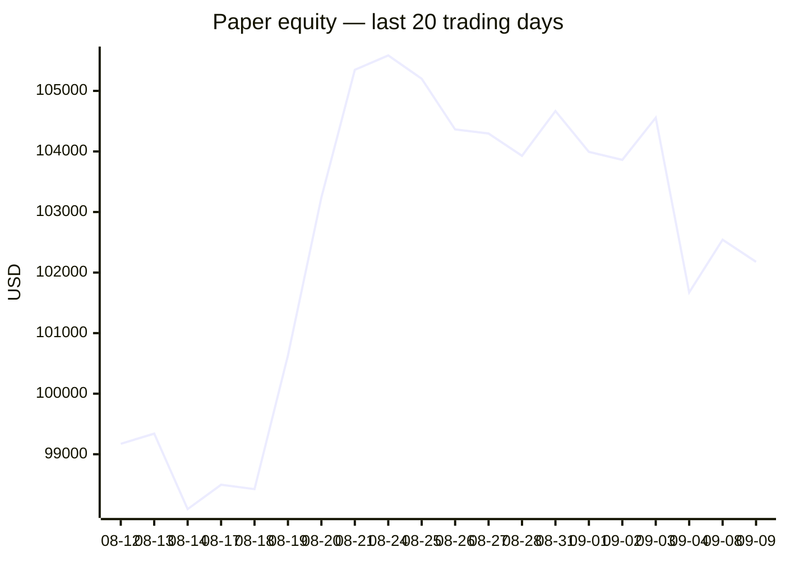
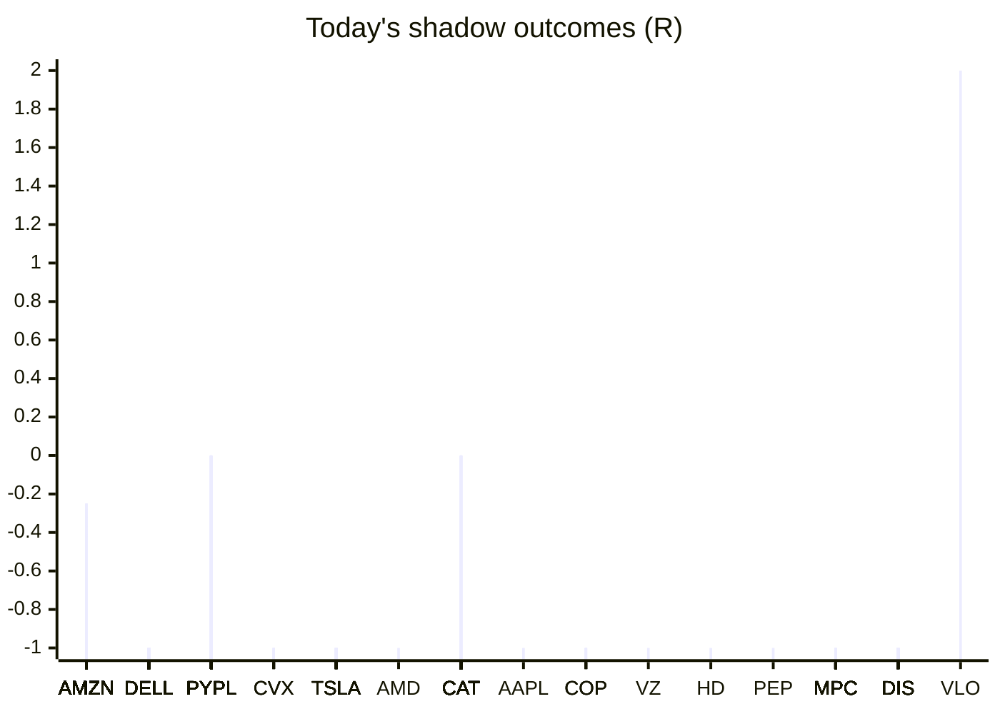

# Trading day 2026-09-09

Paper equity **$102,177** · day -0.53% · regime choppy · config v4-seeded · VIX 15.72 (down)

## Charts

## Activity

- Theses formed: 0 (approved→orders: 0, human-rejected: 0, expired unapproved: 0)
- Risk gate blocked: 0
- Fills at the broker: 0

## Shadow ledger (what would have happened)

- AMZN (pullback-trend:filtered, filter-blocked) → **timeout** -0.29R
- AMZN (pullback-trend:filtered, filter-blocked) → **timeout** -0.3R
- AMZN (pullback-trend:filtered, filter-blocked) → **timeout** -0.28R
- DELL (momentum-breakout:filtered, filter-blocked) → **stopped** -1R
- DELL (momentum-breakout:filtered, filter-blocked) → **stopped** -1R
- AMZN (pullback-trend:filtered, filter-blocked) → **timeout** -0.32R
- PYPL (momentum-breakout:filtered, filter-blocked) → **timeout** +0R
- AMZN (pullback-trend:filtered, filter-blocked) → **timeout** -0.32R
- CVX (momentum-breakout:filtered, filter-blocked) → **stopped** -1R
- AMZN (pullback-trend:filtered, filter-blocked) → **timeout** -0.32R
- AMZN (pullback-trend:filtered, filter-blocked) → **timeout** -0.31R
- CVX (momentum-breakout:filtered, filter-blocked) → **stopped** -1R
- AMZN (pullback-trend:filtered, filter-blocked) → **timeout** -0.32R
- AMZN (pullback-trend:filtered, filter-blocked) → **timeout** -0.31R
- AMZN (pullback-trend:filtered, filter-blocked) → **timeout** -0.34R
- AMZN (pullback-trend:filtered, filter-blocked) → **timeout** -0.35R
- AMZN (pullback-trend:filtered, filter-blocked) → **timeout** -0.37R
- AMZN (pullback-trend:filtered, filter-blocked) → **timeout** -0.37R
- AMZN (pullback-trend:filtered, filter-blocked) → **timeout** -0.43R
- TSLA (momentum-breakout:filtered, filter-blocked) → **stopped** -1R
- AMZN (pullback-trend:filtered, filter-blocked) → **timeout** -0.41R
- AMZN (pullback-trend:filtered, filter-blocked) → **timeout** -0.4R
- TSLA (momentum-breakout:filtered, filter-blocked) → **stopped** -1R
- AMZN (pullback-trend:filtered, filter-blocked) → **timeout** -0.4R
- AMZN (pullback-trend:filtered, filter-blocked) → **timeout** -0.41R
- AMZN (pullback-trend:filtered, filter-blocked) → **timeout** -0.41R
- DELL (momentum-breakout:filtered, filter-blocked) → **stopped** -1R
- DELL (momentum-breakout:filtered, filter-blocked) → **stopped** -1R
- DELL (momentum-breakout:filtered, filter-blocked) → **stopped** -1R
- AMZN (pullback-trend:filtered, filter-blocked) → **timeout** -0.45R
- TSLA (momentum-breakout:filtered, filter-blocked) → **stopped** -1R
- CVX (momentum-breakout:filtered, filter-blocked) → **stopped** -1R
- TSLA (momentum-breakout:filtered, filter-blocked) → **stopped** -1R
- TSLA (momentum-breakout:filtered, filter-blocked) → **stopped** -1R
- DELL (momentum-breakout:filtered, filter-blocked) → **stopped** -1R
- DELL (momentum-breakout:filtered, filter-blocked) → **stopped** -1R
- DELL (momentum-breakout:filtered, filter-blocked) → **stopped** -1R
- AMZN (pullback-trend:filtered, filter-blocked) → **timeout** -0.45R
- AMZN (pullback-trend:filtered, filter-blocked) → **timeout** -0.45R
- AMZN (pullback-trend:filtered, filter-blocked) → **timeout** -0.45R
- AMZN (pullback-trend:filtered, filter-blocked) → **timeout** -0.39R
- AMZN (pullback-trend:filtered, filter-blocked) → **timeout** -0.38R
- AMZN (pullback-trend:filtered, filter-blocked) → **timeout** -0.37R
- AMZN (pullback-trend:filtered, filter-blocked) → **timeout** -0.36R
- AMZN (pullback-trend:filtered, filter-blocked) → **timeout** -0.35R
- AMZN (pullback-trend:filtered, filter-blocked) → **timeout** -0.36R
- AMZN (pullback-trend:filtered, filter-blocked) → **timeout** -0.37R
- AMZN (pullback-trend:filtered, filter-blocked) → **timeout** -0.39R
- AMZN (pullback-trend:filtered, filter-blocked) → **timeout** -0.41R
- TSLA (momentum-breakout:filtered, filter-blocked) → **stopped** -1R
- AMZN (pullback-trend:filtered, filter-blocked) → **timeout** -0.42R
- TSLA (momentum-breakout:filtered, filter-blocked) → **stopped** -1R
- TSLA (momentum-breakout:filtered, filter-blocked) → **stopped** -1R
- TSLA (momentum-breakout:filtered, filter-blocked) → **stopped** -1R
- DELL (momentum-breakout:filtered, filter-blocked) → **stopped** -1R
- DELL (momentum-breakout:filtered, filter-blocked) → **stopped** -1R
- DELL (momentum-breakout:filtered, filter-blocked) → **stopped** -1R
- DELL (momentum-breakout:filtered, filter-blocked) → **stopped** -1R
- AMD (momentum-breakout:filtered, filter-blocked) → **stopped** -1R
- AMZN (pullback-trend:filtered, filter-blocked) → **timeout** -0.42R
- AMZN (pullback-trend:filtered, filter-blocked) → **timeout** -0.42R
- CAT (momentum-breakout:filtered, filter-blocked) → **timeout** +0R
- AMZN (pullback-trend:filtered, filter-blocked) → **timeout** -0.42R
- AMZN (pullback-trend:filtered, filter-blocked) → **timeout** -0.44R
- CAT (momentum-breakout:filtered, filter-blocked) → **timeout** +0R
- AMZN (pullback-trend:filtered, filter-blocked) → **timeout** -0.43R
- CAT (momentum-breakout:filtered, filter-blocked) → **timeout** +0R
- AMZN (pullback-trend:filtered, filter-blocked) → **timeout** -0.42R
- CAT (momentum-breakout:filtered, filter-blocked) → **timeout** +0R
- AMZN (pullback-trend:filtered, filter-blocked) → **timeout** -0.42R
- CAT (momentum-breakout:filtered, filter-blocked) → **timeout** +0R
- AMZN (pullback-trend:filtered, filter-blocked) → **timeout** -0.4R
- CAT (momentum-breakout:filtered, filter-blocked) → **timeout** +0R
- AMZN (pullback-trend:filtered, filter-blocked) → **timeout** -0.4R
- CAT (momentum-breakout:filtered, filter-blocked) → **timeout** +0R
- AMZN (pullback-trend:filtered, filter-blocked) → **timeout** -0.41R
- AMZN (pullback-trend:filtered, filter-blocked) → **timeout** -0.39R
- CAT (momentum-breakout:filtered, filter-blocked) → **timeout** +0R
- AMZN (pullback-trend:filtered, filter-blocked) → **timeout** -0.38R
- CAT (momentum-breakout:filtered, filter-blocked) → **timeout** +0R
- AMZN (pullback-trend:filtered, filter-blocked) → **timeout** -0.4R
- CAT (momentum-breakout:filtered, filter-blocked) → **timeout** +0R
- AMZN (pullback-trend:filtered, filter-blocked) → **timeout** -0.41R
- CAT (momentum-breakout:filtered, filter-blocked) → **timeout** +0R
- AMZN (pullback-trend:filtered, filter-blocked) → **timeout** -0.39R
- CAT (momentum-breakout:filtered, filter-blocked) → **timeout** +0R
- DELL (momentum-breakout:filtered, filter-blocked) → **stopped** -1R
- AMZN (pullback-trend:filtered, filter-blocked) → **timeout** -0.39R
- CAT (momentum-breakout:filtered, filter-blocked) → **timeout** +0R
- AMZN (pullback-trend:filtered, filter-blocked) → **timeout** -0.4R
- CAT (momentum-breakout:filtered, filter-blocked) → **timeout** +0R
- AMZN (pullback-trend:filtered, filter-blocked) → **timeout** -0.39R
- CAT (momentum-breakout:filtered, filter-blocked) → **timeout** +0R
- AMZN (pullback-trend:filtered, filter-blocked) → **timeout** -0.38R
- CAT (momentum-breakout:filtered, filter-blocked) → **timeout** +0R
- DELL (momentum-breakout:filtered, filter-blocked) → **stopped** -1R
- DELL (momentum-breakout:filtered, filter-blocked) → **stopped** -1R
- DELL (momentum-breakout:filtered, filter-blocked) → **stopped** -1R
- DELL (momentum-breakout:filtered, filter-blocked) → **stopped** -1R
- AMZN (pullback-trend:filtered, filter-blocked) → **timeout** -0.38R
- CAT (momentum-breakout:filtered, filter-blocked) → **timeout** +0R
- AMZN (pullback-trend:filtered, filter-blocked) → **timeout** -0.38R
- CAT (momentum-breakout:filtered, filter-blocked) → **timeout** +0R
- DELL (momentum-breakout:filtered, filter-blocked) → **stopped** -1R
- DELL (momentum-breakout:filtered, filter-blocked) → **stopped** -1R
- DELL (momentum-breakout:filtered, filter-blocked) → **stopped** -1R
- AMZN (pullback-trend:filtered, filter-blocked) → **timeout** -0.38R
- DELL (momentum-breakout:filtered, filter-blocked) → **stopped** -1R
- AMZN (pullback-trend:filtered, filter-blocked) → **timeout** -0.38R
- DELL (momentum-breakout:filtered, filter-blocked) → **stopped** -1R
- DELL (momentum-breakout:filtered, filter-blocked) → **stopped** -1R
- AMZN (pullback-trend:filtered, filter-blocked) → **timeout** -0.37R
- AMZN (pullback-trend:filtered, filter-blocked) → **timeout** -0.36R
- AMZN (pullback-trend:filtered, filter-blocked) → **timeout** -0.36R
- AMZN (pullback-trend:filtered, filter-blocked) → **timeout** -0.35R
- AMZN (pullback-trend:filtered, filter-blocked) → **timeout** -0.35R
- AMZN (pullback-trend:filtered, filter-blocked) → **timeout** -0.34R
- AMZN (pullback-trend:filtered, filter-blocked) → **timeout** -0.33R
- AMZN (pullback-trend:filtered, filter-blocked) → **timeout** -0.34R
- AMZN (pullback-trend:filtered, filter-blocked) → **timeout** -0.32R
- AMZN (pullback-trend:filtered, filter-blocked) → **timeout** -0.31R
- AMZN (pullback-trend:filtered, filter-blocked) → **timeout** -0.3R
- AMZN (pullback-trend:filtered, filter-blocked) → **timeout** -0.32R
- AMZN (pullback-trend:filtered, filter-blocked) → **timeout** -0.31R
- AMZN (pullback-trend:filtered, filter-blocked) → **timeout** -0.33R
- AMZN (pullback-trend:filtered, filter-blocked) → **timeout** -0.33R
- AMZN (pullback-trend:filtered, filter-blocked) → **timeout** -0.33R
- AMZN (pullback-trend:filtered, filter-blocked) → **timeout** -0.34R
- AMZN (pullback-trend:filtered, filter-blocked) → **timeout** -0.34R
- AMZN (pullback-trend:filtered, filter-blocked) → **timeout** -0.33R
- AMZN (pullback-trend:filtered, filter-blocked) → **timeout** -0.33R
- AAPL (momentum-breakdown, incubation) → **stopped** -1R
- AMZN (pullback-trend:filtered, filter-blocked) → **timeout** -0.32R
- COP (momentum-breakout:filtered, filter-blocked) → **stopped** -1R
- AMZN (pullback-trend:filtered, filter-blocked) → **timeout** -0.32R
- AMZN (pullback-trend:filtered, filter-blocked) → **timeout** -0.31R
- COP (momentum-breakout:filtered, filter-blocked) → **stopped** -1R
- COP (momentum-breakout:filtered, filter-blocked) → **stopped** -1R
- AMZN (pullback-trend:filtered, filter-blocked) → **timeout** -0.3R
- AMZN (pullback-trend:filtered, filter-blocked) → **timeout** -0.3R
- AMZN (pullback-trend:filtered, filter-blocked) → **timeout** -0.3R
- AMZN (pullback-trend:filtered, filter-blocked) → **timeout** -0.29R
- AMZN (pullback-trend:filtered, filter-blocked) → **timeout** -0.3R
- AMZN (pullback-trend:filtered, filter-blocked) → **timeout** -0.29R
- AMZN (pullback-trend:filtered, filter-blocked) → **timeout** -0.27R
- AMZN (pullback-trend:filtered, filter-blocked) → **timeout** -0.28R
- AMZN (pullback-trend:filtered, filter-blocked) → **timeout** -0.28R
- DELL (momentum-breakout:filtered, filter-blocked) → **stopped** -1R
- DELL (momentum-breakout:filtered, filter-blocked) → **stopped** -1R
- VZ (momentum-breakdown, incubation) → **stopped** -1R
- AMZN (pullback-trend:filtered, filter-blocked) → **timeout** -0.27R
- AMZN (pullback-trend:filtered, filter-blocked) → **timeout** -0.26R
- AMZN (pullback-trend:filtered, filter-blocked) → **timeout** -0.26R
- AMZN (pullback-trend:filtered, filter-blocked) → **timeout** -0.27R
- AMZN (pullback-trend:filtered, filter-blocked) → **timeout** -0.26R
- AMZN (pullback-trend:filtered, filter-blocked) → **timeout** -0.28R
- AMZN (pullback-trend:filtered, filter-blocked) → **timeout** -0.27R
- AMZN (pullback-trend:filtered, filter-blocked) → **timeout** -0.28R
- AMZN (pullback-trend:filtered, filter-blocked) → **timeout** -0.28R
- AMZN (pullback-trend:filtered, filter-blocked) → **timeout** -0.27R
- AMZN (pullback-trend:filtered, filter-blocked) → **timeout** -0.28R
- AMZN (pullback-trend:filtered, filter-blocked) → **timeout** -0.27R
- AMZN (pullback-trend:filtered, filter-blocked) → **timeout** -0.27R
- AMZN (pullback-trend:filtered, filter-blocked) → **timeout** -0.26R
- AMZN (pullback-trend:filtered, filter-blocked) → **timeout** -0.27R
- HD (momentum-breakdown, incubation) → **stopped** -1R
- AMZN (pullback-trend:filtered, filter-blocked) → **timeout** -0.27R
- AMZN (pullback-trend:filtered, filter-blocked) → **timeout** -0.27R
- AMZN (pullback-trend:filtered, filter-blocked) → **timeout** -0.28R
- AMZN (pullback-trend:filtered, filter-blocked) → **timeout** -0.28R
- AMZN (pullback-trend:filtered, filter-blocked) → **timeout** -0.29R
- AMZN (pullback-trend:filtered, filter-blocked) → **timeout** -0.28R
- AMZN (pullback-trend:filtered, filter-blocked) → **timeout** -0.26R
- PEP (momentum-breakdown, incubation) → **stopped** -1R
- MPC (momentum-breakout:filtered, filter-blocked) → **stopped** -1R
- MPC (momentum-breakout:filtered, filter-blocked) → **stopped** -1R
- MPC (momentum-breakout:filtered, filter-blocked) → **stopped** -1R
- MPC (momentum-breakout:filtered, filter-blocked) → **stopped** -1R
- MPC (momentum-breakout:filtered, filter-blocked) → **stopped** -1R
- MPC (momentum-breakout:filtered, filter-blocked) → **stopped** -1R
- MPC (momentum-breakout:filtered, filter-blocked) → **stopped** -1R
- MPC (momentum-breakout:filtered, filter-blocked) → **stopped** -1R
- MPC (momentum-breakout:filtered, filter-blocked) → **stopped** -1R
- MPC (momentum-breakout:filtered, filter-blocked) → **stopped** -1R
- MPC (momentum-breakout:filtered, filter-blocked) → **stopped** -1R
- MPC (momentum-breakout:filtered, filter-blocked) → **stopped** -1R
- MPC (momentum-breakout:filtered, filter-blocked) → **stopped** -1R
- MPC (momentum-breakout:filtered, filter-blocked) → **stopped** -1R
- MPC (momentum-breakout:filtered, filter-blocked) → **stopped** -1R
- MPC (momentum-breakout:filtered, filter-blocked) → **stopped** -1R
- MPC (momentum-breakout:filtered, filter-blocked) → **stopped** -1R
- AMZN (pullback-trend:filtered, filter-blocked) → **timeout** -0.27R
- AMZN (pullback-trend:filtered, filter-blocked) → **timeout** -0.28R
- AMZN (pullback-trend:filtered, filter-blocked) → **timeout** -0.28R
- DIS (momentum-breakout:filtered, filter-blocked) → **stopped** -1R
- AMZN (pullback-trend:filtered, filter-blocked) → **timeout** -0.27R
- DIS (momentum-breakout:filtered, filter-blocked) → **stopped** -1R
- DIS (momentum-breakout:filtered, filter-blocked) → **stopped** -1R
- DIS (momentum-breakout:filtered, filter-blocked) → **stopped** -1R
- DIS (momentum-breakout:filtered, filter-blocked) → **stopped** -1R
- DIS (momentum-breakout:filtered, filter-blocked) → **stopped** -1R
- DIS (momentum-breakout:filtered, filter-blocked) → **stopped** -1R
- DIS (momentum-breakout:filtered, filter-blocked) → **stopped** -1R
- DIS (momentum-breakout:filtered, filter-blocked) → **stopped** -1R
- DIS (momentum-breakout:filtered, filter-blocked) → **stopped** -1R
- DIS (momentum-breakout:filtered, filter-blocked) → **stopped** -1R
- AMZN (pullback-trend:filtered, filter-blocked) → **timeout** -0.27R
- AMZN (pullback-trend:filtered, filter-blocked) → **timeout** -0.28R
- AMZN (pullback-trend:filtered, filter-blocked) → **timeout** -0.28R
- AMZN (pullback-trend:filtered, filter-blocked) → **timeout** -0.28R
- AMZN (pullback-trend:filtered, filter-blocked) → **timeout** -0.28R
- AMZN (pullback-trend:filtered, filter-blocked) → **timeout** -0.28R
- AMZN (pullback-trend:filtered, filter-blocked) → **timeout** -0.27R
- AMZN (pullback-trend:filtered, filter-blocked) → **timeout** -0.35R
- AMZN (pullback-trend:filtered, filter-blocked) → **timeout** -0.34R
- AMZN (pullback-trend:filtered, filter-blocked) → **timeout** -0.35R
- AMZN (pullback-trend:filtered, filter-blocked) → **timeout** -0.34R
- AMZN (pullback-trend:filtered, filter-blocked) → **timeout** -0.33R
- AMZN (pullback-trend:filtered, filter-blocked) → **timeout** -0.33R
- AMZN (pullback-trend:filtered, filter-blocked) → **timeout** -0.31R
- VLO (momentum-breakout, gate-blocked) → **target** +2R
- AMZN (pullback-trend:filtered, filter-blocked) → **timeout** -0.3R
- AMZN (pullback-trend:filtered, filter-blocked) → **timeout** -0.31R
- AMZN (pullback-trend:filtered, filter-blocked) → **timeout** -0.3R
- AMZN (pullback-trend:filtered, filter-blocked) → **timeout** -0.32R
- AMZN (pullback-trend:filtered, filter-blocked) → **timeout** -0.32R
- AMZN (pullback-trend:filtered, filter-blocked) → **timeout** -0.32R
- AMZN (pullback-trend:filtered, filter-blocked) → **timeout** -0.33R
- CAT (momentum-breakout:filtered, filter-blocked) → **timeout** +0R
- AMZN (pullback-trend:filtered, filter-blocked) → **timeout** -0.32R
- CAT (momentum-breakout:filtered, filter-blocked) → **timeout** +0R
- AMZN (pullback-trend:filtered, filter-blocked) → **timeout** -0.3R
- AMZN (pullback-trend:filtered, filter-blocked) → **timeout** -0.3R
- AMZN (pullback-trend:filtered, filter-blocked) → **timeout** -0.28R
- AMZN (pullback-trend:filtered, filter-blocked) → **timeout** -0.29R
- AMZN (pullback-trend:filtered, filter-blocked) → **timeout** -0.29R
- AMZN (pullback-trend:filtered, filter-blocked) → **timeout** -0.28R
- AMZN (pullback-trend:filtered, filter-blocked) → **timeout** -0.27R
- AMZN (pullback-trend:filtered, filter-blocked) → **timeout** -0.27R
- AMZN (pullback-trend:filtered, filter-blocked) → **timeout** -0.27R
- AMZN (pullback-trend:filtered, filter-blocked) → **timeout** -0.25R
- AMZN (pullback-trend:filtered, filter-blocked) → **timeout** -0.26R
- AMZN (pullback-trend:filtered, filter-blocked) → **timeout** -0.27R
- AMZN (pullback-trend:filtered, filter-blocked) → **timeout** -0.28R
- AMZN (pullback-trend:filtered, filter-blocked) → **timeout** -0.29R
- AMZN (pullback-trend:filtered, filter-blocked) → **timeout** -0.29R
- AMZN (pullback-trend:filtered, filter-blocked) → **timeout** -0.29R
- AMZN (pullback-trend:filtered, filter-blocked) → **timeout** -0.29R
- AMZN (pullback-trend:filtered, filter-blocked) → **timeout** -0.29R
- CAT (momentum-breakout:filtered, filter-blocked) → **timeout** +0R
- AMZN (pullback-trend:filtered, filter-blocked) → **timeout** -0.29R
- PYPL (momentum-breakout:filtered, filter-blocked) → **timeout** +0R
- CAT (momentum-breakout:filtered, filter-blocked) → **timeout** +0R
- AMZN (pullback-trend:filtered, filter-blocked) → **timeout** -0.29R
- PYPL (momentum-breakout:filtered, filter-blocked) → **timeout** +0R
- CAT (momentum-breakout:filtered, filter-blocked) → **timeout** +0R
- AMZN (pullback-trend:filtered, filter-blocked) → **timeout** -0.29R
- PYPL (momentum-breakout:filtered, filter-blocked) → **timeout** +0R
- CAT (momentum-breakout:filtered, filter-blocked) → **timeout** +0R
- AMZN (pullback-trend:filtered, filter-blocked) → **timeout** -0.29R
- PYPL (momentum-breakout:filtered, filter-blocked) → **timeout** +0R
- CAT (momentum-breakout:filtered, filter-blocked) → **timeout** +0R
- AMZN (pullback-trend:filtered, filter-blocked) → **timeout** -0.29R
- PYPL (momentum-breakout:filtered, filter-blocked) → **timeout** +0R
- CAT (momentum-breakout:filtered, filter-blocked) → **timeout** +0R
- AMZN (pullback-trend:filtered, filter-blocked) → **timeout** -0.29R
- PYPL (momentum-breakout:filtered, filter-blocked) → **timeout** +0R
- CAT (momentum-breakout:filtered, filter-blocked) → **timeout** +0R
- AMZN (pullback-trend:filtered, filter-blocked) → **timeout** -0.29R
- PYPL (momentum-breakout:filtered, filter-blocked) → **timeout** +0R
- CAT (momentum-breakout:filtered, filter-blocked) → **timeout** +0R
- AMZN (pullback-trend:filtered, filter-blocked) → **timeout** -0.28R
- PYPL (momentum-breakout:filtered, filter-blocked) → **timeout** +0R
- PYPL (pullback-trend:filtered, filter-blocked) → **timeout** +0R
- CAT (momentum-breakout:filtered, filter-blocked) → **timeout** +0R
- AMZN (pullback-trend:filtered, filter-blocked) → **timeout** -0.28R
- PYPL (momentum-breakout:filtered, filter-blocked) → **timeout** +0R
- PYPL (pullback-trend:filtered, filter-blocked) → **timeout** +0R
- CAT (momentum-breakout:filtered, filter-blocked) → **timeout** +0R
- AMZN (pullback-trend:filtered, filter-blocked) → **timeout** -0.27R
- PYPL (momentum-breakout:filtered, filter-blocked) → **timeout** +0R
- PYPL (pullback-trend:filtered, filter-blocked) → **timeout** +0R
- CAT (momentum-breakout:filtered, filter-blocked) → **timeout** +0R
- AMZN (pullback-trend:filtered, filter-blocked) → **timeout** -0.27R
- PYPL (momentum-breakout:filtered, filter-blocked) → **timeout** +0R
- PYPL (pullback-trend:filtered, filter-blocked) → **timeout** +0R
- CAT (momentum-breakout:filtered, filter-blocked) → **timeout** +0R
- AMZN (pullback-trend:filtered, filter-blocked) → **timeout** -0.26R
- PYPL (momentum-breakout:filtered, filter-blocked) → **timeout** +0R
- PYPL (pullback-trend:filtered, filter-blocked) → **timeout** +0R
- CAT (momentum-breakout:filtered, filter-blocked) → **timeout** +0R
- AMZN (pullback-trend:filtered, filter-blocked) → **timeout** -0.27R
- PYPL (pullback-trend:filtered, filter-blocked) → **timeout** +0R
- AMZN (pullback-trend:filtered, filter-blocked) → **timeout** -0.27R
- PYPL (pullback-trend:filtered, filter-blocked) → **timeout** +0R
- AMZN (pullback-trend:filtered, filter-blocked) → **timeout** -0.26R
- PYPL (pullback-trend:filtered, filter-blocked) → **timeout** +0R
- CAT (momentum-breakout:filtered, filter-blocked) → **timeout** +0R
- AMZN (pullback-trend:filtered, filter-blocked) → **timeout** -0.26R
- PYPL (pullback-trend:filtered, filter-blocked) → **timeout** +0R
- AMZN (pullback-trend:filtered, filter-blocked) → **timeout** -0.27R
- PYPL (pullback-trend:filtered, filter-blocked) → **timeout** +0R
- CAT (momentum-breakout:filtered, filter-blocked) → **timeout** +0R
- AMZN (pullback-trend:filtered, filter-blocked) → **timeout** -0.26R
- PYPL (pullback-trend:filtered, filter-blocked) → **timeout** +0R
- CAT (momentum-breakout:filtered, filter-blocked) → **timeout** +0R
- AMZN (pullback-trend:filtered, filter-blocked) → **timeout** -0.27R
- CAT (momentum-breakout:filtered, filter-blocked) → **timeout** +0R
- AMZN (pullback-trend:filtered, filter-blocked) → **timeout** -0.28R
- CAT (momentum-breakout:filtered, filter-blocked) → **timeout** +0R
- AMZN (pullback-trend:filtered, filter-blocked) → **timeout** -0.25R
- AMZN (pullback-trend:filtered, filter-blocked) → **timeout** -0.27R
- AMZN (pullback-trend:filtered, filter-blocked) → **timeout** -0.27R
- AMZN (pullback-trend:filtered, filter-blocked) → **timeout** -0.26R
- AMZN (pullback-trend:filtered, filter-blocked) → **timeout** -0.25R
- AMZN (pullback-trend:filtered, filter-blocked) → **timeout** -0.25R

Day total: **-128.77R**

## Running shadow record

Resolved 5 ideas · win rate 20% · total -2R · avg -0.4R · still tracking 367

## Is the desk earning its keep?

Shadow-outcome R by the desk verdict each idea carried (vetoed/expired ideas only — executed trades don't resolve to an R-outcome yet):

| Verdict | Ideas | Win rate | Avg R |
|---|---|---|---|
| proceed | 0 | —% | — |
| caution | 0 | —% | — |
| avoid | 0 | —% | — |
| none | 5 | 20% | -0.4 |

*Only 0 scored ideas so far — a preview, not a verdict on the AI yet.*

## Incubation ward

- **pullback-trend** — incubating: 0/25 shadow outcomes
- **crypto-mean-reversion** — incubating: 0/25 shadow outcomes
- **cfd-mean-reversion** — incubating: 0/25 shadow outcomes
- **cfd-opening-range** — incubating: 0/25 shadow outcomes
- **equity-opening-range** — incubating: 0/25 shadow outcomes
- **cfd-pair-reversion** — incubating: 0/25 shadow outcomes
- **momentum-breakdown** — incubating: 4/25 shadow outcomes
- **mean-reversion-short** — incubating: 0/25 shadow outcomes

*Incubating strategies shadow-track every signal but never execute. Graduation is mechanical: 25+ outcomes, avg ≥ +0.10R, wins ≥ 40%.*

*Generated by code, no AI. Paper account only.*
