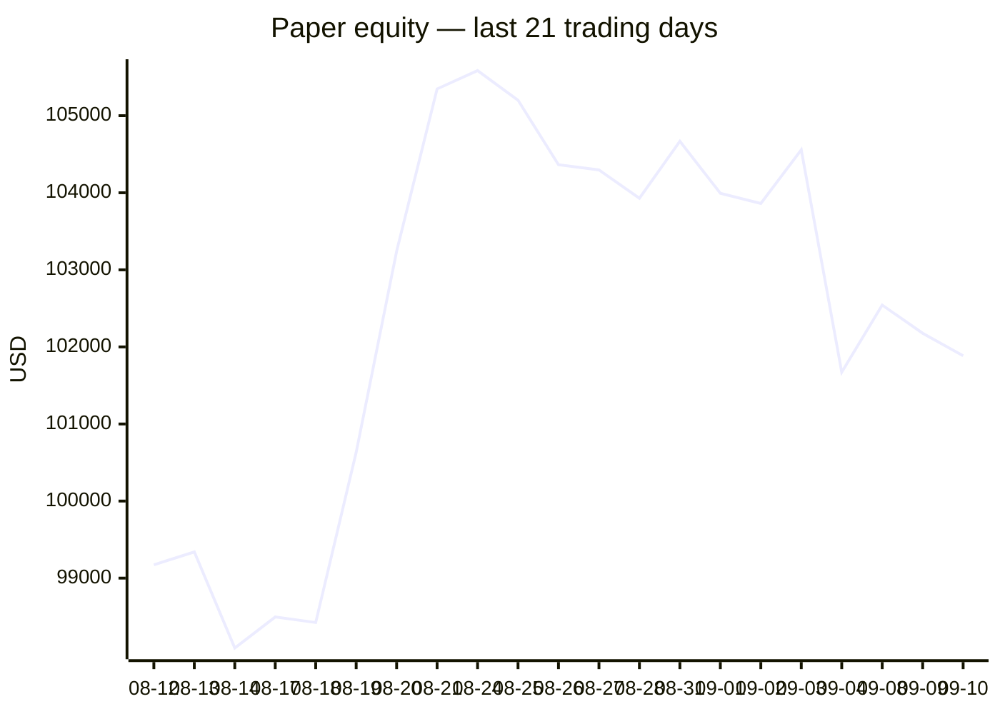
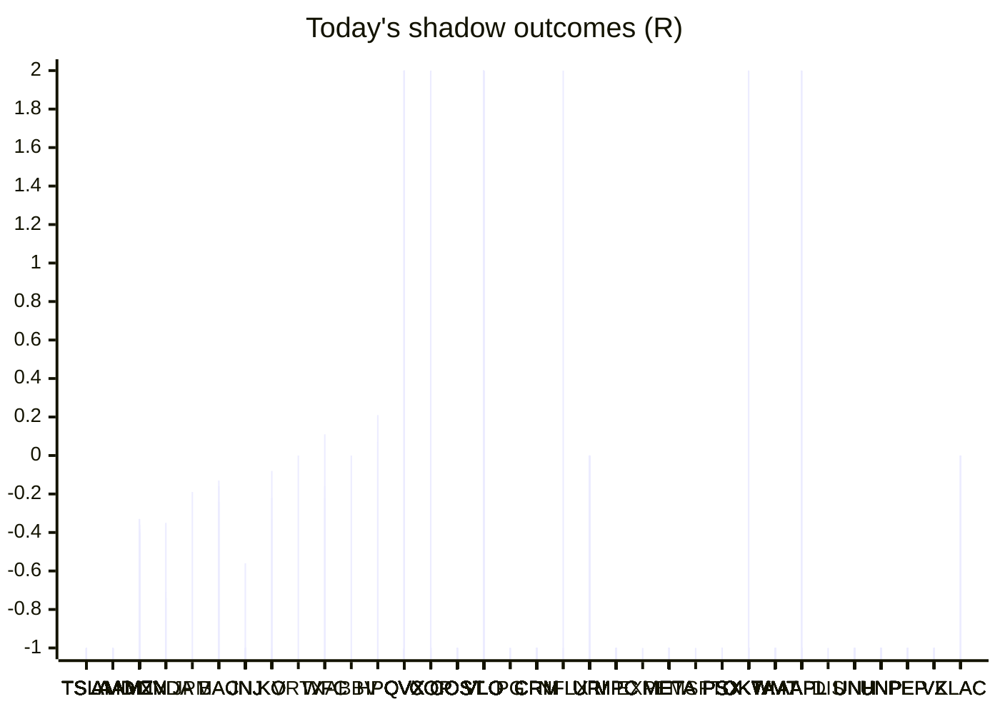

# Trading day 2026-09-10

Paper equity **$101,885** · day -0.22% · regime choppy · config v4-seeded · VIX 15.72 (down)

## Charts

## Activity

- Theses formed: 0 (approved→orders: 0, human-rejected: 0, expired unapproved: 0)
- Risk gate blocked: 0
- Fills at the broker: 0

## Shadow ledger (what would have happened)

- TSLA (momentum-breakout:filtered, filter-blocked) → **stopped** -1R
- TSLA (momentum-breakout:filtered, filter-blocked) → **stopped** -1R
- TSLA (momentum-breakout:filtered, filter-blocked) → **stopped** -1R
- TSLA (momentum-breakout:filtered, filter-blocked) → **stopped** -1R
- TSLA (momentum-breakout:filtered, filter-blocked) → **stopped** -1R
- TSLA (momentum-breakout:filtered, filter-blocked) → **stopped** -1R
- TSLA (momentum-breakout:filtered, filter-blocked) → **stopped** -1R
- TSLA (momentum-breakout:filtered, filter-blocked) → **stopped** -1R
- TSLA (momentum-breakout:filtered, filter-blocked) → **stopped** -1R
- TSLA (momentum-breakout:filtered, filter-blocked) → **stopped** -1R
- TSLA (momentum-breakout:filtered, filter-blocked) → **stopped** -1R
- TSLA (momentum-breakout:filtered, filter-blocked) → **stopped** -1R
- TSLA (momentum-breakout:filtered, filter-blocked) → **stopped** -1R
- TSLA (momentum-breakout:filtered, filter-blocked) → **stopped** -1R
- TSLA (momentum-breakout:filtered, filter-blocked) → **stopped** -1R
- TSLA (momentum-breakout:filtered, filter-blocked) → **stopped** -1R
- TSLA (momentum-breakout:filtered, filter-blocked) → **stopped** -1R
- TSLA (momentum-breakout:filtered, filter-blocked) → **stopped** -1R
- TSLA (momentum-breakout:filtered, filter-blocked) → **stopped** -1R
- AMD (momentum-breakout:filtered, filter-blocked) → **stopped** -1R
- AMD (momentum-breakout:filtered, filter-blocked) → **stopped** -1R
- AMD (momentum-breakout:filtered, filter-blocked) → **stopped** -1R
- AMD (momentum-breakout:filtered, filter-blocked) → **stopped** -1R
- AMD (momentum-breakout:filtered, filter-blocked) → **stopped** -1R
- AMD (momentum-breakout:filtered, filter-blocked) → **stopped** -1R
- AMD (momentum-breakout:filtered, filter-blocked) → **stopped** -1R
- AMD (momentum-breakout:filtered, filter-blocked) → **stopped** -1R
- AMD (momentum-breakout:filtered, filter-blocked) → **stopped** -1R
- AMD (momentum-breakout:filtered, filter-blocked) → **stopped** -1R
- AMD (momentum-breakout:filtered, filter-blocked) → **stopped** -1R
- AMD (momentum-breakout:filtered, filter-blocked) → **stopped** -1R
- AMD (momentum-breakout:filtered, filter-blocked) → **stopped** -1R
- AMD (momentum-breakout:filtered, filter-blocked) → **stopped** -1R
- AMD (momentum-breakout:filtered, filter-blocked) → **stopped** -1R
- AMD (momentum-breakout:filtered, filter-blocked) → **stopped** -1R
- AMD (momentum-breakout:filtered, filter-blocked) → **stopped** -1R
- AMD (momentum-breakout:filtered, filter-blocked) → **stopped** -1R
- AMZN (pullback-trend:filtered, filter-blocked) → **timeout** -0.46R
- NVDA (pullback-trend, incubation) → **timeout** -0.35R
- JPM (pullback-trend, incubation) → **timeout** -0.19R
- BAC (pullback-trend, incubation) → **timeout** -0.13R
- JNJ (pullback-trend, incubation) → **timeout** -0.56R
- KO (pullback-trend, incubation) → **timeout** -0.08R
- VRTX (pullback-trend, incubation) → **timeout** +0R
- WFC (pullback-trend, incubation) → **timeout** +0.11R
- ABBV (pullback-trend, incubation) → **timeout** +0R
- HPQ (pullback-trend, incubation) → **timeout** +0.21R
- CVX (momentum-breakout:filtered, filter-blocked) → **target** +2R
- CVX (momentum-breakout:filtered, filter-blocked) → **target** +2R
- CVX (momentum-breakout:filtered, filter-blocked) → **target** +2R
- CVX (momentum-breakout:filtered, filter-blocked) → **target** +2R
- CVX (momentum-breakout:filtered, filter-blocked) → **target** +2R
- COP (momentum-breakout:filtered, filter-blocked) → **target** +2R
- COST (momentum-breakdown, incubation) → **stopped** -1R
- VLO (momentum-breakout:filtered, filter-blocked) → **target** +2R
- VLO (momentum-breakout:filtered, filter-blocked) → **target** +2R
- VLO (momentum-breakout:filtered, filter-blocked) → **target** +2R
- VLO (momentum-breakout:filtered, filter-blocked) → **target** +2R
- VLO (momentum-breakout:filtered, filter-blocked) → **target** +2R
- VLO (momentum-breakout:filtered, filter-blocked) → **target** +2R
- VLO (momentum-breakout:filtered, filter-blocked) → **target** +2R
- VLO (momentum-breakout:filtered, filter-blocked) → **target** +2R
- VLO (momentum-breakout:filtered, filter-blocked) → **target** +2R
- CVX (momentum-breakout:filtered, filter-blocked) → **target** +2R
- VLO (momentum-breakout:filtered, filter-blocked) → **target** +2R
- CVX (momentum-breakout:filtered, filter-blocked) → **target** +2R
- VLO (momentum-breakout:filtered, filter-blocked) → **target** +2R
- VLO (momentum-breakout:filtered, filter-blocked) → **target** +2R
- CVX (momentum-breakout:filtered, filter-blocked) → **target** +2R
- VLO (momentum-breakout:filtered, filter-blocked) → **target** +2R
- CVX (momentum-breakout:filtered, filter-blocked) → **target** +2R
- VLO (momentum-breakout:filtered, filter-blocked) → **target** +2R
- VLO (momentum-breakout:filtered, filter-blocked) → **target** +2R
- VLO (momentum-breakout:filtered, filter-blocked) → **target** +2R
- CVX (momentum-breakout:filtered, filter-blocked) → **target** +2R
- KO (momentum-breakdown, incubation) → **stopped** -1R
- CVX (momentum-breakout:filtered, filter-blocked) → **target** +2R
- CVX (momentum-breakout:filtered, filter-blocked) → **target** +2R
- PG (momentum-breakdown, incubation) → **stopped** -1R
- CRM (momentum-breakdown:filtered, filter-blocked) → **stopped** -1R
- AMZN (pullback-trend:filtered, filter-blocked) → **timeout** -0.48R
- NFLX (momentum-breakdown, incubation) → **target** +2R
- CRM (momentum-breakdown:filtered, filter-blocked) → **stopped** -1R
- AMZN (pullback-trend:filtered, filter-blocked) → **timeout** -0.43R
- VLO (momentum-breakout:filtered, filter-blocked) → **stopped** -1R
- VLO (momentum-breakout:filtered, filter-blocked) → **stopped** -1R
- VLO (momentum-breakout:filtered, filter-blocked) → **stopped** -1R
- VLO (momentum-breakout:filtered, filter-blocked) → **stopped** -1R
- VLO (momentum-breakout:filtered, filter-blocked) → **stopped** -1R
- VLO (momentum-breakout:filtered, filter-blocked) → **stopped** -1R
- VLO (momentum-breakout:filtered, filter-blocked) → **stopped** -1R
- VLO (momentum-breakout:filtered, filter-blocked) → **stopped** -1R
- VLO (momentum-breakout:filtered, filter-blocked) → **stopped** -1R
- AMZN (pullback-trend:filtered, filter-blocked) → **timeout** -0.33R
- AMZN (pullback-trend:filtered, filter-blocked) → **timeout** -0.36R
- AMZN (pullback-trend:filtered, filter-blocked) → **timeout** -0.36R
- AMZN (pullback-trend:filtered, filter-blocked) → **timeout** -0.38R
- AMZN (pullback-trend:filtered, filter-blocked) → **timeout** -0.36R
- AMZN (pullback-trend:filtered, filter-blocked) → **timeout** -0.33R
- AMZN (pullback-trend:filtered, filter-blocked) → **timeout** -0.33R
- URI (mean-reversion:filtered, filter-blocked) → **timeout** +0R
- AMZN (pullback-trend, incubation) → **timeout** -0.77R
- URI (mean-reversion:filtered, filter-blocked) → **timeout** +0R
- URI (mean-reversion:filtered, filter-blocked) → **timeout** +0R
- URI (mean-reversion:filtered, filter-blocked) → **timeout** +0R
- URI (mean-reversion:filtered, filter-blocked) → **timeout** +0R
- CRM (momentum-breakdown:filtered, filter-blocked) → **stopped** -1R
- CRM (momentum-breakdown:filtered, filter-blocked) → **stopped** -1R
- CRM (momentum-breakdown:filtered, filter-blocked) → **stopped** -1R
- CRM (momentum-breakdown:filtered, filter-blocked) → **stopped** -1R
- URI (mean-reversion:filtered, filter-blocked) → **timeout** +0R
- CRM (momentum-breakdown:filtered, filter-blocked) → **stopped** -1R
- CRM (momentum-breakdown:filtered, filter-blocked) → **stopped** -1R
- CRM (momentum-breakdown:filtered, filter-blocked) → **stopped** -1R
- CRM (momentum-breakdown:filtered, filter-blocked) → **stopped** -1R
- CRM (momentum-breakdown:filtered, filter-blocked) → **stopped** -1R
- CRM (momentum-breakdown:filtered, filter-blocked) → **stopped** -1R
- CRM (momentum-breakdown:filtered, filter-blocked) → **stopped** -1R
- CRM (momentum-breakdown:filtered, filter-blocked) → **stopped** -1R
- CRM (momentum-breakdown:filtered, filter-blocked) → **stopped** -1R
- CRM (momentum-breakdown:filtered, filter-blocked) → **stopped** -1R
- TSLA (momentum-breakdown:filtered, filter-blocked) → **stopped** -1R
- KO (momentum-breakdown, incubation) → **stopped** -1R
- TSLA (momentum-breakdown:filtered, filter-blocked) → **stopped** -1R
- MPC (momentum-breakout:filtered, filter-blocked) → **stopped** -1R
- EXPE (momentum-breakdown, incubation) → **stopped** -1R
- TSLA (momentum-breakdown:filtered, filter-blocked) → **stopped** -1R
- MPC (momentum-breakout:filtered, filter-blocked) → **stopped** -1R
- META (momentum-breakout:filtered, filter-blocked) → **stopped** -1R
- TSLA (momentum-breakdown:filtered, filter-blocked) → **stopped** -1R
- CRM (momentum-breakdown:filtered, filter-blocked) → **stopped** -1R
- META (momentum-breakout:filtered, filter-blocked) → **stopped** -1R
- TSLA (momentum-breakdown:filtered, filter-blocked) → **stopped** -1R
- CRM (momentum-breakdown:filtered, filter-blocked) → **stopped** -1R
- META (momentum-breakout:filtered, filter-blocked) → **stopped** -1R
- TSLA (momentum-breakdown:filtered, filter-blocked) → **stopped** -1R
- TSLA (momentum-breakdown:filtered, filter-blocked) → **stopped** -1R
- CRM (momentum-breakdown:filtered, filter-blocked) → **stopped** -1R
- META (momentum-breakout:filtered, filter-blocked) → **stopped** -1R
- META (momentum-breakout:filtered, filter-blocked) → **stopped** -1R
- META (momentum-breakout:filtered, filter-blocked) → **stopped** -1R
- URI (mean-reversion:filtered, filter-blocked) → **timeout** +0R
- CRM (momentum-breakdown:filtered, filter-blocked) → **stopped** -1R
- AMZN (momentum-breakdown, incubation) → **stopped** -1R
- CVX (momentum-breakout:filtered, filter-blocked) → **stopped** -1R
- MSFT (momentum-breakdown, incubation) → **stopped** -1R
- CVX (momentum-breakout:filtered, filter-blocked) → **stopped** -1R
- CVX (momentum-breakout:filtered, filter-blocked) → **stopped** -1R
- JNJ (momentum-breakout:filtered, filter-blocked) → **stopped** -1R
- CVX (momentum-breakout:filtered, filter-blocked) → **stopped** -1R
- CVX (momentum-breakout:filtered, filter-blocked) → **stopped** -1R
- CVX (momentum-breakout:filtered, filter-blocked) → **stopped** -1R
- URI (mean-reversion:filtered, filter-blocked) → **timeout** +0R
- META (momentum-breakout:filtered, filter-blocked) → **stopped** -1R
- VLO (momentum-breakout:filtered, filter-blocked) → **stopped** -1R
- PSX (momentum-breakout:filtered, filter-blocked) → **stopped** -1R
- PSX (momentum-breakout:filtered, filter-blocked) → **stopped** -1R
- PSX (momentum-breakout:filtered, filter-blocked) → **stopped** -1R
- PSX (momentum-breakout:filtered, filter-blocked) → **stopped** -1R
- PSX (momentum-breakout:filtered, filter-blocked) → **stopped** -1R
- MPC (momentum-breakout:filtered, filter-blocked) → **stopped** -1R
- URI (mean-reversion:filtered, filter-blocked) → **timeout** +0R
- OKTA (momentum-breakout:filtered, filter-blocked) → **target** +2R
- COST (momentum-breakout:filtered, filter-blocked) → **stopped** -1R
- COST (momentum-breakout:filtered, filter-blocked) → **stopped** -1R
- COST (momentum-breakout:filtered, filter-blocked) → **stopped** -1R
- COST (momentum-breakout:filtered, filter-blocked) → **stopped** -1R
- URI (mean-reversion:filtered, filter-blocked) → **timeout** +0R
- META (momentum-breakout:filtered, filter-blocked) → **stopped** -1R
- META (momentum-breakout:filtered, filter-blocked) → **stopped** -1R
- META (momentum-breakout:filtered, filter-blocked) → **stopped** -1R
- CRM (momentum-breakdown:filtered, filter-blocked) → **stopped** -1R
- CRM (momentum-breakdown:filtered, filter-blocked) → **stopped** -1R
- CRM (momentum-breakdown:filtered, filter-blocked) → **stopped** -1R
- CRM (momentum-breakdown:filtered, filter-blocked) → **stopped** -1R
- CRM (momentum-breakdown:filtered, filter-blocked) → **stopped** -1R
- CRM (momentum-breakdown:filtered, filter-blocked) → **stopped** -1R
- CRM (momentum-breakdown:filtered, filter-blocked) → **stopped** -1R
- CRM (momentum-breakdown:filtered, filter-blocked) → **stopped** -1R
- CRM (momentum-breakdown:filtered, filter-blocked) → **stopped** -1R
- CRM (momentum-breakdown:filtered, filter-blocked) → **stopped** -1R
- CRM (momentum-breakdown:filtered, filter-blocked) → **stopped** -1R
- CVX (momentum-breakout:filtered, filter-blocked) → **stopped** -1R
- PSX (momentum-breakout:filtered, filter-blocked) → **stopped** -1R
- PSX (momentum-breakout:filtered, filter-blocked) → **stopped** -1R
- URI (mean-reversion:filtered, filter-blocked) → **timeout** +0R
- CVX (momentum-breakout:filtered, filter-blocked) → **stopped** -1R
- CVX (momentum-breakout:filtered, filter-blocked) → **stopped** -1R
- CVX (momentum-breakout:filtered, filter-blocked) → **stopped** -1R
- VLO (momentum-breakout:filtered, filter-blocked) → **stopped** -1R
- CVX (momentum-breakout:filtered, filter-blocked) → **stopped** -1R
- VLO (momentum-breakout:filtered, filter-blocked) → **stopped** -1R
- VLO (momentum-breakout:filtered, filter-blocked) → **stopped** -1R
- URI (mean-reversion:filtered, filter-blocked) → **timeout** +0R
- URI (mean-reversion:filtered, filter-blocked) → **timeout** +0R
- VLO (momentum-breakout:filtered, filter-blocked) → **stopped** -1R
- URI (mean-reversion:filtered, filter-blocked) → **timeout** +0R
- PSX (momentum-breakout:filtered, filter-blocked) → **stopped** -1R
- PSX (momentum-breakout:filtered, filter-blocked) → **stopped** -1R
- PSX (momentum-breakout:filtered, filter-blocked) → **stopped** -1R
- PSX (momentum-breakout:filtered, filter-blocked) → **stopped** -1R
- VLO (momentum-breakout:filtered, filter-blocked) → **stopped** -1R
- VLO (momentum-breakout:filtered, filter-blocked) → **stopped** -1R
- JNJ (momentum-breakout:filtered, filter-blocked) → **stopped** -1R
- JNJ (momentum-breakout:filtered, filter-blocked) → **stopped** -1R
- JNJ (momentum-breakout:filtered, filter-blocked) → **stopped** -1R
- CVX (momentum-breakout:filtered, filter-blocked) → **stopped** -1R
- VLO (momentum-breakout:filtered, filter-blocked) → **stopped** -1R
- PSX (momentum-breakout:filtered, filter-blocked) → **stopped** -1R
- URI (mean-reversion:filtered, filter-blocked) → **timeout** +0R
- WMT (momentum-breakout:filtered, filter-blocked) → **stopped** -1R
- WMT (momentum-breakout:filtered, filter-blocked) → **stopped** -1R
- WMT (momentum-breakout:filtered, filter-blocked) → **stopped** -1R
- WMT (momentum-breakout:filtered, filter-blocked) → **stopped** -1R
- AAPL (momentum-breakout:filtered, filter-blocked) → **stopped** -1R
- WMT (momentum-breakout:filtered, filter-blocked) → **stopped** -1R
- WMT (momentum-breakout:filtered, filter-blocked) → **stopped** -1R
- WMT (momentum-breakout:filtered, filter-blocked) → **stopped** -1R
- URI (mean-reversion:filtered, filter-blocked) → **timeout** +0R
- AAPL (momentum-breakout:filtered, filter-blocked) → **stopped** -1R
- WMT (momentum-breakout:filtered, filter-blocked) → **stopped** -1R
- WMT (momentum-breakout:filtered, filter-blocked) → **stopped** -1R
- URI (mean-reversion:filtered, filter-blocked) → **timeout** +0R
- AAPL (momentum-breakout:filtered, filter-blocked) → **stopped** -1R
- JNJ (momentum-breakout:filtered, filter-blocked) → **stopped** -1R
- COST (momentum-breakout:filtered, filter-blocked) → **stopped** -1R
- COST (momentum-breakout:filtered, filter-blocked) → **stopped** -1R
- URI (mean-reversion:filtered, filter-blocked) → **timeout** +0R
- JNJ (momentum-breakout:filtered, filter-blocked) → **stopped** -1R
- NFLX (momentum-breakdown, incubation) → **stopped** -1R
- JNJ (momentum-breakout:filtered, filter-blocked) → **stopped** -1R
- URI (mean-reversion:filtered, filter-blocked) → **timeout** +0R
- URI (mean-reversion:filtered, filter-blocked) → **timeout** +0R
- CVX (momentum-breakout:filtered, filter-blocked) → **stopped** -1R
- URI (mean-reversion:filtered, filter-blocked) → **timeout** +0R
- DIS (momentum-breakdown, incubation) → **stopped** -1R
- JNJ (momentum-breakout:filtered, filter-blocked) → **stopped** -1R
- COST (momentum-breakout:filtered, filter-blocked) → **stopped** -1R
- COST (momentum-breakout:filtered, filter-blocked) → **stopped** -1R
- JNJ (momentum-breakout:filtered, filter-blocked) → **stopped** -1R
- COST (momentum-breakout:filtered, filter-blocked) → **stopped** -1R
- COST (momentum-breakout:filtered, filter-blocked) → **stopped** -1R
- WMT (momentum-breakout:filtered, filter-blocked) → **stopped** -1R
- COST (momentum-breakout:filtered, filter-blocked) → **stopped** -1R
- COST (momentum-breakout:filtered, filter-blocked) → **stopped** -1R
- COST (momentum-breakout:filtered, filter-blocked) → **stopped** -1R
- COST (momentum-breakout:filtered, filter-blocked) → **stopped** -1R
- COST (momentum-breakout:filtered, filter-blocked) → **stopped** -1R
- COST (momentum-breakout:filtered, filter-blocked) → **stopped** -1R
- COP (momentum-breakout:filtered, filter-blocked) → **stopped** -1R
- COP (momentum-breakout:filtered, filter-blocked) → **stopped** -1R
- COP (momentum-breakout:filtered, filter-blocked) → **stopped** -1R
- COP (momentum-breakout:filtered, filter-blocked) → **stopped** -1R
- COP (momentum-breakout:filtered, filter-blocked) → **stopped** -1R
- COP (momentum-breakout:filtered, filter-blocked) → **stopped** -1R
- UNH (momentum-breakout:filtered, filter-blocked) → **stopped** -1R
- UNH (momentum-breakout:filtered, filter-blocked) → **stopped** -1R
- URI (mean-reversion:filtered, filter-blocked) → **timeout** +0R
- URI (mean-reversion:filtered, filter-blocked) → **timeout** +0R
- URI (mean-reversion:filtered, filter-blocked) → **timeout** +0R
- URI (mean-reversion:filtered, filter-blocked) → **timeout** +0R
- URI (mean-reversion:filtered, filter-blocked) → **timeout** +0R
- URI (mean-reversion:filtered, filter-blocked) → **timeout** +0R
- URI (mean-reversion:filtered, filter-blocked) → **timeout** +0R
- URI (mean-reversion:filtered, filter-blocked) → **timeout** +0R
- URI (mean-reversion:filtered, filter-blocked) → **timeout** +0R
- META (momentum-breakdown:filtered, filter-blocked) → **stopped** -1R
- META (momentum-breakdown:filtered, filter-blocked) → **stopped** -1R
- URI (mean-reversion:filtered, filter-blocked) → **timeout** +0R
- OKTA (momentum-breakout:filtered, filter-blocked) → **target** +2R
- META (momentum-breakdown:filtered, filter-blocked) → **stopped** -1R
- META (momentum-breakdown:filtered, filter-blocked) → **stopped** -1R
- META (momentum-breakdown:filtered, filter-blocked) → **stopped** -1R
- META (momentum-breakdown:filtered, filter-blocked) → **stopped** -1R
- META (momentum-breakdown:filtered, filter-blocked) → **stopped** -1R
- META (momentum-breakdown:filtered, filter-blocked) → **stopped** -1R
- META (momentum-breakdown:filtered, filter-blocked) → **stopped** -1R
- META (momentum-breakdown:filtered, filter-blocked) → **stopped** -1R
- META (momentum-breakdown:filtered, filter-blocked) → **stopped** -1R
- URI (mean-reversion:filtered, filter-blocked) → **timeout** +0R
- META (momentum-breakdown:filtered, filter-blocked) → **stopped** -1R
- META (momentum-breakdown:filtered, filter-blocked) → **stopped** -1R
- META (momentum-breakdown:filtered, filter-blocked) → **stopped** -1R
- URI (mean-reversion:filtered, filter-blocked) → **timeout** +0R
- URI (mean-reversion:filtered, filter-blocked) → **timeout** +0R
- URI (mean-reversion:filtered, filter-blocked) → **timeout** +0R
- VLO (momentum-breakout:filtered, filter-blocked) → **stopped** -1R
- VLO (momentum-breakout:filtered, filter-blocked) → **stopped** -1R
- VLO (momentum-breakout:filtered, filter-blocked) → **stopped** -1R
- VLO (momentum-breakout:filtered, filter-blocked) → **stopped** -1R
- URI (mean-reversion:filtered, filter-blocked) → **timeout** +0R
- URI (mean-reversion:filtered, filter-blocked) → **timeout** +0R
- COST (momentum-breakout:filtered, filter-blocked) → **stopped** -1R
- UNH (momentum-breakout:filtered, filter-blocked) → **stopped** -1R
- UNH (momentum-breakout:filtered, filter-blocked) → **stopped** -1R
- URI (mean-reversion:filtered, filter-blocked) → **timeout** +0R
- UNH (momentum-breakout:filtered, filter-blocked) → **stopped** -1R
- COST (momentum-breakout:filtered, filter-blocked) → **stopped** -1R
- UNH (momentum-breakout:filtered, filter-blocked) → **stopped** -1R
- UNH (momentum-breakout:filtered, filter-blocked) → **stopped** -1R
- UNH (momentum-breakout:filtered, filter-blocked) → **stopped** -1R
- UNH (momentum-breakout:filtered, filter-blocked) → **stopped** -1R
- UNH (momentum-breakout:filtered, filter-blocked) → **stopped** -1R
- UNH (momentum-breakout:filtered, filter-blocked) → **stopped** -1R
- URI (mean-reversion:filtered, filter-blocked) → **timeout** +0R
- UNH (momentum-breakout:filtered, filter-blocked) → **stopped** -1R
- UNH (momentum-breakout:filtered, filter-blocked) → **stopped** -1R
- URI (mean-reversion:filtered, filter-blocked) → **timeout** +0R
- URI (mean-reversion:filtered, filter-blocked) → **timeout** +0R
- URI (mean-reversion:filtered, filter-blocked) → **timeout** +0R
- UNH (momentum-breakout:filtered, filter-blocked) → **stopped** -1R
- UNH (momentum-breakout:filtered, filter-blocked) → **stopped** -1R
- URI (mean-reversion:filtered, filter-blocked) → **timeout** +0R
- URI (mean-reversion:filtered, filter-blocked) → **timeout** +0R
- VLO (momentum-breakdown:filtered, filter-blocked) → **stopped** -1R
- VLO (momentum-breakdown:filtered, filter-blocked) → **stopped** -1R
- URI (mean-reversion:filtered, filter-blocked) → **timeout** +0R
- URI (mean-reversion:filtered, filter-blocked) → **timeout** +0R
- URI (mean-reversion:filtered, filter-blocked) → **timeout** +0R
- URI (mean-reversion:filtered, filter-blocked) → **timeout** +0R
- URI (mean-reversion:filtered, filter-blocked) → **timeout** +0R
- META (momentum-breakdown:filtered, filter-blocked) → **stopped** -1R
- UNP (momentum-breakout:filtered, filter-blocked) → **stopped** -1R
- UNP (momentum-breakout:filtered, filter-blocked) → **stopped** -1R
- UNP (momentum-breakout:filtered, filter-blocked) → **stopped** -1R
- UNP (momentum-breakout:filtered, filter-blocked) → **stopped** -1R
- UNP (momentum-breakout:filtered, filter-blocked) → **stopped** -1R
- UNP (momentum-breakout:filtered, filter-blocked) → **stopped** -1R
- UNP (momentum-breakout:filtered, filter-blocked) → **stopped** -1R
- UNP (momentum-breakout:filtered, filter-blocked) → **stopped** -1R
- UNP (momentum-breakout:filtered, filter-blocked) → **stopped** -1R
- URI (mean-reversion:filtered, filter-blocked) → **timeout** +0R
- UNP (momentum-breakout:filtered, filter-blocked) → **stopped** -1R
- UNP (momentum-breakout:filtered, filter-blocked) → **stopped** -1R
- UNP (momentum-breakout:filtered, filter-blocked) → **stopped** -1R
- UNP (momentum-breakout:filtered, filter-blocked) → **stopped** -1R
- UNP (momentum-breakout:filtered, filter-blocked) → **stopped** -1R
- UNP (momentum-breakout:filtered, filter-blocked) → **stopped** -1R
- UNP (momentum-breakout:filtered, filter-blocked) → **stopped** -1R
- UNP (momentum-breakout:filtered, filter-blocked) → **stopped** -1R
- UNP (momentum-breakout:filtered, filter-blocked) → **stopped** -1R
- UNP (momentum-breakout:filtered, filter-blocked) → **stopped** -1R
- UNP (momentum-breakout:filtered, filter-blocked) → **stopped** -1R
- AMZN (pullback-trend:filtered, filter-blocked) → **timeout** -0.47R
- URI (mean-reversion:filtered, filter-blocked) → **timeout** +0R
- NVDA (pullback-trend, incubation) → **timeout** -0.71R
- BAC (pullback-trend, incubation) → **timeout** -0.24R
- KO (pullback-trend, incubation) → **timeout** -0.22R
- WFC (pullback-trend, incubation) → **timeout** -0.16R
- UNP (momentum-breakout:filtered, filter-blocked) → **stopped** -1R
- UNP (momentum-breakout:filtered, filter-blocked) → **stopped** -1R
- UNP (momentum-breakout:filtered, filter-blocked) → **stopped** -1R
- UNP (momentum-breakout:filtered, filter-blocked) → **stopped** -1R
- UNP (momentum-breakout:filtered, filter-blocked) → **stopped** -1R
- AMZN (pullback-trend:filtered, filter-blocked) → **timeout** -0.47R
- URI (mean-reversion:filtered, filter-blocked) → **timeout** +0R
- CRM (momentum-breakdown:filtered, filter-blocked) → **stopped** -1R
- CRM (momentum-breakdown:filtered, filter-blocked) → **stopped** -1R
- CRM (momentum-breakdown:filtered, filter-blocked) → **stopped** -1R
- CRM (momentum-breakdown:filtered, filter-blocked) → **stopped** -1R
- CRM (momentum-breakdown:filtered, filter-blocked) → **stopped** -1R
- CRM (momentum-breakdown:filtered, filter-blocked) → **stopped** -1R
- AMZN (pullback-trend:filtered, filter-blocked) → **timeout** -0.47R
- URI (mean-reversion:filtered, filter-blocked) → **timeout** +0R
- AMZN (pullback-trend:filtered, filter-blocked) → **timeout** -0.46R
- URI (mean-reversion:filtered, filter-blocked) → **timeout** +0R
- VLO (momentum-breakdown:filtered, filter-blocked) → **stopped** -1R
- VLO (momentum-breakdown:filtered, filter-blocked) → **stopped** -1R
- VLO (momentum-breakdown:filtered, filter-blocked) → **stopped** -1R
- VLO (momentum-breakdown:filtered, filter-blocked) → **stopped** -1R
- VLO (momentum-breakdown:filtered, filter-blocked) → **stopped** -1R
- VLO (momentum-breakdown:filtered, filter-blocked) → **stopped** -1R
- VLO (momentum-breakdown:filtered, filter-blocked) → **stopped** -1R
- VLO (momentum-breakdown:filtered, filter-blocked) → **stopped** -1R
- VLO (momentum-breakdown:filtered, filter-blocked) → **stopped** -1R
- AMZN (pullback-trend:filtered, filter-blocked) → **timeout** -0.48R
- URI (mean-reversion:filtered, filter-blocked) → **timeout** +0R
- MPC (momentum-breakdown:filtered, filter-blocked) → **stopped** -1R
- MPC (momentum-breakdown:filtered, filter-blocked) → **stopped** -1R
- MPC (momentum-breakdown:filtered, filter-blocked) → **stopped** -1R
- MPC (momentum-breakdown:filtered, filter-blocked) → **stopped** -1R
- MPC (momentum-breakdown:filtered, filter-blocked) → **stopped** -1R
- MPC (momentum-breakdown:filtered, filter-blocked) → **stopped** -1R
- MPC (momentum-breakdown:filtered, filter-blocked) → **stopped** -1R
- MPC (momentum-breakdown:filtered, filter-blocked) → **stopped** -1R
- MPC (momentum-breakdown:filtered, filter-blocked) → **stopped** -1R
- PSX (momentum-breakdown:filtered, filter-blocked) → **stopped** -1R
- MPC (momentum-breakdown:filtered, filter-blocked) → **stopped** -1R
- MPC (momentum-breakdown:filtered, filter-blocked) → **stopped** -1R
- MPC (momentum-breakdown:filtered, filter-blocked) → **stopped** -1R
- MPC (momentum-breakdown:filtered, filter-blocked) → **stopped** -1R
- MPC (momentum-breakdown:filtered, filter-blocked) → **stopped** -1R
- AMZN (pullback-trend:filtered, filter-blocked) → **timeout** -0.48R
- URI (mean-reversion:filtered, filter-blocked) → **timeout** +0R
- VLO (momentum-breakdown:filtered, filter-blocked) → **stopped** -1R
- VLO (momentum-breakdown:filtered, filter-blocked) → **stopped** -1R
- VLO (momentum-breakdown:filtered, filter-blocked) → **stopped** -1R
- PSX (momentum-breakdown:filtered, filter-blocked) → **stopped** -1R
- PSX (momentum-breakdown:filtered, filter-blocked) → **stopped** -1R
- PSX (momentum-breakdown:filtered, filter-blocked) → **stopped** -1R
- PSX (momentum-breakdown:filtered, filter-blocked) → **stopped** -1R
- VLO (momentum-breakdown:filtered, filter-blocked) → **stopped** -1R
- AMZN (pullback-trend:filtered, filter-blocked) → **timeout** -0.48R
- URI (mean-reversion:filtered, filter-blocked) → **timeout** +0R
- PEP (momentum-breakout:filtered, filter-blocked) → **stopped** -1R
- PEP (momentum-breakout:filtered, filter-blocked) → **stopped** -1R
- PEP (momentum-breakout:filtered, filter-blocked) → **stopped** -1R
- PEP (momentum-breakout:filtered, filter-blocked) → **stopped** -1R
- PEP (momentum-breakout:filtered, filter-blocked) → **stopped** -1R
- PEP (momentum-breakout:filtered, filter-blocked) → **stopped** -1R
- PEP (momentum-breakout:filtered, filter-blocked) → **stopped** -1R
- AMZN (pullback-trend:filtered, filter-blocked) → **timeout** -0.47R
- URI (mean-reversion:filtered, filter-blocked) → **timeout** +0R
- AMZN (pullback-trend:filtered, filter-blocked) → **timeout** -0.48R
- NVDA (pullback-trend, incubation) → **timeout** -0.74R
- BAC (pullback-trend, incubation) → **timeout** -0.16R
- KO (pullback-trend, incubation) → **timeout** -0.33R
- AMZN (pullback-trend:filtered, filter-blocked) → **timeout** -0.5R
- AMZN (pullback-trend:filtered, filter-blocked) → **timeout** -0.5R
- AMZN (pullback-trend:filtered, filter-blocked) → **timeout** -0.5R
- AMZN (pullback-trend:filtered, filter-blocked) → **timeout** -0.5R
- WMT (momentum-breakout:filtered, filter-blocked) → **stopped** -1R
- AMZN (pullback-trend:filtered, filter-blocked) → **timeout** -0.48R
- AMZN (pullback-trend:filtered, filter-blocked) → **timeout** -0.48R
- WMT (momentum-breakout:filtered, filter-blocked) → **stopped** -1R
- AMZN (pullback-trend:filtered, filter-blocked) → **timeout** -0.48R
- PSX (momentum-breakdown:filtered, filter-blocked) → **stopped** -1R
- PSX (momentum-breakdown:filtered, filter-blocked) → **stopped** -1R
- AMZN (pullback-trend:filtered, filter-blocked) → **timeout** -0.48R
- AMZN (pullback-trend:filtered, filter-blocked) → **timeout** -0.46R
- VZ (momentum-breakout:filtered, filter-blocked) → **stopped** -1R
- AMZN (pullback-trend:filtered, filter-blocked) → **timeout** -0.47R
- MPC (momentum-breakdown:filtered, filter-blocked) → **stopped** -1R
- MPC (momentum-breakdown:filtered, filter-blocked) → **stopped** -1R
- AMZN (pullback-trend:filtered, filter-blocked) → **timeout** -0.38R
- WFC (pullback-trend, incubation) → **timeout** -0.22R
- PSX (momentum-breakdown:filtered, filter-blocked) → **stopped** -1R
- PSX (momentum-breakdown:filtered, filter-blocked) → **stopped** -1R
- PSX (momentum-breakdown:filtered, filter-blocked) → **stopped** -1R
- PSX (momentum-breakdown:filtered, filter-blocked) → **stopped** -1R
- AMZN (pullback-trend:filtered, filter-blocked) → **timeout** -0.38R
- PSX (momentum-breakdown:filtered, filter-blocked) → **stopped** -1R
- AMZN (pullback-trend:filtered, filter-blocked) → **timeout** -0.4R
- AMZN (pullback-trend:filtered, filter-blocked) → **timeout** -0.4R
- AMZN (pullback-trend:filtered, filter-blocked) → **timeout** -0.41R
- AMZN (pullback-trend:filtered, filter-blocked) → **timeout** -0.39R
- AMZN (pullback-trend:filtered, filter-blocked) → **timeout** -0.41R
- VZ (momentum-breakout:filtered, filter-blocked) → **stopped** -1R
- VZ (momentum-breakout:filtered, filter-blocked) → **stopped** -1R
- VZ (momentum-breakout:filtered, filter-blocked) → **stopped** -1R
- VZ (momentum-breakout:filtered, filter-blocked) → **stopped** -1R
- VZ (momentum-breakout:filtered, filter-blocked) → **stopped** -1R
- AMZN (pullback-trend:filtered, filter-blocked) → **timeout** -0.41R
- AMZN (pullback-trend:filtered, filter-blocked) → **timeout** -0.41R
- AMZN (pullback-trend:filtered, filter-blocked) → **timeout** -0.41R
- OKTA (momentum-breakout:filtered, filter-blocked) → **stopped** -1R
- OKTA (momentum-breakout:filtered, filter-blocked) → **stopped** -1R
- OKTA (momentum-breakout:filtered, filter-blocked) → **stopped** -1R
- OKTA (momentum-breakout:filtered, filter-blocked) → **stopped** -1R
- AMZN (pullback-trend:filtered, filter-blocked) → **timeout** -0.51R
- HPQ (pullback-trend, incubation) → **timeout** +0.07R
- OKTA (momentum-breakout:filtered, filter-blocked) → **stopped** -1R
- AMZN (pullback-trend:filtered, filter-blocked) → **timeout** -0.5R
- WMT (momentum-breakout:filtered, filter-blocked) → **stopped** -1R
- OKTA (momentum-breakout:filtered, filter-blocked) → **stopped** -1R
- OKTA (momentum-breakout:filtered, filter-blocked) → **stopped** -1R
- OKTA (momentum-breakout:filtered, filter-blocked) → **stopped** -1R
- OKTA (momentum-breakout:filtered, filter-blocked) → **stopped** -1R
- OKTA (momentum-breakout:filtered, filter-blocked) → **stopped** -1R
- OKTA (momentum-breakout:filtered, filter-blocked) → **stopped** -1R
- AMZN (pullback-trend:filtered, filter-blocked) → **timeout** -0.5R
- AMZN (pullback-trend:filtered, filter-blocked) → **timeout** -0.51R
- AMZN (pullback-trend:filtered, filter-blocked) → **timeout** -0.49R
- AMZN (pullback-trend:filtered, filter-blocked) → **timeout** -0.5R
- AMZN (pullback-trend:filtered, filter-blocked) → **timeout** -0.51R
- OKTA (momentum-breakout:filtered, filter-blocked) → **stopped** -1R
- AMZN (pullback-trend:filtered, filter-blocked) → **timeout** -0.49R
- AMZN (momentum-breakdown, incubation) → **stopped** -1R
- AMZN (pullback-trend:filtered, filter-blocked) → **timeout** -0.49R
- AMZN (pullback-trend:filtered, filter-blocked) → **timeout** -0.5R
- AMZN (pullback-trend:filtered, filter-blocked) → **timeout** -0.51R
- AMZN (pullback-trend:filtered, filter-blocked) → **timeout** -0.56R
- OKTA (momentum-breakout:filtered, filter-blocked) → **stopped** -1R
- OKTA (momentum-breakout:filtered, filter-blocked) → **stopped** -1R
- AMZN (pullback-trend:filtered, filter-blocked) → **timeout** -0.55R
- OKTA (momentum-breakout:filtered, filter-blocked) → **stopped** -1R
- OKTA (momentum-breakout:filtered, filter-blocked) → **stopped** -1R
- OKTA (momentum-breakout:filtered, filter-blocked) → **stopped** -1R
- OKTA (momentum-breakout:filtered, filter-blocked) → **stopped** -1R
- AMZN (pullback-trend:filtered, filter-blocked) → **timeout** -0.53R
- PSX (momentum-breakdown:filtered, filter-blocked) → **stopped** -1R
- PSX (momentum-breakdown:filtered, filter-blocked) → **stopped** -1R
- AMZN (pullback-trend:filtered, filter-blocked) → **timeout** -0.53R
- AMZN (pullback-trend:filtered, filter-blocked) → **timeout** -0.55R
- PSX (momentum-breakdown:filtered, filter-blocked) → **stopped** -1R
- PSX (momentum-breakdown:filtered, filter-blocked) → **stopped** -1R
- AMZN (pullback-trend:filtered, filter-blocked) → **timeout** -0.57R
- CVX (momentum-breakdown:filtered, filter-blocked) → **stopped** -1R
- CVX (momentum-breakdown:filtered, filter-blocked) → **stopped** -1R
- AMZN (pullback-trend:filtered, filter-blocked) → **timeout** -0.57R
- AMZN (pullback-trend:filtered, filter-blocked) → **timeout** -0.57R
- AMZN (pullback-trend:filtered, filter-blocked) → **timeout** -0.58R
- KLAC (momentum-breakout:filtered, filter-blocked) → **timeout** +0R
- MPC (momentum-breakdown:filtered, filter-blocked) → **stopped** -1R
- MPC (momentum-breakdown:filtered, filter-blocked) → **stopped** -1R
- MPC (momentum-breakdown:filtered, filter-blocked) → **stopped** -1R
- MPC (momentum-breakdown:filtered, filter-blocked) → **stopped** -1R
- MPC (momentum-breakdown:filtered, filter-blocked) → **stopped** -1R
- AMZN (pullback-trend:filtered, filter-blocked) → **timeout** -0.57R
- AMZN (pullback-trend, incubation) → **timeout** -0.62R
- WMT (momentum-breakout:filtered, filter-blocked) → **stopped** -1R
- CVX (momentum-breakdown:filtered, filter-blocked) → **stopped** -1R
- UNP (momentum-breakout:filtered, filter-blocked) → **stopped** -1R
- UNP (momentum-breakout:filtered, filter-blocked) → **stopped** -1R
- UNP (momentum-breakout:filtered, filter-blocked) → **stopped** -1R
- UNP (momentum-breakout:filtered, filter-blocked) → **stopped** -1R
- UNP (momentum-breakout:filtered, filter-blocked) → **stopped** -1R
- CVX (momentum-breakdown:filtered, filter-blocked) → **stopped** -1R
- AAPL (momentum-breakout:filtered, filter-blocked) → **stopped** -1R
- AAPL (momentum-breakout:filtered, filter-blocked) → **stopped** -1R
- AAPL (momentum-breakout:filtered, filter-blocked) → **stopped** -1R
- AAPL (momentum-breakout:filtered, filter-blocked) → **stopped** -1R
- AAPL (momentum-breakout:filtered, filter-blocked) → **stopped** -1R
- CVX (momentum-breakdown:filtered, filter-blocked) → **stopped** -1R
- CVX (momentum-breakdown:filtered, filter-blocked) → **stopped** -1R
- CVX (momentum-breakdown:filtered, filter-blocked) → **stopped** -1R
- CVX (momentum-breakdown:filtered, filter-blocked) → **stopped** -1R
- CVX (momentum-breakdown:filtered, filter-blocked) → **stopped** -1R
- CVX (momentum-breakdown:filtered, filter-blocked) → **stopped** -1R
- CVX (momentum-breakdown:filtered, filter-blocked) → **stopped** -1R
- CVX (momentum-breakdown:filtered, filter-blocked) → **stopped** -1R
- AAPL (momentum-breakout:filtered, filter-blocked) → **stopped** -1R
- CVX (momentum-breakdown:filtered, filter-blocked) → **stopped** -1R
- AAPL (momentum-breakout:filtered, filter-blocked) → **stopped** -1R
- AAPL (momentum-breakout:filtered, filter-blocked) → **stopped** -1R
- AAPL (momentum-breakout:filtered, filter-blocked) → **stopped** -1R
- OKTA (momentum-breakout:filtered, filter-blocked) → **stopped** -1R
- OKTA (momentum-breakout:filtered, filter-blocked) → **stopped** -1R
- OKTA (momentum-breakout:filtered, filter-blocked) → **stopped** -1R
- OKTA (momentum-breakout:filtered, filter-blocked) → **stopped** -1R
- VLO (momentum-breakout:filtered, filter-blocked) → **stopped** -1R
- OKTA (momentum-breakout:filtered, filter-blocked) → **stopped** -1R
- OKTA (momentum-breakout:filtered, filter-blocked) → **stopped** -1R
- OKTA (momentum-breakout:filtered, filter-blocked) → **stopped** -1R
- OKTA (momentum-breakout:filtered, filter-blocked) → **stopped** -1R
- OKTA (momentum-breakout:filtered, filter-blocked) → **stopped** -1R
- OKTA (momentum-breakout:filtered, filter-blocked) → **stopped** -1R
- CVX (momentum-breakdown:filtered, filter-blocked) → **stopped** -1R
- CVX (momentum-breakdown:filtered, filter-blocked) → **stopped** -1R
- CVX (momentum-breakdown:filtered, filter-blocked) → **stopped** -1R
- CVX (momentum-breakdown:filtered, filter-blocked) → **stopped** -1R
- CVX (momentum-breakdown:filtered, filter-blocked) → **stopped** -1R
- OKTA (momentum-breakout:filtered, filter-blocked) → **stopped** -1R
- PG (momentum-breakdown, incubation) → **stopped** -1R
- WMT (momentum-breakout:filtered, filter-blocked) → **stopped** -1R
- AAPL (momentum-breakout:filtered, filter-blocked) → **target** +2R
- META (momentum-breakout:filtered, filter-blocked) → **stopped** -1R
- KLAC (momentum-breakout:filtered, filter-blocked) → **timeout** +0R
- AAPL (momentum-breakout:filtered, filter-blocked) → **target** +2R
- AAPL (momentum-breakout:filtered, filter-blocked) → **target** +2R
- COST (momentum-breakdown, incubation) → **stopped** -1R
- KLAC (momentum-breakout:filtered, filter-blocked) → **timeout** +0R
- KLAC (momentum-breakout:filtered, filter-blocked) → **timeout** +0R

Day total: **-349.11R**

## Running shadow record

Resolved 38 ideas · win rate 13% · total -17.09R · avg -0.45R · still tracking 241

## Is the desk earning its keep?

Shadow-outcome R by the desk verdict each idea carried (vetoed/expired ideas only — executed trades don't resolve to an R-outcome yet):

| Verdict | Ideas | Win rate | Avg R |
|---|---|---|---|
| proceed | 0 | —% | — |
| caution | 0 | —% | — |
| avoid | 0 | —% | — |
| none | 38 | 13% | -0.45 |

*Only 0 scored ideas so far — a preview, not a verdict on the AI yet.*

## Incubation ward

- **pullback-trend** — incubating: 20/25 shadow outcomes
- **crypto-mean-reversion** — incubating: 0/25 shadow outcomes
- **cfd-mean-reversion** — incubating: 0/25 shadow outcomes
- **cfd-opening-range** — incubating: 0/25 shadow outcomes
- **equity-opening-range** — incubating: 0/25 shadow outcomes
- **cfd-pair-reversion** — incubating: 0/25 shadow outcomes
- **momentum-breakdown** — incubating: 17/25 shadow outcomes
- **mean-reversion-short** — incubating: 0/25 shadow outcomes

*Incubating strategies shadow-track every signal but never execute. Graduation is mechanical: 25+ outcomes, avg ≥ +0.10R, wins ≥ 40%.*

*Generated by code, no AI. Paper account only.*
