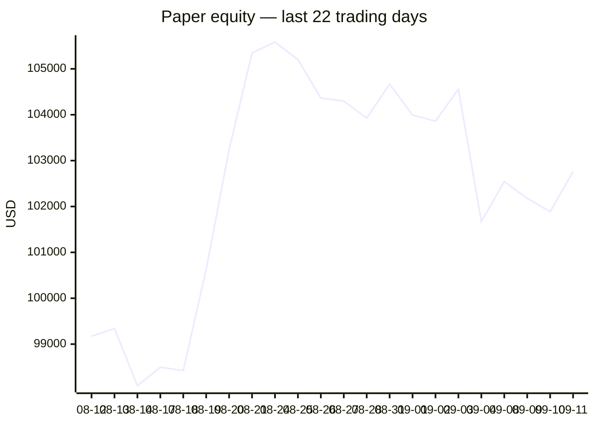
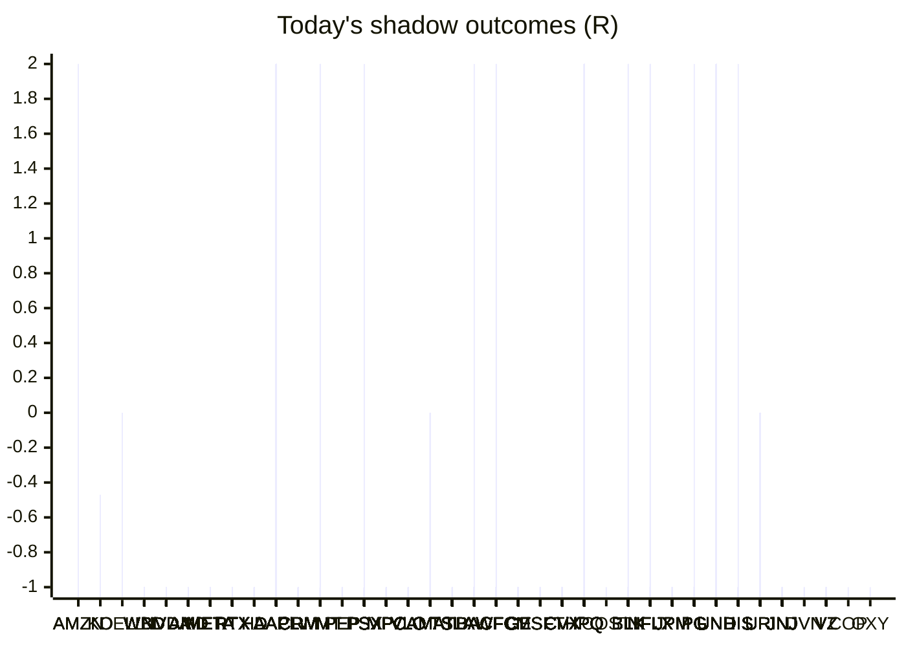

# Trading day 2026-09-11

Paper equity **$102,760** · day +0.93% · regime choppy · config v4-seeded

## Charts

## Activity

- Theses formed: 0 (approved→orders: 0, human-rejected: 0, expired unapproved: 0)
- Risk gate blocked: 0
- Fills at the broker: 0

## Shadow ledger (what would have happened)

- AMZN (pullback-trend, incubation) → **timeout** -0.48R
- KO (pullback-trend, incubation) → **timeout** -0.47R
- DELL (pullback-trend, incubation) → **timeout** +0R
- WBD (momentum-breakdown, incubation) → **stopped** -1R
- NVDA (momentum-breakdown:filtered, filter-blocked) → **stopped** -1R
- NVDA (momentum-breakdown:filtered, filter-blocked) → **stopped** -1R
- NVDA (momentum-breakdown:filtered, filter-blocked) → **stopped** -1R
- NVDA (momentum-breakdown:filtered, filter-blocked) → **stopped** -1R
- NVDA (momentum-breakdown:filtered, filter-blocked) → **stopped** -1R
- NVDA (momentum-breakdown:filtered, filter-blocked) → **stopped** -1R
- NVDA (momentum-breakdown:filtered, filter-blocked) → **stopped** -1R
- NVDA (momentum-breakdown:filtered, filter-blocked) → **stopped** -1R
- NVDA (momentum-breakdown, incubation) → **stopped** -1R
- AMD (momentum-breakdown:filtered, filter-blocked) → **stopped** -1R
- AMD (momentum-breakdown:filtered, filter-blocked) → **stopped** -1R
- AMD (momentum-breakdown:filtered, filter-blocked) → **stopped** -1R
- AMD (momentum-breakdown:filtered, filter-blocked) → **stopped** -1R
- AMD (momentum-breakdown:filtered, filter-blocked) → **stopped** -1R
- AMD (momentum-breakdown:filtered, filter-blocked) → **stopped** -1R
- AMD (momentum-breakdown:filtered, filter-blocked) → **stopped** -1R
- AMD (momentum-breakdown:filtered, filter-blocked) → **stopped** -1R
- AMD (momentum-breakdown:filtered, filter-blocked) → **stopped** -1R
- META (momentum-breakdown:filtered, filter-blocked) → **stopped** -1R
- META (momentum-breakdown:filtered, filter-blocked) → **stopped** -1R
- META (momentum-breakdown:filtered, filter-blocked) → **stopped** -1R
- META (momentum-breakdown:filtered, filter-blocked) → **stopped** -1R
- META (momentum-breakdown:filtered, filter-blocked) → **stopped** -1R
- META (momentum-breakdown:filtered, filter-blocked) → **stopped** -1R
- META (momentum-breakdown:filtered, filter-blocked) → **stopped** -1R
- META (momentum-breakdown:filtered, filter-blocked) → **stopped** -1R
- META (momentum-breakdown:filtered, filter-blocked) → **stopped** -1R
- META (momentum-breakdown:filtered, filter-blocked) → **stopped** -1R
- META (momentum-breakdown:filtered, filter-blocked) → **stopped** -1R
- META (momentum-breakdown:filtered, filter-blocked) → **stopped** -1R
- AMD (momentum-breakdown:filtered, filter-blocked) → **stopped** -1R
- META (momentum-breakdown:filtered, filter-blocked) → **stopped** -1R
- RTX (momentum-breakdown, incubation) → **stopped** -1R
- RTX (momentum-breakdown, incubation) → **stopped** -1R
- HD (momentum-breakdown, incubation) → **stopped** -1R
- AAPL (momentum-breakout:filtered, filter-blocked) → **target** +2R
- AAPL (momentum-breakout:filtered, filter-blocked) → **target** +2R
- AAPL (momentum-breakout:filtered, filter-blocked) → **target** +2R
- AAPL (momentum-breakout:filtered, filter-blocked) → **target** +2R
- AAPL (momentum-breakout:filtered, filter-blocked) → **target** +2R
- CRM (momentum-breakdown:filtered, filter-blocked) → **stopped** -1R
- CRM (momentum-breakdown:filtered, filter-blocked) → **stopped** -1R
- CRM (momentum-breakdown:filtered, filter-blocked) → **stopped** -1R
- CRM (momentum-breakdown:filtered, filter-blocked) → **stopped** -1R
- CRM (momentum-breakdown:filtered, filter-blocked) → **stopped** -1R
- CRM (momentum-breakdown:filtered, filter-blocked) → **stopped** -1R
- CRM (momentum-breakdown:filtered, filter-blocked) → **stopped** -1R
- CRM (momentum-breakdown:filtered, filter-blocked) → **stopped** -1R
- CRM (momentum-breakdown:filtered, filter-blocked) → **stopped** -1R
- WMT (momentum-breakdown, incubation) → **stopped** -1R
- PEP (momentum-breakdown, incubation) → **stopped** -1R
- PSX (momentum-breakdown:filtered, filter-blocked) → **stopped** -1R
- MPC (momentum-breakdown:filtered, filter-blocked) → **stopped** -1R
- PSX (momentum-breakdown:filtered, filter-blocked) → **stopped** -1R
- MPC (momentum-breakdown:filtered, filter-blocked) → **stopped** -1R
- PSX (momentum-breakdown:filtered, filter-blocked) → **stopped** -1R
- PSX (momentum-breakdown:filtered, filter-blocked) → **stopped** -1R
- MPC (momentum-breakdown:filtered, filter-blocked) → **stopped** -1R
- PSX (momentum-breakdown:filtered, filter-blocked) → **stopped** -1R
- MPC (momentum-breakdown:filtered, filter-blocked) → **stopped** -1R
- PSX (momentum-breakdown:filtered, filter-blocked) → **stopped** -1R
- MPC (momentum-breakdown:filtered, filter-blocked) → **stopped** -1R
- PSX (momentum-breakdown:filtered, filter-blocked) → **stopped** -1R
- MPC (momentum-breakdown:filtered, filter-blocked) → **stopped** -1R
- PSX (momentum-breakdown:filtered, filter-blocked) → **stopped** -1R
- MPC (momentum-breakdown:filtered, filter-blocked) → **stopped** -1R
- VLO (momentum-breakdown:filtered, filter-blocked) → **stopped** -1R
- VLO (momentum-breakdown:filtered, filter-blocked) → **stopped** -1R
- MPC (momentum-breakdown:filtered, filter-blocked) → **stopped** -1R
- VLO (momentum-breakdown:filtered, filter-blocked) → **stopped** -1R
- VLO (momentum-breakdown:filtered, filter-blocked) → **stopped** -1R
- VLO (momentum-breakdown:filtered, filter-blocked) → **stopped** -1R
- AMAT (momentum-breakout:filtered, filter-blocked) → **timeout** +0R
- TSLA (momentum-breakdown:filtered, filter-blocked) → **stopped** -1R
- TSLA (momentum-breakdown:filtered, filter-blocked) → **stopped** -1R
- TSLA (momentum-breakdown:filtered, filter-blocked) → **stopped** -1R
- TSLA (momentum-breakdown:filtered, filter-blocked) → **stopped** -1R
- TSLA (momentum-breakdown:filtered, filter-blocked) → **stopped** -1R
- TSLA (momentum-breakdown:filtered, filter-blocked) → **stopped** -1R
- TSLA (momentum-breakdown:filtered, filter-blocked) → **stopped** -1R
- TSLA (momentum-breakdown:filtered, filter-blocked) → **stopped** -1R
- AMAT (momentum-breakout:filtered, filter-blocked) → **timeout** +0R
- AAPL (momentum-breakout:filtered, filter-blocked) → **target** +2R
- AAPL (momentum-breakout:filtered, filter-blocked) → **target** +2R
- AMAT (momentum-breakout:filtered, filter-blocked) → **timeout** +0R
- AAPL (momentum-breakout:filtered, filter-blocked) → **target** +2R
- AAPL (momentum-breakout:filtered, filter-blocked) → **target** +2R
- AAPL (momentum-breakout:filtered, filter-blocked) → **target** +2R
- VLO (momentum-breakdown:filtered, filter-blocked) → **stopped** -1R
- VLO (momentum-breakdown:filtered, filter-blocked) → **stopped** -1R
- VLO (momentum-breakdown:filtered, filter-blocked) → **stopped** -1R
- VLO (momentum-breakdown:filtered, filter-blocked) → **stopped** -1R
- AAPL (momentum-breakout:filtered, filter-blocked) → **target** +2R
- AAPL (momentum-breakout:filtered, filter-blocked) → **target** +2R
- AAPL (momentum-breakout:filtered, filter-blocked) → **target** +2R
- AMAT (momentum-breakout:filtered, filter-blocked) → **timeout** +0R
- AAPL (momentum-breakout:filtered, filter-blocked) → **target** +2R
- AAPL (momentum-breakout:filtered, filter-blocked) → **target** +2R
- AAPL (momentum-breakout:filtered, filter-blocked) → **target** +2R
- AAPL (momentum-breakout:filtered, filter-blocked) → **target** +2R
- AAPL (momentum-breakout:filtered, filter-blocked) → **target** +2R
- AAPL (momentum-breakout:filtered, filter-blocked) → **target** +2R
- AAPL (momentum-breakout:filtered, filter-blocked) → **target** +2R
- AAPL (momentum-breakout:filtered, filter-blocked) → **target** +2R
- AAPL (momentum-breakout:filtered, filter-blocked) → **target** +2R
- AAPL (momentum-breakout:filtered, filter-blocked) → **target** +2R
- AAPL (momentum-breakout:filtered, filter-blocked) → **target** +2R
- AAPL (momentum-breakout:filtered, filter-blocked) → **target** +2R
- AMAT (momentum-breakout:filtered, filter-blocked) → **timeout** +0R
- AMAT (momentum-breakout:filtered, filter-blocked) → **timeout** +0R
- AMAT (momentum-breakout:filtered, filter-blocked) → **timeout** +0R
- TSLA (momentum-breakdown:filtered, filter-blocked) → **stopped** -1R
- TSLA (momentum-breakdown:filtered, filter-blocked) → **stopped** -1R
- TSLA (momentum-breakdown:filtered, filter-blocked) → **stopped** -1R
- AMAT (momentum-breakout:filtered, filter-blocked) → **timeout** +0R
- TSLA (momentum-breakdown:filtered, filter-blocked) → **stopped** -1R
- TSLA (momentum-breakdown:filtered, filter-blocked) → **stopped** -1R
- TSLA (momentum-breakdown:filtered, filter-blocked) → **stopped** -1R
- TSLA (momentum-breakdown:filtered, filter-blocked) → **stopped** -1R
- TSLA (momentum-breakdown:filtered, filter-blocked) → **stopped** -1R
- TSLA (momentum-breakdown:filtered, filter-blocked) → **stopped** -1R
- TSLA (momentum-breakdown:filtered, filter-blocked) → **stopped** -1R
- TSLA (momentum-breakdown:filtered, filter-blocked) → **stopped** -1R
- TSLA (momentum-breakdown:filtered, filter-blocked) → **stopped** -1R
- TSLA (momentum-breakdown:filtered, filter-blocked) → **stopped** -1R
- TSLA (momentum-breakdown:filtered, filter-blocked) → **stopped** -1R
- TSLA (momentum-breakdown:filtered, filter-blocked) → **stopped** -1R
- TSLA (momentum-breakdown:filtered, filter-blocked) → **stopped** -1R
- TSLA (momentum-breakdown:filtered, filter-blocked) → **stopped** -1R
- AMAT (momentum-breakout:filtered, filter-blocked) → **timeout** +0R
- TSLA (momentum-breakdown:filtered, filter-blocked) → **stopped** -1R
- TSLA (momentum-breakdown:filtered, filter-blocked) → **stopped** -1R
- AMAT (momentum-breakout:filtered, filter-blocked) → **timeout** +0R
- AMAT (momentum-breakout:filtered, filter-blocked) → **timeout** +0R
- AMAT (momentum-breakout:filtered, filter-blocked) → **timeout** +0R
- BAC (momentum-breakout:filtered, filter-blocked) → **target** +2R
- WFC (momentum-breakout:filtered, filter-blocked) → **target** +2R
- MPC (momentum-breakdown:filtered, filter-blocked) → **stopped** -1R
- AAPL (momentum-breakout:filtered, filter-blocked) → **target** +2R
- WFC (momentum-breakout:filtered, filter-blocked) → **target** +2R
- RTX (momentum-breakout:filtered, filter-blocked) → **stopped** -1R
- AAPL (momentum-breakout:filtered, filter-blocked) → **target** +2R
- RTX (momentum-breakout:filtered, filter-blocked) → **stopped** -1R
- GE (momentum-breakout:filtered, filter-blocked) → **stopped** -1R
- BAC (momentum-breakout:filtered, filter-blocked) → **stopped** -1R
- RTX (momentum-breakout:filtered, filter-blocked) → **stopped** -1R
- GE (momentum-breakout:filtered, filter-blocked) → **stopped** -1R
- RTX (momentum-breakout:filtered, filter-blocked) → **stopped** -1R
- BAC (momentum-breakout:filtered, filter-blocked) → **stopped** -1R
- RTX (momentum-breakout:filtered, filter-blocked) → **stopped** -1R
- BAC (momentum-breakout:filtered, filter-blocked) → **stopped** -1R
- CRM (momentum-breakout:filtered, filter-blocked) → **stopped** -1R
- BAC (momentum-breakout:filtered, filter-blocked) → **stopped** -1R
- CRM (momentum-breakout:filtered, filter-blocked) → **stopped** -1R
- BAC (momentum-breakout:filtered, filter-blocked) → **stopped** -1R
- CRM (momentum-breakout:filtered, filter-blocked) → **stopped** -1R
- RTX (momentum-breakout:filtered, filter-blocked) → **stopped** -1R
- MSFT (momentum-breakout:filtered, filter-blocked) → **stopped** -1R
- BAC (momentum-breakout:filtered, filter-blocked) → **stopped** -1R
- RTX (momentum-breakout:filtered, filter-blocked) → **stopped** -1R
- BAC (momentum-breakout:filtered, filter-blocked) → **stopped** -1R
- BAC (momentum-breakout:filtered, filter-blocked) → **stopped** -1R
- TSLA (momentum-breakout:filtered, filter-blocked) → **stopped** -1R
- TSLA (momentum-breakout:filtered, filter-blocked) → **stopped** -1R
- CVX (momentum-breakdown:filtered, filter-blocked) → **stopped** -1R
- CVX (momentum-breakdown:filtered, filter-blocked) → **stopped** -1R
- CVX (momentum-breakdown:filtered, filter-blocked) → **stopped** -1R
- CVX (momentum-breakdown:filtered, filter-blocked) → **stopped** -1R
- NVDA (momentum-breakout:filtered, filter-blocked) → **stopped** -1R
- KO (momentum-breakdown:filtered, filter-blocked) → **stopped** -1R
- VLO (momentum-breakdown:filtered, filter-blocked) → **stopped** -1R
- PSX (momentum-breakdown:filtered, filter-blocked) → **stopped** -1R
- HPQ (momentum-breakout:filtered, filter-blocked) → **target** +2R
- COST (momentum-breakout:filtered, filter-blocked) → **stopped** -1R
- TSLA (momentum-breakout:filtered, filter-blocked) → **stopped** -1R
- BAC (momentum-breakout:filtered, filter-blocked) → **stopped** -1R
- BLK (momentum-breakout:filtered, filter-blocked) → **stopped** -1R
- AMAT (momentum-breakout:filtered, filter-blocked) → **timeout** +0R
- BAC (momentum-breakout:filtered, filter-blocked) → **stopped** -1R
- BAC (momentum-breakout:filtered, filter-blocked) → **stopped** -1R
- NFLX (momentum-breakout:filtered, filter-blocked) → **stopped** -1R
- JPM (momentum-breakout:filtered, filter-blocked) → **stopped** -1R
- PG (momentum-breakout:filtered, filter-blocked) → **stopped** -1R
- WFC (momentum-breakout:filtered, filter-blocked) → **stopped** -1R
- WFC (momentum-breakout:filtered, filter-blocked) → **stopped** -1R
- JPM (momentum-breakout:filtered, filter-blocked) → **stopped** -1R
- WFC (momentum-breakout:filtered, filter-blocked) → **stopped** -1R
- BLK (momentum-breakout:filtered, filter-blocked) → **stopped** -1R
- JPM (momentum-breakout:filtered, filter-blocked) → **stopped** -1R
- BLK (momentum-breakout:filtered, filter-blocked) → **stopped** -1R
- JPM (momentum-breakout:filtered, filter-blocked) → **stopped** -1R
- WFC (momentum-breakout:filtered, filter-blocked) → **stopped** -1R
- BLK (momentum-breakout:filtered, filter-blocked) → **stopped** -1R
- JPM (momentum-breakout:filtered, filter-blocked) → **stopped** -1R
- BAC (momentum-breakout:filtered, filter-blocked) → **stopped** -1R
- BLK (momentum-breakout:filtered, filter-blocked) → **stopped** -1R
- BLK (momentum-breakout:filtered, filter-blocked) → **stopped** -1R
- AMAT (momentum-breakout:filtered, filter-blocked) → **timeout** +0R
- WFC (momentum-breakout:filtered, filter-blocked) → **stopped** -1R
- AMD (momentum-breakdown:filtered, filter-blocked) → **stopped** -1R
- AMD (momentum-breakdown:filtered, filter-blocked) → **stopped** -1R
- AMD (momentum-breakdown:filtered, filter-blocked) → **stopped** -1R
- AMD (momentum-breakdown:filtered, filter-blocked) → **stopped** -1R
- AMD (momentum-breakdown:filtered, filter-blocked) → **stopped** -1R
- BAC (momentum-breakout:filtered, filter-blocked) → **stopped** -1R
- WFC (momentum-breakout:filtered, filter-blocked) → **stopped** -1R
- JPM (momentum-breakout:filtered, filter-blocked) → **stopped** -1R
- WFC (momentum-breakout:filtered, filter-blocked) → **stopped** -1R
- WFC (momentum-breakout:filtered, filter-blocked) → **stopped** -1R
- JPM (momentum-breakout:filtered, filter-blocked) → **stopped** -1R
- GE (momentum-breakout:filtered, filter-blocked) → **stopped** -1R
- JPM (momentum-breakout:filtered, filter-blocked) → **stopped** -1R
- WFC (momentum-breakout:filtered, filter-blocked) → **stopped** -1R
- GE (momentum-breakout:filtered, filter-blocked) → **stopped** -1R
- GE (momentum-breakout:filtered, filter-blocked) → **stopped** -1R
- JPM (momentum-breakout:filtered, filter-blocked) → **stopped** -1R
- PG (momentum-breakout:filtered, filter-blocked) → **stopped** -1R
- WFC (momentum-breakout:filtered, filter-blocked) → **stopped** -1R
- JPM (momentum-breakout:filtered, filter-blocked) → **stopped** -1R
- WFC (momentum-breakout:filtered, filter-blocked) → **stopped** -1R
- BAC (momentum-breakout:filtered, filter-blocked) → **stopped** -1R
- WFC (momentum-breakout:filtered, filter-blocked) → **stopped** -1R
- AMD (momentum-breakdown:filtered, filter-blocked) → **stopped** -1R
- AMD (momentum-breakdown:filtered, filter-blocked) → **stopped** -1R
- UNH (momentum-breakdown:filtered, filter-blocked) → **target** +2R
- DIS (momentum-breakout:filtered, filter-blocked) → **stopped** -1R
- GE (momentum-breakout:filtered, filter-blocked) → **stopped** -1R
- HPQ (momentum-breakout:filtered, filter-blocked) → **target** +2R
- HPQ (momentum-breakout:filtered, filter-blocked) → **target** +2R
- GE (momentum-breakout:filtered, filter-blocked) → **stopped** -1R
- NFLX (momentum-breakout:filtered, filter-blocked) → **stopped** -1R
- NFLX (momentum-breakout:filtered, filter-blocked) → **stopped** -1R
- NFLX (momentum-breakout:filtered, filter-blocked) → **stopped** -1R
- HPQ (momentum-breakout:filtered, filter-blocked) → **target** +2R
- HPQ (momentum-breakout:filtered, filter-blocked) → **target** +2R
- HPQ (momentum-breakout:filtered, filter-blocked) → **target** +2R
- HPQ (momentum-breakout:filtered, filter-blocked) → **target** +2R
- AMAT (momentum-breakout:filtered, filter-blocked) → **timeout** +0R
- NFLX (momentum-breakout:filtered, filter-blocked) → **stopped** -1R
- NFLX (momentum-breakout:filtered, filter-blocked) → **stopped** -1R
- RTX (momentum-breakout:filtered, filter-blocked) → **stopped** -1R
- RTX (momentum-breakout:filtered, filter-blocked) → **stopped** -1R
- RTX (momentum-breakout:filtered, filter-blocked) → **stopped** -1R
- NFLX (momentum-breakout:filtered, filter-blocked) → **stopped** -1R
- DIS (momentum-breakout:filtered, filter-blocked) → **stopped** -1R
- NFLX (momentum-breakout:filtered, filter-blocked) → **stopped** -1R
- GE (momentum-breakout:filtered, filter-blocked) → **stopped** -1R
- GE (momentum-breakout:filtered, filter-blocked) → **stopped** -1R
- GE (momentum-breakout:filtered, filter-blocked) → **stopped** -1R
- NFLX (momentum-breakout:filtered, filter-blocked) → **stopped** -1R
- GE (momentum-breakout:filtered, filter-blocked) → **stopped** -1R
- GE (momentum-breakout:filtered, filter-blocked) → **stopped** -1R
- NFLX (momentum-breakout:filtered, filter-blocked) → **stopped** -1R
- DIS (momentum-breakout:filtered, filter-blocked) → **stopped** -1R
- META (momentum-breakout:filtered, filter-blocked) → **stopped** -1R
- HD (momentum-breakout:filtered, filter-blocked) → **stopped** -1R
- URI (momentum-breakout:filtered, filter-blocked) → **timeout** +0R
- META (momentum-breakout:filtered, filter-blocked) → **stopped** -1R
- META (momentum-breakout:filtered, filter-blocked) → **stopped** -1R
- META (momentum-breakout:filtered, filter-blocked) → **stopped** -1R
- URI (momentum-breakout:filtered, filter-blocked) → **timeout** +0R
- PSX (momentum-breakout, gate-blocked) → **target** +2R
- HD (momentum-breakout:filtered, filter-blocked) → **stopped** -1R
- HD (momentum-breakout:filtered, filter-blocked) → **stopped** -1R
- HD (momentum-breakout:filtered, filter-blocked) → **stopped** -1R
- HD (momentum-breakout:filtered, filter-blocked) → **stopped** -1R
- META (momentum-breakout:filtered, filter-blocked) → **stopped** -1R
- UNH (momentum-breakdown:filtered, filter-blocked) → **stopped** -1R
- URI (momentum-breakout:filtered, filter-blocked) → **timeout** +0R
- UNH (momentum-breakdown:filtered, filter-blocked) → **stopped** -1R
- URI (momentum-breakout:filtered, filter-blocked) → **timeout** +0R
- HD (momentum-breakout:filtered, filter-blocked) → **stopped** -1R
- PG (momentum-breakout:filtered, filter-blocked) → **stopped** -1R
- PG (momentum-breakout:filtered, filter-blocked) → **stopped** -1R
- PG (momentum-breakout:filtered, filter-blocked) → **stopped** -1R
- HPQ (momentum-breakout:filtered, filter-blocked) → **target** +2R
- HD (momentum-breakout:filtered, filter-blocked) → **stopped** -1R
- HPQ (momentum-breakout:filtered, filter-blocked) → **target** +2R
- HD (momentum-breakout:filtered, filter-blocked) → **stopped** -1R
- HD (momentum-breakout:filtered, filter-blocked) → **stopped** -1R
- URI (momentum-breakout:filtered, filter-blocked) → **timeout** +0R
- NVDA (momentum-breakdown:filtered, filter-blocked) → **stopped** -1R
- JNJ (momentum-breakout:filtered, filter-blocked) → **stopped** -1R
- JNJ (momentum-breakout:filtered, filter-blocked) → **stopped** -1R
- URI (momentum-breakout:filtered, filter-blocked) → **timeout** +0R
- HPQ (momentum-breakout:filtered, filter-blocked) → **target** +2R
- HPQ (momentum-breakout:filtered, filter-blocked) → **target** +2R
- HPQ (momentum-breakout:filtered, filter-blocked) → **target** +2R
- JNJ (momentum-breakout:filtered, filter-blocked) → **stopped** -1R
- JNJ (momentum-breakout:filtered, filter-blocked) → **stopped** -1R
- URI (momentum-breakout:filtered, filter-blocked) → **timeout** +0R
- WMT (momentum-breakout:filtered, filter-blocked) → **stopped** -1R
- HPQ (momentum-breakout:filtered, filter-blocked) → **target** +2R
- JNJ (momentum-breakout:filtered, filter-blocked) → **stopped** -1R
- JNJ (momentum-breakout:filtered, filter-blocked) → **stopped** -1R
- HPQ (momentum-breakout:filtered, filter-blocked) → **target** +2R
- HPQ (momentum-breakout:filtered, filter-blocked) → **target** +2R
- RTX (momentum-breakout:filtered, filter-blocked) → **stopped** -1R
- RTX (momentum-breakout:filtered, filter-blocked) → **stopped** -1R
- RTX (momentum-breakout:filtered, filter-blocked) → **stopped** -1R
- HPQ (momentum-breakout:filtered, filter-blocked) → **target** +2R
- AMD (momentum-breakout:filtered, filter-blocked) → **stopped** -1R
- WMT (momentum-breakout:filtered, filter-blocked) → **stopped** -1R
- WMT (momentum-breakout:filtered, filter-blocked) → **stopped** -1R
- AMD (momentum-breakout:filtered, filter-blocked) → **stopped** -1R
- AMD (momentum-breakout:filtered, filter-blocked) → **stopped** -1R
- WMT (momentum-breakout:filtered, filter-blocked) → **stopped** -1R
- WMT (momentum-breakout:filtered, filter-blocked) → **stopped** -1R
- WMT (momentum-breakout:filtered, filter-blocked) → **stopped** -1R
- WMT (momentum-breakout:filtered, filter-blocked) → **stopped** -1R
- RTX (momentum-breakout:filtered, filter-blocked) → **stopped** -1R
- RTX (momentum-breakout:filtered, filter-blocked) → **stopped** -1R
- HPQ (momentum-breakout:filtered, filter-blocked) → **target** +2R
- HPQ (momentum-breakout:filtered, filter-blocked) → **target** +2R
- META (momentum-breakout:filtered, filter-blocked) → **stopped** -1R
- CRM (momentum-breakout:filtered, filter-blocked) → **stopped** -1R
- HD (momentum-breakout:filtered, filter-blocked) → **stopped** -1R
- BAC (momentum-breakout:filtered, filter-blocked) → **stopped** -1R
- JPM (momentum-breakout:filtered, filter-blocked) → **stopped** -1R
- JPM (momentum-breakout:filtered, filter-blocked) → **stopped** -1R
- JPM (momentum-breakout:filtered, filter-blocked) → **stopped** -1R
- JPM (momentum-breakout:filtered, filter-blocked) → **stopped** -1R
- JPM (momentum-breakout:filtered, filter-blocked) → **stopped** -1R
- CRM (momentum-breakout:filtered, filter-blocked) → **stopped** -1R
- VLO (momentum-breakout:filtered, filter-blocked) → **stopped** -1R
- VLO (momentum-breakout:filtered, filter-blocked) → **stopped** -1R
- VLO (momentum-breakout:filtered, filter-blocked) → **stopped** -1R
- VLO (momentum-breakout:filtered, filter-blocked) → **stopped** -1R
- MPC (momentum-breakout:filtered, filter-blocked) → **stopped** -1R
- VLO (momentum-breakout:filtered, filter-blocked) → **stopped** -1R
- MPC (momentum-breakout:filtered, filter-blocked) → **stopped** -1R
- VLO (momentum-breakout:filtered, filter-blocked) → **stopped** -1R
- VLO (momentum-breakout:filtered, filter-blocked) → **stopped** -1R
- VLO (momentum-breakout:filtered, filter-blocked) → **stopped** -1R
- PEP (momentum-breakdown:filtered, filter-blocked) → **stopped** -1R
- META (momentum-breakout:filtered, filter-blocked) → **stopped** -1R
- PEP (momentum-breakdown:filtered, filter-blocked) → **stopped** -1R
- PEP (momentum-breakdown:filtered, filter-blocked) → **stopped** -1R
- MSFT (momentum-breakout:filtered, filter-blocked) → **stopped** -1R
- PEP (momentum-breakdown:filtered, filter-blocked) → **stopped** -1R
- GE (momentum-breakout:filtered, filter-blocked) → **stopped** -1R
- PEP (momentum-breakdown:filtered, filter-blocked) → **stopped** -1R
- GE (momentum-breakout:filtered, filter-blocked) → **stopped** -1R
- CRM (momentum-breakout:filtered, filter-blocked) → **stopped** -1R
- CRM (momentum-breakout:filtered, filter-blocked) → **stopped** -1R
- MPC (momentum-breakout:filtered, filter-blocked) → **stopped** -1R
- MPC (momentum-breakout:filtered, filter-blocked) → **stopped** -1R
- MPC (momentum-breakout:filtered, filter-blocked) → **stopped** -1R
- DIS (momentum-breakout:filtered, filter-blocked) → **target** +2R
- PEP (momentum-breakdown:filtered, filter-blocked) → **stopped** -1R
- MPC (momentum-breakout:filtered, filter-blocked) → **stopped** -1R
- MPC (momentum-breakout:filtered, filter-blocked) → **stopped** -1R
- PSX (momentum-breakout:filtered, filter-blocked) → **stopped** -1R
- PSX (momentum-breakout:filtered, filter-blocked) → **stopped** -1R
- PSX (momentum-breakout:filtered, filter-blocked) → **stopped** -1R
- PSX (momentum-breakout:filtered, filter-blocked) → **stopped** -1R
- AMZN (momentum-breakout:filtered, filter-blocked) → **target** +2R
- VLO (momentum-breakout:filtered, filter-blocked) → **stopped** -1R
- UNH (momentum-breakdown:filtered, filter-blocked) → **target** +2R
- GE (momentum-breakout:filtered, filter-blocked) → **stopped** -1R
- UNH (momentum-breakdown:filtered, filter-blocked) → **target** +2R
- HPQ (momentum-breakout:filtered, filter-blocked) → **target** +2R
- UNH (momentum-breakdown, incubation) → **target** +2R
- AAPL (momentum-breakout:filtered, filter-blocked) → **target** +2R
- WFC (momentum-breakout:filtered, filter-blocked) → **stopped** -1R
- WFC (momentum-breakout:filtered, filter-blocked) → **stopped** -1R
- DVN (momentum-breakout:filtered, filter-blocked) → **stopped** -1R
- UNH (momentum-breakdown:filtered, filter-blocked) → **target** +2R
- RTX (momentum-breakout:filtered, filter-blocked) → **stopped** -1R
- UNH (momentum-breakdown:filtered, filter-blocked) → **target** +2R
- UNH (momentum-breakdown:filtered, filter-blocked) → **target** +2R
- DVN (momentum-breakout:filtered, filter-blocked) → **stopped** -1R
- PSX (momentum-breakout:filtered, filter-blocked) → **stopped** -1R
- PSX (momentum-breakout:filtered, filter-blocked) → **stopped** -1R
- PSX (momentum-breakout:filtered, filter-blocked) → **stopped** -1R
- NVDA (momentum-breakout:filtered, filter-blocked) → **stopped** -1R
- NVDA (momentum-breakout:filtered, filter-blocked) → **stopped** -1R
- PSX (momentum-breakout:filtered, filter-blocked) → **stopped** -1R
- PSX (momentum-breakout:filtered, filter-blocked) → **stopped** -1R
- HPQ (momentum-breakout:filtered, filter-blocked) → **target** +2R
- AMZN (momentum-breakout:filtered, filter-blocked) → **stopped** -1R
- CVX (momentum-breakout:filtered, filter-blocked) → **stopped** -1R
- CVX (momentum-breakout:filtered, filter-blocked) → **stopped** -1R
- UNH (momentum-breakdown:filtered, filter-blocked) → **target** +2R
- UNH (momentum-breakdown:filtered, filter-blocked) → **target** +2R
- UNH (momentum-breakdown:filtered, filter-blocked) → **target** +2R
- UNH (momentum-breakdown:filtered, filter-blocked) → **target** +2R
- MSFT (momentum-breakout:filtered, filter-blocked) → **stopped** -1R
- MSFT (momentum-breakout:filtered, filter-blocked) → **stopped** -1R
- MSFT (momentum-breakout:filtered, filter-blocked) → **stopped** -1R
- AMZN (momentum-breakout:filtered, filter-blocked) → **stopped** -1R
- MSFT (momentum-breakout:filtered, filter-blocked) → **stopped** -1R
- CVX (momentum-breakout:filtered, filter-blocked) → **stopped** -1R
- CVX (momentum-breakout:filtered, filter-blocked) → **stopped** -1R
- CVX (momentum-breakout:filtered, filter-blocked) → **stopped** -1R
- CVX (momentum-breakout:filtered, filter-blocked) → **stopped** -1R
- CVX (momentum-breakout:filtered, filter-blocked) → **stopped** -1R
- CVX (momentum-breakout:filtered, filter-blocked) → **stopped** -1R
- CVX (momentum-breakout:filtered, filter-blocked) → **stopped** -1R
- HPQ (momentum-breakout:filtered, filter-blocked) → **target** +2R
- CVX (momentum-breakout:filtered, filter-blocked) → **stopped** -1R
- JNJ (momentum-breakout:filtered, filter-blocked) → **stopped** -1R
- CVX (momentum-breakout:filtered, filter-blocked) → **stopped** -1R
- PSX (momentum-breakout:filtered, filter-blocked) → **stopped** -1R
- JNJ (momentum-breakout:filtered, filter-blocked) → **stopped** -1R
- AMD (momentum-breakout:filtered, filter-blocked) → **stopped** -1R
- AMD (momentum-breakout:filtered, filter-blocked) → **stopped** -1R
- CVX (momentum-breakout:filtered, filter-blocked) → **stopped** -1R
- CVX (momentum-breakout:filtered, filter-blocked) → **stopped** -1R
- CVX (momentum-breakout:filtered, filter-blocked) → **stopped** -1R
- CVX (momentum-breakout:filtered, filter-blocked) → **stopped** -1R
- NVDA (momentum-breakout:filtered, filter-blocked) → **stopped** -1R
- CVX (momentum-breakout:filtered, filter-blocked) → **stopped** -1R
- CVX (momentum-breakout:filtered, filter-blocked) → **stopped** -1R
- CVX (momentum-breakout:filtered, filter-blocked) → **stopped** -1R
- CVX (momentum-breakout:filtered, filter-blocked) → **stopped** -1R
- CVX (momentum-breakout:filtered, filter-blocked) → **stopped** -1R
- MPC (momentum-breakout:filtered, filter-blocked) → **stopped** -1R
- MPC (momentum-breakout:filtered, filter-blocked) → **stopped** -1R
- MPC (momentum-breakout:filtered, filter-blocked) → **stopped** -1R
- MPC (momentum-breakout:filtered, filter-blocked) → **stopped** -1R
- JNJ (momentum-breakout:filtered, filter-blocked) → **stopped** -1R
- JNJ (momentum-breakout:filtered, filter-blocked) → **stopped** -1R
- JNJ (momentum-breakout:filtered, filter-blocked) → **stopped** -1R
- JNJ (momentum-breakout:filtered, filter-blocked) → **stopped** -1R
- JNJ (momentum-breakout:filtered, filter-blocked) → **stopped** -1R
- PSX (momentum-breakout:filtered, filter-blocked) → **stopped** -1R
- PSX (momentum-breakout:filtered, filter-blocked) → **stopped** -1R
- PSX (momentum-breakout:filtered, filter-blocked) → **stopped** -1R
- NVDA (momentum-breakout:filtered, filter-blocked) → **stopped** -1R
- NVDA (momentum-breakout:filtered, filter-blocked) → **stopped** -1R
- BLK (momentum-breakout:filtered, filter-blocked) → **target** +2R
- BLK (momentum-breakout:filtered, filter-blocked) → **target** +2R
- BLK (momentum-breakout:filtered, filter-blocked) → **target** +2R
- VZ (momentum-breakout:filtered, filter-blocked) → **stopped** -1R
- VZ (momentum-breakout:filtered, filter-blocked) → **stopped** -1R
- VZ (momentum-breakout:filtered, filter-blocked) → **stopped** -1R
- VZ (momentum-breakout:filtered, filter-blocked) → **stopped** -1R
- PG (momentum-breakout:filtered, filter-blocked) → **stopped** -1R
- VZ (momentum-breakout:filtered, filter-blocked) → **stopped** -1R
- VZ (momentum-breakout:filtered, filter-blocked) → **stopped** -1R
- HPQ (momentum-breakout:filtered, filter-blocked) → **stopped** -1R
- HPQ (momentum-breakout:filtered, filter-blocked) → **stopped** -1R
- HPQ (momentum-breakout:filtered, filter-blocked) → **stopped** -1R
- HPQ (momentum-breakout:filtered, filter-blocked) → **stopped** -1R
- HPQ (momentum-breakout:filtered, filter-blocked) → **stopped** -1R
- HPQ (momentum-breakout:filtered, filter-blocked) → **stopped** -1R
- HPQ (momentum-breakout:filtered, filter-blocked) → **stopped** -1R
- HPQ (momentum-breakout:filtered, filter-blocked) → **stopped** -1R
- JNJ (momentum-breakout:filtered, filter-blocked) → **stopped** -1R
- JNJ (momentum-breakout:filtered, filter-blocked) → **stopped** -1R
- JNJ (momentum-breakout:filtered, filter-blocked) → **stopped** -1R
- JNJ (momentum-breakout:filtered, filter-blocked) → **stopped** -1R
- JNJ (momentum-breakout:filtered, filter-blocked) → **stopped** -1R
- JNJ (momentum-breakout:filtered, filter-blocked) → **stopped** -1R
- JNJ (momentum-breakout:filtered, filter-blocked) → **stopped** -1R
- JNJ (momentum-breakout:filtered, filter-blocked) → **stopped** -1R
- JNJ (momentum-breakout:filtered, filter-blocked) → **stopped** -1R
- HPQ (momentum-breakout:filtered, filter-blocked) → **stopped** -1R
- HPQ (momentum-breakout:filtered, filter-blocked) → **stopped** -1R
- HPQ (momentum-breakout:filtered, filter-blocked) → **stopped** -1R
- HPQ (momentum-breakout:filtered, filter-blocked) → **stopped** -1R
- HPQ (momentum-breakout:filtered, filter-blocked) → **stopped** -1R
- HPQ (momentum-breakout:filtered, filter-blocked) → **stopped** -1R
- JNJ (momentum-breakout:filtered, filter-blocked) → **stopped** -1R
- HPQ (momentum-breakout:filtered, filter-blocked) → **stopped** -1R
- HPQ (momentum-breakout:filtered, filter-blocked) → **stopped** -1R
- HPQ (momentum-breakout:filtered, filter-blocked) → **stopped** -1R
- COP (momentum-breakdown:filtered, filter-blocked) → **stopped** -1R
- OXY (momentum-breakdown:filtered, filter-blocked) → **stopped** -1R
- RTX (momentum-breakdown:filtered, filter-blocked) → **stopped** -1R
- RTX (momentum-breakdown:filtered, filter-blocked) → **stopped** -1R
- RTX (momentum-breakdown:filtered, filter-blocked) → **stopped** -1R
- RTX (momentum-breakdown:filtered, filter-blocked) → **stopped** -1R
- RTX (momentum-breakdown:filtered, filter-blocked) → **stopped** -1R
- RTX (momentum-breakdown:filtered, filter-blocked) → **stopped** -1R
- RTX (momentum-breakdown:filtered, filter-blocked) → **stopped** -1R
- RTX (momentum-breakdown:filtered, filter-blocked) → **stopped** -1R
- RTX (momentum-breakdown:filtered, filter-blocked) → **stopped** -1R
- RTX (momentum-breakdown:filtered, filter-blocked) → **stopped** -1R
- RTX (momentum-breakdown:filtered, filter-blocked) → **stopped** -1R
- RTX (momentum-breakdown:filtered, filter-blocked) → **stopped** -1R
- DIS (momentum-breakout:filtered, filter-blocked) → **stopped** -1R
- DIS (momentum-breakout:filtered, filter-blocked) → **stopped** -1R
- DIS (momentum-breakout:filtered, filter-blocked) → **stopped** -1R
- DIS (momentum-breakout:filtered, filter-blocked) → **stopped** -1R
- DIS (momentum-breakout:filtered, filter-blocked) → **stopped** -1R
- DIS (momentum-breakout:filtered, filter-blocked) → **stopped** -1R
- DIS (momentum-breakout:filtered, filter-blocked) → **stopped** -1R
- VLO (momentum-breakout:filtered, filter-blocked) → **stopped** -1R
- VLO (momentum-breakout:filtered, filter-blocked) → **stopped** -1R
- VLO (momentum-breakout:filtered, filter-blocked) → **stopped** -1R
- DIS (momentum-breakout:filtered, filter-blocked) → **stopped** -1R
- DIS (momentum-breakout:filtered, filter-blocked) → **stopped** -1R
- DIS (momentum-breakout:filtered, filter-blocked) → **stopped** -1R
- DIS (momentum-breakout:filtered, filter-blocked) → **stopped** -1R
- DIS (momentum-breakout:filtered, filter-blocked) → **stopped** -1R
- DIS (momentum-breakout:filtered, filter-blocked) → **stopped** -1R
- PG (momentum-breakout:filtered, filter-blocked) → **target** +2R
- AAPL (momentum-breakout:filtered, filter-blocked) → **stopped** -1R
- MPC (momentum-breakout:filtered, filter-blocked) → **stopped** -1R
- MPC (momentum-breakout:filtered, filter-blocked) → **stopped** -1R
- MPC (momentum-breakout:filtered, filter-blocked) → **stopped** -1R
- MPC (momentum-breakout:filtered, filter-blocked) → **stopped** -1R
- VLO (momentum-breakout:filtered, filter-blocked) → **stopped** -1R
- VLO (momentum-breakout:filtered, filter-blocked) → **stopped** -1R
- MPC (momentum-breakout:filtered, filter-blocked) → **stopped** -1R
- VLO (momentum-breakout:filtered, filter-blocked) → **stopped** -1R
- VLO (momentum-breakout:filtered, filter-blocked) → **stopped** -1R
- VZ (momentum-breakout:filtered, filter-blocked) → **stopped** -1R
- VZ (momentum-breakout:filtered, filter-blocked) → **stopped** -1R
- VZ (momentum-breakout:filtered, filter-blocked) → **stopped** -1R
- VZ (momentum-breakout:filtered, filter-blocked) → **stopped** -1R
- PG (momentum-breakout:filtered, filter-blocked) → **stopped** -1R
- PG (momentum-breakout:filtered, filter-blocked) → **stopped** -1R
- PG (momentum-breakout:filtered, filter-blocked) → **stopped** -1R
- PG (momentum-breakout:filtered, filter-blocked) → **stopped** -1R
- PG (momentum-breakout:filtered, filter-blocked) → **stopped** -1R
- NFLX (momentum-breakout:filtered, filter-blocked) → **target** +2R
- WBD (momentum-breakdown:filtered, filter-blocked) → **stopped** -1R
- WBD (momentum-breakdown:filtered, filter-blocked) → **stopped** -1R
- WBD (momentum-breakdown:filtered, filter-blocked) → **stopped** -1R
- WBD (momentum-breakdown:filtered, filter-blocked) → **stopped** -1R
- WBD (momentum-breakdown:filtered, filter-blocked) → **stopped** -1R
- WBD (momentum-breakdown:filtered, filter-blocked) → **stopped** -1R
- WBD (momentum-breakdown:filtered, filter-blocked) → **stopped** -1R
- WBD (momentum-breakdown:filtered, filter-blocked) → **stopped** -1R
- WBD (momentum-breakdown:filtered, filter-blocked) → **stopped** -1R
- WBD (momentum-breakdown:filtered, filter-blocked) → **stopped** -1R
- PG (momentum-breakout:filtered, filter-blocked) → **stopped** -1R
- PG (momentum-breakout:filtered, filter-blocked) → **stopped** -1R
- WBD (momentum-breakdown:filtered, filter-blocked) → **stopped** -1R
- BLK (momentum-breakout:filtered, filter-blocked) → **stopped** -1R
- BLK (momentum-breakout:filtered, filter-blocked) → **stopped** -1R
- BLK (momentum-breakout:filtered, filter-blocked) → **stopped** -1R
- BLK (momentum-breakout:filtered, filter-blocked) → **stopped** -1R
- BLK (momentum-breakout:filtered, filter-blocked) → **stopped** -1R
- BLK (momentum-breakout:filtered, filter-blocked) → **stopped** -1R
- BLK (momentum-breakout:filtered, filter-blocked) → **stopped** -1R
- BLK (momentum-breakout:filtered, filter-blocked) → **stopped** -1R
- BLK (momentum-breakout:filtered, filter-blocked) → **stopped** -1R
- BLK (momentum-breakout:filtered, filter-blocked) → **stopped** -1R
- BLK (momentum-breakout:filtered, filter-blocked) → **stopped** -1R
- BLK (momentum-breakout:filtered, filter-blocked) → **stopped** -1R
- BLK (momentum-breakout:filtered, filter-blocked) → **stopped** -1R
- BLK (momentum-breakout:filtered, filter-blocked) → **stopped** -1R
- BLK (momentum-breakout:filtered, filter-blocked) → **stopped** -1R
- BLK (momentum-breakout:filtered, filter-blocked) → **stopped** -1R
- BLK (momentum-breakout:filtered, filter-blocked) → **stopped** -1R
- BLK (momentum-breakout:filtered, filter-blocked) → **stopped** -1R
- BLK (momentum-breakout:filtered, filter-blocked) → **stopped** -1R
- BLK (momentum-breakout:filtered, filter-blocked) → **stopped** -1R
- BLK (momentum-breakout:filtered, filter-blocked) → **stopped** -1R
- BLK (momentum-breakout:filtered, filter-blocked) → **stopped** -1R
- BLK (momentum-breakout:filtered, filter-blocked) → **stopped** -1R
- BLK (momentum-breakout:filtered, filter-blocked) → **stopped** -1R
- UNH (momentum-breakdown:filtered, filter-blocked) → **target** +2R
- WBD (momentum-breakdown:filtered, filter-blocked) → **stopped** -1R
- WBD (momentum-breakdown:filtered, filter-blocked) → **stopped** -1R
- WBD (momentum-breakdown:filtered, filter-blocked) → **stopped** -1R
- BLK (momentum-breakout:filtered, filter-blocked) → **stopped** -1R
- BLK (momentum-breakout:filtered, filter-blocked) → **stopped** -1R
- BLK (momentum-breakout:filtered, filter-blocked) → **stopped** -1R
- BLK (momentum-breakout:filtered, filter-blocked) → **stopped** -1R
- BLK (momentum-breakout:filtered, filter-blocked) → **stopped** -1R
- BLK (momentum-breakout:filtered, filter-blocked) → **stopped** -1R
- VLO (momentum-breakout:filtered, filter-blocked) → **stopped** -1R
- VLO (momentum-breakout:filtered, filter-blocked) → **stopped** -1R
- VLO (momentum-breakout:filtered, filter-blocked) → **stopped** -1R
- VLO (momentum-breakout:filtered, filter-blocked) → **stopped** -1R
- VLO (momentum-breakout:filtered, filter-blocked) → **stopped** -1R
- AMZN (momentum-breakout:filtered, filter-blocked) → **target** +2R
- WMT (momentum-breakout:filtered, filter-blocked) → **target** +2R
- NFLX (momentum-breakout:filtered, filter-blocked) → **target** +2R
- NFLX (momentum-breakout:filtered, filter-blocked) → **target** +2R
- URI (momentum-breakout:filtered, filter-blocked) → **timeout** +0R
- URI (momentum-breakout:filtered, filter-blocked) → **timeout** +0R
- URI (momentum-breakout:filtered, filter-blocked) → **timeout** +0R
- URI (momentum-breakout:filtered, filter-blocked) → **timeout** +0R
- WMT (momentum-breakout:filtered, filter-blocked) → **target** +2R
- WMT (momentum-breakout:filtered, filter-blocked) → **target** +2R
- PG (momentum-breakout:filtered, filter-blocked) → **stopped** -1R
- PG (momentum-breakout:filtered, filter-blocked) → **stopped** -1R
- PG (momentum-breakout:filtered, filter-blocked) → **stopped** -1R
- PG (momentum-breakout:filtered, filter-blocked) → **stopped** -1R
- PG (momentum-breakout:filtered, filter-blocked) → **stopped** -1R
- PG (momentum-breakout:filtered, filter-blocked) → **stopped** -1R
- PG (momentum-breakout:filtered, filter-blocked) → **stopped** -1R
- AAPL (momentum-breakout:filtered, filter-blocked) → **stopped** -1R
- AAPL (momentum-breakout:filtered, filter-blocked) → **stopped** -1R
- UNH (momentum-breakdown:filtered, filter-blocked) → **stopped** -1R
- UNH (momentum-breakdown:filtered, filter-blocked) → **stopped** -1R
- UNH (momentum-breakdown:filtered, filter-blocked) → **stopped** -1R
- UNH (momentum-breakdown:filtered, filter-blocked) → **stopped** -1R
- UNH (momentum-breakdown:filtered, filter-blocked) → **stopped** -1R
- UNH (momentum-breakdown:filtered, filter-blocked) → **stopped** -1R
- UNH (momentum-breakdown:filtered, filter-blocked) → **stopped** -1R
- UNH (momentum-breakdown:filtered, filter-blocked) → **stopped** -1R
- URI (momentum-breakout:filtered, filter-blocked) → **timeout** +0R
- UNH (momentum-breakdown:filtered, filter-blocked) → **stopped** -1R
- URI (momentum-breakout:filtered, filter-blocked) → **timeout** +0R

Day total: **-340.95R**

## Running shadow record

Resolved 12 ideas · win rate 17% · total -3.95R · avg -0.33R · still tracking 3584

## Is the desk earning its keep?

Shadow-outcome R by the desk verdict each idea carried (vetoed/expired ideas only — executed trades don't resolve to an R-outcome yet):

| Verdict | Ideas | Win rate | Avg R |
|---|---|---|---|
| proceed | 0 | —% | — |
| caution | 0 | —% | — |
| avoid | 0 | —% | — |
| none | 12 | 17% | -0.33 |

*Only 0 scored ideas so far — a preview, not a verdict on the AI yet.*

## Incubation ward

- **pullback-trend** — incubating: 3/25 shadow outcomes
- **crypto-mean-reversion** — incubating: 0/25 shadow outcomes
- **cfd-mean-reversion** — incubating: 0/25 shadow outcomes
- **cfd-opening-range** — incubating: 0/25 shadow outcomes
- **equity-opening-range** — incubating: 0/25 shadow outcomes
- **cfd-pair-reversion** — incubating: 0/25 shadow outcomes
- **momentum-breakdown** — incubating: 8/25 shadow outcomes
- **mean-reversion-short** — incubating: 0/25 shadow outcomes

*Incubating strategies shadow-track every signal but never execute. Graduation is mechanical: 25+ outcomes, avg ≥ +0.10R, wins ≥ 40%.*

*Generated by code, no AI. Paper account only.*
